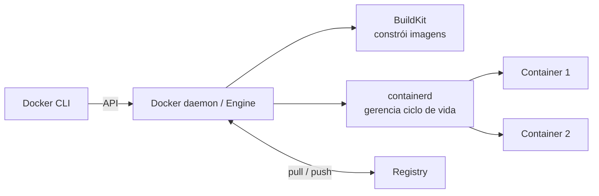
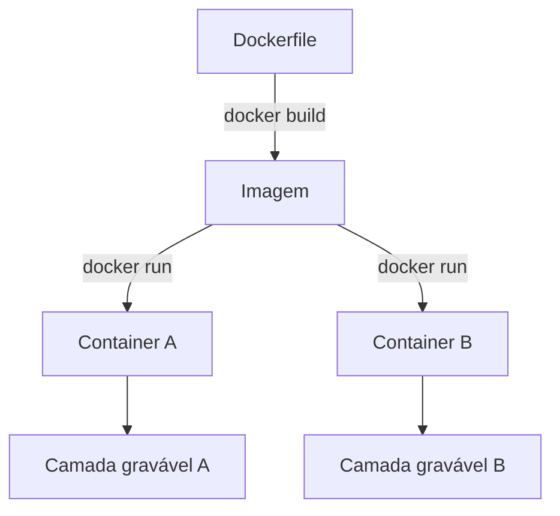
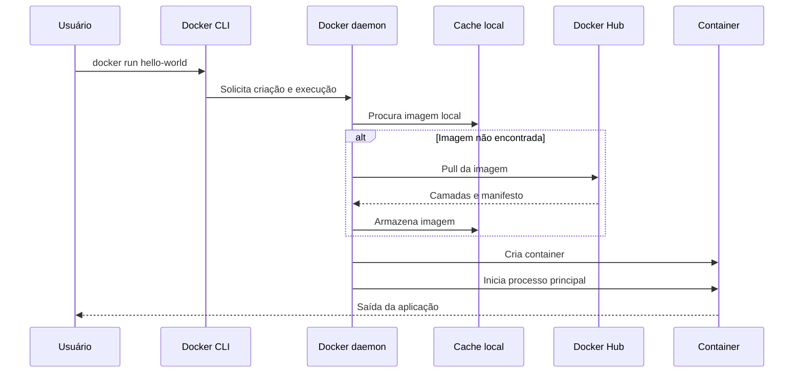
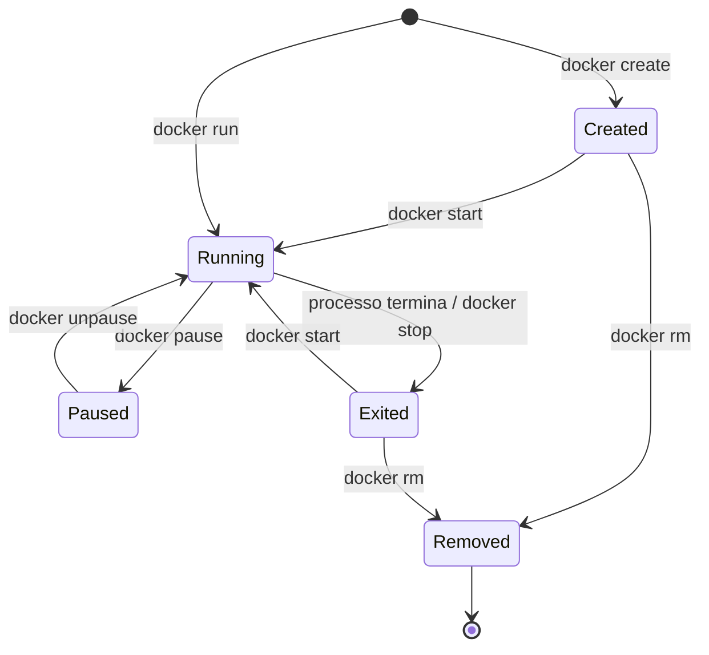
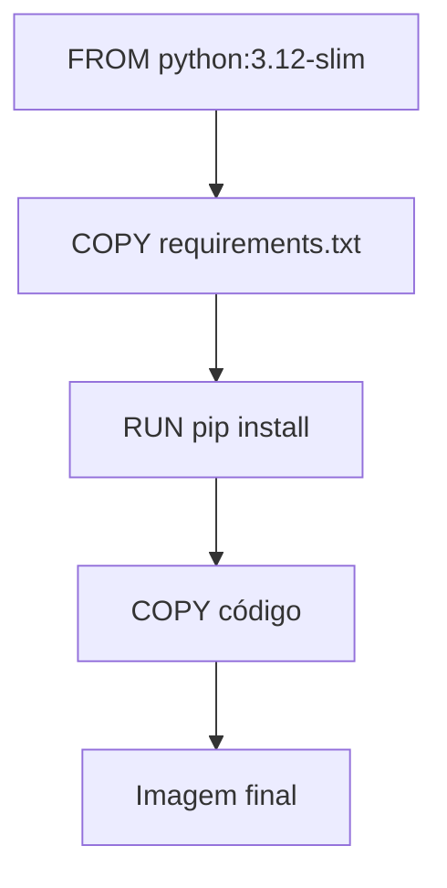
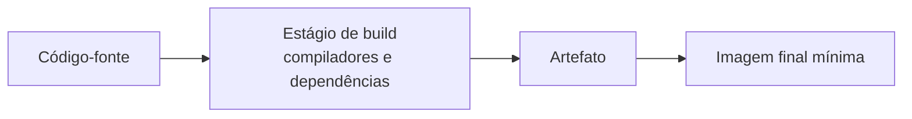
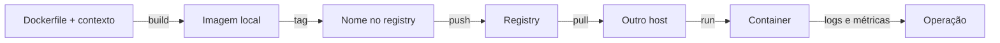

# 2. Docker, imagens, registries e Dockerfile

## Objetivos de aprendizagem

Ao final deste capítulo, você deverá ser capaz de:

- identificar os componentes da plataforma Docker;
- diferenciar imagem, container, registry e repository;
- executar e administrar containers;
- explicar o fluxo de busca de uma imagem;
- criar imagens com Dockerfile;
- compreender camadas, cache e tags;
- publicar imagens em um registry;
- reconhecer erros comuns em comandos e Dockerfiles.

## 1. O que é Docker

Docker é uma plataforma para construir, distribuir e executar aplicações em containers. O nome “Docker” costuma ser usado para diferentes componentes, portanto é importante separar os papéis.



### 1.1 Componentes principais

| Componente | Responsabilidade |
|---|---|
| Docker CLI | Recebe comandos como `docker run` e `docker build` |
| Docker daemon (`dockerd`) | Expõe a API e coordena imagens, redes, volumes e containers |
| BuildKit | Executa builds de imagens com cache e paralelismo |
| containerd | Gerencia download, armazenamento e execução de containers |
| runtime de baixo nível | Cria o processo isolado, normalmente por meio de `runc` |
| Registry | Armazena e distribui imagens |

## 2. Docker Desktop e Docker Engine

### Docker Engine

É o conjunto de componentes usado principalmente em servidores Linux. Pode ser instalado pelos repositórios oficiais da distribuição ou pelos repositórios da Docker.

### Docker Desktop

É uma solução de desenvolvimento para Windows, macOS e Linux. Inclui interface gráfica, Docker CLI, Engine em ambiente virtualizado, Compose e integração opcional com Kubernetes.

No Windows, os backends usuais são WSL 2 ou Hyper-V, de acordo com edição, configuração e política da máquina.

### Docker Toolbox

Docker Toolbox aparece no material como alternativa para máquinas antigas. Atualmente é uma solução legada e obsoleta. Em ambientes modernos, use Docker Desktop, Docker Engine, Podman ou uma VM Linux adequadamente mantida.

### Instalação por script conveniente

O material apresenta:

```bash
curl -fsSL https://get.docker.com -o get-docker.sh
sudo sh ./get-docker.sh --dry-run
```

O script é útil para laboratório, mas oferece menos controle sobre versões e parâmetros. Em produção, prefira configurar o repositório oficial e instalar os pacotes de forma administrável.

### Grupo `docker`

```bash
sudo usermod -aG docker "$USER"
```

> **Alerta de segurança:** pertencer ao grupo `docker` concede privilégios equivalentes a root sobre o host, porque o usuário pode solicitar ao daemon operações privilegiadas. Para maior isolamento, avalie Docker Rootless.

## 3. Imagem versus container

### Imagem

Uma imagem é um pacote imutável composto por camadas. Ela contém sistema de arquivos, aplicação, bibliotecas, metadados e configuração padrão.

### Container

Um container é uma instância executável de uma imagem. Ao ser criado, recebe uma camada gravável própria sobre as camadas somente leitura da imagem.



> **Ponto de prova:** a imagem contém arquivos e dependências usados para criar containers. O container é a execução concreta baseada nessa imagem.

## 4. Registry, repository e tag

| Termo | Definição | Exemplo |
|---|---|---|
| Registry | Serviço que armazena imagens | Docker Hub, GHCR, ECR, ACR, GAR |
| Repository | Coleção de imagens relacionadas | `nginx`, `usuario/minha-api` |
| Tag | Nome lógico de uma versão | `1.2.0`, `stable`, `latest` |
| Digest | Identificador imutável pelo conteúdo | `sha256:...` |

Exemplo completo:

```text
ghcr.io/evaldo/minha-api:1.4.0
└─registry┘ └──repository────┘ └tag┘
```

### 4.1 A tag `latest`

`latest` é apenas a tag usada quando nenhuma outra é informada. Ela não significa necessariamente “mais recente”, “estável” ou “segura”. Em produção, prefira versões explícitas e, para maior reprodutibilidade, digests.

## 5. Docker Hub e imagens confiáveis

O Docker Hub é o registry público padrão usado pelo Docker CLI quando nenhum registry é informado.

Critérios úteis:

- Docker Official Image;
- Verified Publisher;
- Sponsored OSS;
- documentação clara;
- frequência de atualização;
- histórico de vulnerabilidades;
- tamanho e conteúdo da imagem;
- tag explícita;
- origem verificável.

> **Ponto de prova:** imagens oficiais e de editores verificados são preferíveis; repositórios desconhecidos devem ser avaliados com cautela.

## 6. Fluxo do `docker run`

Ao executar:

```bash
docker run hello-world
```

O Docker realiza, de forma simplificada:



## 7. Comandos fundamentais

### 7.1 Criar e executar

```bash
docker run --name meu-nginx -p 8080:80 -d nginx
```

| Parte | Significado |
|---|---|
| `docker run` | Cria e inicia um container |
| `--name meu-nginx` | Define nome legível |
| `-p 8080:80` | Publica porta `8080` do host para a porta `80` do container |
| `-d` | Executa em segundo plano |
| `nginx` | Imagem usada |

> **Correção importante:** a ordem de `-p` é `HOST:CONTAINER`, e não “porta interna:porta externa”. Em `8080:80`, o navegador acessa a porta 8080 do host e o tráfego é encaminhado à porta 80 do container.

### 7.2 Listar containers

```bash
docker container ls      # somente em execução
docker container ls -a   # todos
```

Atalhos equivalentes:

```bash
docker ps
docker ps -a
```

### 7.3 Iniciar, parar e reiniciar

```bash
docker start meu-nginx
docker stop meu-nginx
docker restart meu-nginx
```

### 7.4 Remover

```bash
docker rm meu-nginx
```

Se estiver em execução:

```bash
docker rm -f meu-nginx
```

### 7.5 Imagens

```bash
docker image ls
docker pull nginx
docker image inspect nginx
docker image rm nginx
```

## 8. Ciclo de vida do container



O container permanece em execução enquanto o processo principal — PID 1 do namespace — estiver ativo.

## 9. Dockerfile

Dockerfile é um arquivo declarativo que descreve como construir uma imagem.

### 9.1 Instruções principais

| Instrução | Finalidade |
|---|---|
| `FROM` | Define a imagem base |
| `WORKDIR` | Define o diretório de trabalho |
| `COPY` | Copia arquivos do contexto de build |
| `ADD` | Copia arquivos e possui comportamentos extras; prefira `COPY` quando não forem necessários |
| `RUN` | Executa comandos durante o build |
| `ENV` | Define variável persistida na imagem |
| `ARG` | Define variável disponível durante o build |
| `EXPOSE` | Documenta a porta usada pela aplicação |
| `USER` | Define usuário de execução |
| `HEALTHCHECK` | Define verificação de saúde da imagem |
| `CMD` | Define comando padrão |
| `ENTRYPOINT` | Define executável principal |
| `LABEL` | Adiciona metadados |

### 9.2 Exemplo corrigido em Python

```dockerfile
FROM python:3.12-slim

WORKDIR /app

COPY requirements.txt ./
RUN pip install --no-cache-dir -r requirements.txt

COPY . .

USER 10001

CMD ["python", "app.py"]
```

### 9.3 Construir uma imagem

```bash
docker build -t minha-aplicacao:1.0.0 .
```

- `-t` define repository e tag;
- `.` é o contexto de build;
- o Dockerfile padrão deve se chamar `Dockerfile`.

### 9.4 Executar a imagem criada

```bash
docker run --rm --name minha-app minha-aplicacao:1.0.0
```

`--rm` remove o container quando o processo termina.

## 10. Camadas e cache

Cada instrução relevante cria uma camada ou metadado reutilizável. O cache acelera builds quando entradas e instruções não mudaram.



A ordem recomendada copia primeiro os arquivos que mudam menos. Assim, alterações no código não invalidam desnecessariamente a instalação das dependências.

### Exemplo menos eficiente

```dockerfile
COPY . .
RUN pip install -r requirements.txt
```

Qualquer alteração no código invalida a camada de dependências.

### Exemplo melhor

```dockerfile
COPY requirements.txt ./
RUN pip install --no-cache-dir -r requirements.txt
COPY . .
```

## 11. `CMD` versus `ENTRYPOINT`

### `CMD`

Define comando ou argumentos padrão. Pode ser substituído facilmente na linha de comando.

```dockerfile
CMD ["python", "app.py"]
```

### `ENTRYPOINT`

Define o executável principal. Argumentos do `docker run` são acrescentados.

```dockerfile
ENTRYPOINT ["python", "app.py"]
CMD ["--port", "8080"]
```

Execução:

```bash
docker run minha-app --port 9090
```

## 12. Multi-stage build

Builds de múltiplos estágios reduzem o tamanho final ao separar compilação e execução.

```dockerfile
FROM golang:1.24 AS build
WORKDIR /src
COPY . .
RUN CGO_ENABLED=0 go build -o /out/app ./cmd/app

FROM gcr.io/distroless/static-debian12:nonroot
COPY --from=build /out/app /app
USER nonroot:nonroot
ENTRYPOINT ["/app"]
```



## 13. `.dockerignore`

Evita enviar arquivos desnecessários ao contexto de build.

```gitignore
.git
.env
*.log
node_modules
__pycache__
.venv
build
coverage
```

Benefícios:

- build mais rápido;
- menor risco de copiar segredos;
- contexto menor;
- cache mais previsível.

## 14. Publicar uma imagem

### Docker Hub

```bash
docker login
docker tag minha-aplicacao:1.0.0 usuario/minha-aplicacao:1.0.0
docker push usuario/minha-aplicacao:1.0.0
```

### GitHub Container Registry

```bash
echo "$GITHUB_TOKEN" | docker login ghcr.io -u SEU_USUARIO --password-stdin
docker tag minha-aplicacao:1.0.0 ghcr.io/SEU_USUARIO/minha-aplicacao:1.0.0
docker push ghcr.io/SEU_USUARIO/minha-aplicacao:1.0.0
```

> Não inclua tokens em scripts versionados. Use secrets do pipeline ou variáveis protegidas.

## 15. Ciclo de vida da imagem



## 16. Boas práticas de Dockerfile

- use imagens base confiáveis;
- fixe versões quando a reprodutibilidade for necessária;
- evite `latest` em produção;
- use imagens menores, mas não sacrifique manutenção e compatibilidade;
- agrupe comandos relacionados e limpe caches no mesmo `RUN`;
- copie somente arquivos necessários;
- use usuário não root;
- não grave segredos em `ARG`, `ENV`, `RUN` ou camadas;
- use multi-stage build;
- declare health check quando fizer sentido;
- use formato exec JSON em `CMD` e `ENTRYPOINT`;
- adicione metadados OCI com `LABEL`.

## 17. Erros comuns

### Confundir imagem e container

Uma imagem pode criar vários containers independentes.

### Tratar `EXPOSE` como publicação de porta

`EXPOSE 8080` documenta a porta. Para acessá-la do host, use `-p` ou configuração equivalente.

### Copiar segredo e apagá-lo depois

Se o segredo foi copiado em uma camada, pode continuar recuperável no histórico. Use secrets de build e montagem temporária.

### Usar aspas tipográficas

Dockerfile e YAML exigem aspas ASCII:

```dockerfile
CMD ["python", "app.py"]
```

Não use `“` e `”`.

### Usar imagem sem tag explícita

O Docker assume `latest`, que é mutável e pouco previsível.

## 18. Resumo para a prova

- Imagem é o pacote imutável; container é a instância em execução.
- Registry armazena imagens; repository agrupa versões; tag identifica uma versão lógica.
- `docker run` cria e inicia; `docker start` inicia um container existente.
- `-p` usa a ordem `HOST:CONTAINER`.
- Dockerfile descreve a construção da imagem.
- `FROM`, `COPY`, `RUN`, `WORKDIR`, `CMD`, `ENTRYPOINT`, `USER` e `EXPOSE` são instruções centrais.
- A ordem das instruções afeta cache e desempenho do build.
- Multi-stage build reduz o conteúdo da imagem final.
- `latest` é apenas uma tag padrão, não garantia de versão mais nova ou estável.

## 19. Perguntas de revisão

1. Qual é a diferença entre registry e repository?
2. O que acontece quando `docker run` não encontra a imagem localmente?
3. Qual é a ordem correta no mapeamento `-p`?
4. Qual é a diferença entre `docker run` e `docker start`?
5. Por que copiar `requirements.txt` antes do código melhora o cache?
6. Para que serve `.dockerignore`?
7. Qual é a diferença prática entre `CMD` e `ENTRYPOINT`?
8. Por que multi-stage build aumenta a segurança e reduz tamanho?
