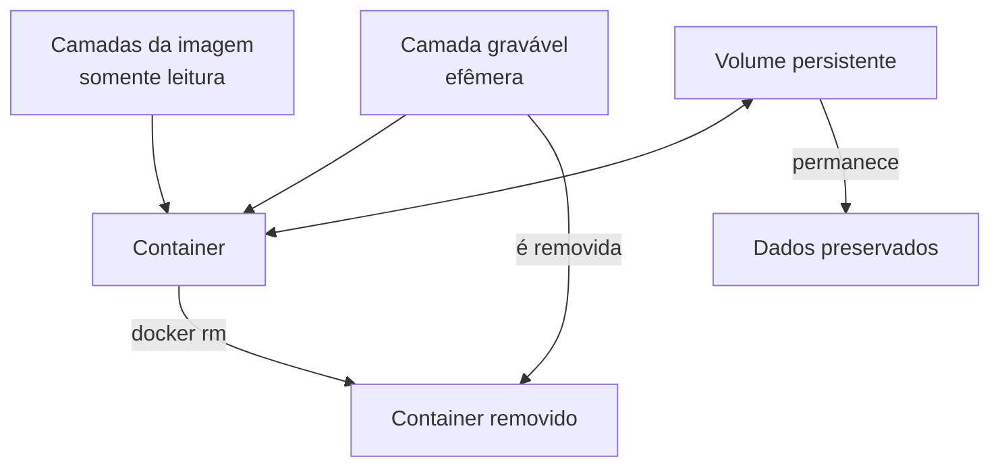
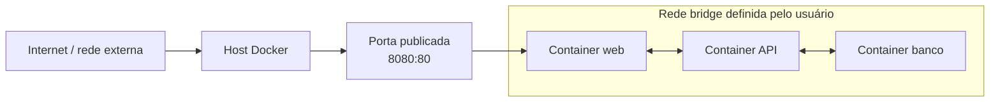
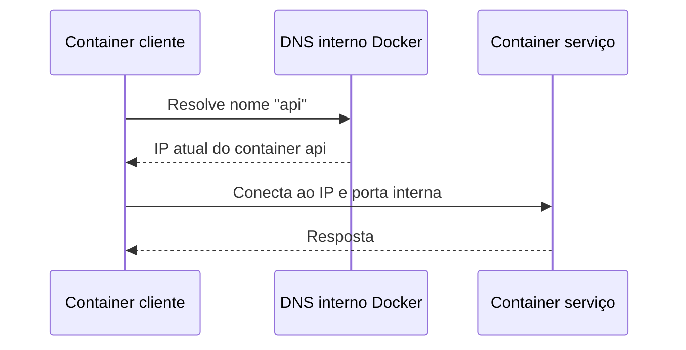
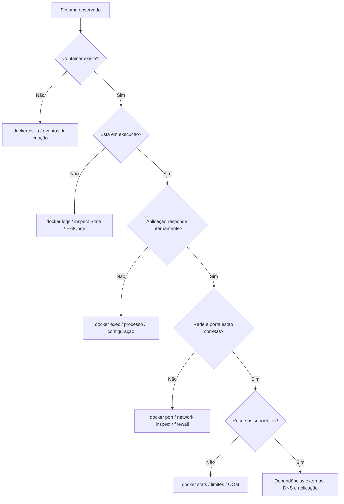
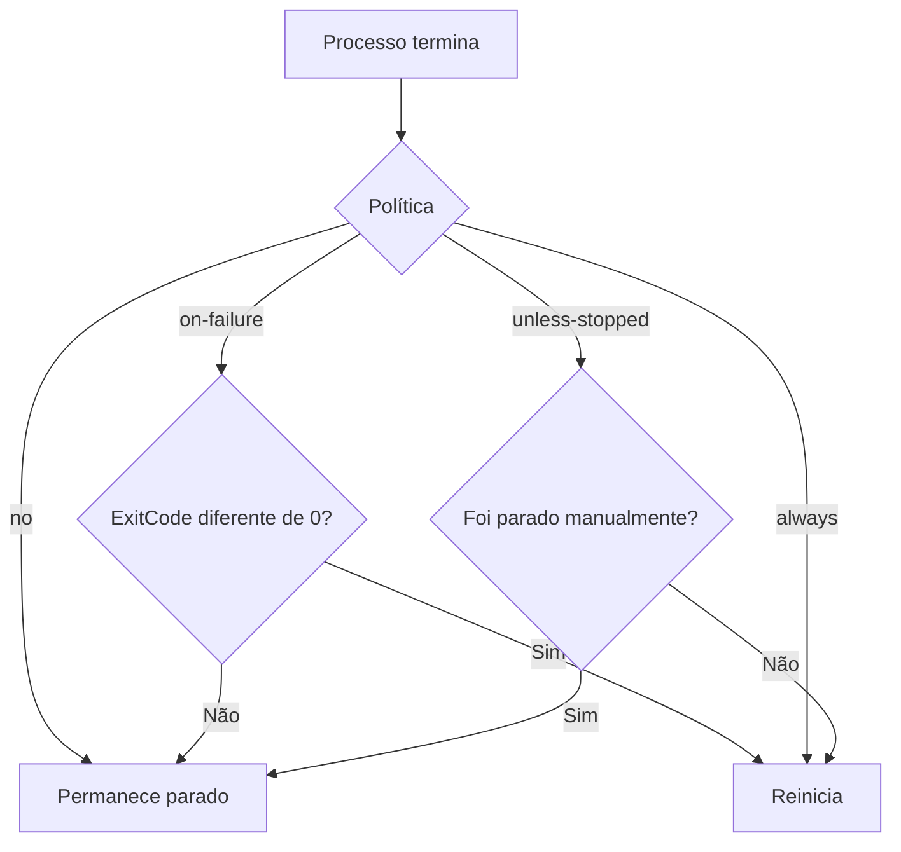

# 3. Volumes, redes e troubleshooting em Docker

## Objetivos de aprendizagem

Ao final deste capítulo, você deverá ser capaz de:

- explicar por que a camada gravável do container não deve armazenar dados importantes;
- criar, listar, inspecionar e remover volumes;
- diferenciar volume nomeado, bind mount e `tmpfs`;
- compreender os principais drivers de rede Docker;
- conectar containers por nome em uma rede definida pelo usuário;
- diagnosticar problemas com `logs`, `inspect`, `stats` e `exec`;
- configurar limites de recursos e políticas de reinicialização.

## 1. Persistência e natureza efêmera

Containers devem ser tratados como unidades substituíveis. Quando um container é removido, sua camada gravável também é descartada. Dados importantes precisam ser armazenados fora dessa camada.



> **Ponto de prova:** volumes permitem que os dados sobrevivam à remoção do container.

## 2. Tipos de montagem

### 2.1 Volume nomeado

É gerenciado pelo Docker e identificado por um nome.

```bash
docker volume create dados-app

docker run -d \
  --name minha-app \
  --mount source=dados-app,target=/var/lib/app \
  minha-imagem
```

### 2.2 Bind mount

Mapeia um caminho específico do host para dentro do container.

```bash
docker run --rm \
  --mount type=bind,source="$PWD",target=/app \
  python:3.12-slim python /app/app.py
```

É útil no desenvolvimento, mas cria maior dependência da estrutura do host.

### 2.3 `tmpfs`

Armazena dados temporários na memória do host e não os persiste em disco.

```bash
docker run --rm \
  --tmpfs /run/secrets:rw,noexec,nosuid,size=16m \
  alpine
```

### 2.4 Comparação

| Tipo | Gerenciado por | Persistência | Uso típico |
|---|---|---:|---|
| Volume nomeado | Docker | Sim | Dados de banco, estado de aplicação |
| Bind mount | Usuário/host | Sim | Código e configuração no desenvolvimento |
| `tmpfs` | Memória do host | Não | Dados temporários e sensíveis |

## 3. `--mount` versus `-v`

O material utiliza a sintaxe curta:

```bash
docker run -d --name meu-nginx -v meu-volume:/app/data nginx
```

Ela é válida. A sintaxe `--mount` é mais explícita e reduz ambiguidades:

```bash
docker run -d \
  --name meu-nginx \
  --mount type=volume,source=meu-volume,target=/app/data \
  nginx
```

## 4. Comandos de volumes

```bash
docker volume create meu-volume
docker volume ls
docker volume inspect meu-volume
docker volume rm meu-volume
docker volume prune
```

> `docker volume prune` remove volumes não utilizados. Confirme que não há dados necessários antes da execução.

### 4.1 Exemplo de persistência

```bash
# Cria o volume
docker volume create dados-demo

# Grava um arquivo
docker run --rm \
  --mount source=dados-demo,target=/dados \
  alpine sh -c 'date > /dados/criado.txt'

# Lê o arquivo em outro container
docker run --rm \
  --mount source=dados-demo,target=/dados,readonly \
  alpine cat /dados/criado.txt
```

## 5. Permissões em volumes

O processo do container acessa o volume com seu UID e GID. Um usuário não root pode receber “permission denied” se o diretório estiver com proprietário incompatível.

Estratégias:

- ajustar proprietário no build ou entrypoint;
- executar com UID/GID conhecidos;
- preparar o volume antes do uso;
- usar `read_only` ou montagem `readonly` quando escrita não for necessária;
- evitar `chmod 777` como solução genérica.

## 6. Redes no Docker

O Docker cria uma abstração que permite comunicação entre containers, host e redes externas.



## 7. Drivers de rede

| Driver | Característica | Uso típico |
|---|---|---|
| `bridge` | Rede privada no host | Containers no mesmo host |
| `host` | Container compartilha a pilha de rede do host | Baixa sobrecarga, cenários específicos em Linux |
| `none` | Sem conectividade de rede | Isolamento completo |
| `overlay` | Rede virtual entre múltiplos nós | Docker Swarm |
| `macvlan` | Container recebe endereço MAC próprio | Integração direta à rede física |
| `ipvlan` | Controle de endereçamento com menor uso de MACs | Redes avançadas e ambientes legados |

> **Ponto de prova:** `bridge` é o driver padrão para containers executados em um host Docker comum.

## 8. Bridge padrão versus bridge definida pelo usuário

Uma bridge criada pelo usuário oferece resolução DNS automática por nome do container e melhor isolamento lógico.

```bash
docker network create minha-rede

docker run -d --name api --network minha-rede nginx

docker run --rm --network minha-rede alpine ping -c 3 api
```

### Fluxo de resolução



A aplicação deve usar `api:porta` dentro da rede, não `localhost`. `localhost` aponta para o próprio container.

## 9. Publicação de portas

```bash
docker run -d --name web -p 8080:80 nginx
```

- host: `8080`;
- container: `80`;
- acesso externo: `http://localhost:8080`.

### Restringir ao loopback

```bash
docker run -d --name web -p 127.0.0.1:8080:80 nginx
```

Isso evita exposição em todas as interfaces do host.

### Porta aleatória no host

```bash
docker run -d --name web -p 80 nginx
docker port web
```

## 10. Comandos de rede

```bash
docker network ls
docker network create minha-rede
docker network inspect minha-rede
docker network connect minha-rede meu-container
docker network disconnect minha-rede meu-container
docker network rm minha-rede
```

## 11. Rede overlay

Overlay conecta serviços executados em hosts diferentes dentro de um Swarm.

```bash
docker network create --driver overlay minha-rede-overlay

docker service create \
  --name servico1 \
  --network minha-rede-overlay \
  nginx
```

A criação de uma rede overlay normalmente requer Swarm inicializado.

## 12. Método de troubleshooting

Uma investigação eficiente parte do sintoma e avança por camadas.



## 13. `docker logs`

```bash
docker logs meu-container
docker logs -f meu-container
docker logs --tail 100 meu-container
docker logs --since 10m meu-container
docker logs --timestamps meu-container
```

`-f` acompanha novas linhas, como `tail -f`.

Boas práticas da aplicação:

- escrever logs em `stdout` e `stderr`;
- incluir timestamp e nível;
- evitar dados sensíveis;
- preferir formato estruturado, como JSON, em produção;
- configurar rotação no driver de logging.

## 14. `docker inspect`

Retorna metadados detalhados em JSON.

```bash
docker inspect meu-container
docker network inspect minha-rede
docker volume inspect meu-volume
```

### Consultas com `--format`

```bash
docker inspect \
  --format '{{.State.Status}} {{.State.ExitCode}}' \
  meu-container

docker inspect \
  --format '{{range .NetworkSettings.Networks}}{{.IPAddress}}{{end}}' \
  meu-container
```

Campos úteis:

- `.State.Status`;
- `.State.ExitCode`;
- `.State.OOMKilled`;
- `.Config.Env`;
- `.HostConfig.RestartPolicy`;
- `.Mounts`;
- `.NetworkSettings.Networks`.

## 15. `docker stats`

```bash
docker stats
docker stats meu-container
docker stats --no-stream meu-container
```

Exibe:

- CPU;
- memória e limite;
- rede de entrada e saída;
- I/O de bloco;
- quantidade de processos.

## 16. `docker exec`

Executa um processo adicional dentro de um container em execução.

```bash
docker exec -it meu-container sh
docker exec -it meu-container bash
docker exec meu-container env
docker exec meu-container ps aux
```

Nem toda imagem possui `bash`, `ping`, `curl` ou gerenciador de pacotes. Imagens mínimas podem conter apenas a aplicação.

### Container de diagnóstico

Em vez de instalar ferramentas no container de produção, use uma imagem de diagnóstico na mesma rede:

```bash
docker run --rm -it \
  --network minha-rede \
  nicolaka/netshoot
```

## 17. Códigos de saída comuns

| Código | Significado frequente |
|---:|---|
| 0 | Processo terminou com sucesso |
| 1 | Erro genérico da aplicação |
| 126 | Comando encontrado, mas sem permissão de execução |
| 127 | Comando não encontrado |
| 137 | Processo morto por `SIGKILL`, frequentemente OOM ou `docker kill` |
| 139 | Segmentation fault |
| 143 | Processo recebeu `SIGTERM`, comum em parada controlada |

O código isolado não comprova a causa. Correlacione logs, `OOMKilled`, eventos e métricas.

## 18. Limites de CPU e memória

```bash
docker run -d \
  --name app-limitada \
  --memory="512m" \
  --cpus="0.5" \
  minha-imagem
```

- `--memory=512m`: teto de memória;
- `--cpus=0.5`: equivalente aproximado a metade de uma CPU;
- limites previnem que um container comprometa o host;
- limites muito baixos causam lentidão, OOM e reinicializações.

Atualizar um container existente:

```bash
docker update --cpus=2 --memory=1g meu-container
```

## 19. Políticas de reinicialização

| Política | Comportamento |
|---|---|
| `no` | Não reinicia automaticamente |
| `on-failure` | Reinicia quando o processo termina com código diferente de zero |
| `always` | Reinicia após término e após reinício do daemon |
| `unless-stopped` | Reinicia, exceto se tiver sido explicitamente parado |

Criar com política:

```bash
docker run -d \
  --name api \
  --restart unless-stopped \
  minha-api
```

Atualizar:

```bash
docker update --restart unless-stopped api
```



> Política de restart não substitui correção de falhas, health checks, monitoramento nem orquestração.

## 20. Health check

Um health check avalia se a aplicação está saudável, não apenas se o processo está vivo.

Dockerfile:

```dockerfile
HEALTHCHECK --interval=30s --timeout=3s --retries=3 \
  CMD wget -qO- http://localhost:8080/health || exit 1
```

Linha de comando:

```bash
docker run -d \
  --health-cmd='wget -qO- http://localhost/ || exit 1' \
  --health-interval=30s \
  nginx
```

Estados: `starting`, `healthy` e `unhealthy`.

## 21. Checklist de diagnóstico

1. `docker ps -a` — existe e qual é o estado?
2. `docker logs --tail 100` — o que a aplicação informou?
3. `docker inspect` — exit code, OOM, mounts, env e rede.
4. `docker port` — a porta foi publicada?
5. `docker network inspect` — está na rede correta?
6. `docker exec` — processo e arquivo existem?
7. `docker stats` — há saturação ou falta de memória?
8. teste DNS e conexão a partir de container de diagnóstico;
9. valide volume, permissões e configuração;
10. confirme firewall, proxy e dependências externas.

## 22. Boas práticas

- use volumes para dados persistentes;
- não exponha a porta de banco de dados sem necessidade;
- use redes definidas pelo usuário;
- restrinja portas ao endereço necessário;
- monte configuração somente leitura quando possível;
- defina limites de CPU e memória;
- configure rotação de logs;
- use health checks representativos;
- não use `exec` para alterações permanentes: corrija imagem ou configuração;
- registre causa e evidências antes de recriar o container.

## 23. Resumo para a prova

- Volume persiste após remoção do container.
- Bind mount referencia caminho do host.
- `bridge` é o driver de rede padrão.
- Redes bridge definidas pelo usuário fornecem DNS por nome.
- `overlay` conecta serviços em nós diferentes do Swarm.
- `docker logs -f` acompanha logs.
- `docker stats` mostra consumo de recursos.
- `docker inspect` mostra metadados detalhados.
- `docker exec -it ... sh` abre shell quando disponível.
- `no`, `on-failure`, `always` e `unless-stopped` são políticas de restart.
- Limites de CPU e memória estabilizam o ecossistema e reduzem contenção.

## 24. Perguntas de revisão

1. Por que a camada gravável do container não deve ser usada para dados importantes?
2. Qual é a diferença entre volume e bind mount?
3. Qual é o driver de rede padrão?
4. Por que containers em uma rede própria podem se comunicar por nome?
5. Qual comando acompanha logs continuamente?
6. Como verificar se um container foi encerrado por falta de memória?
7. Qual política reinicia o container exceto após parada manual?
8. Por que instalar ferramentas de diagnóstico no container de produção pode ser uma má prática?
