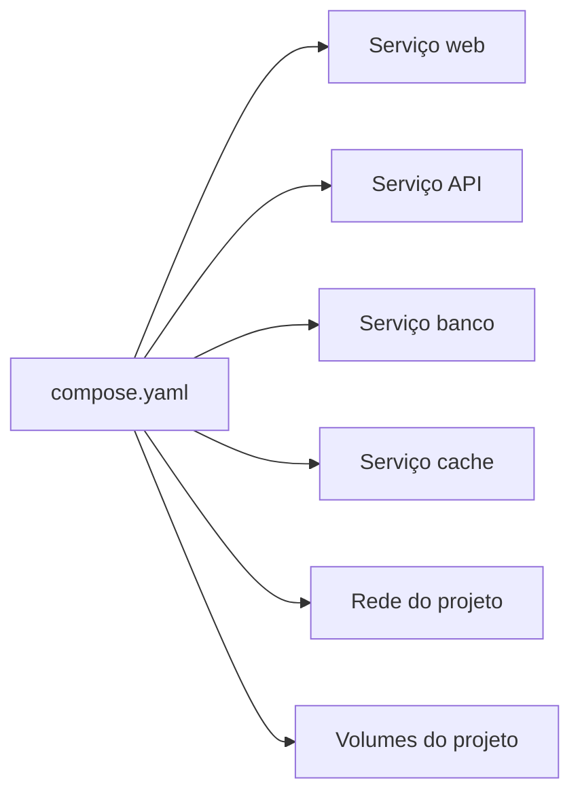
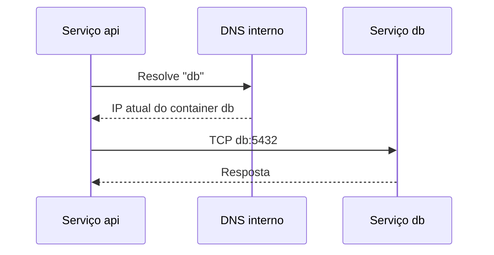
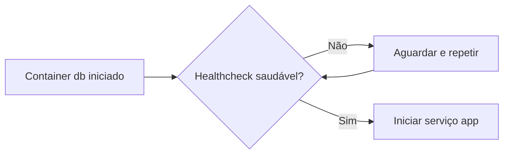
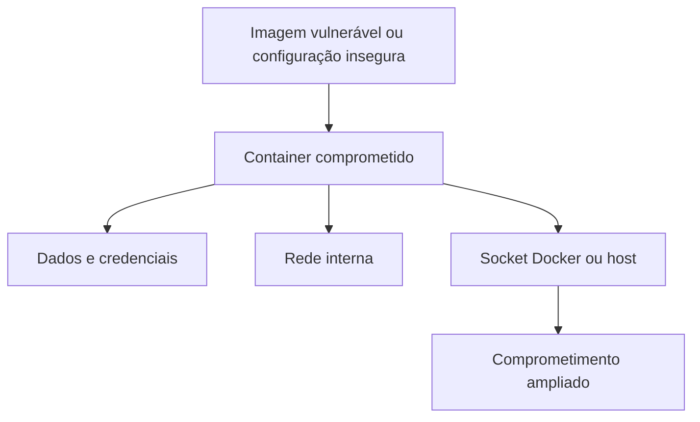
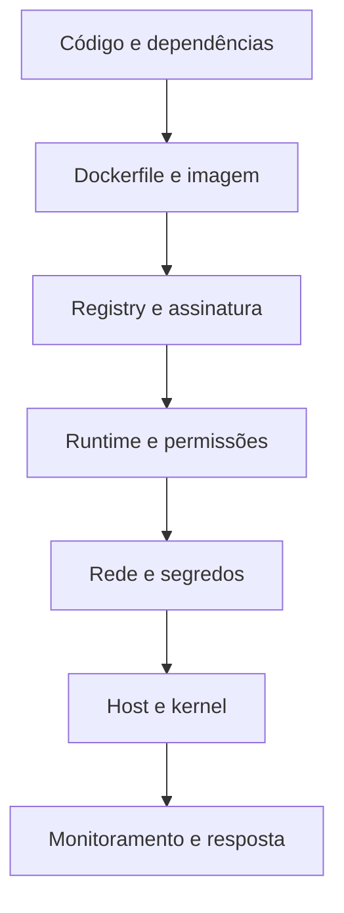

# 4. Docker Compose e segurança em containers

## Objetivos de aprendizagem

Ao final deste capítulo, você deverá ser capaz de:

- definir aplicações multicontainer com Compose;
- interpretar serviços, redes, volumes, portas e variáveis em YAML;
- controlar ordem de inicialização com `depends_on` e `healthcheck`;
- diferenciar disponibilidade do processo e prontidão da aplicação;
- identificar riscos de imagens, permissões, segredos, redes e volumes;
- aplicar configurações básicas de hardening;
- analisar imagens com Docker Scout.

## 1. Por que usar Docker Compose

Aplicações modernas normalmente possuem vários componentes: frontend, backend, banco, cache, mensageria e observabilidade. Docker Compose descreve esses componentes em um único arquivo YAML e administra seu ciclo de vida como um projeto.



Benefícios apresentados no material:

- facilidade de configuração;
- automação;
- reprodutibilidade;
- gerenciamento com um único comando;
- possibilidade de escalar serviços locais.

> **Ponto de prova:** Docker Compose define e executa aplicações Docker multicontainer por meio de um arquivo YAML.

## 2. Atualização: Compose V2

O material utiliza comandos como:

```bash
docker-compose up -d
```

Na versão atual, prefira o plugin Compose V2:

```bash
docker compose up -d
```

A forma com hífen pertence ao Compose V1, legado.

### Chave `version`

Exemplos antigos iniciam com:

```yaml
version: "3.8"
```

A chave superior `version` está obsoleta na Compose Specification atual. O Compose usa o schema mais recente suportado. Um arquivo moderno pode começar diretamente por `services`.

## 3. Estrutura de um `compose.yaml`

```yaml
services:
  app:
    build:
      context: .
    ports:
      - "8080:8080"
    environment:
      APP_ENV: production
    depends_on:
      db:
        condition: service_healthy
    networks:
      - app-net

  db:
    image: postgres:17-alpine
    environment:
      POSTGRES_DB: app
      POSTGRES_USER: app
      POSTGRES_PASSWORD_FILE: /run/secrets/db_password
    volumes:
      - db-data:/var/lib/postgresql/data
    secrets:
      - db_password
    healthcheck:
      test: ["CMD-SHELL", "pg_isready -U app -d app"]
      interval: 10s
      timeout: 5s
      retries: 5
    networks:
      - app-net

networks:
  app-net:

volumes:
  db-data:

secrets:
  db_password:
    file: ./secrets/db_password.txt
```

### 3.1 Elementos principais

| Elemento | Finalidade |
|---|---|
| `services` | Define os containers lógicos da aplicação |
| `image` | Usa uma imagem existente |
| `build` | Constrói uma imagem a partir de Dockerfile |
| `ports` | Publica portas do host |
| `expose` | Documenta portas para a rede, sem publicar no host |
| `environment` | Define variáveis de ambiente |
| `env_file` | Carrega variáveis de arquivo |
| `volumes` | Monta volumes e bind mounts |
| `networks` | Conecta o serviço a redes |
| `depends_on` | Declara dependências de inicialização |
| `healthcheck` | Verifica saúde do serviço |
| `restart` | Define política de reinicialização |
| `secrets` | Monta dados sensíveis como arquivos |

## 4. Comandos básicos

```bash
docker compose up
docker compose up -d
docker compose ps
docker compose logs
docker compose logs -f app
docker compose stop
docker compose start
docker compose restart app
docker compose down
```

### Construir e subir

```bash
docker compose up -d --build
```

### Remover também volumes

```bash
docker compose down --volumes
```

> Esse comando apaga os volumes declarados pelo projeto. Em bancos de dados, isso normalmente elimina os dados locais.

### Validar e visualizar configuração final

```bash
docker compose config
```

Esse comando ajuda a detectar erro de YAML, interpolação e combinação de arquivos.

## 5. Nomes e descoberta de serviços

Compose cria uma rede padrão para o projeto. Cada serviço pode ser encontrado pelo nome definido em `services`.

```yaml
services:
  api:
    image: minha-api
  db:
    image: postgres:17-alpine
```

Dentro do container `api`, o banco deve ser acessado como:

```text
db:5432
```

Não use `localhost:5432`, pois `localhost` representa o próprio container da API.



## 6. Portas em Compose

```yaml
ports:
  - "8000:80"
```

- `8000`: porta do host;
- `80`: porta do container.

### Publicação restrita ao host local

```yaml
ports:
  - "127.0.0.1:8000:80"
```

### Comunicação interna não exige `ports`

Se apenas outros serviços Compose acessam o banco, não publique a porta:

```yaml
services:
  db:
    image: postgres:17-alpine
```

## 7. Volumes no Compose

### Volume nomeado

```yaml
services:
  db:
    image: postgres:17-alpine
    volumes:
      - db-data:/var/lib/postgresql/data

volumes:
  db-data:
```

### Bind mount para desenvolvimento

```yaml
services:
  app:
    build: .
    volumes:
      - ./src:/app/src
```

### Somente leitura

```yaml
volumes:
  - ./config:/app/config:ro
```

## 8. Variáveis e interpolação

Arquivo `.env`:

```dotenv
APP_PORT=8080
POSTGRES_DB=app
POSTGRES_USER=app
```

Compose:

```yaml
services:
  app:
    ports:
      - "${APP_PORT:-8080}:8080"
```

A expressão usa `8080` como padrão se `APP_PORT` não estiver definida.

> `.env` não é um cofre de segredos. Ele apenas facilita parametrização. Não o versione quando contiver credenciais.

## 9. Ordem de inicialização e prontidão

Iniciar primeiro não significa estar pronto para receber conexões. Bancos de dados podem precisar de vários segundos para concluir recuperação e abrir a porta.



### 9.1 Condições de `depends_on`

| Condição | Significado |
|---|---|
| `service_started` | Dependência foi iniciada |
| `service_healthy` | Dependência passou no health check |
| `service_completed_successfully` | Dependência terminou com sucesso |

Exemplo:

```yaml
services:
  migrate:
    image: minha-app
    command: ["./migrate"]

  db:
    image: postgres:17-alpine
    healthcheck:
      test: ["CMD-SHELL", "pg_isready -U app -d app"]
      interval: 10s
      timeout: 5s
      retries: 5

  app:
    image: minha-app
    depends_on:
      db:
        condition: service_healthy
      migrate:
        condition: service_completed_successfully
```

### 9.2 Aplicação resiliente

Mesmo com `depends_on`, a aplicação deve implementar:

- tentativas com backoff;
- timeout;
- circuit breaker quando adequado;
- tratamento de indisponibilidade temporária;
- encerramento gracioso.

Compose controla a inicialização local, mas não garante que uma dependência permanecerá disponível.

## 10. Exemplo WordPress e MySQL

Exemplo alinhado ao conteúdo da disciplina, com ajustes de segurança didáticos:

```yaml
services:
  wordpress:
    image: wordpress:6.8-apache
    ports:
      - "8000:80"
    environment:
      WORDPRESS_DB_HOST: db:3306
      WORDPRESS_DB_NAME: exampledb
      WORDPRESS_DB_USER: exampleuser
      WORDPRESS_DB_PASSWORD_FILE: /run/secrets/db_password
    volumes:
      - wordpress-data:/var/www/html
    secrets:
      - db_password
    depends_on:
      db:
        condition: service_healthy

  db:
    image: mysql:8.4
    environment:
      MYSQL_DATABASE: exampledb
      MYSQL_USER: exampleuser
      MYSQL_PASSWORD_FILE: /run/secrets/db_password
      MYSQL_ROOT_PASSWORD_FILE: /run/secrets/db_root_password
    volumes:
      - db-data:/var/lib/mysql
    secrets:
      - db_password
      - db_root_password
    healthcheck:
      test: ["CMD", "mysqladmin", "ping", "-h", "localhost"]
      interval: 10s
      timeout: 5s
      retries: 10

volumes:
  wordpress-data:
  db-data:

secrets:
  db_password:
    file: ./secrets/db_password.txt
  db_root_password:
    file: ./secrets/db_root_password.txt
```

## 11. Escala local

```bash
docker compose up -d --scale worker=3
```

Quando um serviço publicado em porta fixa é escalado, pode haver conflito de portas. Escala local não substitui um orquestrador com balanceamento, reconciliação e agendamento distribuído.

## 12. Perfis

Perfis permitem ativar serviços opcionais.

```yaml
services:
  app:
    image: minha-app

  adminer:
    image: adminer
    profiles: ["debug"]
    ports:
      - "127.0.0.1:8081:8080"
```

```bash
docker compose --profile debug up -d
```

## 13. Por que segurança em containers é importante

Containers compartilham o kernel do host. Vulnerabilidades em imagens, runtime, configurações, aplicações ou permissões podem permitir:

- acesso indevido a dados;
- movimento lateral;
- execução de comandos;
- escalada de privilégios;
- comprometimento do host;
- indisponibilidade por consumo de recursos;
- vazamento de segredos.



## 14. Modelo de defesa em profundidade

A segurança deve atuar em várias camadas:



## 15. Imagens confiáveis e atualizadas

- prefira imagens oficiais e de editores verificados;
- use tags explícitas;
- acompanhe CVEs;
- reconstrua imagens periodicamente;
- remova pacotes e ferramentas não necessários;
- gere SBOM;
- analise dependências diretas e transitivas;
- não suponha que `alpine` é automaticamente mais segura;
- teste a atualização antes de produção.

## 16. Usuário não privilegiado

Dockerfile:

```dockerfile
FROM alpine:3.21

RUN addgroup -S appgroup \
    && adduser -S appuser -G appgroup

WORKDIR /app
COPY --chown=appuser:appgroup app /app/app

USER appuser
EXPOSE 8080
ENTRYPOINT ["/app/app"]
```

Compose:

```yaml
services:
  app:
    image: minha-app
    user: "10001:10001"
```

> **Ponto de prova:** executar como usuário não root reduz o impacto caso a aplicação seja comprometida.

## 17. Remover capacidades e impedir escalada

```yaml
services:
  app:
    image: minha-app
    cap_drop:
      - ALL
    cap_add:
      - NET_BIND_SERVICE
    security_opt:
      - no-new-privileges:true
```

Adicione somente as capacidades estritamente necessárias.

## 18. Sistema de arquivos somente leitura

```yaml
services:
  app:
    image: minha-app
    read_only: true
    tmpfs:
      - /tmp:size=64m,noexec,nosuid
```

Isso dificulta persistência maliciosa e alterações acidentais. A aplicação deve gravar apenas em volumes e diretórios temporários planejados.

## 19. Limites de recursos

No Compose local:

```yaml
services:
  app:
    image: minha-app
    mem_limit: 512m
    cpus: 0.50
    pids_limit: 200
```

Objetivos:

- evitar esgotamento de memória;
- limitar fork bombs;
- reduzir interferência entre serviços;
- tornar falhas mais previsíveis.

## 20. Segredos

### Nunca grave segredo no Dockerfile

Evite:

```dockerfile
ENV API_KEY=segredo
```

O valor pode aparecer em metadados, histórico, cache e registry.

### Arquivos locais e `.gitignore`

```gitignore
.env
secrets/
*.pem
*.key
```

### Secrets no Compose

```yaml
secrets:
  api_key:
    file: ./secrets/api_key.txt

services:
  app:
    secrets:
      - api_key
```

O segredo fica disponível como arquivo em `/run/secrets/api_key`.

### Secrets em Swarm

```bash
printf '%s' 'minha-senha' | docker secret create db_password -
```

Em produção, prefira um gerenciador dedicado, como serviço de secrets da nuvem, Vault ou solução integrada ao orquestrador.

## 21. Redes seguras

- crie redes separadas por responsabilidade;
- não publique portas internas sem necessidade;
- restrinja a interface de bind;
- segmente frontend, backend e dados;
- use TLS para tráfego sensível;
- não confie apenas em isolamento de rede;
- evite conectar todos os serviços à mesma rede.

```yaml
services:
  proxy:
    networks: [front]

  app:
    networks: [front, back]

  db:
    networks: [back]

networks:
  front:
  back:
    internal: true
```

## 22. Volumes seguros

- use somente leitura quando possível;
- evite montar `/`, `/etc`, `/var/run` ou diretórios amplos do host;
- nunca monte o socket Docker em aplicação não confiável;
- limite acesso por UID/GID;
- criptografe dados sensíveis em repouso quando necessário;
- realize backup e teste restauração;
- não use volumes como cofre de segredos por padrão.

### Perigo do socket Docker

```yaml
volumes:
  - /var/run/docker.sock:/var/run/docker.sock
```

Essa montagem normalmente concede capacidade de controlar o daemon e obter privilégios sobre o host. Use apenas em componentes altamente confiáveis, com alternativas e controles adicionais.

## 23. Seccomp, AppArmor e SELinux

| Recurso | Papel |
|---|---|
| Seccomp | Filtra chamadas de sistema permitidas |
| AppArmor | Aplica perfis de acesso por programa |
| SELinux | Aplica controle de acesso obrigatório por rótulos e políticas |

Docker utiliza um perfil seccomp padrão. Evite `seccomp=unconfined` sem justificativa.

## 24. Docker Scout

```bash
docker scout version
docker pull nginx:stable-alpine
docker scout quickview nginx:stable-alpine
docker scout cves nginx:stable-alpine
```

O resultado deve ser interpretado considerando:

- severidade;
- explorabilidade;
- presença do componente no caminho de execução;
- correção disponível;
- imagem base alternativa;
- política de risco da organização.

Vulnerabilidade “alta” não deve ser ignorada, mas a priorização exige contexto.

## 25. Assinatura e integridade de imagens

O material cita Docker Content Trust (DCT). Em 2026, DCT/Notary v1 está em processo de retirada do ecossistema Docker, com desligamento anunciado para dezembro de 2026. Para novos projetos, avalie alternativas modernas como:

- Sigstore Cosign;
- Notation;
- assinaturas OCI;
- políticas de admissão no registry ou orquestrador.

Referência: <https://docs.docker.com/retired/>

## 26. Exemplo de Compose endurecido

```yaml
services:
  app:
    image: ghcr.io/exemplo/app:1.4.0
    user: "10001:10001"
    read_only: true
    init: true
    cap_drop:
      - ALL
    security_opt:
      - no-new-privileges:true
    pids_limit: 200
    mem_limit: 512m
    cpus: 0.50
    tmpfs:
      - /tmp:size=64m,noexec,nosuid
    ports:
      - "127.0.0.1:8080:8080"
    secrets:
      - api_key
    networks:
      - app-net
    healthcheck:
      test: ["CMD", "/app/healthcheck"]
      interval: 30s
      timeout: 3s
      retries: 3
    restart: unless-stopped

networks:
  app-net:
    internal: true

secrets:
  api_key:
    file: ./secrets/api_key.txt
```

A configuração precisa ser adaptada ao comportamento real da aplicação. Segurança excessivamente restritiva sem testes pode causar indisponibilidade.

## 27. Checklist antes de produção

- [ ] imagem confiável e com tag explícita;
- [ ] vulnerabilidades analisadas;
- [ ] SBOM disponível;
- [ ] usuário não root;
- [ ] capacidades mínimas;
- [ ] `no-new-privileges`;
- [ ] filesystem somente leitura quando possível;
- [ ] limites de CPU, memória e PIDs;
- [ ] portas mínimas e interfaces restritas;
- [ ] redes segmentadas;
- [ ] segredos fora da imagem e do Git;
- [ ] volumes com permissões adequadas;
- [ ] health check;
- [ ] logs sem dados sensíveis;
- [ ] backup e restauração testados;
- [ ] atualização e rollback definidos.

## 28. Resumo para a prova

- Compose administra aplicações multicontainer por YAML.
- O comando atual é `docker compose`.
- A chave `version` está obsoleta.
- `depends_on` pode usar `service_started`, `service_healthy` e `service_completed_successfully`.
- Health check indica prontidão ou saúde da aplicação.
- Usuário não root reduz impacto de comprometimento.
- Segredos não devem ser gravados em Dockerfile nem versionados.
- Limites de recursos, redes personalizadas e volumes restritos melhoram segurança.
- Docker Scout analisa vulnerabilidades e dependências.
- Seccomp, AppArmor e SELinux adicionam controles de runtime.

## 29. Perguntas de revisão

1. Qual é a diferença entre `docker compose up` e `docker compose up -d`?
2. Por que `depends_on: service_started` pode ser insuficiente para um banco?
3. Qual é o papel do health check?
4. Por que `.env` não deve ser tratado como um cofre?
5. Que risco existe ao montar `/var/run/docker.sock`?
6. Qual é o benefício de `cap_drop: [ALL]`?
7. Por que `read_only: true` pode exigir `tmpfs`?
8. Qual ferramenta do material analisa vulnerabilidades de imagens?
9. Qual é a atualização técnica referente ao Docker Content Trust?
