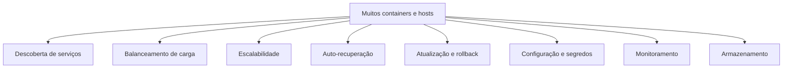
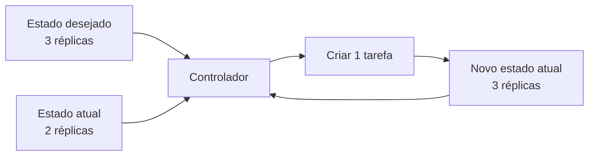
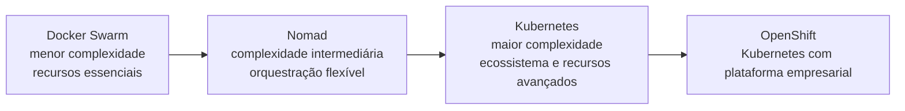
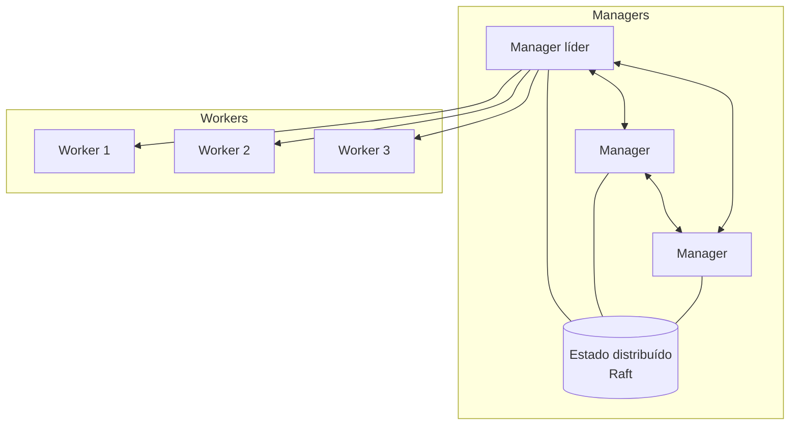
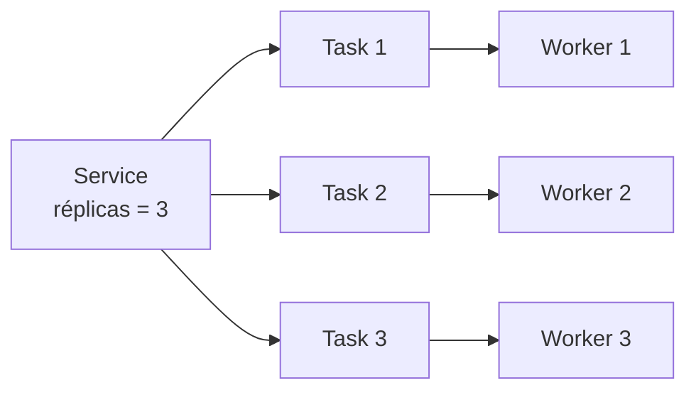
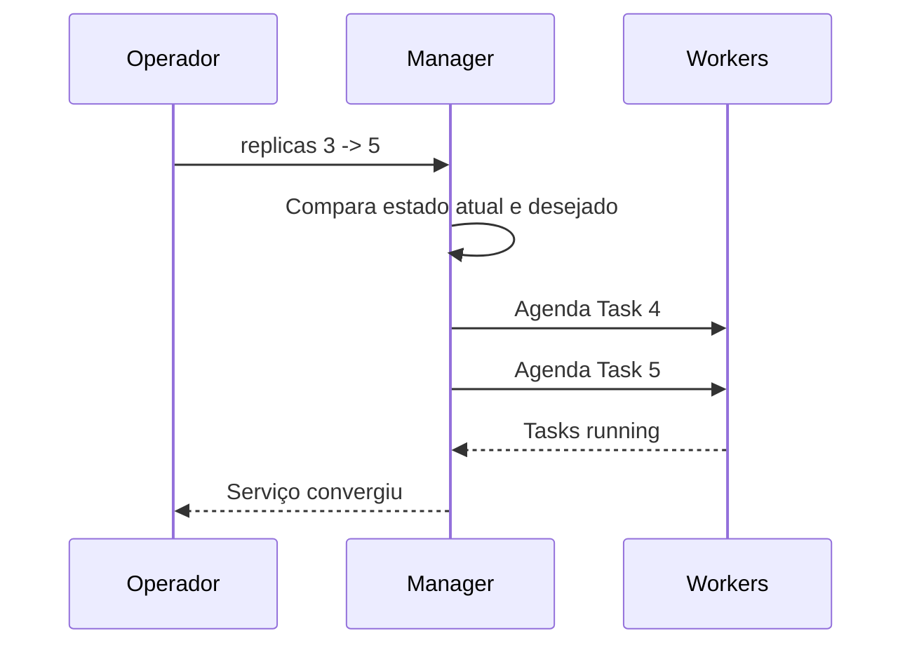
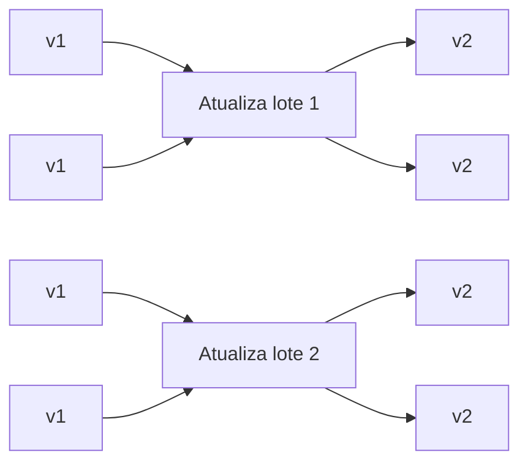

# 5. Orquestração de containers e Docker Swarm

## Objetivos de aprendizagem

Ao final deste capítulo, você deverá ser capaz de:

- explicar por que uma aplicação com muitos containers exige orquestração;
- descrever estado desejado, reconciliação e auto-recuperação;
- comparar opções de orquestração;
- identificar componentes do Docker Swarm;
- criar e escalar serviços;
- compreender overlay network, routing mesh e rolling update;
- reconhecer limites e casos de uso do Swarm.

## 1. Por que orquestrar containers

Executar alguns containers em um único host é relativamente simples. Em escala, surgem problemas de distribuição, disponibilidade, atualização, rede, armazenamento e observabilidade.



Um orquestrador oferece um plano de controle que recebe a intenção do operador e trabalha continuamente para realizá-la.

> **Ponto de prova:** os principais benefícios são gerenciamento centralizado, implantação, escalabilidade, auto-recuperação, descoberta de serviços, balanceamento e atualizações controladas.

## 2. Estado desejado e estado atual

O operador declara “quero três réplicas da imagem X”. O orquestrador observa quantas réplicas estão ativas e corrige diferenças.



Esse ciclo é chamado de reconciliação.

## 3. Capacidades de um orquestrador

### Descoberta de serviços

Serviços recebem nomes e endereços estáveis, mesmo quando containers são recriados.

### Balanceamento de carga

O tráfego é distribuído entre réplicas saudáveis.

### Agendamento

O orquestrador escolhe em qual nó cada workload será executado, considerando recursos e restrições.

### Auto-recuperação

Quando um container ou nó falha, novas instâncias são criadas em nós disponíveis.

### Escalabilidade

A quantidade de réplicas pode ser alterada manual ou automaticamente.

### Atualização e rollback

Versões são substituídas de forma controlada, com possibilidade de retorno.

### Abstração de armazenamento

Volumes e drivers de storage permitem conectar dados persistentes aos workloads.

## 4. Ferramentas apresentadas

| Ferramenta | Característica |
|---|---|
| Docker Swarm | Orquestração integrada ao Docker Engine, simples e didática |
| Kubernetes | Plataforma extensível e dominante no ecossistema cloud native |
| Amazon ECS | Serviço gerenciado de containers da AWS |
| Amazon EKS | Kubernetes gerenciado pela AWS |
| Azure Kubernetes Service (AKS) | Kubernetes gerenciado no Azure |
| Google Kubernetes Engine (GKE) | Kubernetes gerenciado no Google Cloud |
| Red Hat OpenShift | Plataforma empresarial baseada em Kubernetes |
| HashiCorp Nomad | Orquestrador flexível para containers e outras cargas |

> **Correção do material:** o serviço Kubernetes da AWS é **Amazon EKS**, não “Amazon AKS”. AKS é o serviço do Microsoft Azure.

## 5. Critérios de escolha

- compatibilidade com a infraestrutura existente;
- integração com serviços de nuvem;
- experiência da equipe;
- complexidade operacional;
- escalabilidade e desempenho;
- requisitos de segurança e conformidade;
- observabilidade;
- custo total, não apenas custo de execução;
- portabilidade e risco de lock-in;
- ecossistema e documentação.



A sequência é didática e não representa uma classificação absoluta. A escolha depende do contexto.

## 6. Docker Swarm

Swarm mode é a funcionalidade de cluster integrada ao Docker Engine. Um conjunto de hosts Docker forma um swarm e executa serviços distribuídos.



## 7. Componentes do Swarm

### 7.1 Manager nodes

Responsabilidades:

- manter o estado do cluster;
- receber comandos administrativos;
- agendar tarefas;
- reconciliar estado desejado;
- gerenciar membership e certificados;
- eleger líder por consenso Raft.

Managers também podem executar tarefas, salvo quando configurados como `drain`.

### 7.2 Worker nodes

- executam tarefas atribuídas;
- reportam estado aos managers;
- executam containers dos serviços.

### 7.3 Service

É a definição declarativa de uma aplicação no Swarm. Inclui:

- imagem;
- número de réplicas;
- portas;
- redes;
- atualização;
- rollback;
- recursos;
- secrets e configs.

### 7.4 Task

É a unidade de trabalho atribuída a um nó. Normalmente corresponde a um container de uma réplica do serviço.



### 7.5 Overlay network

Rede virtual que conecta serviços em nós diferentes.

### 7.6 Load balancing e routing mesh

O Swarm pode aceitar tráfego publicado em qualquer nó e encaminhá-lo a uma tarefa ativa do serviço.

## 8. Containers efêmeros e serviços duráveis

- **Efêmero:** tarefa curta, executada uma vez e descartada.
- **Durável:** serviço contínuo, mantido pelo orquestrador.

Em Swarm, `docker run` cria um container local não gerenciado pelo cluster. `docker service create` cria um serviço reconciliado pelo Swarm.

## 9. Criar o cluster

No primeiro manager:

```bash
docker swarm init --advertise-addr <MANAGER-IP>
```

Obter token para workers:

```bash
docker swarm join-token worker
```

Adicionar worker:

```bash
docker swarm join \
  --token <TOKEN> \
  <MANAGER-IP>:2377
```

Listar nós, no manager:

```bash
docker node ls
```

> **Correção do material:** o namespace correto para comandos de nós é `docker node`, no singular. `docker swarm nodes --help` não é um comando válido.

## 10. Criar e administrar serviço

```bash
docker service create \
  --name web \
  --replicas 3 \
  --publish published=8080,target=80 \
  nginx:stable-alpine
```

Listar:

```bash
docker service ls
docker service ps web
```

Inspecionar:

```bash
docker service inspect --pretty web
```

Logs:

```bash
docker service logs -f web
```

Remover:

```bash
docker service rm web
```

## 11. Escalar serviços

Forma apresentada no material:

```bash
docker service update --replicas 5 web
```

Forma específica para escala:

```bash
docker service scale web=5
```



## 12. Global service

Um serviço replicado executa uma quantidade desejada de tarefas. Um serviço global executa uma tarefa em cada nó elegível.

```bash
docker service create \
  --name node-agent \
  --mode global \
  minha-imagem-agent
```

Uso típico:

- agente de monitoramento;
- coletor de logs;
- componente de rede;
- daemon de infraestrutura.

## 13. Restrições de agendamento

Adicionar label ao nó:

```bash
docker node update --label-add tipo=gpu worker-1
```

Criar serviço com constraint:

```bash
docker service create \
  --name inferencia \
  --constraint 'node.labels.tipo == gpu' \
  minha-imagem
```

Outras estratégias incluem preferências de espalhamento e reservas de recursos.

## 14. Limites e reservas

```bash
docker service create \
  --name api \
  --limit-cpu 1 \
  --limit-memory 512m \
  --reserve-cpu 0.25 \
  --reserve-memory 128m \
  minha-api
```

- **reservation:** recurso considerado pelo scheduler;
- **limit:** teto de consumo em execução.

## 15. Rolling update

```bash
docker service update \
  --image minha-api:2.0.0 \
  --update-parallelism 2 \
  --update-delay 10s \
  --update-failure-action rollback \
  api
```



## 16. Rollback

```bash
docker service rollback api
```

Ou configure rollback automático em caso de falha durante a atualização.

```bash
docker service update \
  --rollback-parallelism 1 \
  --rollback-delay 5s \
  api
```

## 17. Overlay network

```bash
docker network create \
  --driver overlay \
  --attachable \
  app-net
```

Serviços:

```bash
docker service create --name api --network app-net minha-api
docker service create --name db --network app-net postgres:17-alpine
```

A resolução de nomes é oferecida internamente pelo Swarm.

## 18. Secrets e configs

### Secret

```bash
printf '%s' 'senha-forte' | docker secret create db_password -
```

```bash
docker service create \
  --name db \
  --secret db_password \
  postgres:17-alpine
```

O secret é montado por padrão em `/run/secrets/db_password`.

### Config

```bash
docker config create nginx_conf ./nginx.conf
```

```bash
docker service create \
  --name proxy \
  --config source=nginx_conf,target=/etc/nginx/nginx.conf \
  nginx:stable-alpine
```

## 19. Stack com Compose

O Swarm pode implantar uma stack a partir de arquivo Compose compatível:

```bash
docker stack deploy -c stack.yaml minha-stack
```

Listar:

```bash
docker stack ls
docker stack services minha-stack
docker stack ps minha-stack
```

Remover:

```bash
docker stack rm minha-stack
```

Exemplo:

```yaml
services:
  web:
    image: nginx:stable-alpine
    ports:
      - "8080:80"
    deploy:
      replicas: 3
      update_config:
        parallelism: 1
        delay: 5s
        failure_action: rollback
      restart_policy:
        condition: on-failure
      resources:
        limits:
          cpus: "0.50"
          memory: 256M
```

> A seção `deploy` é voltada à implantação orquestrada. Nem todos os seus atributos são aplicados pelo `docker compose up` local.

## 20. Alta disponibilidade dos managers

Managers usam consenso Raft. Recomenda-se quantidade ímpar de managers para tolerar falhas sem empate.

| Managers | Falhas toleradas |
|---:|---:|
| 1 | 0 |
| 3 | 1 |
| 5 | 2 |
| 7 | 3 |

Mais managers não significam desempenho ilimitado; aumentam custo de consenso.

## 21. Segurança do Swarm

- comunicação entre nós usa TLS mútuo;
- nós recebem certificados;
- tokens de join devem ser protegidos e rotacionados;
- secrets são distribuídos apenas a tarefas autorizadas;
- managers concentram poder administrativo;
- portas de cluster devem ser restritas à rede de gerenciamento;
- proteja backups do estado do Swarm e unlock key quando autolock estiver ativo.

Rotacionar token:

```bash
docker swarm join-token --rotate worker
```

## 22. Sair do Swarm

Worker:

```bash
docker swarm leave
```

Manager único ou remoção forçada:

```bash
docker swarm leave --force
```

O `--force` deve ser usado com cuidado, pois pode destruir o controle do cluster local.

## 23. Swarm versus Compose versus Kubernetes

| Critério | Compose | Swarm | Kubernetes |
|---|---|---|---|
| Escopo | Um host/projeto | Cluster Docker | Cluster extensível |
| Reconciliação | Limitada | Sim | Sim |
| Scheduler | Não | Sim | Sim |
| Auto-recuperação | Básica por restart | Sim | Sim |
| Rede entre hosts | Não | Overlay | CNI |
| Complexidade | Baixa | Baixa a média | Média a alta |
| Ecossistema | Desenvolvimento local | Menor | Muito amplo |

## 24. Quando usar Swarm

Pode ser adequado quando:

- a equipe já domina Docker;
- o cluster é pequeno ou médio;
- os requisitos são simples;
- deseja-se aprender conceitos de orquestração;
- a complexidade do Kubernetes não se justifica.

Pode ser insuficiente quando:

- são necessários autoscaling avançado, operators e políticas extensas;
- há forte integração com o ecossistema Kubernetes;
- múltiplas equipes compartilham a plataforma;
- governança e extensibilidade são requisitos centrais.

## 25. Resumo para a prova

- Orquestração centraliza gerenciamento, escala e auto-recuperação.
- Estado desejado é continuamente comparado ao estado atual.
- Managers gerenciam; workers executam tarefas.
- Service representa a aplicação; task é uma instância de trabalho.
- Overlay conecta nós diferentes.
- Swarm distribui tráfego entre réplicas.
- `docker swarm init` cria o cluster.
- `docker node ls` lista nós.
- `docker service create` cria serviço.
- `docker service update --replicas` e `docker service scale` alteram escala.
- Rolling update substitui réplicas gradualmente.
- `docker stack deploy` implanta uma stack.

## 26. Perguntas de revisão

1. Qual é a diferença entre service e task?
2. Qual é o papel de um manager?
3. O que é estado desejado?
4. Por que usar quantidade ímpar de managers?
5. Qual é a diferença entre serviço replicado e global?
6. Para que serve uma rede overlay?
7. Como escalar um serviço para cinco réplicas?
8. Qual é a diferença entre `docker run` e `docker service create`?
9. Em que cenário Swarm pode ser preferível a Kubernetes?
