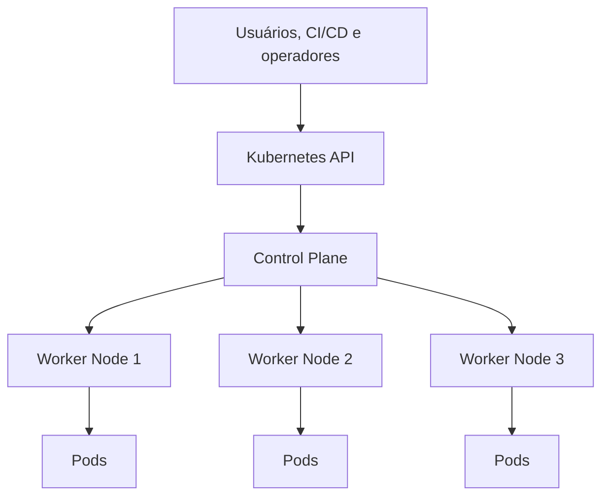
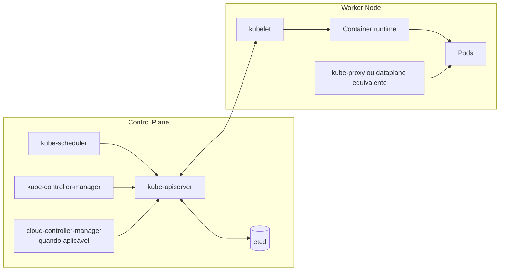
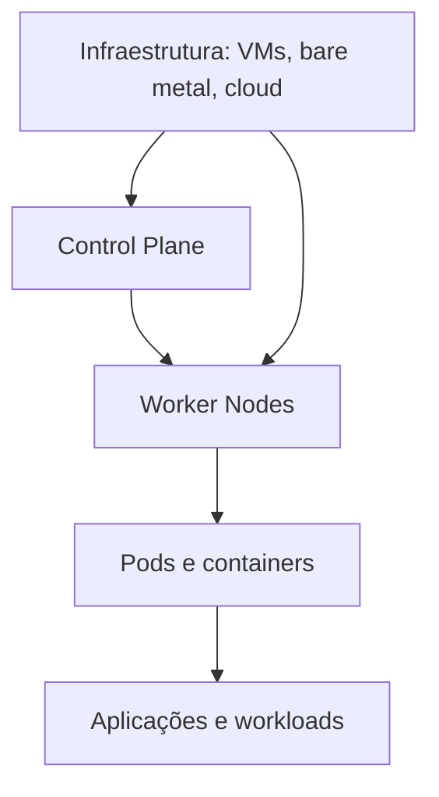
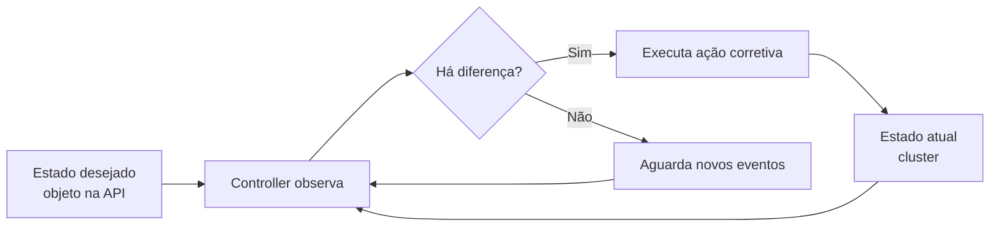
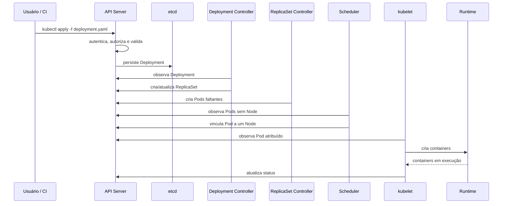
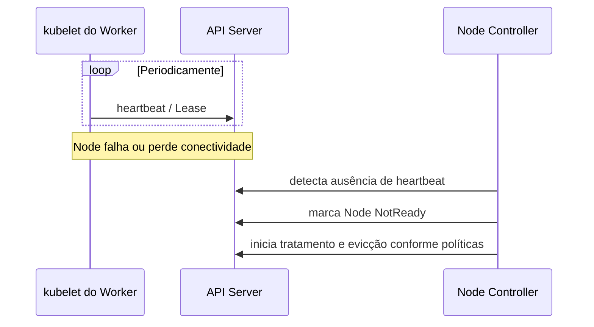
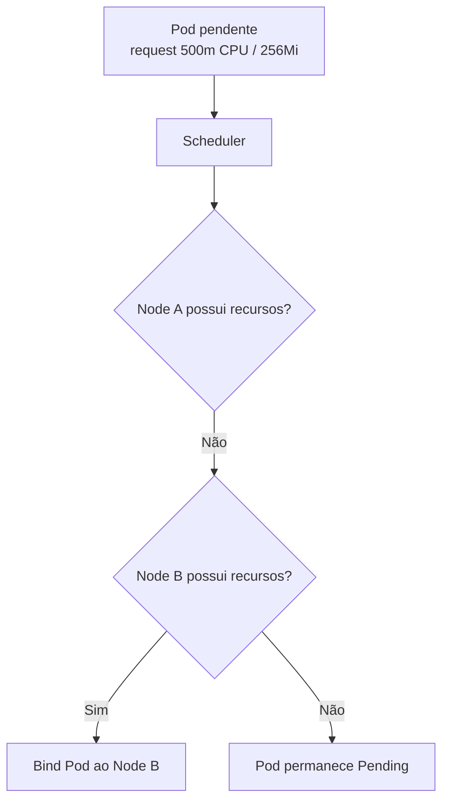
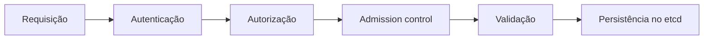

# 6. Arquitetura e fundamentos do Kubernetes

## Objetivos de aprendizagem

Ao final deste capítulo, você deverá ser capaz de:

- explicar o propósito do Kubernetes;
- identificar componentes do Control Plane e dos workers;
- descrever o fluxo de criação de um workload;
- explicar estado desejado e loops de controle;
- compreender o papel de API Server, etcd, scheduler, controllers e kubelet;
- explicar detecção de falhas por heartbeats;
- diferenciar Kubernetes de Docker e de um container runtime.

## 1. O que é Kubernetes

Kubernetes, frequentemente abreviado como K8s, é uma plataforma de código aberto para automatizar implantação, escalabilidade e gerenciamento de aplicações containerizadas.

Ele não é:

- um formato de container;
- um substituto para imagens OCI;
- um runtime de baixo nível;
- uma plataforma que elimina a necessidade de operação.

Ele coordena workloads distribuídos sobre um cluster de máquinas.



## 2. Contexto histórico

A história do Kubernetes está ligada à experiência do Google com sistemas internos de gerenciamento de workloads, como Borg. O projeto foi anunciado em 2014 e posteriormente doado à Cloud Native Computing Foundation.

O nome vem do grego e remete a “timoneiro” ou “piloto”, alguém que conduz uma embarcação.

> **Ponto de prova:** Kubernetes automatiza implantação, gerenciamento e dimensionamento de aplicações e serviços containerizados.

## 3. Arquitetura geral

Um cluster Kubernetes possui:

- **Control Plane:** toma decisões globais e mantém o estado do cluster;
- **Worker Nodes:** executam os Pods e componentes necessários;
- **API declarativa:** recebe e armazena objetos desejados;
- **controllers:** reconciliam estado atual e desejado.



## 4. Componentes do Control Plane

### 4.1 kube-apiserver

É o ponto central de comunicação do cluster. Expõe a API HTTP, autentica e autoriza requisições, aplica admission control, valida objetos e persiste estado no etcd.

Todas as operações administrativas passam pela API, diretamente ou por ferramentas como `kubectl`.

### 4.2 etcd

Banco chave-valor consistente e distribuído que armazena o estado da API.

Armazena, por exemplo:

- objetos de workload;
- Services e configurações;
- metadados de Nodes;
- Secrets e ConfigMaps em forma persistida pela API;
- estado desejado do cluster.

> O backup do etcd é essencial para recuperação de clusters autogerenciados.

### 4.3 kube-scheduler

Observa Pods que ainda não possuem Node atribuído e escolhe um Node adequado.

Considera:

- solicitações de CPU e memória;
- afinidade e antiafinidade;
- taints e tolerations;
- topology spread constraints;
- disponibilidade de volumes;
- selectors e constraints;
- políticas e extensões do scheduler.

> **Ponto de prova:** o scheduler atribui Pods a Nodes adequados; ele não executa diretamente os containers.

### 4.4 kube-controller-manager

Executa vários controllers, como:

- Node Controller;
- Deployment e ReplicaSet controllers;
- Job Controller;
- EndpointSlice Controller;
- Namespace Controller;
- ServiceAccount Controller.

Cada controller observa objetos e tenta aproximar o estado atual do estado desejado.

### 4.5 cloud-controller-manager

Em clusters integrados a provedores de nuvem, gerencia recursos dependentes do provedor, como:

- Nodes ligados a instâncias;
- rotas;
- balanceadores de carga;
- endereços e integrações específicas.

## 5. Componentes do Worker Node

### 5.1 kubelet

Agente executado em cada Node. Ele:

- registra ou atualiza o Node;
- recebe PodSpecs atribuídos ao Node;
- solicita ao runtime a criação de containers;
- monta volumes;
- executa probes;
- reporta status e heartbeats;
- garante que os containers definidos estejam em execução.

### 5.2 Container runtime

Executa os containers. Exemplos comuns:

- containerd;
- CRI-O;
- Docker Engine por meio de `cri-dockerd`;
- runtimes compatíveis com a Container Runtime Interface.

> **Atualização técnica:** Kubernetes se comunica com runtimes pela CRI. O suporte interno chamado dockershim foi removido. Docker Engine não implementa CRI diretamente e necessita de um adaptador como `cri-dockerd`. Na prática, containerd e CRI-O são escolhas comuns.

### 5.3 kube-proxy

Mantém regras de rede relacionadas a Services, permitindo encaminhamento de tráfego para os Pods.

Dependendo da solução de rede, parte ou toda essa função pode ser substituída por dataplanes baseados em eBPF.

### 5.4 Plugin CNI

Embora não seja destacado em todos os materiais introdutórios, um cluster necessita de implementação de rede compatível com CNI para conectar Pods e aplicar o modelo de rede.

Exemplos: Calico, Cilium, Flannel e plugins de provedores de nuvem.

## 6. Camadas conceituais



## 7. API declarativa

Em vez de mandar uma sequência de passos imperativos, o usuário normalmente envia um objeto declarando o resultado desejado.

Exemplo:

```yaml
apiVersion: apps/v1
kind: Deployment
metadata:
  name: web
spec:
  replicas: 3
  selector:
    matchLabels:
      app: web
  template:
    metadata:
      labels:
        app: web
    spec:
      containers:
        - name: nginx
          image: nginx:stable-alpine
```

O Kubernetes armazena esse objeto e controllers trabalham para manter três réplicas.

## 8. Estado desejado versus estado atual



Essa reconciliação contínua explica por que o cluster pode estar sempre mudando sem ser considerado “instável”. O importante é que os controladores consigam convergir para um estado útil.

## 9. Fluxo de criação de um Deployment



## 10. Nodes

Node é uma máquina física ou virtual que executa workloads.

Pode ser adicionado ao cluster por:

- auto-registro do kubelet;
- criação manual do objeto Node;
- automação de infraestrutura ou serviço gerenciado.

O Control Plane valida o Node e acompanha condições como:

- `Ready`;
- `MemoryPressure`;
- `DiskPressure`;
- `PIDPressure`;
- `NetworkUnavailable`.

## 11. Heartbeats e detecção de falhas

O kubelet envia atualizações de status e leases periódicos.



### Reação geral à falha

1. Node deixa de responder;
2. condição muda para `Unknown` ou `NotReady`;
3. novos Pods deixam de ser agendados nele;
4. após tempos e tolerâncias aplicáveis, Pods podem ser recriados em outros Nodes;
5. volumes e regras de workload influenciam a recuperação.

> **Precisão importante:** os Pods não são “movidos” como processos vivos. Controllers criam Pods substitutos em outros Nodes. Pods locais do Node falho podem continuar existindo apenas como objetos até a reconciliação e evicção.

## 12. Scheduling e recursos

Containers podem declarar requests e limits.

```yaml
resources:
  requests:
    cpu: "250m"
    memory: "128Mi"
  limits:
    cpu: "1"
    memory: "512Mi"
```

- **request:** quantidade usada pelo scheduler para decidir se o Node comporta o Pod;
- **limit:** teto de consumo imposto em execução, de acordo com o recurso.



## 13. `kubectl`

`kubectl` é a ferramenta de linha de comando que se comunica com a API Kubernetes usando um arquivo `kubeconfig`.

Comandos iniciais:

```bash
kubectl cluster-info
kubectl get nodes
kubectl get pods -A
kubectl api-resources
kubectl explain deployment.spec
```

### Contextos

```bash
kubectl config get-contexts
kubectl config current-context
kubectl config use-context meu-contexto
```

> Confirme contexto e namespace antes de comandos destrutivos.

## 14. Namespaces Kubernetes

Namespaces organizam e separam logicamente recursos dentro do cluster.

```bash
kubectl get namespaces
kubectl create namespace estudo
kubectl get pods -n estudo
```

Eles ajudam em:

- organização por equipe ou ambiente;
- escopo de nomes;
- quotas;
- RBAC;
- políticas de rede;
- políticas de admissão.

Namespaces não são, sozinhos, uma barreira completa de segurança.

## 15. Segurança da API

Fluxo simplificado:



### Autenticação

Identifica usuário, service account ou componente.

### Autorização

Determina se a identidade pode realizar a ação. RBAC é o modelo mais comum.

### Admission control

Pode modificar ou rejeitar objetos antes da persistência, aplicando políticas e padrões.

## 16. Alta disponibilidade

Em produção, componentes do Control Plane podem ser replicados:

- múltiplos API Servers atrás de balanceador;
- cluster etcd com número ímpar de membros;
- scheduler e controllers com eleição de líder;
- Nodes distribuídos por zonas.

Alta disponibilidade não surge apenas por aumentar réplicas. Exige desenho de falhas, backups, capacidade e testes.

## 17. Kubernetes gerenciado

Serviços gerenciados reduzem parte do trabalho operacional do Control Plane:

- Amazon EKS;
- Azure Kubernetes Service;
- Google Kubernetes Engine;
- IBM Cloud Kubernetes Service;
- Oracle Container Engine for Kubernetes.

O usuário continua responsável por workloads, configuração, custos, segurança de aplicações, políticas e muitos aspectos dos Nodes.

## 18. Kubernetes versus Docker

| Item | Docker | Kubernetes |
|---|---|---|
| Imagem e container | Constrói e executa | Agenda e gerencia workloads baseados em imagens |
| Escopo básico | Host individual | Cluster |
| Build | Dockerfile/BuildKit | Não é função central do cluster |
| Rede | Drivers Docker | Modelo Kubernetes + CNI |
| Orquestração | Swarm opcional | Função principal |
| Runtime | Docker Engine | Usa runtime compatível com CRI |

A relação não é “Docker ou Kubernetes”. É possível construir imagens com Docker e executá-las em Kubernetes com containerd.

## 19. Erros conceituais comuns

### “Master executa tudo”

O Control Plane toma decisões, mas workloads normalmente executam nos workers.

### “Scheduler inicia containers”

O scheduler escolhe o Node. O kubelet e o runtime executam os containers.

### “Kubernetes usa Docker obrigatoriamente”

Kubernetes usa CRI. Docker Engine é apenas uma opção por meio de adaptador.

### “Pod é movido para outro Node”

Controllers criam substitutos; não há migração viva padrão do Pod.

### “Se o processo está vivo, a aplicação está saudável”

Probes de readiness e liveness tratam dimensões diferentes da saúde.

## 20. Resumo para a prova

- Kubernetes é um orquestrador de containers.
- Control Plane gerencia o cluster; workers executam Pods.
- API Server é a porta de entrada para operações.
- etcd armazena o estado da API.
- scheduler atribui Pods a Nodes.
- controller-manager executa loops de reconciliação.
- kubelet garante execução dos Pods no Node.
- kube-proxy implementa regras de Services, salvo dataplanes alternativos.
- container runtime executa containers via CRI.
- heartbeats permitem detectar Nodes indisponíveis.
- estado atual é continuamente aproximado do estado desejado.

## 21. Perguntas de revisão

1. Qual é a função do kube-apiserver?
2. O que o etcd armazena?
3. Qual componente escolhe o Node para um Pod?
4. Qual componente efetivamente solicita ao runtime a criação dos containers?
5. O que é um loop de reconciliação?
6. O que acontece quando um Node deixa de enviar heartbeats?
7. Qual é a diferença entre request e limit?
8. Por que Docker Engine não é obrigatório em Kubernetes?
9. Qual é o papel de um plugin CNI?
