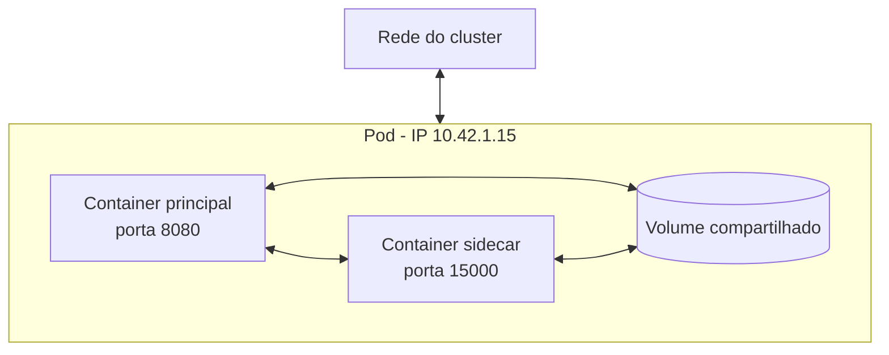
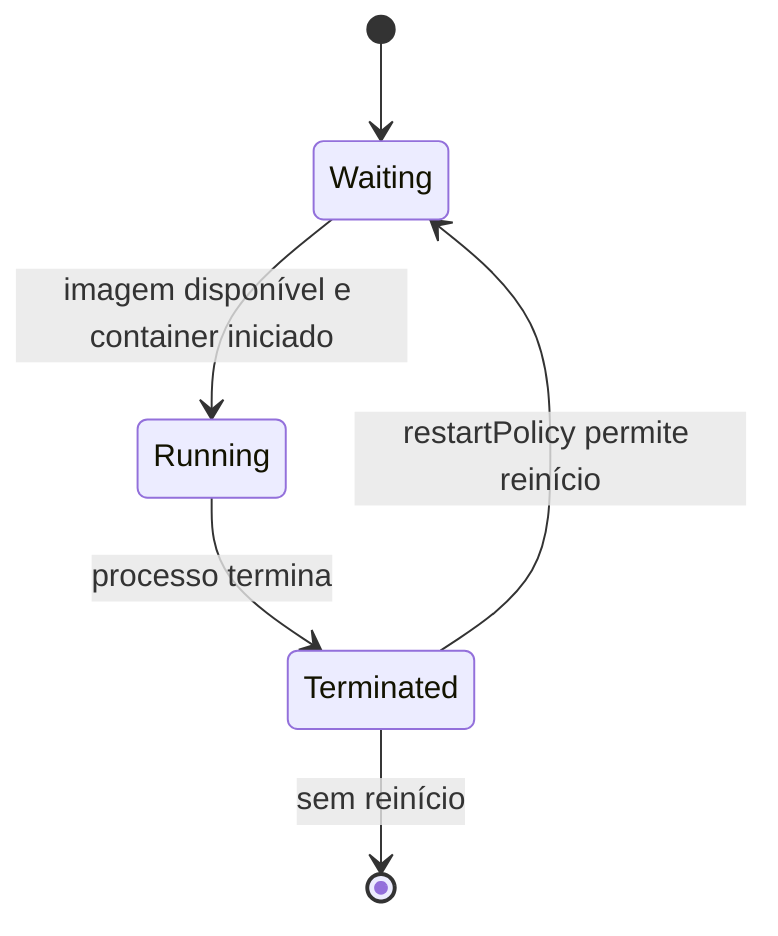
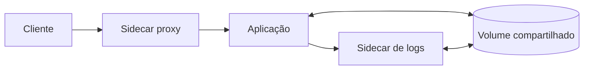
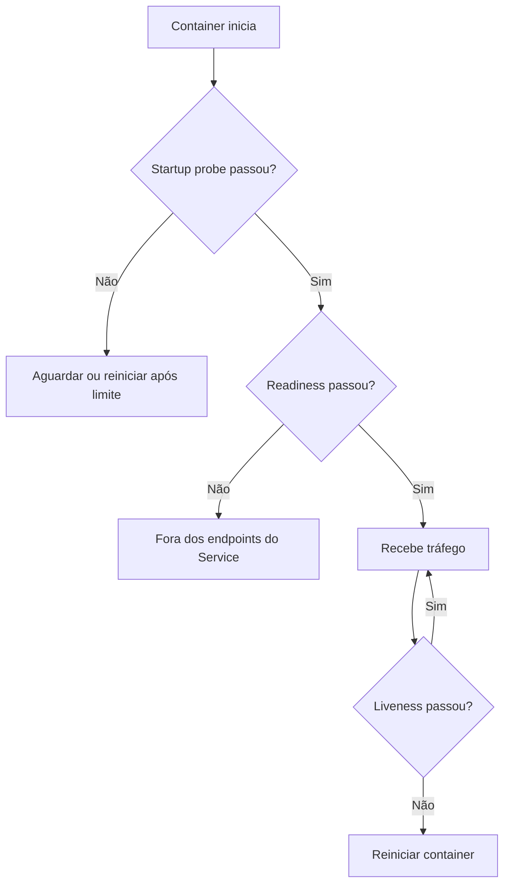
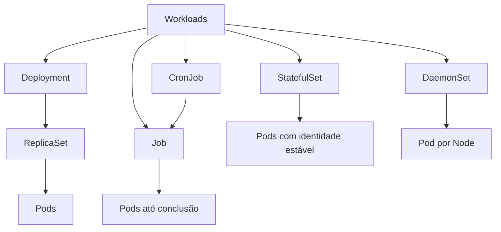
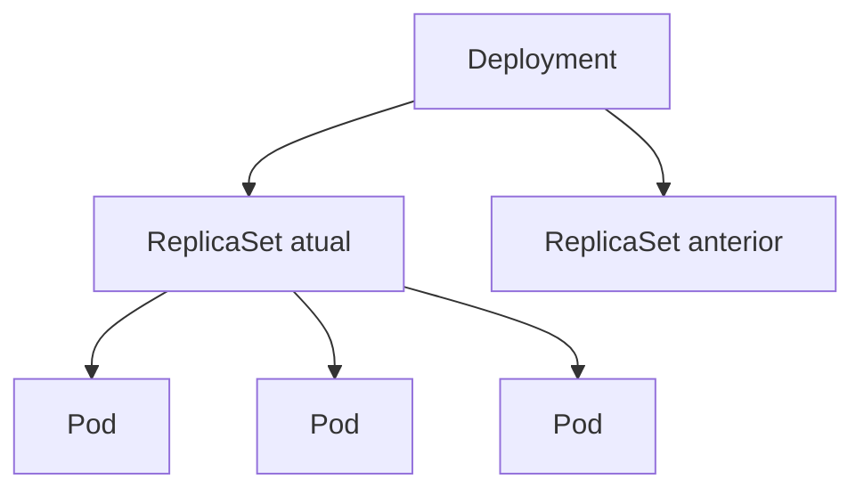
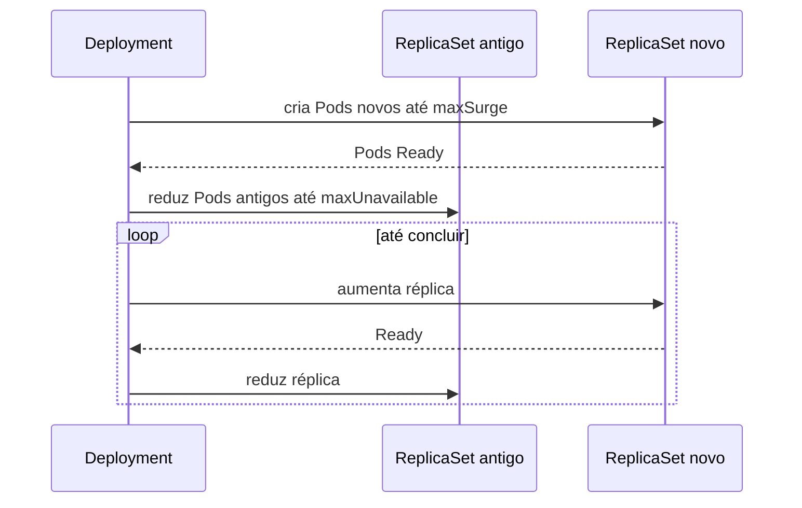
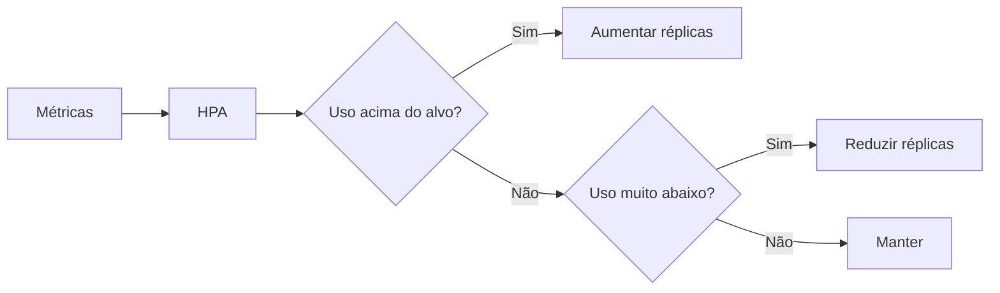
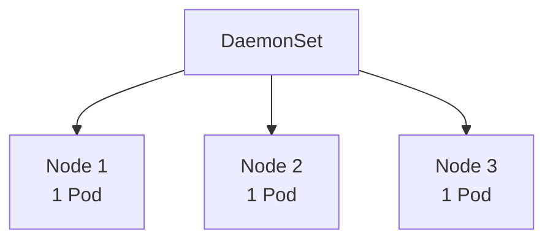

# 7. Pods, workloads e Deployments no Kubernetes

## Objetivos de aprendizagem

Ao final deste capítulo, você deverá ser capaz de:

- explicar o que é um Pod;
- descrever compartilhamento de rede e armazenamento intra-Pod;
- reconhecer estados de containers e fases de Pods;
- explicar o padrão sidecar;
- diferenciar Pod, ReplicaSet, Deployment, StatefulSet, DaemonSet, Job e CronJob;
- interpretar estratégias RollingUpdate e Recreate;
- escalar e acompanhar rollouts;
- configurar probes e recursos básicos.

## 1. O que é um Pod

Pod é a menor unidade implantável gerenciada pelo Kubernetes. Ele encapsula um ou mais containers que compartilham contexto de execução.



Containers no mesmo Pod compartilham:

- endereço IP;
- namespace de rede;
- espaço de portas;
- volumes declarados pelo Pod;
- ciclo de vida e agendamento no mesmo Node.

> **Ponto de prova:** um Pod é um grupo de um ou mais containers com rede, armazenamento e especificação de execução compartilhados.

## 2. Por que não criar apenas containers isolados

Kubernetes administra Pods, não containers soltos. O Pod define a unidade que será:

- agendada em um Node;
- reiniciada ou substituída por controllers;
- associada a Service;
- observada por probes;
- configurada com volumes, secrets e recursos.

## 3. Comunicação intra-Pod

Como os containers compartilham rede, eles se comunicam por `localhost`.

Exemplo:

- aplicação principal escuta em `localhost:8080`;
- sidecar proxy escuta em `localhost:15001`;
- ambos veem o mesmo IP do Pod.

Containers precisam coordenar portas para evitar conflito.

## 4. Armazenamento compartilhado

```yaml
apiVersion: v1
kind: Pod
metadata:
  name: pod-volume
spec:
  volumes:
    - name: dados
      emptyDir: {}
  containers:
    - name: produtor
      image: busybox:1.36
      command: ["sh", "-c", "date > /dados/data.txt; sleep 3600"]
      volumeMounts:
        - name: dados
          mountPath: /dados
    - name: consumidor
      image: busybox:1.36
      command: ["sh", "-c", "while true; do cat /dados/data.txt; sleep 10; done"]
      volumeMounts:
        - name: dados
          mountPath: /dados
```

`emptyDir` existe durante a vida do Pod. Quando o Pod é removido, os dados são descartados.

## 5. Manifesto básico de Pod

```yaml
apiVersion: v1
kind: Pod
metadata:
  name: meu-pod
  labels:
    app: nginx
spec:
  containers:
    - name: nginx
      image: nginx:stable-alpine
      ports:
        - name: http
          containerPort: 80
      resources:
        requests:
          cpu: 50m
          memory: 64Mi
        limits:
          cpu: 250m
          memory: 128Mi
```

Aplicar:

```bash
kubectl apply -f pod.yaml
kubectl get pod meu-pod
kubectl describe pod meu-pod
kubectl logs meu-pod
```

## 6. Fases do Pod e estados dos containers

### Fases de Pod

| Fase | Significado |
|---|---|
| `Pending` | Aceito pelo cluster, mas ainda não totalmente iniciado |
| `Running` | Associado a um Node e com pelo menos um container em execução ou iniciando |
| `Succeeded` | Todos os containers terminaram com sucesso e não reiniciarão |
| `Failed` | Pelo menos um container terminou com falha e não reiniciará |
| `Unknown` | Estado não pôde ser obtido, geralmente por comunicação com o Node |

### Estados de container

- `Waiting`;
- `Running`;
- `Terminated`.



## 7. Restart policy do Pod

Valores:

- `Always` — padrão para Pods comuns e obrigatório em templates de Deployment;
- `OnFailure` — reinicia somente quando houver falha;
- `Never` — não reinicia.

Exemplo de Job:

```yaml
apiVersion: batch/v1
kind: Job
metadata:
  name: backup-job
spec:
  template:
    spec:
      restartPolicy: Never
      containers:
        - name: backup
          image: alpine:3.21
          command:
            - sh
            - -c
            - echo "Backup iniciado"; sleep 10; echo "Backup concluído"
```

## 8. Pods são efêmeros

Pods recebem identidade e IP temporários. Quando um Pod é substituído, o novo Pod possui outro UID e provavelmente outro IP.

Por isso:

- clientes devem usar Services, não IP direto;
- dados persistentes devem usar volumes adequados;
- aplicações devem tolerar reinício;
- controllers devem gerenciar réplicas.

## 9. Sidecars

Sidecar é um container auxiliar executado no mesmo Pod para estender o container principal.

Casos de uso do material:

- logging e monitoramento;
- proxy e gerenciamento de tráfego;
- sincronização de dados;
- segurança e autenticação;
- atualização de arquivos de configuração.



### Cuidados

- sidecar aumenta consumo de recursos;
- falhas podem afetar o Pod inteiro;
- coordenação de inicialização e encerramento é necessária;
- nem todo agente precisa ser sidecar — DaemonSet pode ser melhor para agentes por Node;
- service mesh moderno também pode operar sem sidecar por workload.

## 10. Init containers

Executam antes dos containers principais e devem terminar com sucesso.

```yaml
apiVersion: v1
kind: Pod
metadata:
  name: app-com-init
spec:
  initContainers:
    - name: aguarda-db
      image: busybox:1.36
      command: ["sh", "-c", "until nc -z db 5432; do sleep 2; done"]
  containers:
    - name: app
      image: minha-app:1.0.0
```

Usos:

- migração ou preparação;
- geração de arquivos;
- espera por dependência;
- validação de pré-condições.

## 11. Probes

### Liveness

Indica se o container deve ser reiniciado.

### Readiness

Indica se o Pod pode receber tráfego de Services.

### Startup

Protege aplicações com inicialização lenta, adiando liveness e readiness até a partida.

```yaml
containers:
  - name: app
    image: minha-app:1.0.0
    ports:
      - containerPort: 8080
    startupProbe:
      httpGet:
        path: /health/startup
        port: 8080
      failureThreshold: 30
      periodSeconds: 2
    readinessProbe:
      httpGet:
        path: /health/ready
        port: 8080
      periodSeconds: 5
    livenessProbe:
      httpGet:
        path: /health/live
        port: 8080
      periodSeconds: 10
```



## 12. O que são workloads

Workloads são objetos de nível superior que gerenciam Pods.



## 13. ReplicaSet

Garante que uma quantidade desejada de Pods esteja ativa.

```yaml
apiVersion: apps/v1
kind: ReplicaSet
metadata:
  name: nginx-rs
spec:
  replicas: 3
  selector:
    matchLabels:
      app: nginx
  template:
    metadata:
      labels:
        app: nginx
    spec:
      containers:
        - name: nginx
          image: nginx:stable-alpine
```

Na prática, ReplicaSets normalmente são criados e gerenciados por Deployments.

## 14. Deployment

Deployment administra Pods stateless por meio de ReplicaSets e oferece atualização declarativa.

Funções do material:

- criação e atualização;
- escalabilidade;
- rollback;
- monitoramento e ações corretivas.



### Manifesto

```yaml
apiVersion: apps/v1
kind: Deployment
metadata:
  name: nginx-deployment
spec:
  replicas: 3
  selector:
    matchLabels:
      app: nginx
  strategy:
    type: RollingUpdate
    rollingUpdate:
      maxUnavailable: 25%
      maxSurge: 25%
  template:
    metadata:
      labels:
        app: nginx
    spec:
      containers:
        - name: nginx
          image: nginx:stable-alpine
          ports:
            - name: http
              containerPort: 80
          readinessProbe:
            httpGet:
              path: /
              port: http
            initialDelaySeconds: 2
            periodSeconds: 5
          resources:
            requests:
              cpu: 50m
              memory: 64Mi
            limits:
              cpu: 250m
              memory: 128Mi
```

Aplicar:

```bash
kubectl apply -f deployment.yaml
kubectl get deployments
kubectl get replicasets
kubectl get pods -l app=nginx
```

## 15. Estratégia RollingUpdate

É a estratégia padrão. Novos Pods são criados gradualmente enquanto antigos são removidos.

- `maxUnavailable`: quantidade máxima indisponível;
- `maxSurge`: quantidade máxima adicional durante o rollout.



> **Ponto de prova:** com valores padrão de 25%, o Deployment busca manter ao menos 75% das réplicas desejadas disponíveis e pode chegar a 125% durante o aumento temporário.

## 16. Estratégia Recreate

Todos os Pods antigos são encerrados antes da criação dos novos.

```yaml
strategy:
  type: Recreate
```

Use quando:

- versões antigas e novas não podem coexistir;
- há recurso exclusivo;
- a aplicação não suporta execução simultânea;
- downtime é aceitável.

> **Ponto de prova:** Recreate evita versões simultâneas, mas causa indisponibilidade.

## 17. Atualizar imagem e acompanhar rollout

```bash
kubectl set image deployment/nginx-deployment \
  nginx=nginx:1.28-alpine

kubectl rollout status deployment/nginx-deployment
kubectl rollout history deployment/nginx-deployment
```

Pausar e continuar:

```bash
kubectl rollout pause deployment/nginx-deployment
kubectl rollout resume deployment/nginx-deployment
```

Rollback:

```bash
kubectl rollout undo deployment/nginx-deployment
kubectl rollout undo deployment/nginx-deployment --to-revision=2
```

## 18. Escala manual

```bash
kubectl scale deployment/nginx-deployment --replicas=10
```

## 19. Horizontal Pod Autoscaler

```bash
kubectl autoscale deployment nginx-deployment \
  --min=2 \
  --max=10 \
  --cpu-percent=80
```

O HPA depende de métricas, normalmente Metrics Server, e funciona melhor quando requests estão definidos.



## 20. StatefulSet

Gerencia aplicações que precisam de identidade e armazenamento estáveis.

Características:

- nomes ordenados, como `mongodb-0`, `mongodb-1`;
- criação e remoção ordenadas;
- volume persistente por réplica;
- integração comum com Service headless.

```yaml
apiVersion: apps/v1
kind: StatefulSet
metadata:
  name: mongodb
spec:
  serviceName: mongodb
  replicas: 3
  selector:
    matchLabels:
      app: mongodb
  template:
    metadata:
      labels:
        app: mongodb
    spec:
      containers:
        - name: mongodb
          image: mongo:8.0
          ports:
            - containerPort: 27017
          volumeMounts:
            - name: data
              mountPath: /data/db
  volumeClaimTemplates:
    - metadata:
        name: data
      spec:
        accessModes: ["ReadWriteOnce"]
        resources:
          requests:
            storage: 1Gi
```

StatefulSet não transforma automaticamente um banco em cluster. A aplicação ainda precisa configurar replicação, eleição e consistência.

## 21. DaemonSet

Garante uma réplica em todos os Nodes elegíveis ou em um subconjunto.

Usos do material:

- monitoramento;
- coleta de logs;
- agentes de rede;
- serviços de infraestrutura por Node.

```yaml
apiVersion: apps/v1
kind: DaemonSet
metadata:
  name: node-exporter
spec:
  selector:
    matchLabels:
      app: node-exporter
  template:
    metadata:
      labels:
        app: node-exporter
    spec:
      containers:
        - name: node-exporter
          image: prom/node-exporter:v1.8.2
          ports:
            - containerPort: 9100
```



## 22. Job

Executa trabalho até a conclusão.

```yaml
apiVersion: batch/v1
kind: Job
metadata:
  name: relatorio
spec:
  backoffLimit: 3
  template:
    spec:
      restartPolicy: Never
      containers:
        - name: relatorio
          image: minha-app:1.0.0
          command: ["./gerar-relatorio"]
```

## 23. CronJob

Cria Jobs em agenda cron.

```yaml
apiVersion: batch/v1
kind: CronJob
metadata:
  name: backup-diario
spec:
  schedule: "0 2 * * *"
  concurrencyPolicy: Forbid
  successfulJobsHistoryLimit: 3
  failedJobsHistoryLimit: 3
  jobTemplate:
    spec:
      template:
        spec:
          restartPolicy: Never
          containers:
            - name: backup
              image: minha-backup:1.0.0
```

Cuidados:

- fuso horário;
- idempotência;
- concorrência;
- atrasos e missed schedules;
- retenção de histórico;
- duração maior que o intervalo.

## 24. Comparação de workloads

| Workload | Identidade | Execução | Uso típico |
|---|---|---|---|
| Deployment | Intercambiável | Contínua | APIs e aplicações stateless |
| ReplicaSet | Intercambiável | Contínua | Réplicas, geralmente via Deployment |
| StatefulSet | Estável e ordenada | Contínua | Bancos e sistemas distribuídos |
| DaemonSet | Uma por Node | Contínua | Agentes de infraestrutura |
| Job | Até conclusão | Finita | Migração, processamento, backup |
| CronJob | Agendada | Finita e recorrente | Tarefas periódicas |

## 25. Comandos essenciais

```bash
kubectl apply -f arquivo.yaml
kubectl get pods
kubectl get deployments
kubectl describe pod <pod>
kubectl logs <pod>
kubectl logs -f <pod> -c <container>
kubectl exec -it <pod> -c <container> -- sh
kubectl delete -f arquivo.yaml
kubectl rollout status deployment/<nome>
kubectl port-forward pod/<pod> 8080:80
kubectl get events --sort-by=.lastTimestamp
```

## 26. Troubleshooting de Pods

### Pending

Verifique:

- eventos do scheduler;
- requests acima da capacidade;
- PVC pendente;
- taints e tolerations;
- affinity e selectors;
- quota.

### ImagePullBackOff

Verifique:

- nome e tag;
- autenticação no registry;
- conectividade;
- secret de pull;
- arquitetura da imagem.

### CrashLoopBackOff

Verifique:

```bash
kubectl logs <pod> --previous
kubectl describe pod <pod>
```

Causas comuns:

- erro da aplicação;
- comando incorreto;
- configuração ausente;
- probe agressiva;
- falta de permissão;
- OOMKilled.

## 27. Resumo para a prova

- Pod é a menor unidade implantável do Kubernetes.
- Containers do mesmo Pod compartilham IP, portas e volumes declarados.
- Estados de container: Waiting, Running e Terminated.
- Sidecar estende o container principal.
- Deployment gerencia ReplicaSets e atualizações.
- RollingUpdate atualiza gradualmente.
- Recreate remove todos os Pods antigos antes dos novos.
- StatefulSet fornece identidade e volumes estáveis.
- DaemonSet executa um Pod por Node elegível.
- Job executa até conclusão; CronJob agenda Jobs.
- Readiness controla tráfego; liveness controla reinício; startup protege inicialização lenta.

## 28. Perguntas de revisão

1. O que os containers de um Pod compartilham?
2. Qual é a diferença entre fase do Pod e estado do container?
3. Para que serve um sidecar?
4. Por que normalmente não se cria ReplicaSet diretamente?
5. Qual estratégia causa downtime e impede coexistência de versões?
6. Qual workload oferece identidade estável por réplica?
7. Qual workload executa uma réplica por Node?
8. Qual é a diferença entre readiness e liveness?
9. Por que HPA precisa de requests bem definidos?
