# 8. Services, redes, Ingress, Gateway API e Service Mesh

## Objetivos de aprendizagem

Ao final deste capítulo, você deverá ser capaz de:

- explicar o modelo de rede do Kubernetes;
- justificar por que Pods precisam de Services;
- diferenciar ClusterIP, NodePort, LoadBalancer, ExternalName e Headless Service;
- compreender selectors, EndpointSlices e descoberta por DNS;
- explicar tráfego norte-sul e leste-oeste;
- diferenciar Service, Ingress, Gateway API, API Gateway e Service Mesh;
- descrever o plano de controle e o plano de dados do Istio;
- reconhecer as diferenças entre sidecar mode e ambient mode.

## 1. Modelo de rede Kubernetes

O modelo de rede assume que:

- cada Pod recebe um endereço IP único no cluster;
- Pods podem se comunicar diretamente, conforme políticas e implementação CNI;
- containers do mesmo Pod compartilham o IP;
- Services fornecem endereços estáveis para conjuntos dinâmicos de Pods.

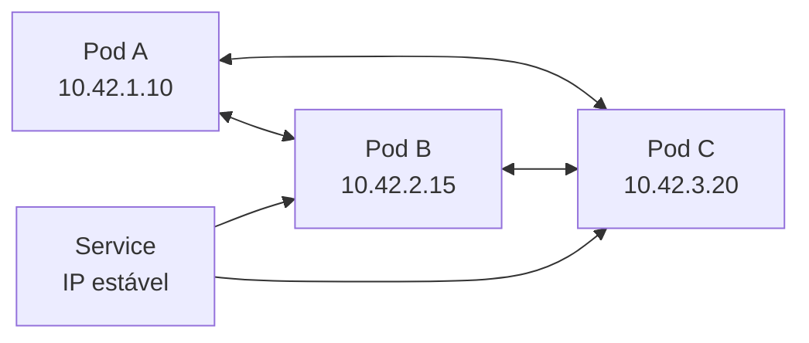

A implementação exata depende do plugin CNI e de NetworkPolicies.

## 2. Por que Services existem

Pods são efêmeros. Quando substituídos, recebem novo UID e possivelmente novo IP. Clientes não devem manter endereços de Pods diretamente.

Um Service oferece:

- nome DNS estável;
- IP virtual estável, quando aplicável;
- seleção lógica de Pods;
- balanceamento entre endpoints;
- descoberta de serviços;
- desacoplamento entre cliente e réplicas.

> **Ponto de prova:** Service fornece ponto de acesso estável para Pods, independentemente das mudanças nas réplicas.

## 3. Selector e EndpointSlice

Service seleciona Pods por labels.

```yaml
apiVersion: v1
kind: Service
metadata:
  name: minha-api
spec:
  selector:
    app: minha-api
  ports:
    - name: http
      protocol: TCP
      port: 80
      targetPort: 8080
```

Pods:

```yaml
metadata:
  labels:
    app: minha-api
```

O controlador mantém EndpointSlices com os endereços dos Pods correspondentes e prontos.

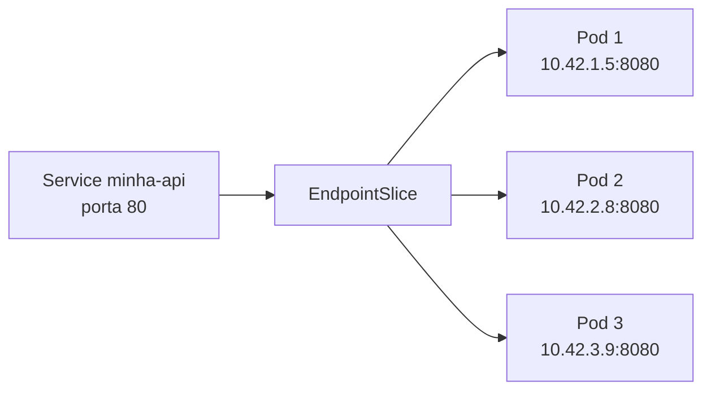

### `port` versus `targetPort`

- `port`: porta exposta pelo Service;
- `targetPort`: porta do container/Pod;
- `nodePort`: porta aberta em cada Node, quando aplicável.

## 4. Descoberta por DNS

Um Service chamado `db` no namespace `producao` pode ser encontrado por:

```text
db

db.producao

db.producao.svc.cluster.local
```

Um Pod no mesmo namespace normalmente usa apenas `db`.

## 5. Tipos de Service

### 5.1 ClusterIP

Tipo padrão. Expõe o Service apenas dentro da rede do cluster.

```yaml
spec:
  type: ClusterIP
```

Uso:

- comunicação entre aplicações internas;
- backend, banco, cache;
- ponto de acesso para Ingress ou Gateway.

### 5.2 NodePort

Abre uma porta em cada Node e encaminha ao Service.

```yaml
spec:
  type: NodePort
  ports:
    - port: 80
      targetPort: 8080
      nodePort: 30080
```

Acesso:

```text
http://IP_DO_NODE:30080
```

É simples, mas expõe portas altas e oferece menos flexibilidade para tráfego HTTP avançado.

### 5.3 LoadBalancer

Solicita um balanceador externo ao provedor ou implementação instalada.

```yaml
spec:
  type: LoadBalancer
```

É comum em clusters de nuvem e em soluções como MetalLB para bare metal.

### 5.4 ExternalName

Retorna um alias DNS para um nome externo.

```yaml
apiVersion: v1
kind: Service
metadata:
  name: api-legada
spec:
  type: ExternalName
  externalName: legado.exemplo.internal
```

Não cria proxy nem endpoints de Pods.

### 5.5 Comparação

| Tipo | Escopo | Mecanismo | Uso típico |
|---|---|---|---|
| ClusterIP | Interno | IP virtual e DNS | Comunicação interna |
| NodePort | Externo via Node | Porta em cada Node | Laboratório e integração simples |
| LoadBalancer | Externo | Balanceador do provedor | Exposição de serviço TCP/UDP |
| ExternalName | DNS | CNAME | Alias para serviço externo |
| Headless | Direto aos endpoints | DNS por Pod/endpoints | StatefulSets e descoberta direta |

## 6. Headless Service

Headless Service usa:

```yaml
spec:
  clusterIP: None
```

Exemplo:

```yaml
apiVersion: v1
kind: Service
metadata:
  name: mongodb
spec:
  clusterIP: None
  selector:
    app: mongodb
  ports:
    - name: mongo
      port: 27017
      targetPort: 27017
```

Em vez de um IP virtual único, o DNS retorna endereços dos Pods selecionados.

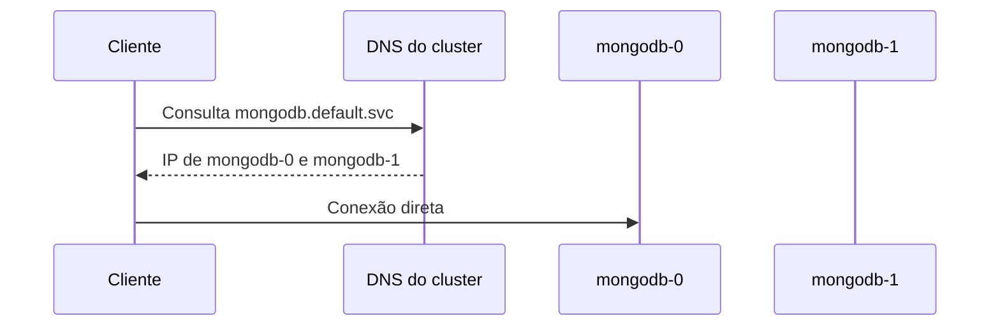

Uso comum:

- StatefulSets;
- bancos distribuídos;
- sistemas que realizam descoberta própria;
- comunicação direta entre réplicas.

## 7. Readiness e endpoints

Um Pod que falha na readiness probe normalmente é removido dos endpoints do Service, mas continua em execução.

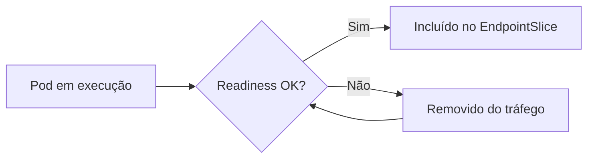

Isso permite retirar uma réplica do balanceamento durante inicialização, sobrecarga ou indisponibilidade temporária.

## 8. NetworkPolicy

Por padrão, muitos clusters permitem comunicação ampla entre Pods. NetworkPolicy declara tráfego permitido, desde que o plugin CNI ofereça suporte.

Exemplo: somente Pods com label `role=backend` podem acessar o banco na porta 5432.

```yaml
apiVersion: networking.k8s.io/v1
kind: NetworkPolicy
metadata:
  name: db-somente-backend
spec:
  podSelector:
    matchLabels:
      role: db
  policyTypes:
    - Ingress
  ingress:
    - from:
        - podSelector:
            matchLabels:
              role: backend
      ports:
        - protocol: TCP
          port: 5432
```

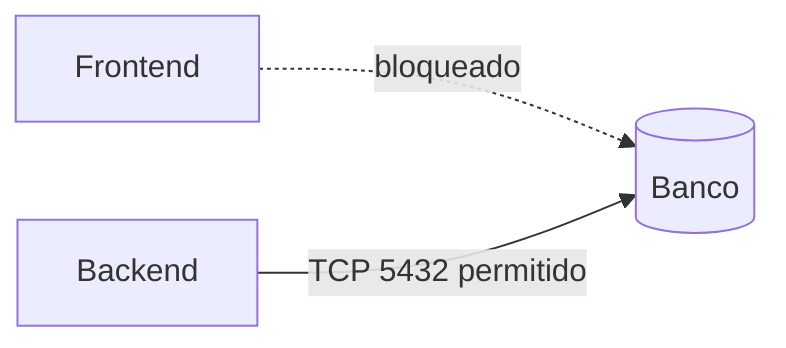

## 9. Tráfego norte-sul e leste-oeste

### Norte-sul

Tráfego entre clientes externos e serviços internos.

Exemplos:

- navegador para aplicação;
- parceiro para API;
- dispositivo para backend.

### Leste-oeste

Tráfego entre serviços internos.

Exemplos:

- frontend para API;
- API para serviço de pagamento;
- serviço para banco.

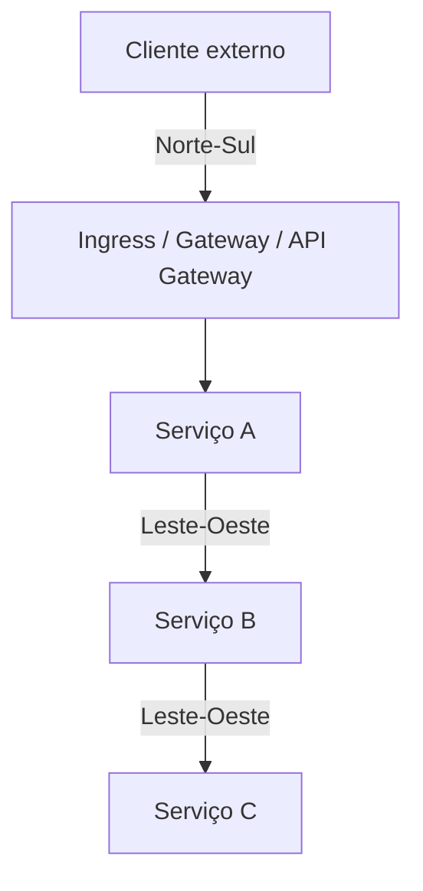

## 10. Ingress

Ingress descreve regras HTTP e HTTPS para rotear tráfego externo até Services. Ele exige um Ingress Controller instalado.

```yaml
apiVersion: networking.k8s.io/v1
kind: Ingress
metadata:
  name: aplicacoes
spec:
  ingressClassName: nginx
  rules:
    - host: app.exemplo.com
      http:
        paths:
          - path: /api
            pathType: Prefix
            backend:
              service:
                name: api
                port:
                  number: 80
          - path: /
            pathType: Prefix
            backend:
              service:
                name: frontend
                port:
                  number: 80
```

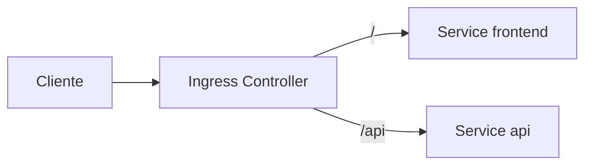

### Atualização técnica — Ingress congelado

A API Ingress continua estável e não está programada para remoção, mas foi congelada: novos recursos de rede estão sendo desenvolvidos principalmente na Gateway API. Para projetos novos e requisitos avançados, avalie Gateway API.

Referências:

- <https://kubernetes.io/docs/concepts/services-networking/ingress/>
- <https://kubernetes.io/docs/concepts/services-networking/gateway/>

## 11. Gateway API

Gateway API fornece recursos mais expressivos e orientados a papéis.

Objetos comuns:

- `GatewayClass` — implementação/controlador;
- `Gateway` — infraestrutura de entrada;
- `HTTPRoute` — regras HTTP;
- `GRPCRoute`, `TCPRoute` e outros, conforme suporte.

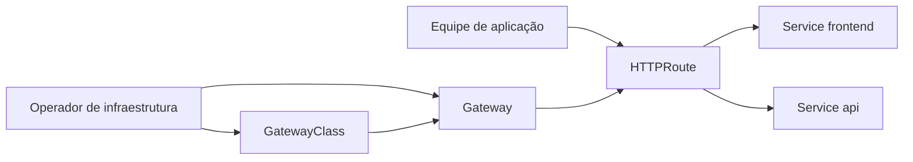

Exemplo simplificado:

```yaml
apiVersion: gateway.networking.k8s.io/v1
kind: Gateway
metadata:
  name: gateway-publico
spec:
  gatewayClassName: minha-classe
  listeners:
    - name: http
      protocol: HTTP
      port: 80
---
apiVersion: gateway.networking.k8s.io/v1
kind: HTTPRoute
metadata:
  name: api
spec:
  parentRefs:
    - name: gateway-publico
  hostnames:
    - api.exemplo.com
  rules:
    - backendRefs:
        - name: api
          port: 80
```

## 12. Ingress/Gateway versus Service

| Recurso | Responsabilidade |
|---|---|
| Service | Ponto estável e balanceamento para Pods |
| Ingress | Regras HTTP/HTTPS de entrada, modelo mais antigo e congelado |
| Gateway API | Entrada e roteamento extensível, orientado a papéis e protocolos |
| LoadBalancer Service | Exposição externa de um Service, normalmente L4 |

## 13. API Gateway versus Kubernetes Gateway

Os nomes são parecidos, mas o conceito pode diferir.

Um API Gateway de aplicação pode oferecer:

- autenticação de clientes;
- rate limiting;
- transformação de mensagens;
- monetização e planos;
- portal de APIs;
- versionamento de APIs.

Gateway API é um conjunto de APIs Kubernetes para configurar infraestrutura e roteamento de rede. Uma implementação pode incluir funções de API Gateway, mas não são sinônimos automáticos.

## 14. Service Mesh

Service mesh é uma camada de infraestrutura para gerenciar comunicação entre serviços.

Recursos destacados no material:

- descoberta;
- balanceamento;
- segurança;
- autenticação e autorização;
- observabilidade;
- telemetria;
- resiliência;
- controle de tráfego.

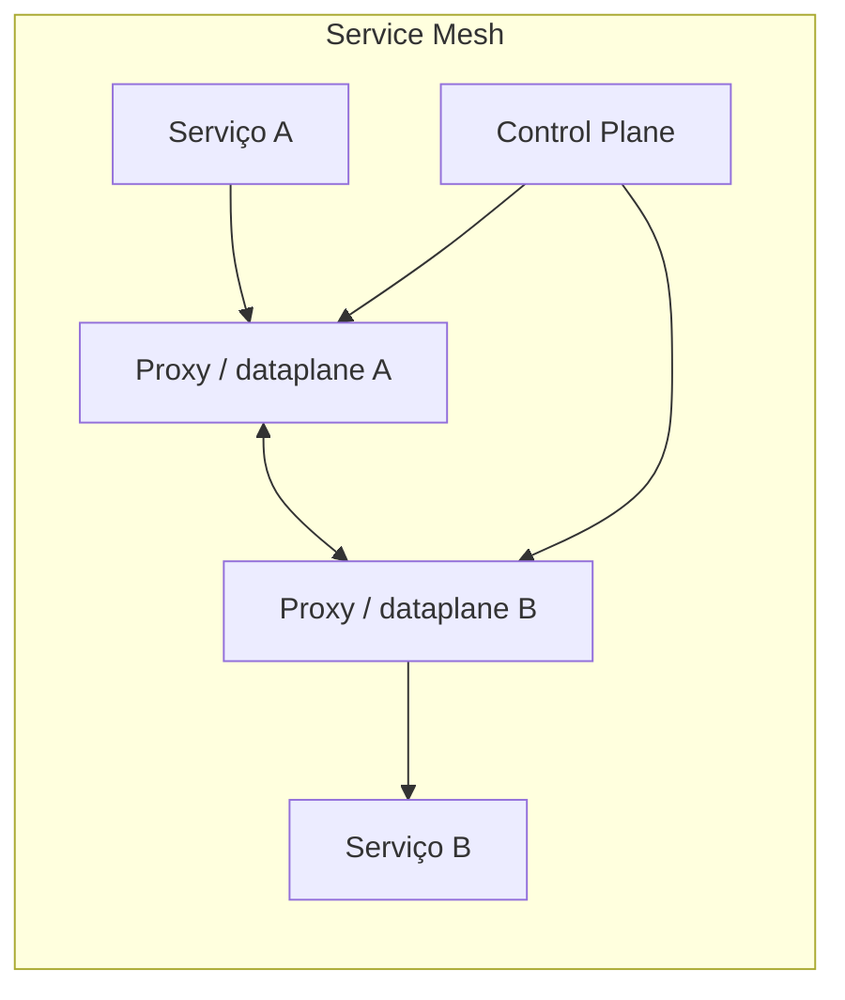

Ferramentas citadas:

- Istio;
- Linkerd;
- Consul.

## 15. Plano de controle e plano de dados

### Plano de controle

Distribui configuração e políticas para o dataplane.

### Plano de dados

Processa o tráfego real entre workloads.

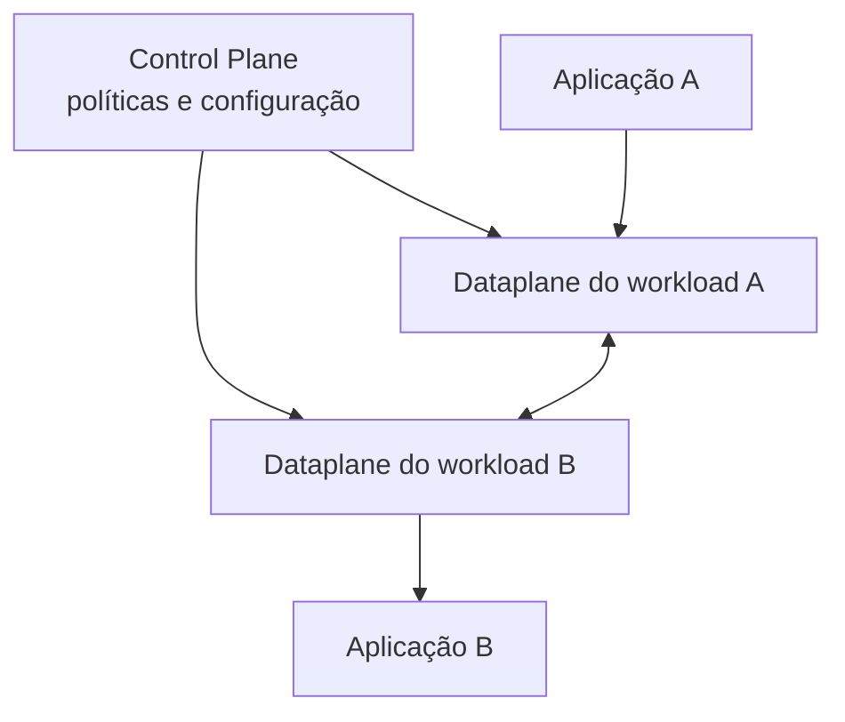

## 16. Istio em sidecar mode

No modo tradicional, um proxy Envoy é injetado em cada Pod participante.

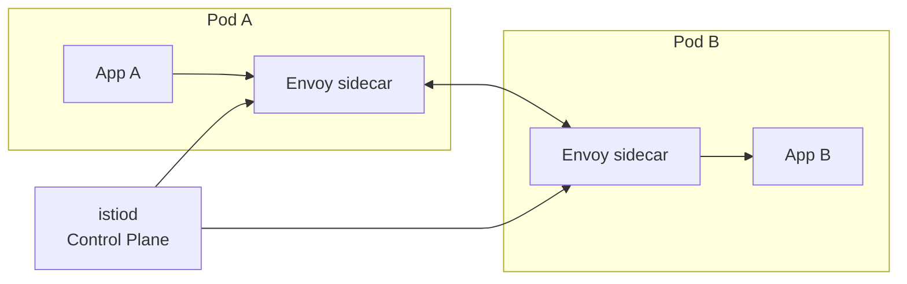

O proxy pode fornecer:

- mTLS;
- roteamento e retries;
- métricas e tracing;
- autorização;
- circuit breaking;
- traffic shifting.

Custos:

- proxy por Pod;
- consumo adicional de CPU e memória;
- injeção e reinício de workloads;
- maior complexidade de troubleshooting.

## 17. Istio ambient mode

O material descreve o modelo sidecar. Atualmente, Istio também oferece ambient mode, que remove a necessidade de um sidecar em cada Pod.

Arquitetura simplificada:

- `ztunnel` por Node para conectividade segura L4;
- waypoint proxy opcional para recursos L7;
- workloads podem aderir sem receber um container proxy adicional.

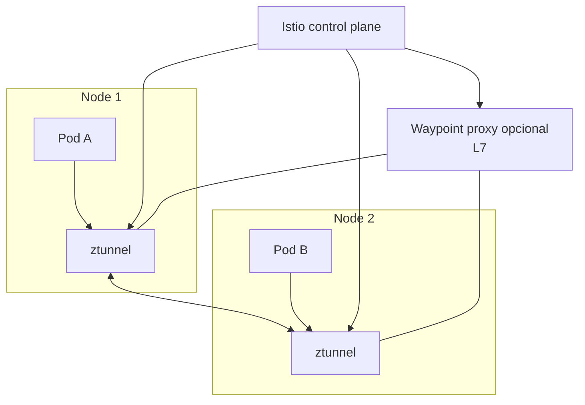

Sidecar e ambient podem coexistir na mesma mesh. A escolha depende de funcionalidades, maturidade da implementação, políticas e requisitos operacionais.

Referência: <https://istio.io/latest/docs/overview/dataplane-modes/>

## 18. Service Mesh não é sempre necessário

Evite adotar apenas por tendência. Avalie:

- quantidade de serviços;
- requisitos de mTLS e autorização;
- necessidade de traffic shifting;
- observabilidade já existente;
- capacidade operacional da equipe;
- custo computacional;
- complexidade de incidentes;
- alternativas mais simples em bibliotecas, gateways ou plataforma.

## 19. Fluxo completo de requisição

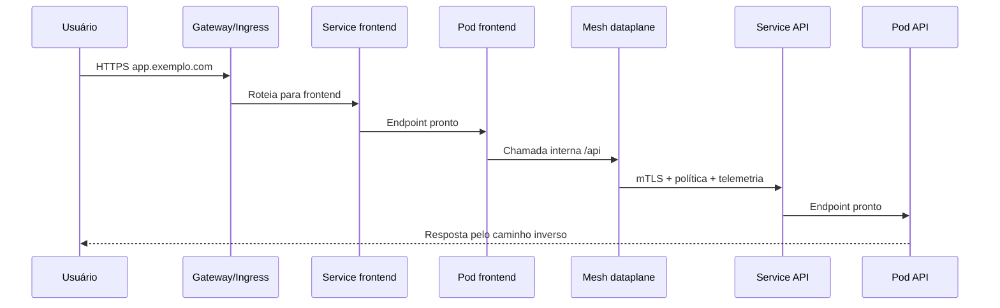

## 20. Troubleshooting de Service

### Service sem resposta

1. verifique selector e labels;
2. confirme EndpointSlices;
3. confirme readiness;
4. teste porta e `targetPort`;
5. teste DNS;
6. verifique NetworkPolicy;
7. verifique plugin CNI e kube-proxy/dataplane;
8. teste do mesmo namespace e de outro;
9. verifique Ingress/Gateway e controlador.

Comandos:

```bash
kubectl get service minha-api
kubectl describe service minha-api
kubectl get endpointslices -l kubernetes.io/service-name=minha-api
kubectl get pods -l app=minha-api --show-labels
kubectl run teste --rm -it --image=curlimages/curl -- sh
```

Dentro do Pod de teste:

```bash
nslookup minha-api
curl -v http://minha-api
```

## 21. Erros comuns

### Selector não corresponde às labels

O Service existe, mas não possui endpoints.

### `targetPort` incorreto

O Service recebe tráfego, mas encaminha à porta errada do Pod.

### Usar NodePort como padrão de produção

Funciona, mas pode dificultar TLS, roteamento, segurança e gestão de múltiplos serviços.

### Confundir Ingress com controlador

O objeto Ingress apenas declara regras. É necessário um Ingress Controller.

### Esperar que Service Mesh corrija aplicação não resiliente

Mesh ajuda no tráfego, mas não substitui idempotência, timeouts adequados, modelagem de falhas e observabilidade de negócio.

## 22. Resumo para a prova

- Cada Pod recebe IP próprio no modelo Kubernetes.
- Service oferece IP/nome estável e balanceamento para Pods.
- ClusterIP é o tipo padrão e interno.
- NodePort abre porta em todos os Nodes.
- LoadBalancer solicita balanceador externo.
- ExternalName cria alias DNS.
- Headless Service usa `clusterIP: None` e permite descoberta direta.
- Ingress gerencia entrada HTTP/HTTPS, mas precisa de controller.
- A API Ingress está congelada; Gateway API é a direção recomendada para novos recursos.
- Tráfego norte-sul envolve clientes externos; leste-oeste ocorre entre serviços internos.
- Service mesh administra comunicação, segurança, observabilidade e resiliência entre serviços.
- Istio possui plano de controle e dataplane, com modos sidecar e ambient.

## 23. Perguntas de revisão

1. Por que um cliente não deve usar diretamente o IP de um Pod?
2. Qual é o tipo padrão de Service?
3. Qual é a diferença entre `port` e `targetPort`?
4. Como um Headless Service difere de ClusterIP?
5. Qual é o papel de EndpointSlice?
6. Por que readiness afeta o tráfego do Service?
7. Qual é a diferença entre Ingress e Ingress Controller?
8. Qual atualização técnica se aplica à API Ingress?
9. O que diferencia tráfego norte-sul de leste-oeste?
10. Qual é a diferença entre sidecar mode e ambient mode no Istio?
