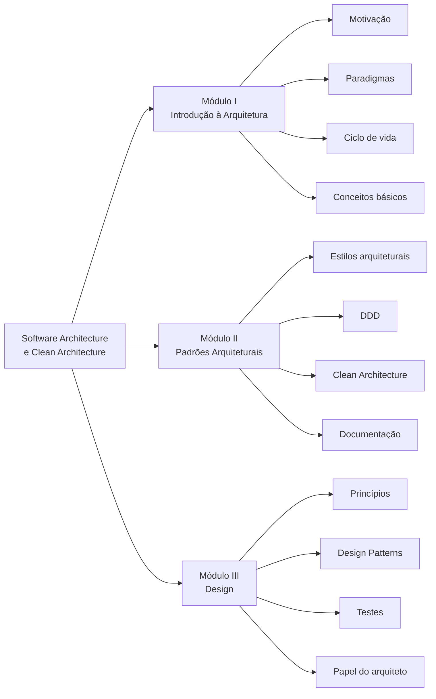

# Software Architecture & Clean Architecture

Documentação de estudo, em português, preparada a partir dos e-books e slides da disciplina **Software Architecture & Clean Architecture**, ministrada pelo professor Eduardo Galego.

O material foi organizado para:

- consulta contínua no GitHub;
- revisão para prova;
- compreensão progressiva dos conceitos;
- transformação dos diagramas visuais das aulas em diagramas Mermaid;
- associação entre fundamentos, decisões arquiteturais e exemplos práticos.

> [!IMPORTANT]
> Esta documentação preserva a terminologia, a organização conceitual e os exemplos apresentados nos materiais da disciplina. Quando há divergência entre slide e e-book, ela é explicitada. Exemplos de código ou diagramas produzidos para tornar o conteúdo mais didático são identificados como **elaboração didática**.

## Estrutura da disciplina

## Navegação

| Ordem | Documento | Conteúdo |
|---:|---|---|
| 0 | [Matriz de rastreabilidade](docs/00-matriz-rastreabilidade.md) | Relação entre capítulos e páginas dos PDFs, critérios de fidelidade e divergências |
| 1 | [Introdução à Arquitetura de Software](docs/01-introducao-arquitetura-software.md) | Motivação, comunicação, conceitos de arquitetura, recursos computacionais, monitoramento e construção do software |
| 2 | [Fundamentos de Design, Ciclo de Vida e Escalabilidade](docs/02-fundamentos-design-ciclo-vida.md) | Paradigmas, SDLC, CI/CD, escopo, dependência, acoplamento, coesão, granularidade e escalabilidade |
| 3 | [Padrões Arquiteturais](docs/03-padroes-arquiteturais.md) | Monólito, MVC, microsserviços, eventos, cliente-servidor, multicamadas, SOA e Pipe and Filters |
| 4 | [Domain-Driven Design](docs/04-domain-driven-design.md) | Domínio, modelo, subdomínios, Bounded Context, Context Map e building blocks |
| 5 | [Clean Architecture](docs/05-clean-architecture.md) | Regra de dependência, camadas, limites e fluxo de execução |
| 6 | [Documentação Arquitetural](docs/06-documentacao-arquitetural.md) | ADR, C4 Model, UML, arc42 e registro de decisões |
| 7 | [Princípios de Design](docs/07-principios-design.md) | SOLID, DRY, KISS, YAGNI, nomes claros e refatoração |
| 8 | [Design Patterns](docs/08-design-patterns.md) | Categorias GoF e padrões abordados na disciplina |
| 9 | [Testes e Papel do Arquiteto](docs/09-testes-papel-arquiteto.md) | Estratégias de teste, pirâmide, TDD, BDD, ATDD e atribuições do arquiteto |
| 10 | [Revisão para a Prova](docs/10-revisao-prova.md) | Resumo, comparações, perguntas e gabarito comentado |

## Fontes utilizadas

- Aula 1 — e-book: *Introdução à Arquitetura de Software*;
- Aula 1 — slides: *Introdução à Arquitetura de Software*;
- Aula 2 — e-book: *Padrões Arquiteturais*;
- Aula 2 — slides: *Padrões Arquiteturais*;
- Aula 3 — e-book: *Design*;
- Aula 3 — slides: *Design*.

## Como usar este repositório

Para uma primeira leitura, siga a ordem dos documentos. Para revisão rápida, comece pelo arquivo [10-revisao-prova.md](docs/10-revisao-prova.md) e retorne aos capítulos específicos quando encontrar uma lacuna.

Os diagramas estão escritos em Mermaid e são renderizados diretamente pelo GitHub.

## Convenções didáticas

Ao longo dos capítulos são utilizados quatro tipos de destaque:

> [!NOTE]
> **Conceito:** definição ou síntese do material.

> [!TIP]
> **Aplicação:** consequência prática para projeto ou código.

> [!WARNING]
> **Armadilha:** simplificação, risco ou interpretação incorreta frequente.

> [!IMPORTANT]
> **Para a prova:** ponto com alta capacidade de aparecer em questão conceitual ou comparativa.
