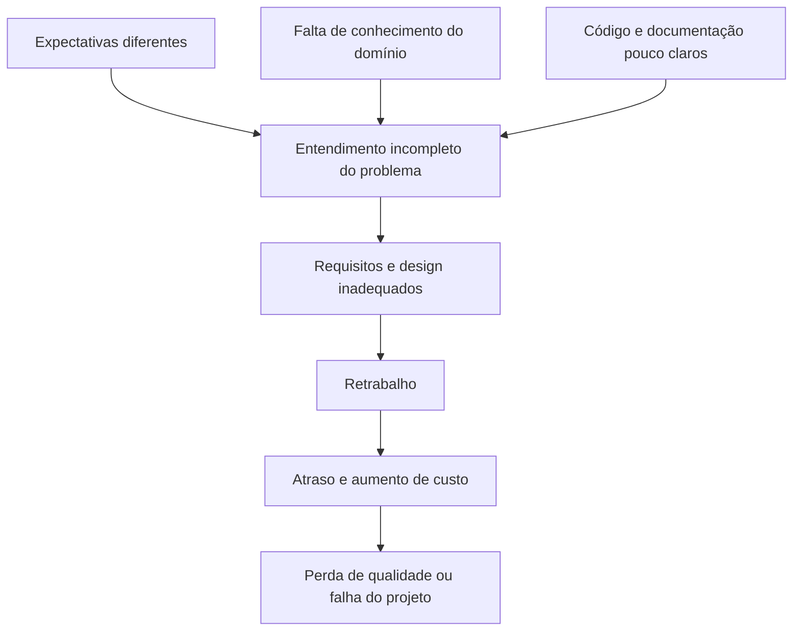
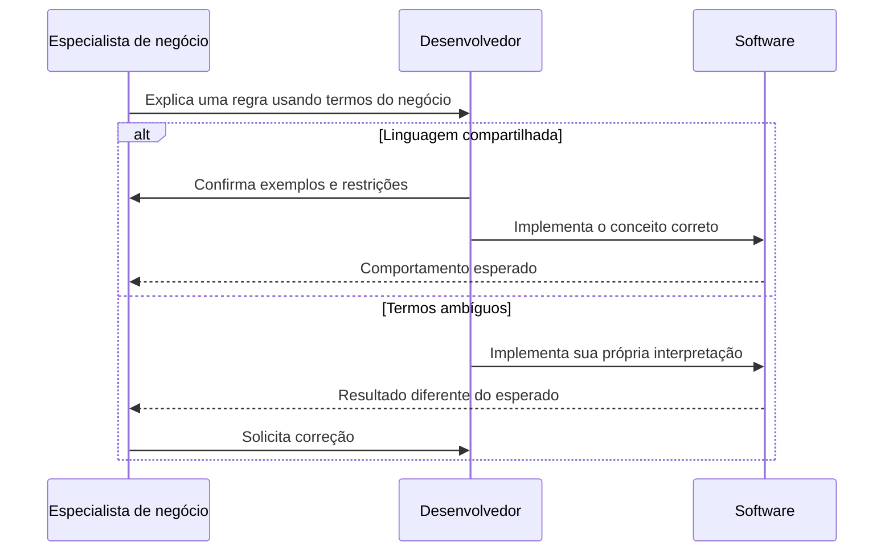
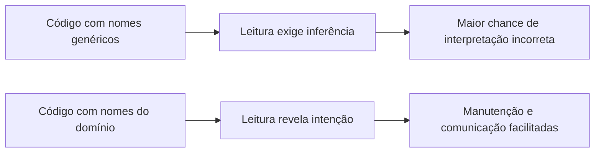
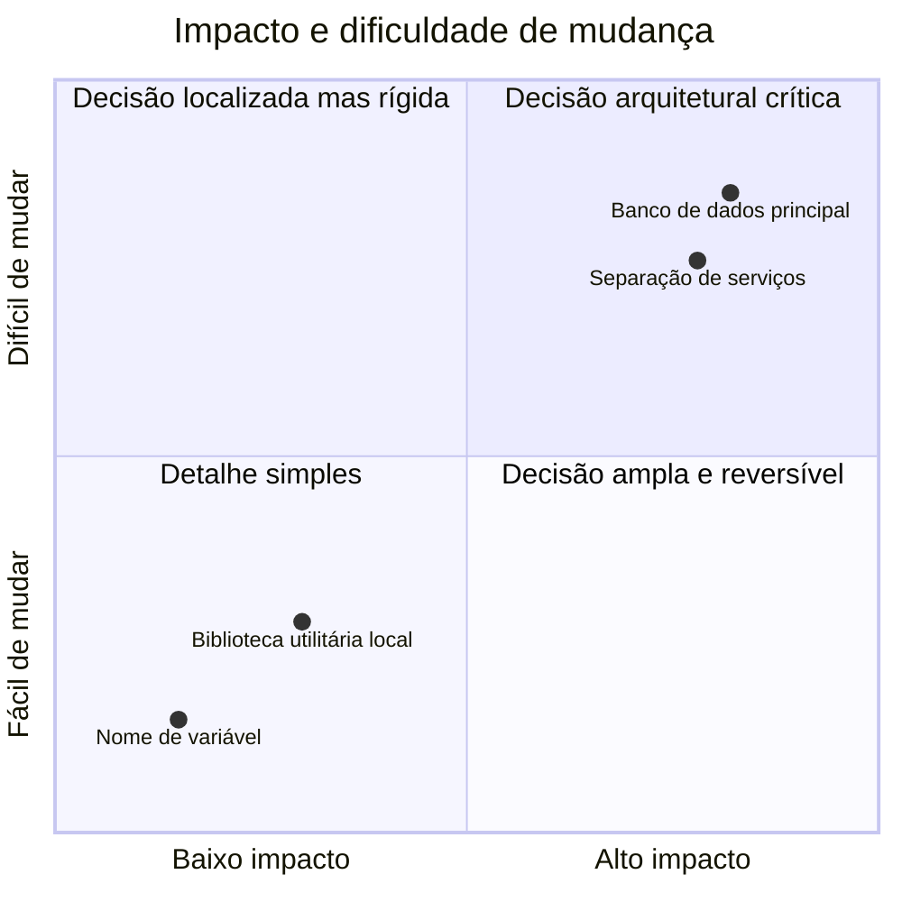
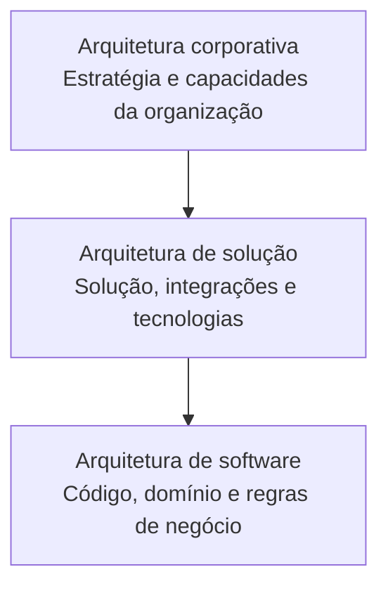
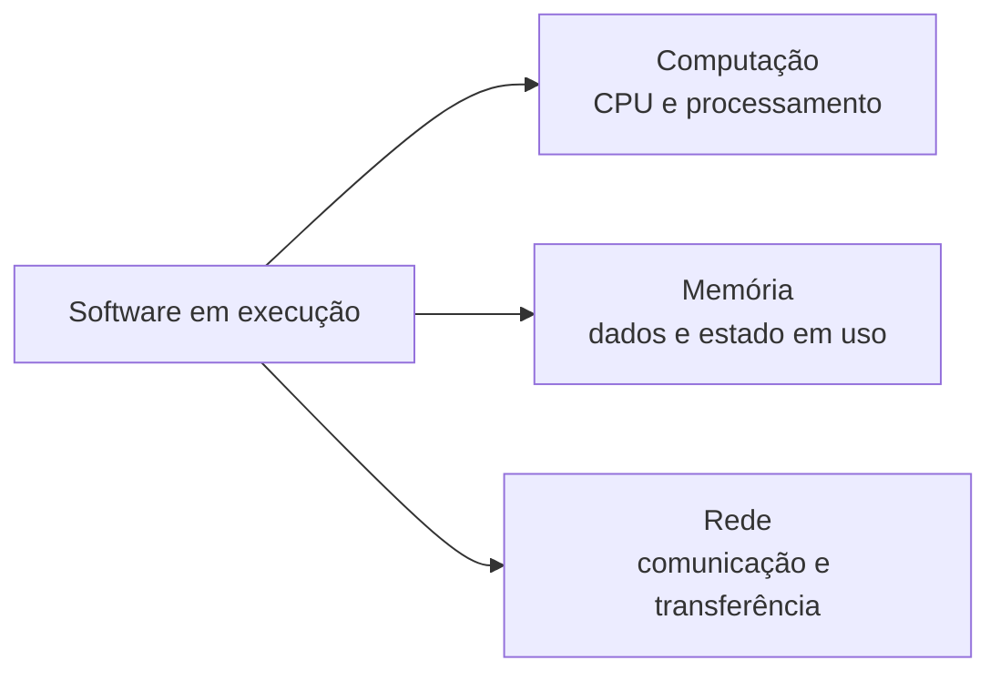
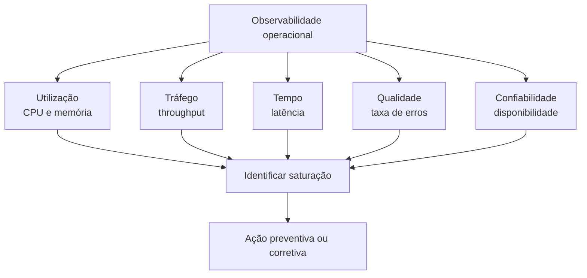
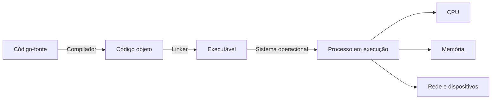
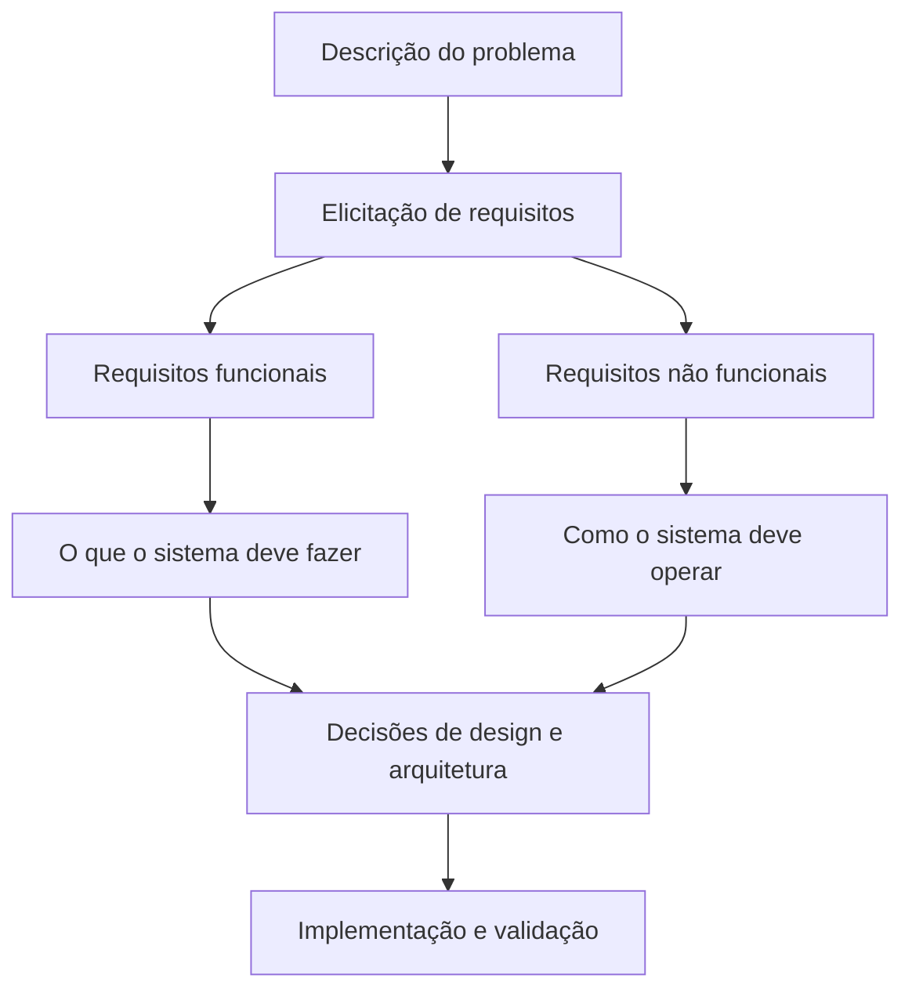
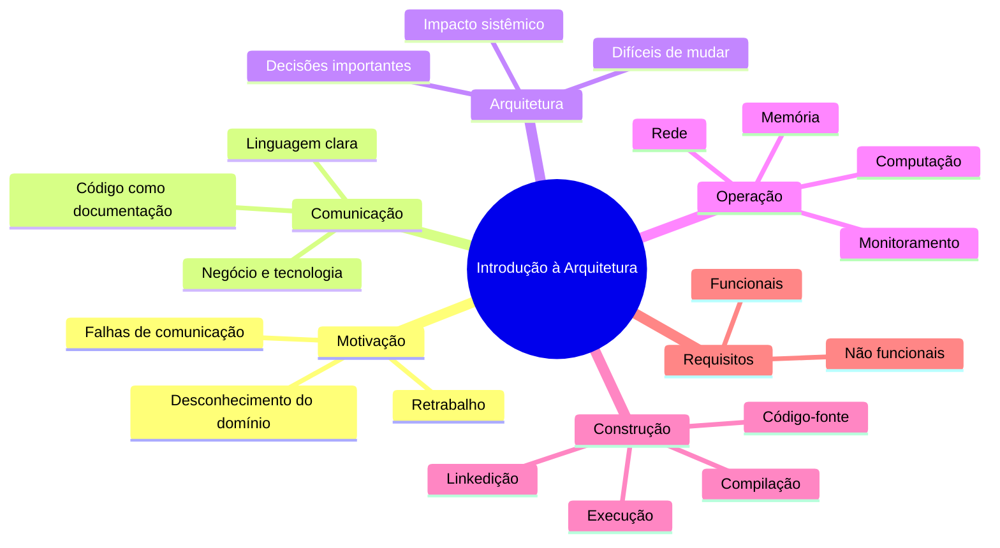

# 1. Introdução à Arquitetura de Software

## Objetivos de aprendizagem

Ao concluir este capítulo, você deverá ser capaz de:

- explicar por que arquitetura de software deve ser considerada desde o início do projeto;
- relacionar falhas de comunicação, desconhecimento do domínio e retrabalho;
- diferenciar arquitetura corporativa, arquitetura de solução e arquitetura de software;
- identificar os recursos básicos necessários para executar uma aplicação;
- reconhecer indicadores usados para observar a saúde operacional do software;
- descrever o caminho entre código-fonte e programa executável.

## 1.1 Por que estudar arquitetura de software?

A disciplina começa pela constatação de que projetos de software podem falhar mesmo quando há pessoas tecnicamente competentes. O problema não é apenas escrever código: é construir um sistema que represente corretamente o negócio, possa evoluir e seja compreendido por pessoas diferentes ao longo do tempo.

O material destaca três causas recorrentes:

1. pessoas envolvidas no projeto possuem expectativas diferentes;
2. equipe técnica e equipe de negócio não compartilham o mesmo entendimento do domínio;
3. o código não comunica claramente as decisões e regras implementadas.



### Estatísticas apresentadas no material

Os slides e o e-book usam estatísticas para mostrar a dimensão do problema:

- 39% dos projetos são apresentados como bem-sucedidos, isto é, entregues no prazo, dentro do orçamento e com os recursos e funções necessários;
- 70% do retrabalho é atribuído à falta de conhecimento do domínio durante requisitos e design;
- projetos acima de US$ 10 milhões aparecem com apenas 10% de sucesso e 38% de falha;
- organizações perderiam US$ 109 milhões para cada US$ 1 bilhão investido em projetos e programas.

> [!WARNING]
> Há uma divergência interna no material sobre projetos menores que US$ 1 milhão: os slides apresentam **76% de sucesso**, enquanto o texto do e-book menciona **70%**. Esta documentação não escolhe silenciosamente um dos números; para a prova, priorize o valor exibido no slide caso a questão reproduza a tabela visual.

O objetivo didático desses números não é decorar estatísticas isoladas, mas perceber que o risco cresce quando o domínio, os requisitos e as decisões arquiteturais não são compreendidos.

## 1.2 A Torre de Babel como metáfora de projeto

A analogia da Torre de Babel mostra que um projeto pode fracassar quando as pessoas deixam de compartilhar uma linguagem compreensível. Em software, todos podem falar português e ainda assim usar as mesmas palavras com sentidos diferentes.



O especialista conhece o funcionamento do negócio, mas normalmente não implementa o software. O desenvolvedor sabe construir software, mas pode não conhecer as regras específicas do domínio. O projeto precisa criar uma ponte entre esses conhecimentos.

> [!IMPORTANT]
> A comunicação não é apenas uma atividade de reunião. Ela também ocorre no vocabulário do domínio, na estrutura do código, nos nomes das classes e nas decisões documentadas.

## 1.3 Código-fonte como documentação

O material compara duas funções equivalentes. Uma possui nomes genéricos, como `cal`, `a`, `b` e `r`. A outra revela a intenção, como `calcularTotalCompra`, `quantidadeItens` e `precoUnitario`.

```javascript
// Pouca semântica
function cal(a, b) {
  const r = a * b;
  return r;
}

// Intenção explícita
function calcularTotalCompra(quantidadeItens, precoUnitario) {
  return quantidadeItens * precoUnitario;
}
```

As duas versões podem produzir o mesmo resultado para a máquina. Para uma pessoa, entretanto, a segunda reduz o esforço de interpretação.



A ideia central é que o código deve representar fielmente o sistema. Ele é uma das principais formas de comunicação entre desenvolvedores atuais e futuros.

## 1.4 O que é arquitetura de software?

A definição enfatizada pelo material, atribuída a Martin Fowler, é:

> Arquitetura de software envolve decisões importantes e difíceis de mudar.

Uma decisão arquitetural normalmente possui amplo impacto e alto custo de reversão. Exemplos discutidos na disciplina incluem:

- escolha do banco de dados;
- forma de separar componentes e camadas;
- estilo arquitetural;
- tecnologia de integração;
- linguagem e frameworks principais;
- estratégia de implantação e escalabilidade.



> [!NOTE]
> O diagrama é uma elaboração didática. A posição de cada exemplo é qualitativa e depende do contexto real do projeto.

Arquitetura não se limita a desenhos ou infraestrutura. O material a relaciona a padrões arquiteturais, design de software, design de código, padrões de projeto e práticas de desenvolvimento.

## 1.5 Níveis de atuação do arquiteto

A disciplina apresenta três níveis de atuação, reconhecendo que organizações menores podem acumular esses papéis na mesma pessoa.



### Arquitetura corporativa

Abrange decisões que afetam a organização inteira, seus sistemas, capacidades, processos e direcionamento tecnológico.

### Arquitetura de solução

Define como uma solução específica funciona e se integra a outros sistemas, serviços e recursos de infraestrutura.

### Arquitetura de software

Concentra-se na estrutura interna do software, no domínio, nas regras de negócio, nos componentes e na forma como o código será organizado.

> [!TIP]
> Uma mesma decisão pode atravessar os três níveis. Adotar uma plataforma de nuvem pode ser corporativo; escolher seus serviços para uma solução é decisão de solução; isolar o domínio desses serviços é decisão de arquitetura de software.

## 1.6 Recursos básicos para executar software

O material resume a execução de software em três grupos de recursos:



### Computação

É a capacidade de processar instruções. O consumo de CPU indica quanto do recurso computacional está sendo utilizado.

### Memória

Armazena dados necessários durante a execução. A memória disponível limita a quantidade de informação e processos que podem permanecer ativos.

### Rede

Permite a comunicação entre clientes, servidores, serviços e bancos de dados. Sua capacidade e latência influenciam o desempenho de sistemas distribuídos.

O software pode executar localmente, em servidores, na nuvem, em celulares ou dispositivos de IoT, mas sempre dependerá de recursos computacionais finitos.

## 1.7 Monitoramento da saúde do software

O material apresenta indicadores operacionais como:

- uso de CPU;
- uso de memória;
- throughput, isto é, quantidade de operações ou requisições processadas;
- taxa de erros;
- tempo de atividade e disponibilidade;
- latência;
- satisfação do cliente.



Essas métricas ajudam a detectar problemas antes que eles se tornem indisponibilidades graves e permitem acompanhar acordos de nível de serviço — SLA.

> [!WARNING]
> Um indicador isolado raramente explica o problema. CPU alta pode indicar carga legítima, laço ineficiente ou saturação. A arquitetura precisa permitir correlacionar sinais.

## 1.8 Da escrita do código à execução

O material apresenta o fluxo tradicional de construção de um programa compilado:



1. O desenvolvedor escreve o código-fonte em uma linguagem de programação.
2. O compilador transforma o código em uma representação de baixo nível ou código objeto.
3. O linker combina os objetos e dependências necessárias.
4. O resultado é um executável.
5. O sistema operacional carrega o programa e aloca recursos.

Esse fluxo é uma simplificação didática. Linguagens e plataformas podem usar interpretação, máquinas virtuais, bytecode ou compilação em tempo de execução. O ponto central do material é compreender que o código humano precisa ser transformado para utilizar o hardware.

## 1.9 Estudo de caso: como iniciar uma arquitetura

A disciplina destaca que não se começa uma arquitetura escolhendo tecnologia. O ponto inicial é compreender os requisitos.



### Requisitos funcionais

Descrevem funcionalidades e comportamentos esperados: cadastrar, consultar, processar, aprovar, emitir, notificar etc.

### Requisitos não funcionais

O material cita:

- usabilidade;
- manutenibilidade;
- confiabilidade e disponibilidade;
- desempenho;
- portabilidade;
- reusabilidade;
- segurança.

Uma solução adequada para 1.000 usuários pode não ser adequada para 1 milhão. A arquitetura depende do público, do volume, do contexto de implantação e das expectativas do negócio.

## 1.10 Síntese do capítulo



## Questões de revisão

1. Por que o desconhecimento do domínio aumenta o retrabalho?
2. Como a metáfora da Torre de Babel se relaciona com projetos de software?
3. Por que nomes de classes e métodos fazem parte da documentação?
4. O que caracteriza uma decisão arquitetural?
5. Qual a diferença entre arquitetura corporativa, de solução e de software?
6. Quais recursos básicos sustentam a execução de uma aplicação?
7. O que throughput, latência, taxa de erros e disponibilidade revelam?
8. Por que requisitos não funcionais influenciam diretamente a arquitetura?

## Referência no material da disciplina

- Aula 1 — e-book, partes 1 a 4;
- Aula 1 — slides, páginas sobre motivação, comunicação, conceitos, monitoramento, construção do software e estudo de caso.
