# 2. Fundamentos de Design, Ciclo de Vida e Escalabilidade

## Objetivos de aprendizagem

Ao concluir este capítulo, você deverá ser capaz de:

- diferenciar os paradigmas procedural, orientado a objetos e funcional;
- explicar o ciclo contínuo de desenvolvimento de software;
- relacionar CI/CD a uma esteira de produção automatizada;
- aplicar os conceitos de escopo, encapsulamento, dependência e inversão de dependência;
- avaliar acoplamento, coesão e granularidade;
- distinguir escalabilidade vertical e horizontal.

## 2.1 Paradigmas de programação

Um paradigma de programação oferece uma forma de organizar o raciocínio e expressar soluções. A disciplina destaca três paradigmas.

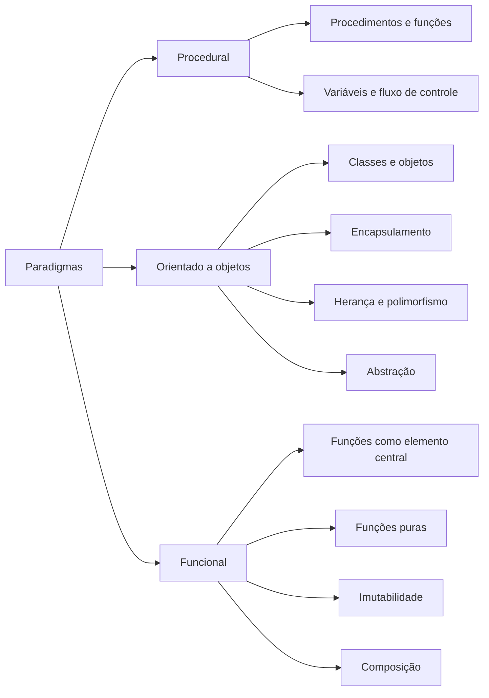

### Paradigma procedural

Organiza o programa como uma sequência de instruções, procedimentos e funções. O material cita COBOL e C e lembra que comandos como `goto` dificultam manutenção, pois quebram o fluxo estruturado e aumentam o risco de efeitos inesperados.

### Paradigma orientado a objetos

Acrescenta semântica por meio de classes e objetos.

- **Encapsulamento:** protege detalhes internos.
- **Herança:** permite compartilhar características entre classes.
- **Polimorfismo:** possibilita comportamentos diferentes por meio de um contrato comum.
- **Abstração:** representa apenas o que é relevante para o problema.

### Paradigma funcional

Coloca a função no centro da solução e é relacionado no material a cenários de computação distribuída.

- **Função pura:** mesma entrada produz a mesma saída.
- **Imutabilidade:** evita alteração de estado já criado.
- **Composição:** combina funções menores em fluxos maiores.

> [!IMPORTANT]
> Paradigmas não são estilos arquiteturais. Eles influenciam como o código é estruturado, enquanto estilos arquiteturais organizam o sistema em nível mais amplo.

## 2.2 Ciclo de vida do desenvolvimento de software

O software não é apenas escrito uma vez. Ele nasce de uma necessidade, passa por construção, validação, implantação, manutenção e evolução.


O material menciona diferentes abordagens para organizar esse ciclo:

- Waterfall;
- prototipação;
- incremental;
- metodologias ágeis.

A diferença está em como as etapas são ordenadas, repetidas e validadas. O ciclo, entretanto, continua enquanto o sistema existir.

## 2.3 CI/CD como linha de produção

A disciplina descreve Continuous Integration e Continuous Deployment como uma esteira de produção na qual etapas são automatizadas para entregar alterações de forma contínua e fluida.

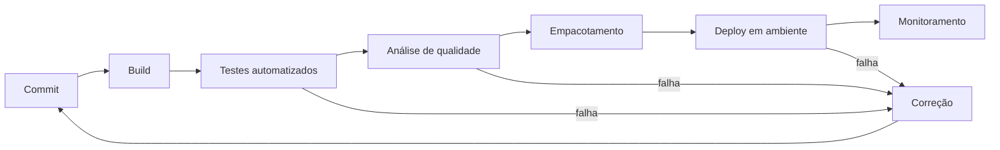

### Integração contínua

Alterações são integradas frequentemente e verificadas por build e testes automatizados.

### Entrega ou implantação contínua

O software validado avança pela esteira até ambientes de teste ou produção, de acordo com a política da organização.

> [!TIP]
> A arquitetura precisa favorecer automação. Um sistema que exige muitos passos manuais, dependências implícitas ou configurações não versionadas dificulta CI/CD.

## 2.4 Escopo e encapsulamento

Escopo é a abrangência em que um elemento pode ser acessado. Na arquitetura, isso se relaciona ao que um componente revela e ao que esconde.

O exemplo da aula usa uma conta corrente cujo saldo não deve ser alterado diretamente.

```java
public final class ContaCorrente {
    private BigDecimal saldo;

    public ContaCorrente(BigDecimal saldoInicial) {
        if (saldoInicial.signum() < 0) {
            throw new IllegalArgumentException("Saldo inicial inválido");
        }
        this.saldo = saldoInicial;
    }

    public void depositar(BigDecimal valor) {
        validarValorPositivo(valor);
        saldo = saldo.add(valor);
    }

    public void sacar(BigDecimal valor) {
        validarValorPositivo(valor);
        if (saldo.compareTo(valor) < 0) {
            throw new IllegalStateException("Saldo insuficiente");
        }
        saldo = saldo.subtract(valor);
    }

    public BigDecimal consultarSaldo() {
        return saldo;
    }

    private static void validarValorPositivo(BigDecimal valor) {
        if (valor == null || valor.signum() <= 0) {
            throw new IllegalArgumentException("O valor deve ser positivo");
        }
    }
}
```

> [!NOTE]
> O código é uma elaboração didática baseada no exemplo da aula. A ideia central do material é que o saldo permaneça protegido e só seja modificado por operações que preservem as regras.

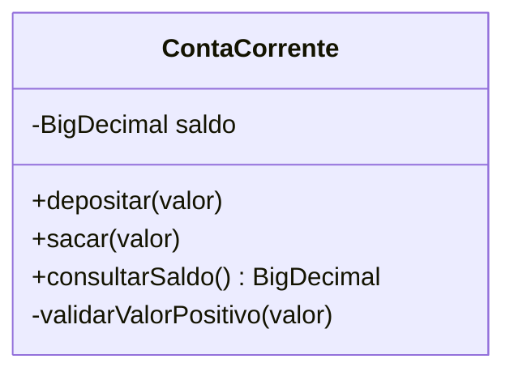

Encapsular não significa apenas declarar atributos privados. Significa proteger invariantes e expor operações coerentes com o domínio.

## 2.5 Dependência

Um componente depende de outro quando precisa dele para cumprir sua responsabilidade.

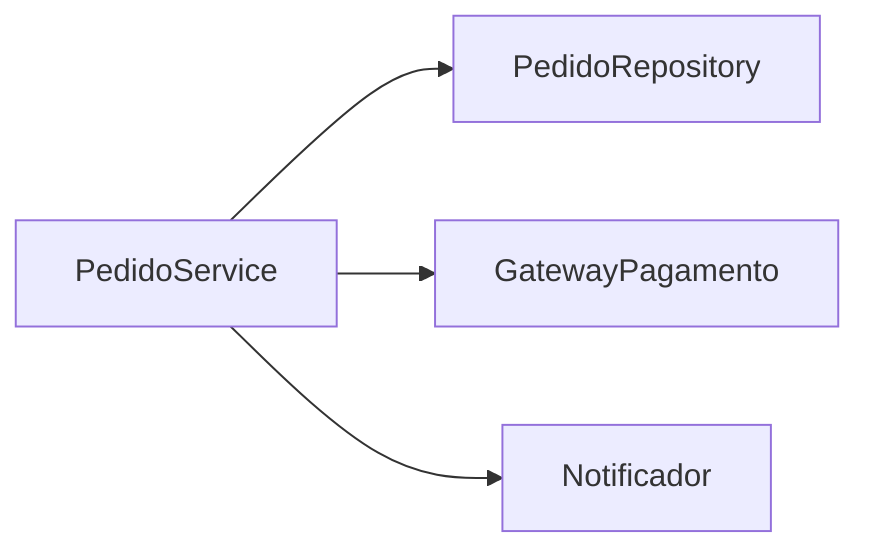

Ao modificar um componente, é necessário conhecer quem depende dele. Caso contrário, uma alteração aparentemente local pode provocar efeitos em cascata.

### Dependência direta e rigidez

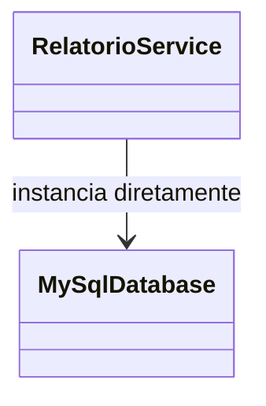

Quando um módulo de alto nível conhece uma implementação específica, trocar essa implementação exige alterar o módulo consumidor.

## 2.6 Inversão de dependência

A aula usa o exemplo de um botão que não deveria conhecer diretamente uma lâmpada. O botão deveria depender de um contrato que pudesse ser implementado por diferentes dispositivos.

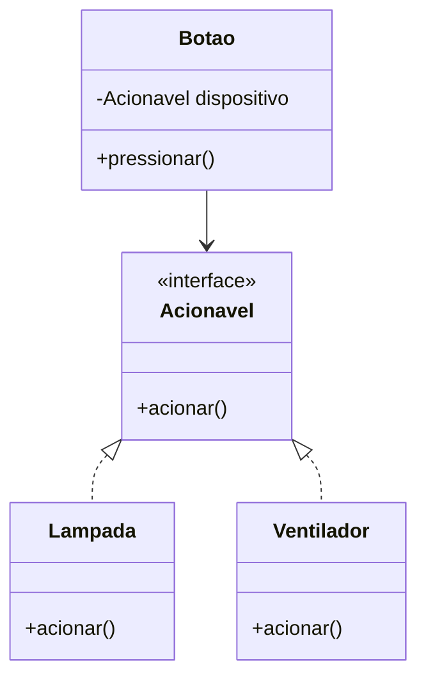

```java
public interface Acionavel {
    void acionar();
}

public final class Botao {
    private final Acionavel dispositivo;

    public Botao(Acionavel dispositivo) {
        this.dispositivo = Objects.requireNonNull(dispositivo);
    }

    public void pressionar() {
        dispositivo.acionar();
    }
}
```

O módulo de alto nível depende da abstração. A implementação concreta é fornecida externamente.

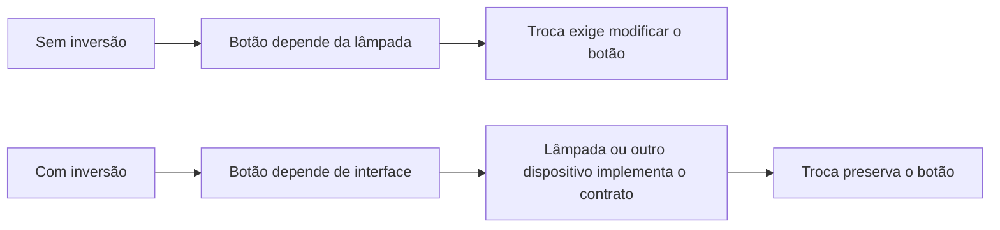

## 2.7 Acoplamento e desacoplamento

Acoplamento expressa quanto um componente depende de outros.

- **Alto acoplamento:** muitas dependências, conhecimento de detalhes e mudanças em cascata.
- **Baixo acoplamento:** contratos claros, poucas dependências e maior substituibilidade.

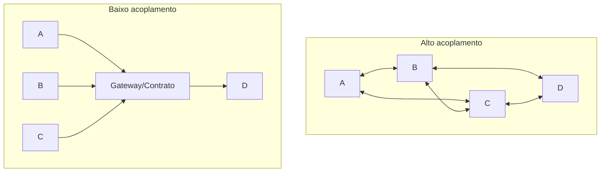

> [!WARNING]
> Desacoplamento não significa ausência de comunicação. Um sistema sem dependências úteis não realiza trabalho. O objetivo é controlar dependências e impedir que detalhes se espalhem.

## 2.8 Coesão

Coesão é o grau em que os elementos de um módulo trabalham para uma finalidade comum.

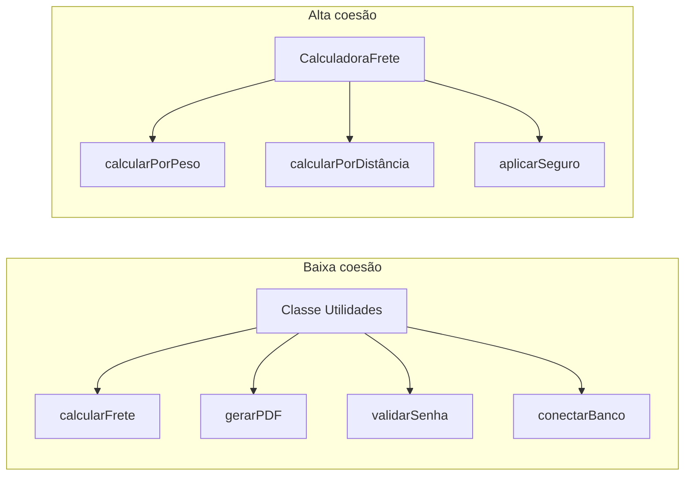

Baixa coesão indica que responsabilidades sem relação foram agrupadas. Alta coesão indica que o componente possui um propósito reconhecível.

### Relação desejada

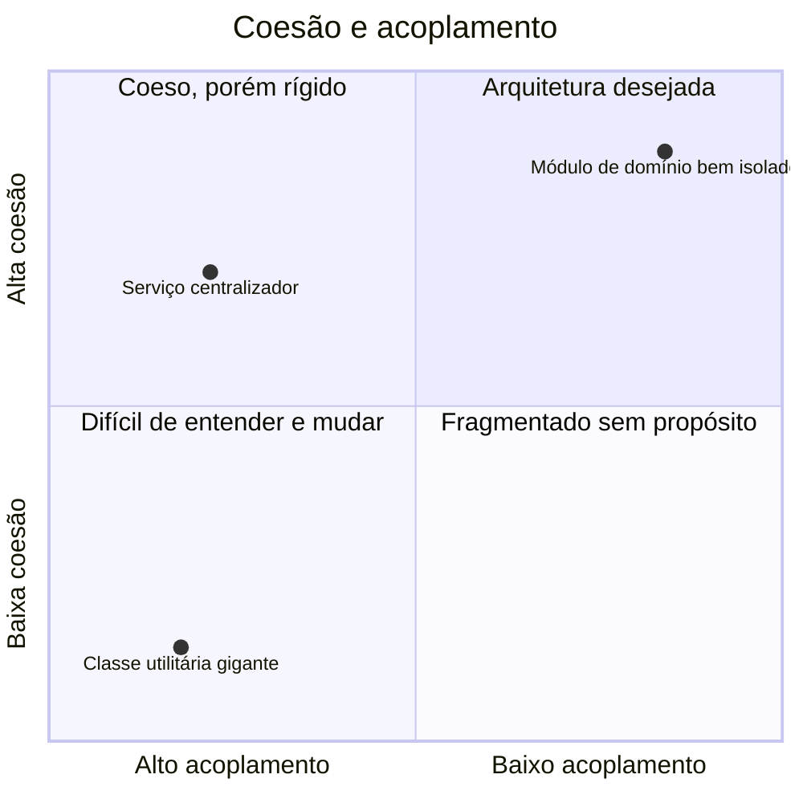

O objetivo destacado na disciplina é **baixo acoplamento e alta coesão**.

## 2.9 Granularidade

Granularidade representa o nível de detalhe ou o tamanho das responsabilidades atribuídas a componentes.

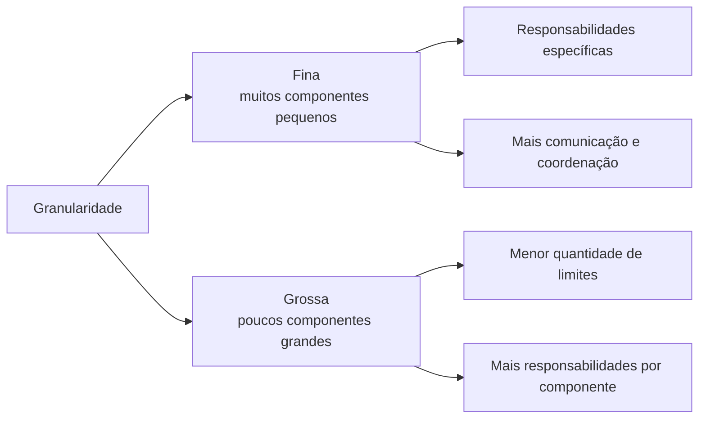

### Granularidade fina

- componentes menores;
- responsabilidades específicas;
- potencial de implantação e escala independentes;
- maior custo de coordenação.

### Granularidade grossa

- componentes maiores;
- mais funcionalidades agrupadas;
- menor complexidade de distribuição;
- maior risco de baixa coesão e impacto amplo de mudanças.

> [!IMPORTANT]
> Não existe uma granularidade correta de forma universal. Dividir demais cria complexidade distribuída; agrupar demais cria rigidez.

## 2.10 Escalabilidade

Escalabilidade é a capacidade de aumentar ou reduzir recursos para suportar variações de carga sem degradação incompatível com os requisitos.

### Escalabilidade vertical

Aumenta os recursos de uma única máquina.

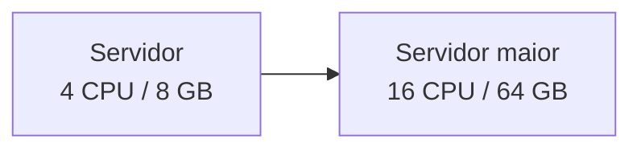

Vantagens:

- implementação geralmente mais simples;
- não exige necessariamente distribuição da aplicação.

Limitações:

- limite físico e financeiro;
- possibilidade de ponto único de falha;
- manutenção pode exigir interrupção.

### Escalabilidade horizontal

Adiciona máquinas ou instâncias para dividir o trabalho.

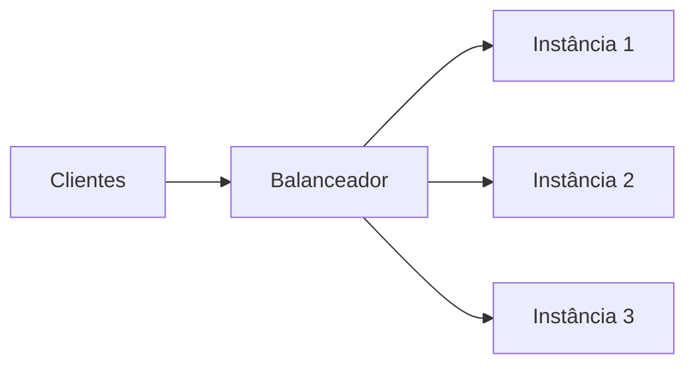

Vantagens:

- crescimento por adição de nós;
- maior potencial de disponibilidade;
- boa aderência a ambientes de nuvem.

Desafios:

- distribuição de estado;
- comunicação de rede;
- consistência;
- observabilidade e coordenação.

### Comparação

| Critério | Vertical | Horizontal |
|---|---|---|
| Ação principal | Aumentar máquina | Adicionar máquinas |
| Complexidade inicial | Menor | Maior |
| Limite de crescimento | Físico/financeiro | Potencialmente muito maior |
| Distribuição | Não é obrigatória | É parte central |
| Tolerância a falhas | Pode continuar centralizada | Pode ser distribuída |

## 2.11 Como os conceitos se conectam

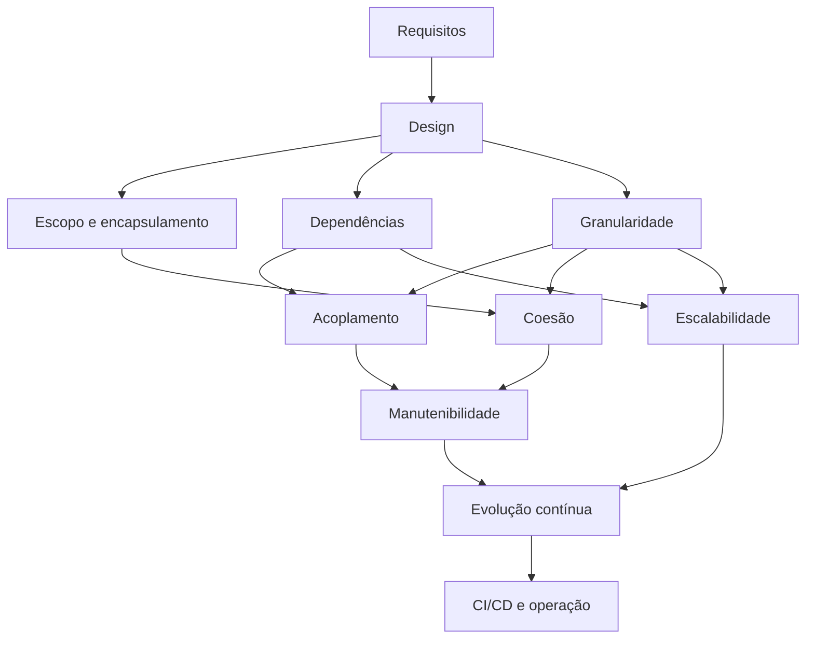

## 2.12 Síntese para a prova

- O paradigma procedural organiza instruções e funções; orientação a objetos acrescenta classes, encapsulamento, herança, polimorfismo e abstração; funcional enfatiza funções puras, imutabilidade e composição.
- O ciclo de vida é contínuo e inclui requisitos, design, implementação, testes, implantação, operação e evolução.
- CI/CD automatiza a integração e a entrega/implantação.
- Escopo e encapsulamento determinam o que é visível e o que deve permanecer protegido.
- Dependência deve ser conhecida; inversão de dependência faz módulos dependerem de abstrações.
- A meta arquitetural apresentada é baixo acoplamento e alta coesão.
- Granularidade fina cria componentes menores e mais coordenação; grossa agrupa mais responsabilidades.
- Escala vertical aumenta recursos de uma máquina; horizontal adiciona máquinas.

## Questões de revisão

1. Qual é a diferença entre paradigma de programação e estilo arquitetural?
2. Por que o ciclo de vida do software não termina após o primeiro deploy?
3. Como CI/CD reduz risco de integração?
4. Qual a relação entre escopo e encapsulamento?
5. Por que dependência direta de uma implementação aumenta rigidez?
6. Como inversão de dependência reduz impacto de troca tecnológica?
7. Diferencie acoplamento, coesão e granularidade.
8. Em que cenário a escala horizontal é preferível à vertical?

## Referência no material da disciplina

- Aula 1 — e-book, partes 2 a 4;
- Aula 1 — slides, páginas sobre paradigmas, ciclo de vida, CI/CD, escopo, dependência, inversão, acoplamento, granularidade, coesão e escalabilidade.
