# 3. Padrões Arquiteturais

## Objetivos de aprendizagem

Ao concluir este capítulo, você deverá ser capaz de:

- explicar por que padrões criam uma linguagem comum;
- reconhecer as características de arquiteturas monolíticas, MVC, microsserviços e orientadas a eventos;
- diferenciar cliente-servidor, multicamadas, SOA e Pipe and Filters;
- analisar vantagens, limitações e trade-offs;
- escolher um estilo com base no contexto, e não em preferência tecnológica.

## 3.1 Para que serve um padrão?

A aula usa a analogia de plugues e tomadas. Quando os dois seguem um padrão compatível, a conexão é previsível. Quando não seguem, surgem adaptações, gambiarras ou impossibilidade de uso.

Em software, um padrão oferece:

- vocabulário compartilhado;
- solução conhecida para um problema recorrente;
- expectativas sobre responsabilidades e comunicação;
- base para discutir vantagens e desvantagens;
- redução do esforço de compreensão.

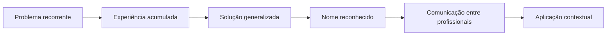

> [!WARNING]
> Padrão não é receita universal. Aplicar um padrão sem o problema que o justifica adiciona complexidade sem benefício.

## 3.2 Arquitetura monolítica

Uma aplicação monolítica é construída e implantada como um único bloco. O código pode ter módulos e camadas internas, mas o pacote de implantação e o processo de execução permanecem integrados.

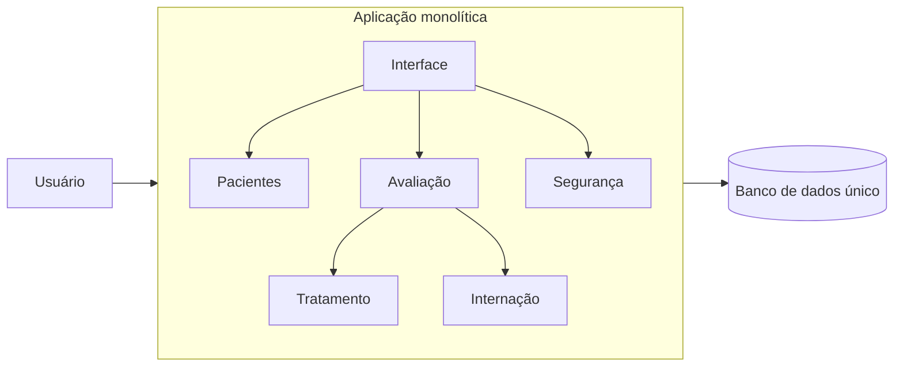

### Vantagens

- menor complexidade inicial;
- implantação de um único pacote;
- desenvolvimento rápido para equipe pequena;
- viabiliza MVP ou prova de conceito;
- chamadas internas podem ter boa performance.

### Desvantagens

- uma modificação pode afetar o sistema inteiro;
- implantação normalmente envolve o conjunto completo;
- escala uma parte significa escalar todo o bloco;
- falha de um módulo pode indisponibilizar a aplicação;
- base de código extensa tende a dificultar evolução;
- maior risco de ponto único de falha.

### Quando faz sentido

O professor recomenda considerar monólitos para MVPs e POCs quando simplicidade, custo e velocidade são mais importantes do que escala independente.

> [!TIP]
> **Complemento didático:** monólito não é sinônimo de código desorganizado. Um monólito modular pode manter limites internos claros e ser uma escolha deliberada.

## 3.3 MVC — Model, View e Controller

O MVC separa responsabilidades em três componentes lógicos.

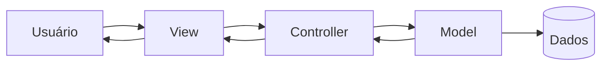

### Model

Representa regras de negócio, dados e operações relacionadas.

### View

Gerencia a apresentação e a interação visual com o usuário.

### Controller

Interpreta ações do usuário, seleciona operações e coordena a resposta.

### Vantagens

- separação de responsabilidades;
- manutenção e testes mais localizados;
- reutilização de partes do código;
- evolução de um componente com menor impacto nos demais.

### Desvantagens

- pode ser excessivo para aplicações muito simples;
- exige entendimento das responsabilidades;
- implementações mal definidas podem espalhar regra de negócio;
- o material alerta para possível custo de comunicação entre camadas em determinados cenários.

### Variantes citadas

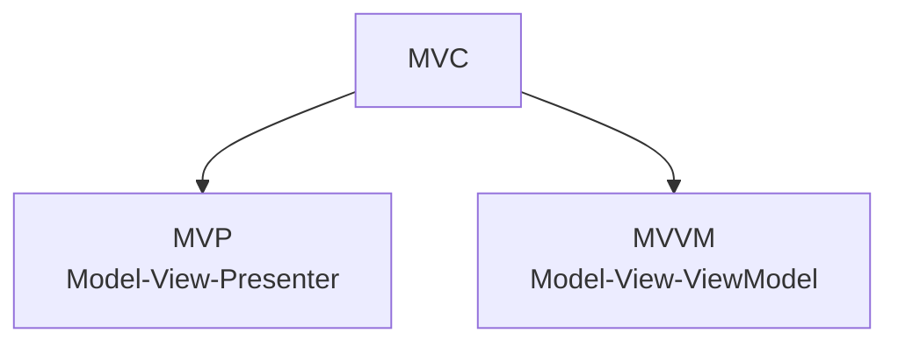

O material cita MVP e MVVM, mas não aprofunda suas diferenças. Portanto, esta documentação não as apresenta como conteúdo obrigatório da aula.

## 3.4 Arquitetura de microsserviços

Microsserviços decompõem o sistema em serviços menores e autônomos. Cada serviço possui sua própria base de código e deve controlar seus próprios dados.

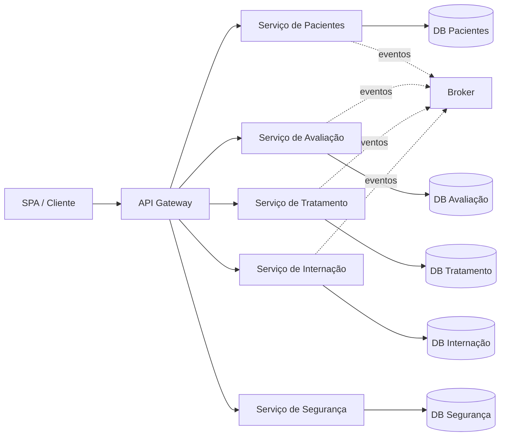

### API Gateway no estudo de caso

O API Gateway é apresentado como camada intermediária que:

- mantém um catálogo ou conhecimento dos serviços disponíveis;
- roteia chamadas;
- centraliza autenticação e políticas transversais;
- limita chamadas;
- monitora tráfego;
- reduz o impacto de mudanças de endereço dos serviços para os clientes.

### Dados por serviço

Cada microserviço é responsável por seus dados. Compartilhamento ocorre por consultas ou eventos, sem acesso direto ao banco de outro serviço.

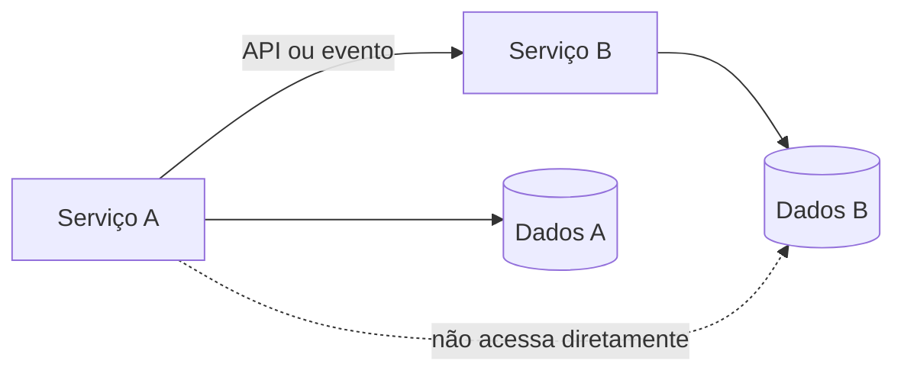

### Vantagens

- escala individual de serviços;
- autonomia tecnológica;
- maior isolamento de falhas;
- implantação independente;
- melhor alinhamento com responsabilidades específicas.

### Desvantagens

- gerenciamento de múltiplos serviços;
- necessidade de descoberta, configuração e monitoramento;
- latência e falhas de rede;
- depuração distribuída;
- consistência entre dados;
- maior exigência de automação e observabilidade.

> [!WARNING]
> O material afirma que a falha de um serviço não afeta o sistema inteiro, mas também reconhece que serviços críticos — como segurança e login — podem bloquear o uso geral. Isolamento reduz propagação, porém não elimina dependências de negócio.

## 3.5 Estudo de caso: hospital, do monólito aos microsserviços

O sistema hospitalar possui registro de pacientes, avaliação, tratamento temporário, internação, exames, alta, login e persistência.

### Situação inicial

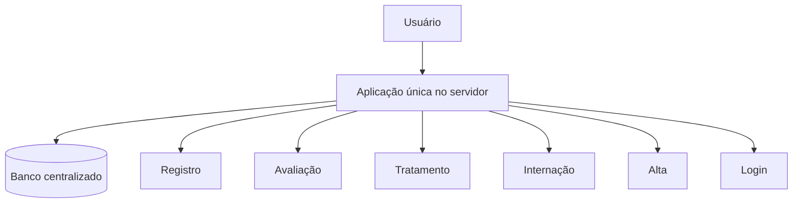

### Dificuldades relatadas

- reiniciar toda a aplicação para adicionar ou melhorar funções;
- períodos de indisponibilidade;
- falha localizada derruba o conjunto;
- escala integral mesmo quando apenas uma função precisa de recursos;
- integração externa difícil;
- manutenção de base extensa.

### Proposta

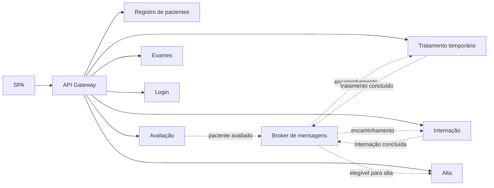

Essa decomposição busca autonomia, resiliência e escala individual. Em contrapartida, introduz comunicação distribuída, mensageria e gestão operacional.

## 3.6 Arquitetura orientada a eventos

Uma arquitetura orientada a eventos organiza a comunicação por fatos ocorridos no domínio. Um produtor publica um evento e consumidores interessados reagem.

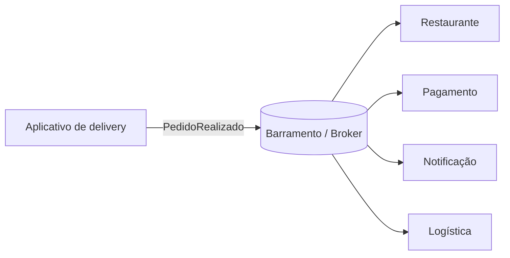

### Comunicação assíncrona

Na comunicação síncrona, o emissor aguarda resposta. Na assíncrona, envia a mensagem e o processamento pode ocorrer depois.

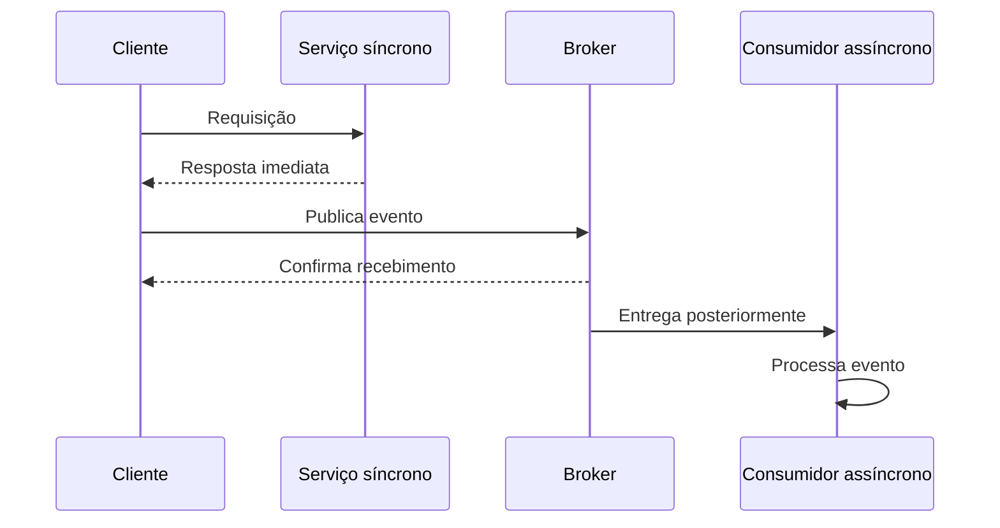

### Vantagens

- baixo acoplamento entre publicador e consumidor;
- inclusão de novos consumidores sem alterar o produtor;
- escalabilidade por consumidores paralelos;
- enfileiramento durante indisponibilidade temporária;
- boa integração entre componentes.

### Desafios

- ausência de resposta imediata;
- rastreamento de fluxos distribuídos;
- ordem e duplicidade de mensagens;
- risco de perda ou inconsistência se a infraestrutura for inadequada;
- latência em processos críticos;
- dificuldade de processos sequenciais complexos.

> [!IMPORTANT]
> **Complemento didático:** evento representa um fato ocorrido, enquanto comando expressa uma intenção. O material concentra-se em eventos e reação assíncrona, sem aprofundar essa distinção.

## 3.7 Cliente-servidor

O padrão cliente-servidor separa a interface ou aplicação cliente do servidor responsável por dados e serviços.

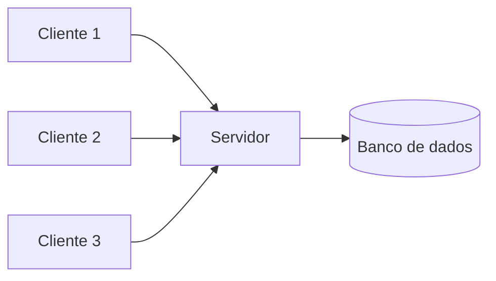

O material associa o modelo clássico a aplicações desktop, como soluções Delphi, nas quais o cliente podia concentrar interface e parte da regra de negócio enquanto o servidor mantinha a persistência.

## 3.8 Arquitetura multicamadas

A arquitetura multicamadas adiciona limites explícitos entre apresentação, regras e dados.

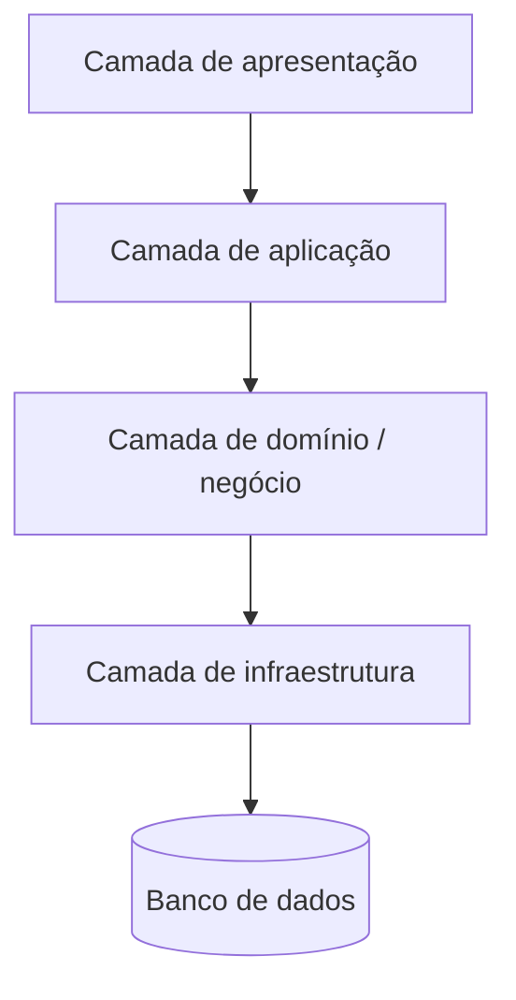

Mais camadas aumentam a quantidade de elementos, mas também tornam responsabilidades mais claras quando os limites são respeitados.

## 3.9 SOA — Arquitetura Orientada a Serviços

SOA divide capacidades empresariais em serviços integrados por um barramento corporativo.

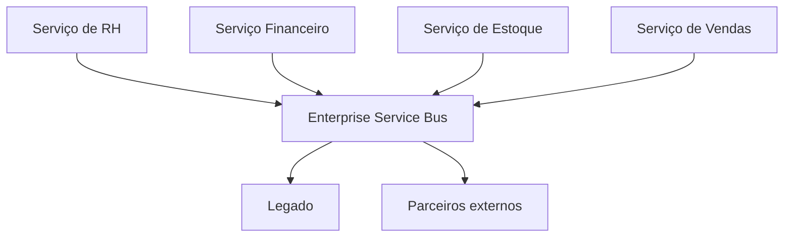

O material destaca o uso frequente na década de 2000 e alerta que um barramento central pode se tornar ponto único de falha.

## 3.10 Pipe and Filters

Organiza processamento como uma sequência de filtros. Cada filtro recebe dados, transforma-os e envia o resultado ao próximo.

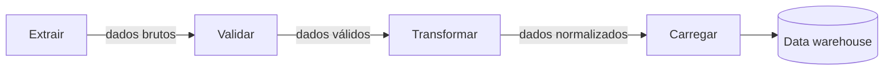

É relacionado no material a fluxos ETL — extração, transformação e carga.

### Vantagens

- filtros com responsabilidades específicas;
- composição e reutilização;
- possibilidade de alterar etapas isoladas.

### Limitações

- custo de serialização e transporte entre etapas;
- tratamento de erro ao longo do pipeline;
- necessidade de padronizar entrada e saída.

## 3.11 Comparação dos estilos principais

| Critério | Monólito | MVC | Microsserviços | Orientada a eventos |
|---|---|---|---|---|
| Unidade principal | Aplicação única | Componentes lógicos | Serviços autônomos | Produtores, eventos e consumidores |
| Implantação | Conjunta | Depende da aplicação | Independente por serviço | Independente por consumidor/produtor |
| Comunicação | Interna | Fluxo Model/View/Controller | Rede e APIs/mensagens | Mensagens assíncronas |
| Escala | Geralmente conjunta | Não define distribuição | Individual | Consumidores podem escalar |
| Complexidade inicial | Baixa | Média | Alta | Alta |
| Isolamento de falha | Menor | Lógico | Maior, com ressalvas | Filas podem absorver indisponibilidade |
| Uso indicado no material | MVP/POC | Front-end/interfaces | Alta escala e autonomia | Fluxos desacoplados e assíncronos |

## 3.12 Como escolher

O professor responde “depende”. A escolha deve partir dos requisitos.

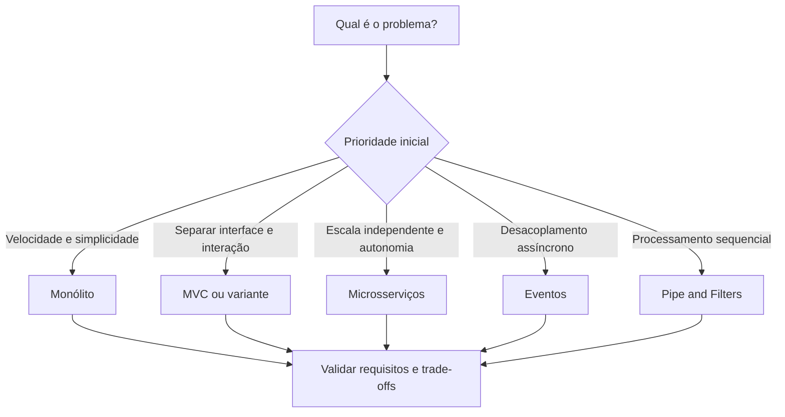

Perguntas úteis:

- Qual volume e perfil de carga?
- É necessário escalar partes separadamente?
- A equipe consegue operar sistemas distribuídos?
- Há necessidade de resposta imediata?
- Qual tolerância a indisponibilidade e inconsistência?
- O sistema é um MVP ou uma plataforma já consolidada?
- Quantas equipes precisam trabalhar de forma autônoma?

## 3.13 Síntese para a prova

- Padrões criam linguagem comum, mas não eliminam análise contextual.
- Monólito é um único bloco de implantação: simples, rápido, porém escala e falha de forma mais ampla.
- MVC separa Model, View e Controller.
- Microsserviços são autônomos, possuem dados próprios e exigem infraestrutura operacional.
- API Gateway centraliza roteamento e políticas transversais no estudo de caso.
- Eventos promovem comunicação assíncrona e desacoplada.
- Cliente-servidor separa cliente e servidor; multicamadas adiciona responsabilidades intermediárias.
- SOA usa serviços e barramento corporativo; o ESB pode virar ponto único de falha.
- Pipe and Filters organiza transformações sequenciais.
- Não existe “melhor padrão” fora de um contexto.

## Questões de revisão

1. Por que a implantação conjunta é simultaneamente vantagem e limitação do monólito?
2. Quais responsabilidades pertencem ao Model, View e Controller?
3. Por que banco compartilhado reduz autonomia de microsserviços?
4. Quais funções o API Gateway exerce no estudo de caso?
5. Como mensageria assíncrona melhora resiliência?
6. Quais problemas surgem com ordem, duplicidade e latência de eventos?
7. Qual diferença entre SOA e arquitetura de microsserviços no enfoque apresentado?
8. Em qual cenário Pipe and Filters é uma boa abstração?
9. Por que “depende” é uma resposta arquitetural válida, mas incompleta?

## Referência no material da disciplina

- Aula 1 — e-book, partes 5 e 6;
- Aula 2 — e-book, parte 1;
- Aula 1 e Aula 2 — slides sobre padrões arquiteturais e estudo de caso hospitalar.
