# 4. Domain-Driven Design — DDD

## Objetivos de aprendizagem

Ao concluir este capítulo, você deverá ser capaz de:

- explicar por que DDD coloca o domínio no centro do design;
- diferenciar domínio, subdomínio e modelo;
- compreender Bounded Context, Linguagem Ubíqua e Context Map;
- reconhecer Entidades, Objetos de Valor, Serviços, Repositórios, Agregados, Eventos de Domínio e Fábricas;
- relacionar DDD à arquitetura em camadas;
- interpretar o estudo de caso de agendamento do Poupatempo.

## 4.1 Dividir para conquistar

A disciplina introduz DDD por meio da estratégia *divide et impera*: problemas complexos tornam-se mais administráveis quando são divididos em partes menores, cada uma com responsabilidades e necessidades próprias.

A analogia utilizada é a administração de um grande império. O imperador delega problemas regionais a líderes locais e permanece responsável por decisões globais.

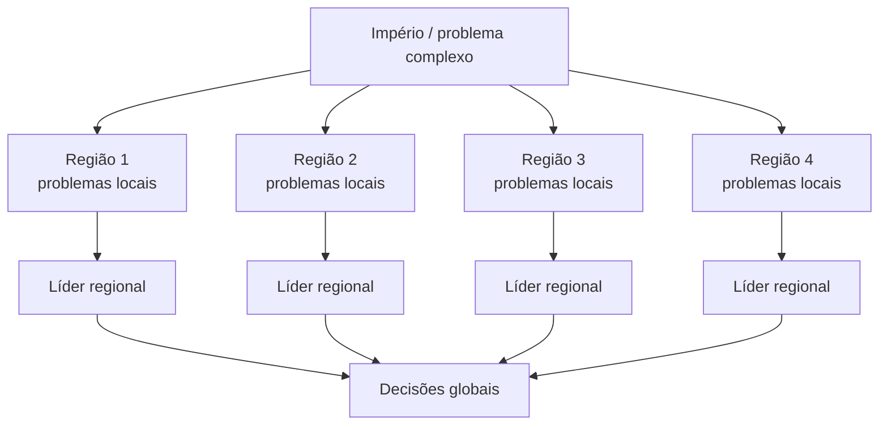

No exemplo de um ERP, recrutamento, folha de pagamento, financeiro, compras, estoque e vendas possuem regras diferentes. Tratar tudo como um único conjunto homogêneo dificulta compreensão e evolução.

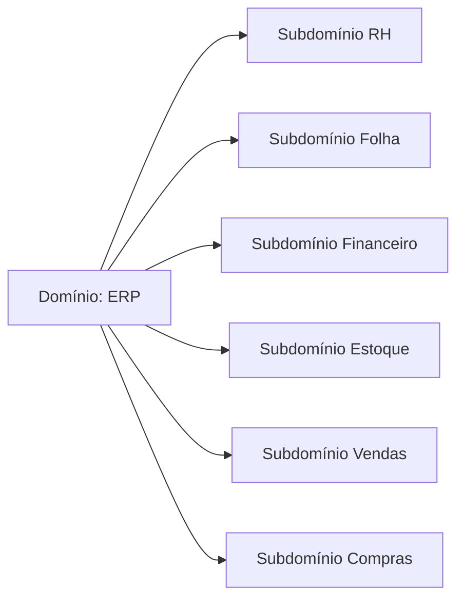

## 4.2 Domínio, subdomínio e modelo

### Domínio

É o campo de conhecimento e atividade que o software pretende atender. No exemplo, o ERP completo representa o domínio analisado.

### Subdomínio

É uma parte do domínio com problemas, regras e linguagem próprias.

### Modelo

É uma abstração seletiva do mundo real. O mundo real possui variáveis demais para ser reproduzido integralmente; o modelo preserva o que é relevante ao problema do software.

A aula compara uma partida de futebol real com futebol de botão. O jogo real envolve condições físicas, psicológicas, estratégias, finanças e inúmeras variáveis. O futebol de botão reduz essas variáveis, mantendo elementos suficientes para representar uma partida.

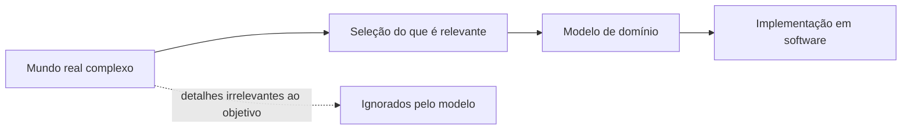

> [!IMPORTANT]
> Modelo não é uma cópia completa do mundo real. É uma representação útil para as decisões e comportamentos que o software precisa suportar.

## 4.3 Modelo tradicional e modelo orientado ao domínio

A disciplina contrasta um desenvolvimento centrado em tabelas com DDD.

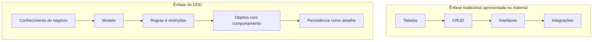

Tabelas são adequadas para armazenar dados e podem oferecer boa performance, mas não expressam sozinhas todas as restrições do domínio. O software deve impedir situações que não fazem sentido no mundo real.

### Exemplo do transporte de contêineres

O sistema permite cadastrar uma rota impossível ou incoerente porque o modelo de dados aceita combinações tecnicamente válidas, mas o domínio não.

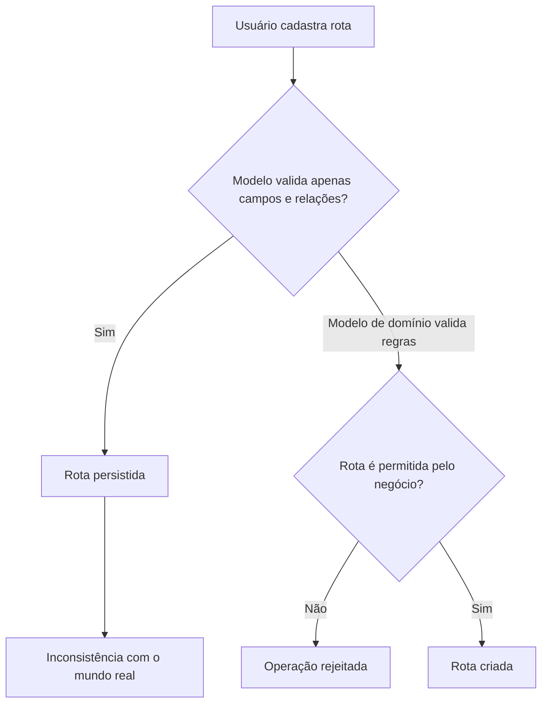

A correção não é apenas adicionar uma condição numa tela. É representar a regra no modelo para que qualquer entrada respeite a restrição.

## 4.4 Linguagem Ubíqua

A Linguagem Ubíqua é o vocabulário compartilhado entre especialistas do negócio e equipe técnica. Os mesmos termos devem aparecer nas conversas, documentos, testes e código.

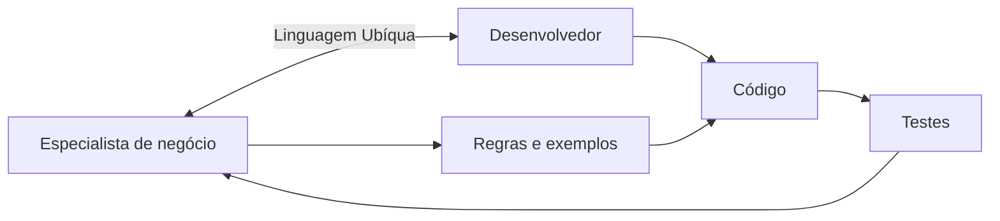

Uma palavra pode mudar de significado entre contextos. “Produto” em estoque pode significar item armazenável; em manufatura, item produzido; em vendas, item comercializado. DDD não obriga uma única definição global. Ele pede definições consistentes dentro de limites explícitos.

## 4.5 Bounded Context — Contexto Delimitado

Um Bounded Context estabelece o limite no qual um modelo e sua linguagem são consistentes.

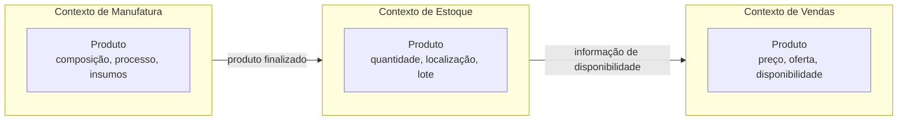

Mesmo nome não implica mesmo objeto ou mesmas regras. Tentar criar um modelo universal para toda a organização pode gerar um objeto excessivamente grande, contraditório ou incompreensível.

> [!WARNING]
> Bounded Context não é apenas pacote, pasta ou microsserviço. Ele é primeiro um limite de significado e modelo. Pode influenciar a implementação, mas não se reduz à tecnologia.

## 4.6 Context Map — Mapa de Contexto

O Context Map mostra os contextos e suas relações de dependência.

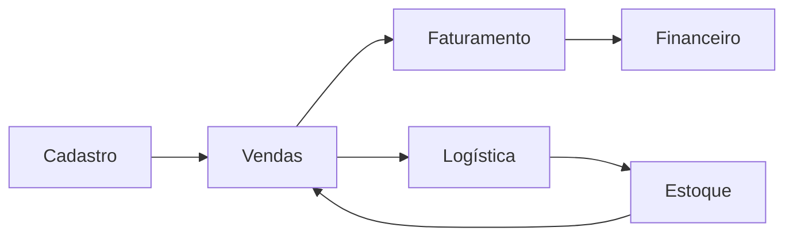

O mapa permite visualizar:

- quem fornece informação;
- quem depende de quem;
- onde existe integração;
- contextos fortemente ligados;
- contextos isolados;
- áreas em que uma mudança pode se propagar.

## 4.7 Building Blocks do DDD

O material apresenta os principais elementos táticos usados dentro de um contexto.

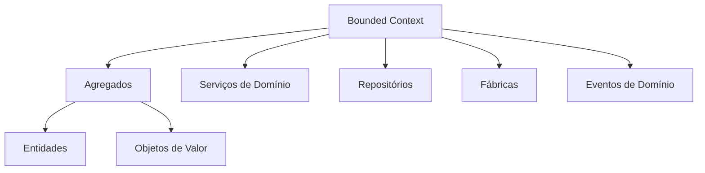

### 4.7.1 Entidade

É identificada por uma identidade única, não apenas pelos atributos. Pode mudar ao longo do tempo sem deixar de ser o mesmo objeto.

```java
public final class Paciente {
    private final UUID id;
    private NomeCompleto nome;

    public Paciente(UUID id, NomeCompleto nome) {
        this.id = Objects.requireNonNull(id);
        this.nome = Objects.requireNonNull(nome);
    }

    public void alterarNome(NomeCompleto novoNome) {
        this.nome = Objects.requireNonNull(novoNome);
    }

    @Override
    public boolean equals(Object obj) {
        return obj instanceof Paciente outro && id.equals(outro.id);
    }

    @Override
    public int hashCode() {
        return id.hashCode();
    }
}
```

> [!NOTE]
> Exemplo didático elaborado a partir da definição apresentada no material.

Uma entidade não deve ser apenas uma estrutura anêmica de dados. Ela pode conter operações que preservam regras do domínio.

### 4.7.2 Objeto de Valor — Value Object

É definido por seus atributos e normalmente é imutável. O material destaca construtor, ausência de setters e tipagem forte no lugar de primitivos genéricos.

```java
public record Dinheiro(BigDecimal valor, Currency moeda) {
    public Dinheiro {
        Objects.requireNonNull(valor);
        Objects.requireNonNull(moeda);
        if (valor.scale() > 2) {
            throw new IllegalArgumentException("Quantidade inválida de casas decimais");
        }
    }

    public Dinheiro somar(Dinheiro outro) {
        if (!moeda.equals(outro.moeda())) {
            throw new IllegalArgumentException("Moedas incompatíveis");
        }
        return new Dinheiro(valor.add(outro.valor()), moeda);
    }
}
```

### 4.7.3 Serviço de Domínio

Representa uma operação de negócio que não pertence naturalmente a uma entidade ou objeto de valor e pode envolver vários objetos.

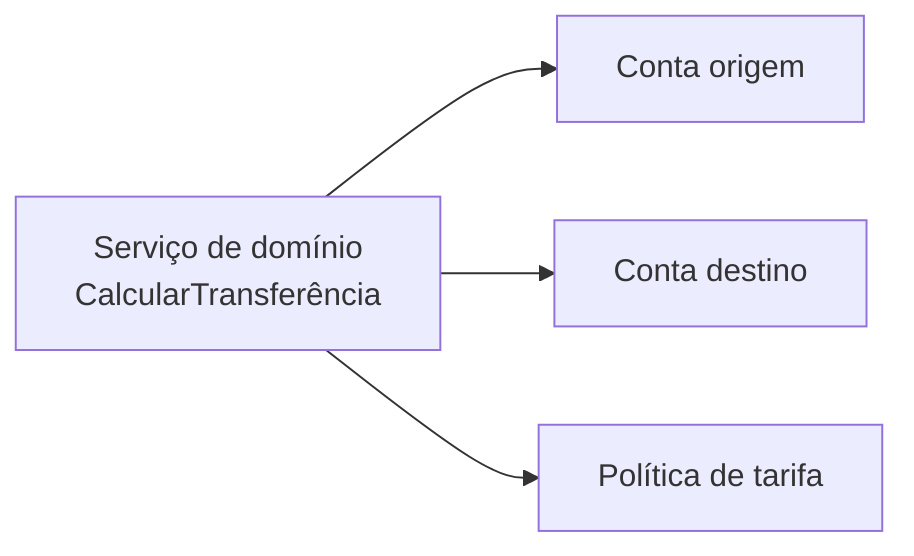

### 4.7.4 Repositório

Oferece acesso a agregados e abstrai persistência ou serviços externos. O material recomenda, como boa prática, um repositório por agregado.

```java
public interface PedidoRepository {
    Optional<Pedido> buscarPorId(PedidoId id);
    void salvar(Pedido pedido);
}
```

### 4.7.5 Agregado

O material define Agregado como um conjunto de Entidades e Objetos de Valor que representa um modelo mais complexo.

> [!NOTE]
> **Complemento didático de DDD:** na literatura, o Agregado costuma ser tratado como unidade de consistência controlada por uma raiz, responsável por preservar invariantes.

É um conjunto de entidades e objetos de valor tratado como uma unidade de consistência. Uma raiz controla o acesso e preserva invariantes.

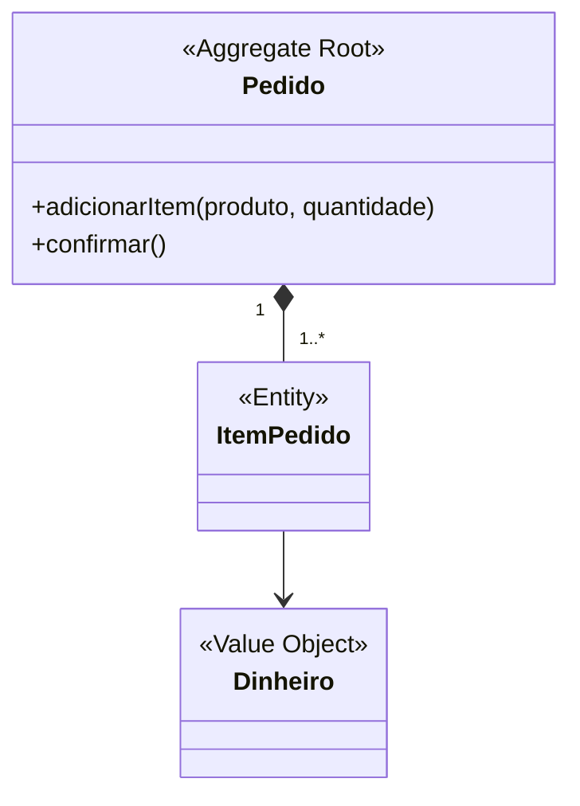

### 4.7.6 Evento de Domínio

Representa um fato de negócio ocorrido. Outros objetos ou contextos podem reagir.

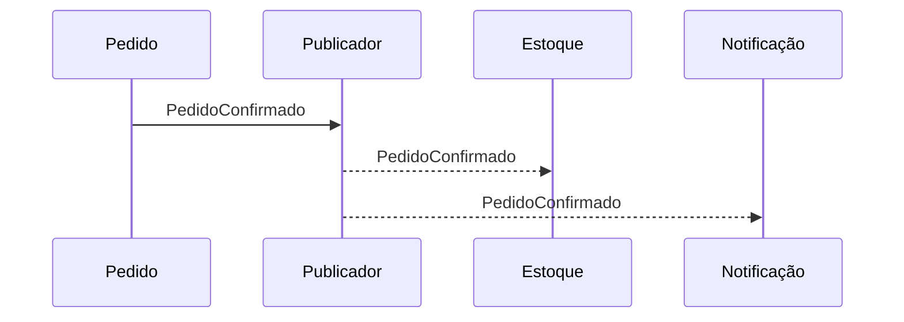

### 4.7.7 Fábrica

Ajuda a criar objetos ou agregados corretamente quando a construção é complexa e precisa garantir invariantes.

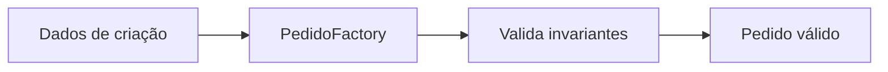

## 4.8 Como os objetos se encaixam

O material apresenta o serviço como coordenador de uma operação, usando repositórios para obter dados e trabalhar com agregados, entidades e objetos de valor.

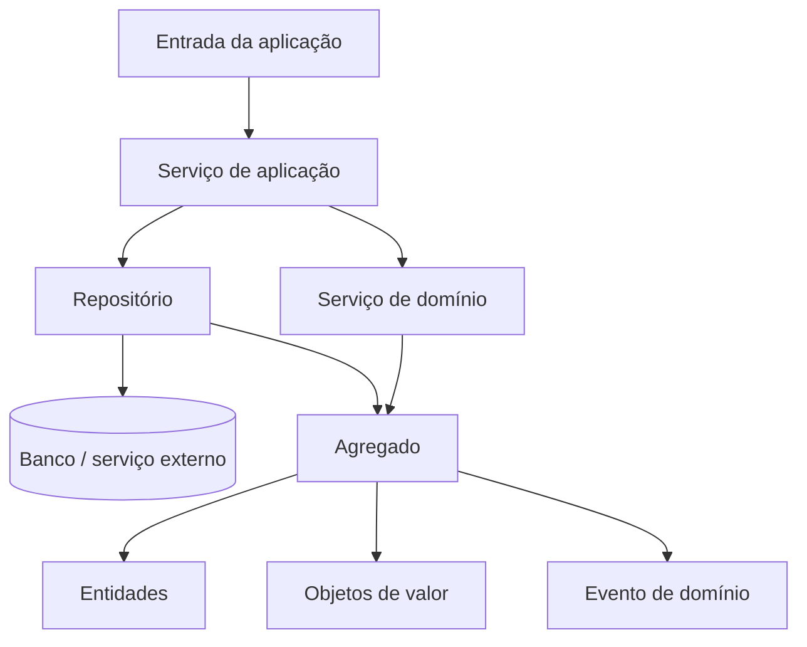

> [!NOTE]
> A nomenclatura “service” pode representar serviço de aplicação ou serviço de domínio. O e-book resume o fluxo; na prática, é importante distinguir coordenação de caso de uso de regra genuinamente pertencente ao domínio.

## 4.9 Arquitetura em quatro camadas segundo o material

O material associa DDD a quatro camadas.

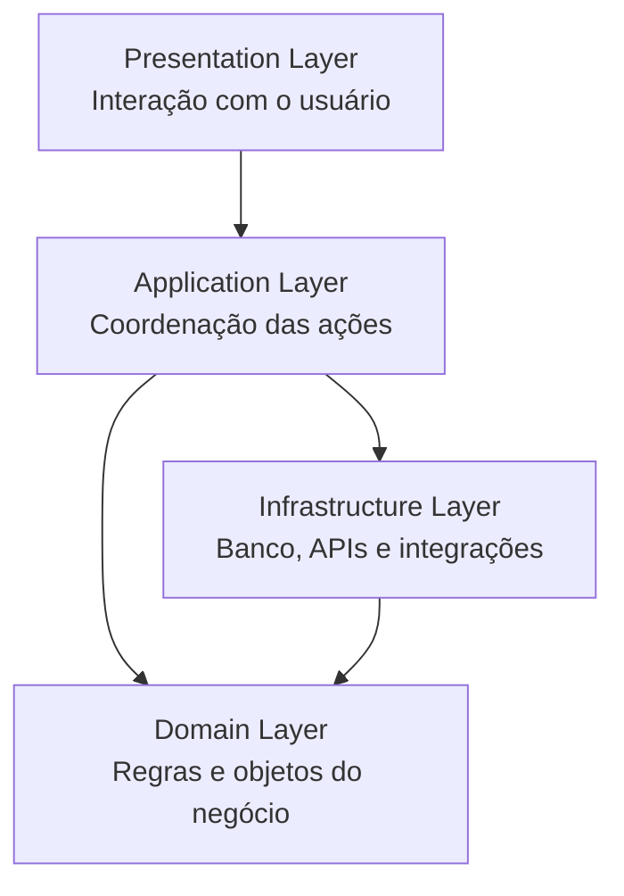

### Presentation Layer

Responsável pela interação do usuário com o sistema.

### Application Layer

Traduz ações externas em fluxos da aplicação. Coordena, mas não deve concentrar as regras centrais do domínio.

### Domain Layer

É o coração do software. Contém modelo e regras do negócio.

### Infrastructure Layer

Implementa acesso a bancos, APIs e tecnologias externas.

### Regra de independência do domínio

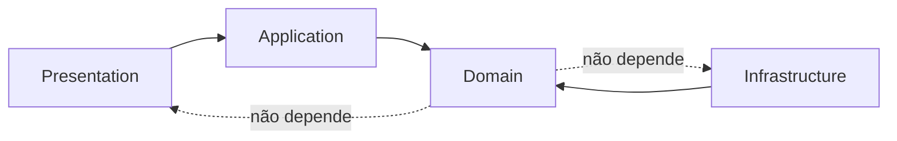

A troca de banco relacional por não relacional deve afetar infraestrutura, não as regras do domínio. A camada de domínio só deveria mudar quando o negócio muda.

## 4.10 Estudo de caso: agendamento do Poupatempo

O sistema apresentado possui quatro contextos.

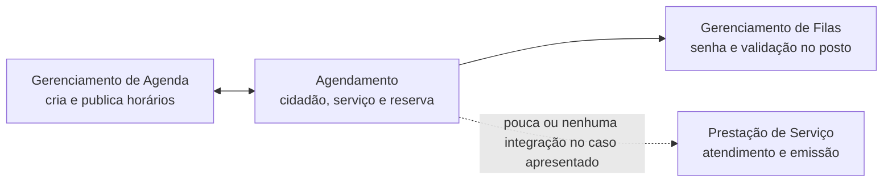

### Gerenciamento de Agenda

Cria e disponibiliza agendas dos postos.

### Agendamento

Relaciona cidadão, serviço, horário e reserva.

### Gerenciamento de Filas

Valida o protocolo no posto e organiza o atendimento físico.

### Prestação de Serviço

Representa o atendimento em si, como emissão de documentos.

O material destaca que objetos chamados “reserva” podem existir em mais de um contexto com regras diferentes. Gerenciamento de Agenda e Agendamento possuem forte dependência. Filas depende de Agendamento para validar protocolos. Prestação de Serviço permanece isolado por existirem sistemas distintos de cada prestador, sendo descrito na aula como uma “grande bola de lama”.

## 4.11 Classe anêmica e múltiplas responsabilidades

O estudo de caso dos slides mostra uma aplicação legada com dois problemas recorrentes:

### Modelo anêmico

A classe representa apenas dados, enquanto regras ficam dispersas em serviços.

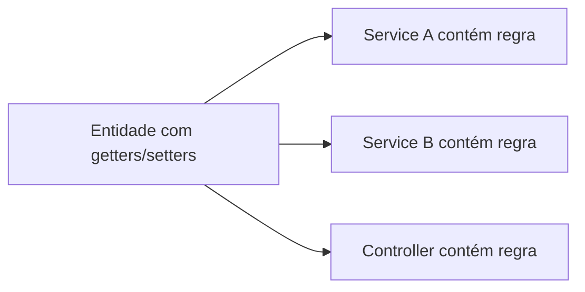

### Classe com responsabilidades demais

Uma classe pode consultar banco, validar regra, enviar mensagem e formatar resposta. Isso reduz coesão e aumenta acoplamento.

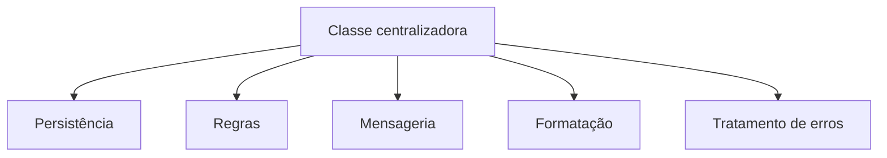

DDD busca aproximar comportamento e modelo, além de tornar limites e dependências explícitos.

## 4.12 Síntese para a prova

- DDD coloca o domínio de negócio no centro do design.
- Domínio é o campo de atividade; subdomínio é uma parte; modelo é uma abstração útil.
- Linguagem Ubíqua alinha equipe técnica e especialistas.
- Bounded Context delimita o significado consistente de um modelo.
- Context Map mostra relações entre contextos.
- Entidade tem identidade; Objeto de Valor é definido pelos atributos e tende a ser imutável.
- O material apresenta Agregado como conjunto de Entidades e Objetos de Valor; como complemento didático, ele pode ser entendido como unidade de consistência controlada por uma raiz.
- Repositório abstrai acesso a agregados; Fábrica ajuda na criação; Serviço de Domínio representa operação sem dono natural; Evento de Domínio representa fato ocorrido.
- O domínio deve permanecer independente de banco, interface e integrações.
- O mesmo termo pode ter significados diferentes em contextos distintos.

## Questões de revisão

1. Por que um modelo não deve tentar reproduzir todo o mundo real?
2. Qual a diferença entre domínio e subdomínio?
3. Como Linguagem Ubíqua reduz falhas de comunicação?
4. Por que o mesmo “Produto” pode ter modelos diferentes em estoque e vendas?
5. O que um Context Map revela?
6. Como diferenciar Entidade e Objeto de Valor?
7. Qual é a função da raiz de um Agregado?
8. Por que o domínio não deve depender da infraestrutura?
9. Quais dependências aparecem no estudo de caso do Poupatempo?
10. Por que uma classe anêmica pode enfraquecer a representação do domínio?

## Referência no material da disciplina

- Aula 2 — e-book, partes 2 e 3;
- Aula 2 — slides sobre estratégia de divisão, DDD, domínio, modelo, Bounded Context, Context Map, building blocks, arquitetura em camadas e estudo de caso.
