# 5. Clean Architecture

## Objetivos de aprendizagem

Ao concluir este capítulo, você deverá ser capaz de:

- explicar a finalidade da Clean Architecture;
- descrever a regra de dependência;
- diferenciar Enterprise Business Rules, Application Business Rules, Interface Adapters e Frameworks & Drivers;
- mapear entradas, saídas, casos de uso e domínio;
- compreender por que banco de dados, frameworks e protocolos devem permanecer em regiões externas;
- relacionar Clean Architecture, DDD e inversão de dependência.

## 5.1 Motivação

A Clean Architecture é apresentada na disciplina como uma forma de construir sistemas:

- fáceis de entender;
- fáceis de desenvolver;
- fáceis de manter;
- fáceis de implantar;
- independentes de frameworks, bancos de dados e interfaces externas.

A ideia central é proteger as regras de negócio das tecnologias que mudam com maior frequência.

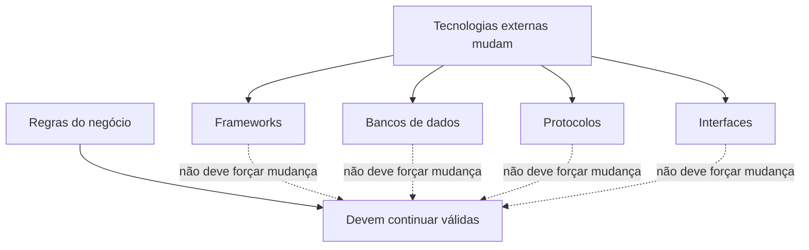

## 5.2 Visão das camadas

O material organiza a Clean Architecture em quatro regiões conceituais.

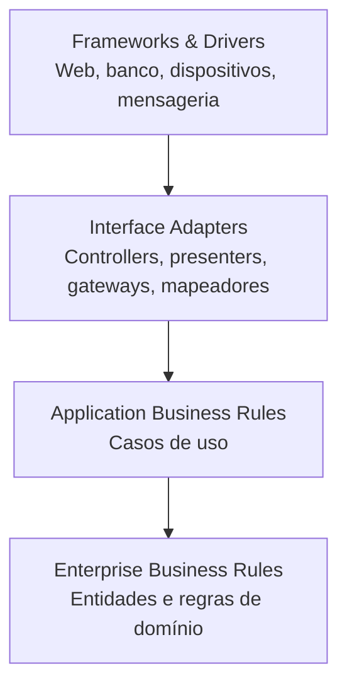

Outra representação ajuda a perceber que as regras ficam no centro:

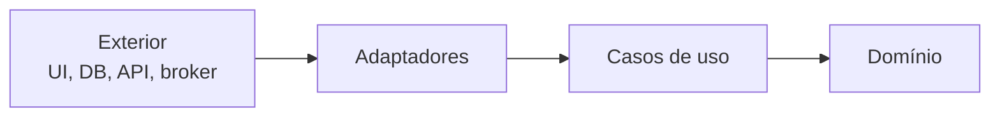

> [!IMPORTANT]
> O desenho em círculos é uma representação. O aspecto essencial não é a quantidade exata de camadas, mas a direção das dependências.

## 5.3 Regra de dependência

Dependências de código-fonte devem apontar para dentro, em direção às políticas de negócio.

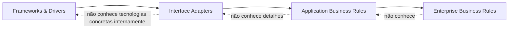

Uma camada interna:

- não importa classes concretas de uma camada externa;
- não conhece formato de banco, JSON, HTTP ou detalhes de UI;
- não depende do ciclo de vida de um framework;
- pode definir contratos que serão implementados externamente.

### Dependência de execução e dependência de código

Em tempo de execução, um caso de uso pode precisar salvar dados. A implementação do repositório está fora. Para preservar a direção do código, o contrato é declarado na região interna.

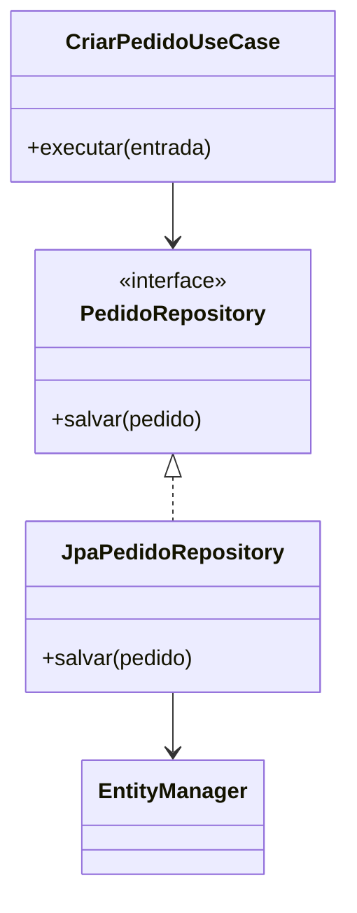

O fluxo de execução vai do caso de uso para a implementação. A dependência de código do adaptador aponta para o contrato interno.

## 5.4 Enterprise Business Rules

É a região mais interna e fundamental. Contém regras que representam o negócio independentemente da aplicação específica.

O material associa essa camada ao domínio e às entidades.

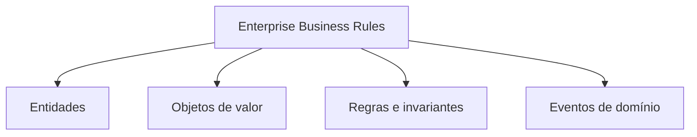

Exemplo didático:

```java
public final class Pedido {
    private final PedidoId id;
    private final List<ItemPedido> itens = new ArrayList<>();
    private StatusPedido status = StatusPedido.ABERTO;

    public void adicionarItem(Produto produto, int quantidade) {
        if (status != StatusPedido.ABERTO) {
            throw new IllegalStateException("Pedido não pode mais ser alterado");
        }
        if (quantidade <= 0) {
            throw new IllegalArgumentException("Quantidade deve ser positiva");
        }
        itens.add(new ItemPedido(produto, quantidade));
    }

    public void confirmar() {
        if (itens.isEmpty()) {
            throw new IllegalStateException("Pedido sem itens");
        }
        status = StatusPedido.CONFIRMADO;
    }
}
```

A classe não sabe se será persistida em PostgreSQL, MongoDB ou arquivo, nem se será chamada por REST ou interface gráfica.

## 5.5 Application Business Rules

Contém os casos de uso — ações que o usuário ou outro sistema deseja realizar. Essa camada orquestra entidades e contratos.

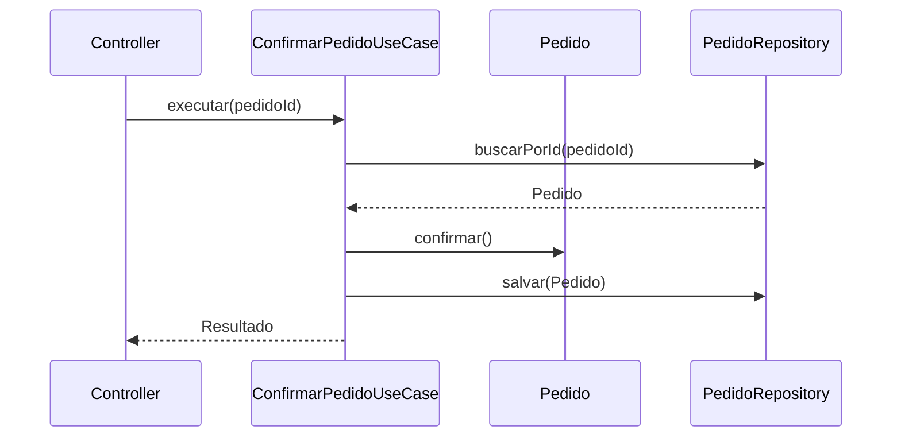

Responsabilidades típicas:

- coordenar o fluxo;
- carregar entidades;
- acionar regras;
- persistir alterações por contratos;
- publicar saídas;
- controlar transação em nível de aplicação.

Não deve conter detalhes de HTTP, SQL, componentes visuais ou bibliotecas concretas.

## 5.6 Interface Adapters

Adapta dados entre o exterior e as representações internas. O e-book destaca quatro responsabilidades:

1. transformação de dados;
2. gerenciamento de acessos externos;
3. roteamento para o caso de uso adequado;
4. tratamento de erros entre exterior e interior.

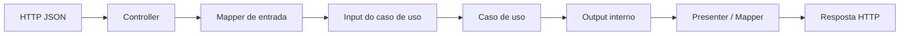

Exemplos:

- controller REST;
- presenter;
- gateway de banco;
- implementação de repositório;
- mapeador entre entidade de persistência e entidade de domínio;
- consumidor ou publicador de mensagens.

### Transformação de dados

Um JSON externo não deve circular pelo domínio como contrato implícito.

```java
public record CriarPedidoHttpRequest(
    String clienteId,
    List<ItemHttpRequest> itens
) {}

public final class CriarPedidoMapper {
    public CriarPedidoInput toInput(CriarPedidoHttpRequest request) {
        var itens = request.itens().stream()
            .map(item -> new CriarPedidoItemInput(
                new ProdutoId(item.produtoId()),
                item.quantidade()))
            .toList();

        return new CriarPedidoInput(new ClienteId(request.clienteId()), itens);
    }
}
```

> [!NOTE]
> Exemplo didático, não transcrição literal do material.

## 5.7 Frameworks & Drivers

É a região mais externa, responsável por tecnologias e detalhes:

- banco de dados;
- servidor web;
- bibliotecas;
- REST, SOAP ou GraphQL;
- RabbitMQ, Apache Kafka ou outros brokers;
- dispositivos e interfaces;
- configuração de framework.

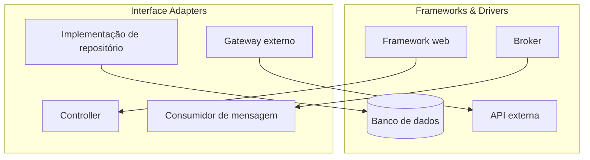

A camada deve ser flexível para que trocas externas não exijam modificação das regras internas.

> [!WARNING]
> Independência não significa que a troca será gratuita. Migração de banco pode exigir scripts, conversão de tipos e ajuste de performance. A meta é impedir que a regra de negócio seja estruturalmente dependente do fornecedor.

## 5.8 Fluxo completo de uma requisição

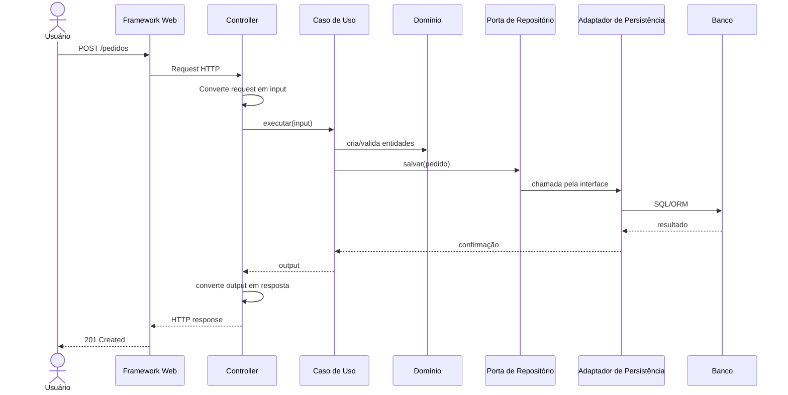

Os formatos externos são convertidos na borda. O domínio trabalha com seus próprios tipos.

## 5.9 Portas e adaptadores como leitura complementar do desenho

Embora o material use as quatro camadas de Clean Architecture, seus exemplos podem ser compreendidos com a ideia de portas e adaptadores:

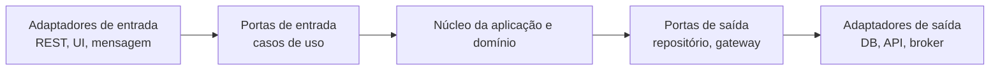

> [!NOTE]
> Esta representação é uma síntese didática compatível com a regra de dependência. O material não apresenta um capítulo separado sobre Arquitetura Hexagonal.

## 5.10 Organização de pacotes

Uma estrutura possível, elaborada didaticamente, é organizar por funcionalidade e por limites internos:

```text
src/main/java/br/com/exemplo/pedido/
├── domain/
│   ├── Pedido.java
│   ├── PedidoId.java
│   ├── ItemPedido.java
│   └── StatusPedido.java
├── application/
│   ├── port/in/
│   │   ├── CriarPedidoUseCase.java
│   │   └── CriarPedidoInput.java
│   ├── port/out/
│   │   └── PedidoRepository.java
│   └── service/
│       └── CriarPedidoService.java
├── adapter/
│   ├── in/web/
│   │   ├── PedidoController.java
│   │   └── CriarPedidoRequest.java
│   └── out/persistence/
│       ├── JpaPedidoRepository.java
│       ├── PedidoJpaEntity.java
│       └── PedidoPersistenceMapper.java
└── configuration/
    └── PedidoConfiguration.java
```

O nome dos diretórios não garante a arquitetura. O que importa é a direção real das dependências.

## 5.11 DDD e Clean Architecture

DDD e Clean Architecture não são sinônimos.

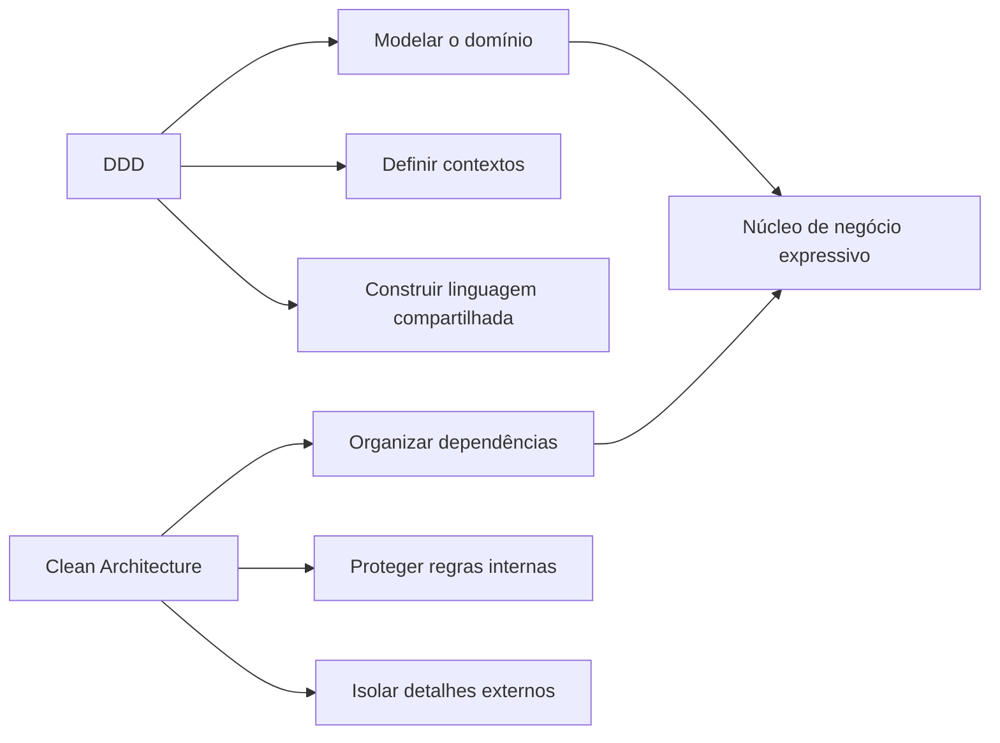

DDD orienta a compreensão e modelagem da complexidade do negócio. Clean Architecture orienta a estrutura e direção das dependências. Elas podem ser usadas em conjunto.

## 5.12 Erros frequentes

### Entidade de domínio acoplada ao ORM

```java
@Entity
public class Pedido {
    // Quando toda regra depende do ciclo de vida e das anotações do framework,
    // o domínio passa a conhecer um detalhe externo.
}
```

O uso de anotações não é automaticamente uma violação em qualquer projeto. A questão é o grau de acoplamento e o custo para testar ou substituir a tecnologia.

### Caso de uso retornando resposta HTTP

```java
public ResponseEntity<?> executar(...) {
    // O caso de uso passa a depender do framework web.
}
```

O caso de uso deve produzir um resultado de aplicação; o adaptador decide como convertê-lo em HTTP.

### Controller com regra de negócio

```java
@PostMapping
public ResponseEntity<?> confirmar(...) {
    // várias validações, cálculo, persistência e integração aqui
}
```

O controller deve adaptar e encaminhar, não substituir o domínio e o caso de uso.

### Repositório de domínio expondo tecnologia

```java
public interface PedidoRepository extends JpaRepository<PedidoJpaEntity, UUID> {
}
```

Essa interface é útil na infraestrutura, mas não deve necessariamente ser a porta consumida pelo caso de uso. A porta interna deve expressar a necessidade da aplicação.

## 5.13 Testabilidade

A independência das camadas internas facilita testes sem servidor, banco ou rede.

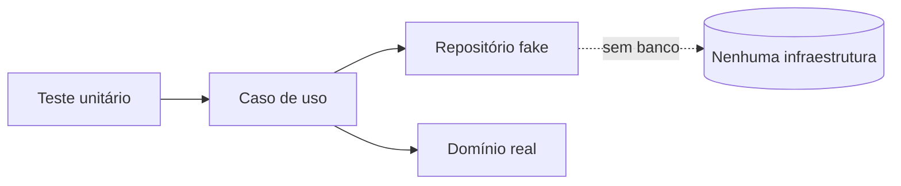

Exemplo didático:

```java
class ConfirmarPedidoServiceTest {
    @Test
    void deveConfirmarPedidoComItens() {
        var pedido = PedidoFixture.pedidoAbertoComItem();
        var repositorio = new PedidoRepositoryEmMemoria(pedido);
        var casoDeUso = new ConfirmarPedidoService(repositorio);

        casoDeUso.executar(pedido.id());

        assertEquals(StatusPedido.CONFIRMADO,
            repositorio.buscarPorId(pedido.id()).orElseThrow().status());
    }
}
```

## 5.14 Checklist de avaliação

Use estas perguntas para verificar uma implementação:

- O domínio importa classes do framework?
- Um caso de uso conhece HTTP, SQL ou JSON?
- As interfaces necessárias ao núcleo estão declaradas no lado interno?
- Controllers apenas adaptam ou também implementam negócio?
- É possível testar regras sem iniciar banco e servidor?
- Formatos externos atravessam todas as camadas?
- Trocar uma API externa exige alterar entidades?
- As dependências apontam para as políticas mais estáveis?

## 5.15 Síntese para a prova

- Clean Architecture protege regras internas de detalhes externos.
- A regra de dependência faz o código apontar para dentro.
- Enterprise Business Rules contém domínio e entidades.
- Application Business Rules contém casos de uso e orquestração.
- Interface Adapters transforma entradas e saídas, roteia e conecta contratos.
- Frameworks & Drivers contém banco, web, protocolos e bibliotecas.
- O núcleo pode declarar interfaces implementadas externamente.
- Fluxo de execução pode sair do caso de uso para um adaptador, mas a dependência de código continua apontando para a abstração interna.
- DDD modela o negócio; Clean Architecture organiza os limites e dependências.

## Questões de revisão

1. Qual é a regra mais importante da Clean Architecture?
2. Por que o domínio não deve conhecer JSON ou SQL?
3. Qual a diferença entre regra de negócio empresarial e caso de uso?
4. Quais responsabilidades pertencem a Interface Adapters?
5. Por que frameworks são colocados na região externa?
6. Como inversão de dependência permite que um caso de uso utilize um banco externo?
7. Qual a diferença entre fluxo de execução e direção da dependência de código?
8. Por que uma arquitetura em camadas pode existir e ainda violar Clean Architecture?
9. Como a arquitetura melhora testabilidade?
10. Como DDD e Clean Architecture se complementam?

## Referência no material da disciplina

- Aula 2 — e-book, parte 4;
- Aula 2 — slides sobre Clean Architecture, regra de dependência e as quatro camadas.
