# 6. Documentação Arquitetural

## Objetivos de aprendizagem

Ao concluir este capítulo, você deverá ser capaz de:

- explicar por que o código não registra sozinho todas as decisões arquiteturais;
- criar um Architecture Decision Record — ADR;
- diferenciar os quatro níveis do C4 Model;
- reconhecer usos de diagramas UML;
- compreender a proposta do arc42;
- selecionar o nível de documentação adequado ao contexto.

## 6.1 Por que documentar arquitetura?

Quem entra em um projeto em andamento encontra decisões já incorporadas ao sistema:

- por que determinada linguagem foi escolhida?
- por que o banco é relacional ou não relacional?
- por que a solução está em nuvem?
- por que foi adotado um framework específico?
- por que componentes foram separados daquela forma?

O código mostra **o que foi implementado**, mas nem sempre explica:

- o contexto da decisão;
- as alternativas analisadas;
- as restrições existentes;
- os riscos aceitos;
- as consequências esperadas.

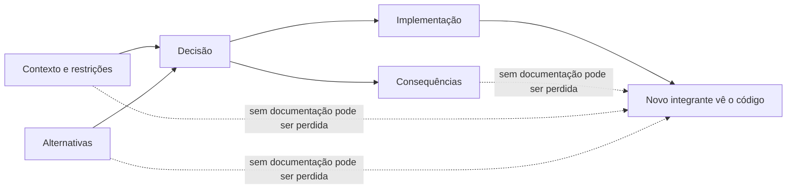

A documentação reduz dependência da memória das pessoas e preserva o raciocínio que não é visível no código.

## 6.2 Architecture Decision Record — ADR

ADR é um registro de uma decisão arquitetural relevante. Vários ADRs formam um histórico de decisões.

### Elementos recomendados no material

- identificador único para versionamento;
- contexto e justificativa;
- decisão tomada;
- alternativas consideradas e motivos de rejeição;
- consequências positivas e negativas;
- referências que fundamentaram a decisão.

Uma estrutura didática completa pode incluir status e data.

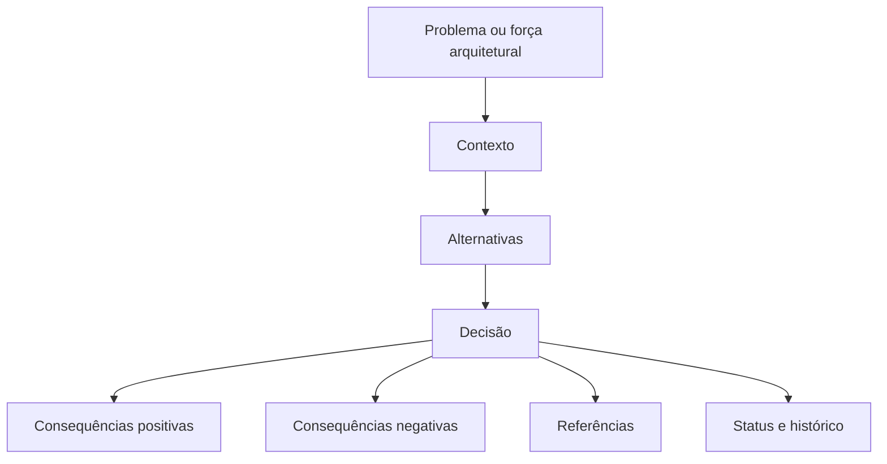

### Ciclo de vida de um ADR

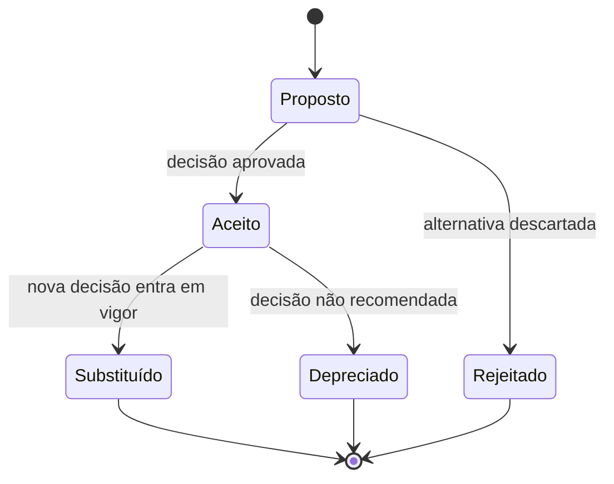

### Exemplo: escolha do PostgreSQL

```markdown
# ADR-0001 — Utilizar PostgreSQL como banco transacional

- Status: Aceito
- Data: 2026-07-30

## Contexto

A aplicação necessita de transações, integridade referencial e consultas relacionais.
A equipe possui experiência operacional com PostgreSQL.

## Decisão

Utilizar PostgreSQL como banco de dados transacional principal.

## Alternativas consideradas

- Banco documental: rejeitado porque o modelo e as consultas são predominantemente relacionais.
- Outro banco relacional comercial: rejeitado por custo e restrições de licenciamento no contexto analisado.

## Consequências positivas

- Suporte a propriedades transacionais requeridas.
- Comunidade madura.
- Conhecimento prévio da equipe.

## Consequências negativas

- Dependência operacional de tecnologia relacional.
- Necessidade de estratégia de migração e administração.

## Referências

- Requisitos de persistência do projeto.
- Avaliação técnica de alternativas.
```

> [!NOTE]
> O material apresenta a escolha do PostgreSQL como exemplo e cita robustez, suporte a ACID, maturidade da comunidade e adequação ao modelo. O texto acima é uma elaboração de ADR para demonstrar a estrutura.

## 6.3 O que merece um ADR?

Nem toda decisão precisa de registro formal. Um ADR é especialmente útil quando a decisão:

- afeta várias partes do sistema;
- é difícil ou cara de reverter;
- envolve trade-offs relevantes;
- depende de restrições não óbvias;
- pode ser questionada no futuro;
- define padrão para várias equipes.

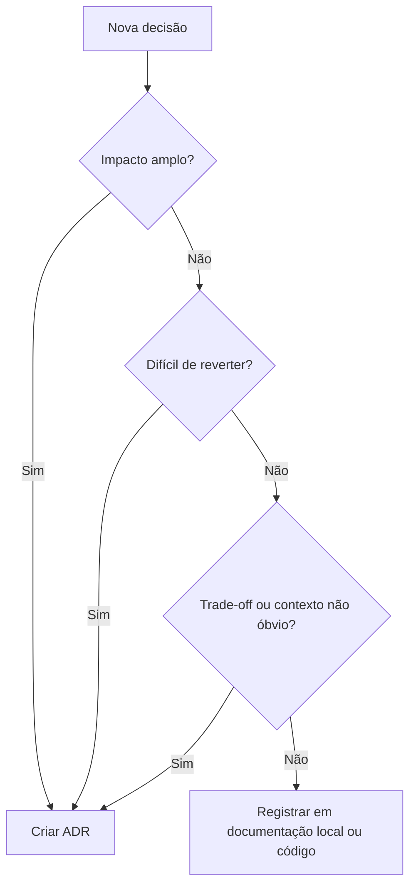

Exemplos de decisões candidatas:

- estilo arquitetural;
- banco de dados principal;
- mensageria;
- autenticação;
- estratégia de observabilidade;
- forma de particionar serviços;
- framework central;
- abordagem de consistência;
- política de versionamento de APIs.

## 6.4 Armazenamento e versionamento

O material cita opções como:

- arquivos de texto;
- Google Docs ou Microsoft Word;
- GitHub, Bitbucket ou TFS;
- Confluence ou MediaWiki.

Para documentação próxima ao código, arquivos Markdown versionados oferecem vantagens:

```text
/docs/adr/
├── 0001-usar-postgresql.md
├── 0002-adotar-mensageria-assincrona.md
├── 0003-separar-contexto-faturamento.md
└── README.md
```

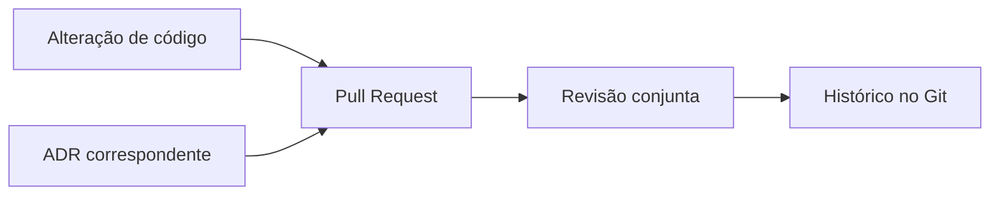

Isso permite revisar decisão e implementação no mesmo fluxo.

## 6.5 C4 Model

O C4 Model documenta arquitetura em níveis progressivos de detalhe:

1. Contexto;
2. Contêineres;
3. Componentes;
4. Código.

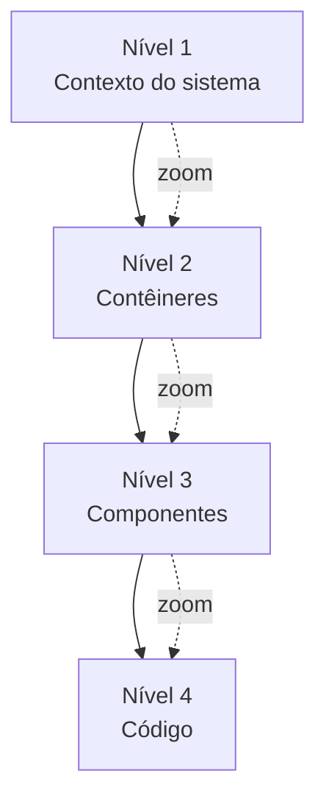

> [!IMPORTANT]
> **Complemento didático:** “Contêiner” no C4 não significa obrigatoriamente contêiner Docker. É uma unidade executável ou armazenadora de dados, como aplicação web, serviço, banco ou aplicativo móvel.

## 6.6 Nível 1 — Diagrama de Contexto

Mostra o sistema como uma caixa, seus usuários e sistemas externos.

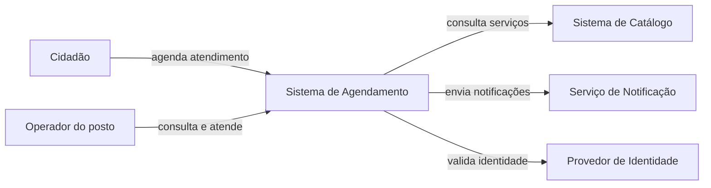

Pergunta respondida: **quem usa o sistema e com quais sistemas ele se relaciona?**

## 6.7 Nível 2 — Diagrama de Contêineres

Mostra aplicações e armazenamentos que formam o sistema.

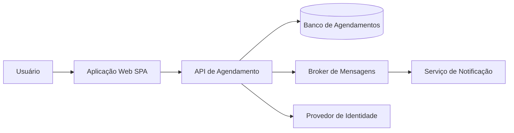

Pergunta respondida: **quais unidades executáveis ou armazenadoras compõem a solução?**

## 6.8 Nível 3 — Diagrama de Componentes

Detalha componentes dentro de um contêiner.

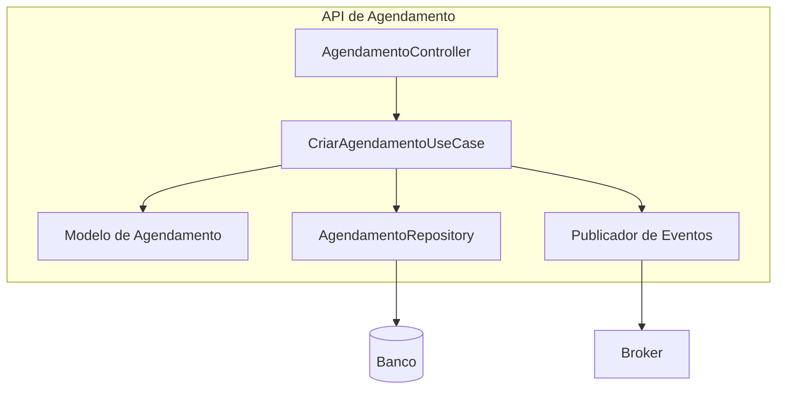

Pergunta respondida: **quais componentes internos realizam as responsabilidades do contêiner?**

## 6.9 Nível 4 — Código

O material apresenta este nível como uma visão de classes, interfaces, objetos, funções e outros elementos de código.

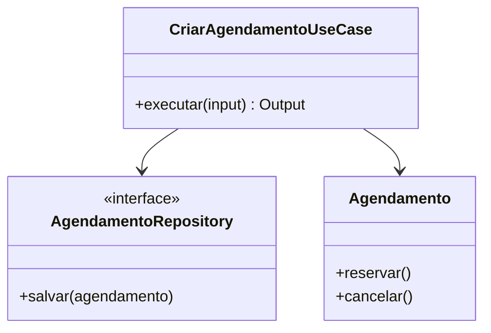

Pergunta respondida: **como uma parte específica está implementada?**

## 6.10 Seleção do nível C4

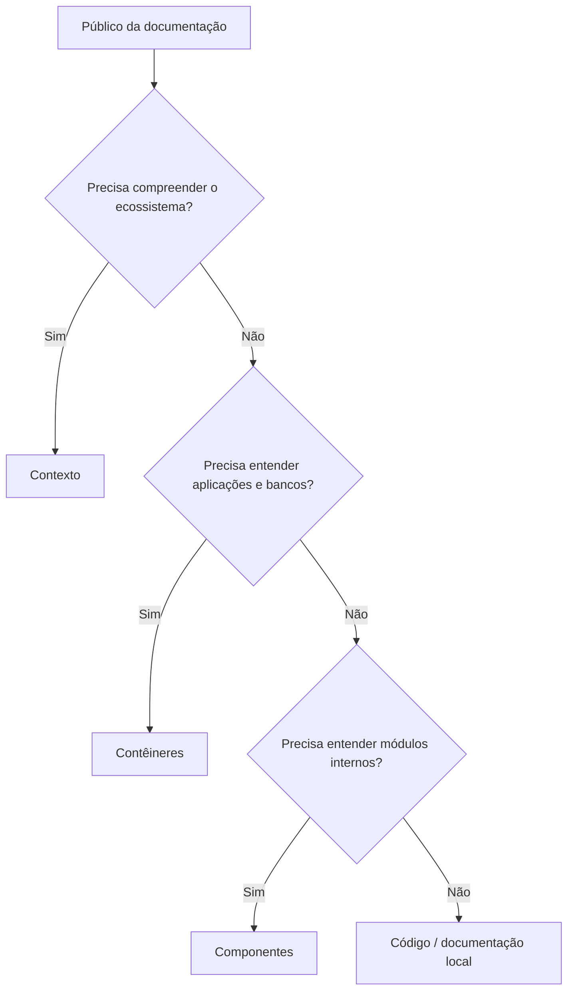

Não é necessário desenhar todos os níveis para todas as partes. A documentação deve responder perguntas reais.

## 6.11 UML na documentação arquitetural

O material cita UML para representar aspectos estruturais e comportamentais, incluindo:

- classes;
- pacotes;
- casos de uso;
- atividades;
- sequência.

### Diagrama de classes

Representa classes, atributos, métodos e relacionamentos.

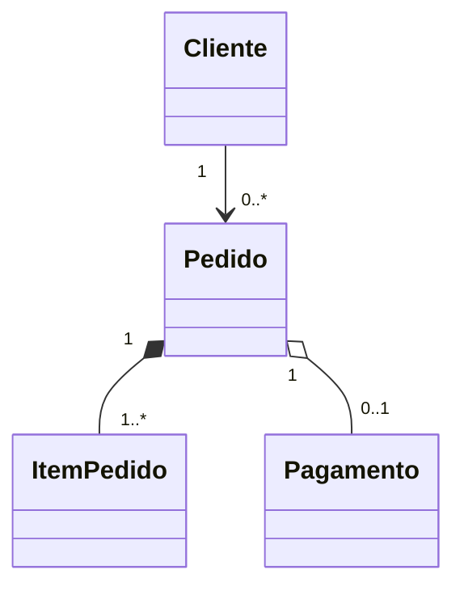

Relacionamentos citados no material:

- associação;
- agregação;
- composição;
- generalização;
- realização de interface.

### Diagrama de sequência

Representa interações ao longo do tempo.

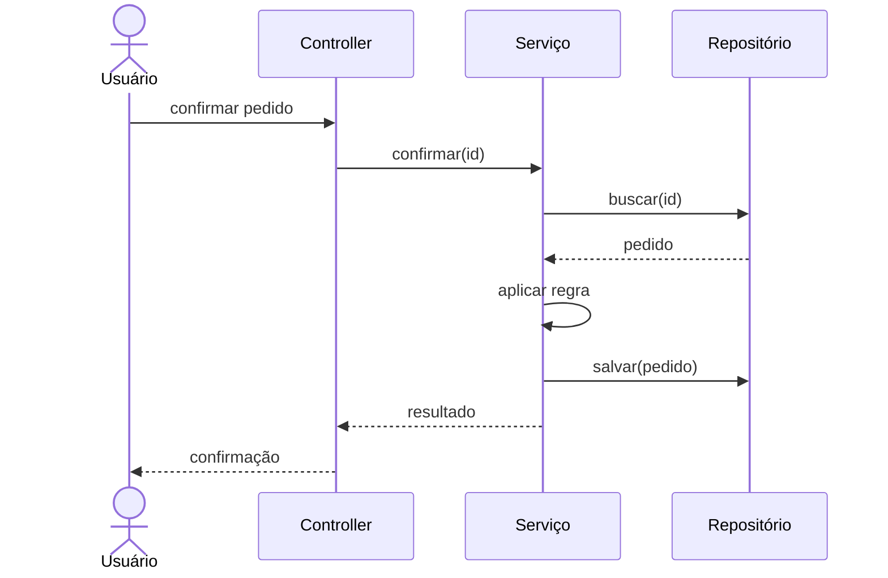

### Diagrama de atividades

Representa fluxo e decisões.

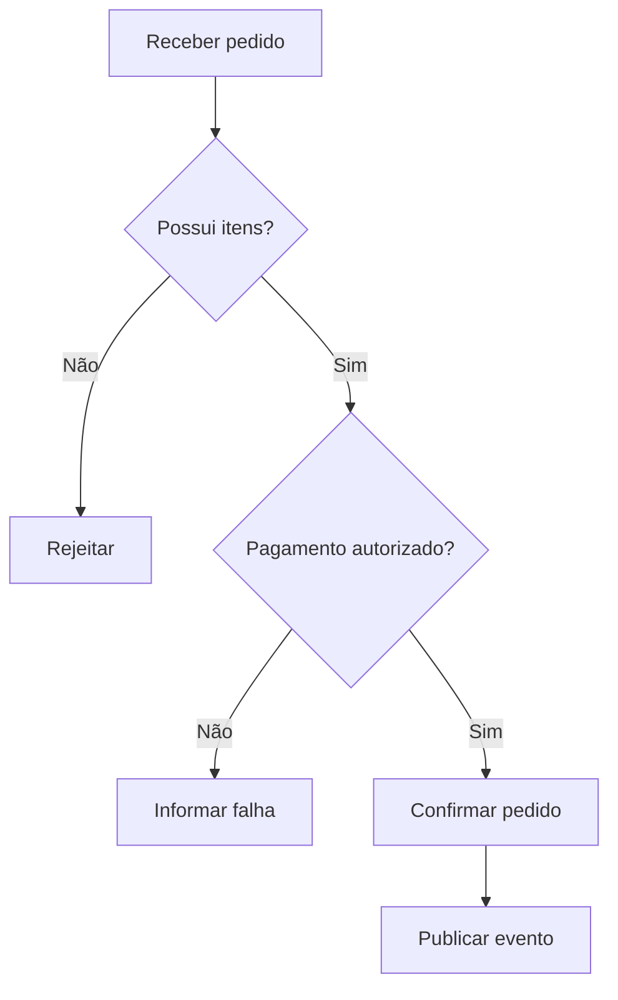

> [!TIP]
> C4 e UML não competem necessariamente. C4 organiza níveis de zoom; UML oferece notações para estruturas e comportamentos específicos.

## 6.12 arc42

O arc42 é apresentado como framework aberto e independente de processo, adequado a projetos enxutos e ágeis. Ele organiza a documentação arquitetural em 12 seções.

Uma visão resumida:

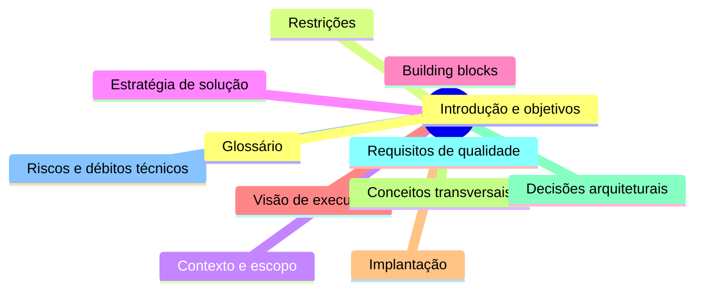

O material sugere:

- em projeto existente sem documentação, começar pelas decisões mais importantes com ADRs;
- em projeto novo, usar C4 para visões iniciais e arc42 para documentação mais completa.

## 6.13 Documentação mínima viável

Uma combinação prática e aderente ao conteúdo é:

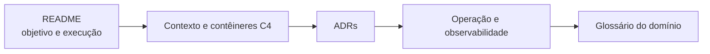

Estrutura de repositório:

```text
/docs/
├── architecture/
│   ├── context.md
│   ├── containers.md
│   ├── components/
│   └── deployment.md
├── adr/
├── domain/
│   ├── glossary.md
│   └── context-map.md
├── quality/
│   └── scenarios.md
└── operations/
    ├── monitoring.md
    └── runbook.md
```

## 6.14 Frameworks e custo de acoplamento

O módulo encerra com a discussão sobre frameworks. Eles aceleram o desenvolvimento, mas criam compromisso e acoplamento.

A pergunta proposta pelo professor é:

> No futuro, quão fácil será remover este framework se necessário?

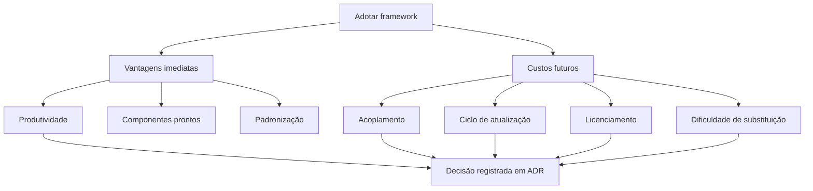

A decisão deve avaliar se os benefícios compensam o custo de dependência.

## 6.15 Checklist de documentação

- O sistema possui uma visão de contexto atualizada?
- Usuários e sistemas externos estão identificados?
- Contêineres e principais responsabilidades estão descritos?
- Decisões difíceis de mudar possuem ADR?
- Alternativas rejeitadas e consequências foram registradas?
- O glossário usa a linguagem do domínio?
- Diagramas possuem título, escopo e data de validade?
- A documentação está versionada junto das mudanças?
- Há instruções operacionais e métricas relevantes?
- Frameworks centrais e riscos de substituição estão documentados?

## 6.16 Síntese para a prova

- Código não explica sozinho o contexto e as alternativas de uma decisão.
- ADR registra decisão, justificativa, alternativas, consequências e referências.
- C4 possui quatro níveis: Contexto, Contêineres, Componentes e Código.
- Contexto mostra pessoas e sistemas; Contêineres mostra aplicações e bancos; Componentes detalha um contêiner; Código mostra classes e interfaces.
- UML pode representar estruturas e comportamentos.
- arc42 oferece uma estrutura ampla em 12 capítulos.
- Projetos legados podem começar por ADRs; projetos novos podem combinar C4 e arc42.
- Frameworks entregam produtividade, mas aumentam acoplamento e precisam ser avaliados como decisão arquitetural.

## Questões de revisão

1. Por que a escolha de banco não fica completamente explicada no código?
2. Quais campos mínimos um ADR deve conter segundo o material?
3. O que significa um ADR ser substituído?
4. Qual é a diferença entre contêiner C4 e contêiner Docker?
5. Que pergunta cada nível do C4 responde?
6. Quando usar um diagrama de sequência em vez de um diagrama de classes?
7. Como arc42 complementa C4 e ADR?
8. Por que documentação deve ser versionada?
9. Quais riscos devem ser avaliados antes de adotar um framework central?
10. O que seria uma documentação mínima viável para um projeto existente?

## Referência no material da disciplina

- Aula 2 — e-book, parte 5;
- Aula 2 — slides sobre ADR, C4 Model, UML, arc42 e dependência de frameworks.
