# 7. Princípios de Design

## Objetivos de aprendizagem

Ao concluir este capítulo, você deverá ser capaz de:

- explicar o papel dos princípios no design de software;
- aplicar os cinco princípios SOLID;
- diferenciar DRY, KISS e YAGNI;
- reconhecer violações em exemplos de código;
- relacionar nomes claros, refatoração e tratamento de erros à manutenibilidade;
- evitar interpretações simplistas ou conflitantes entre princípios.

## 7.1 O que é um princípio de design?

O material define princípios como diretrizes que orientam desenvolvimento, design e implementação. Eles devem nortear decisões mesmo quando existem pressões de prazo, orçamento ou complexidade.

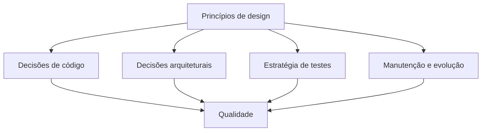

O objetivo declarado é favorecer produtos:

- de alta qualidade;
- eficientes;
- fáceis de manter;
- escaláveis.

> [!IMPORTANT]
> Princípio não é regra mecânica. Ele orienta julgamento. Dois princípios podem criar tensões que precisam ser resolvidas pelo contexto.

## 7.2 Visão geral: SOLID, DRY, KISS e YAGNI

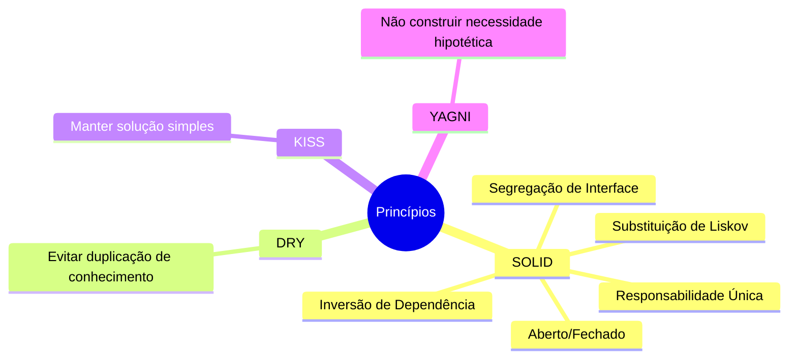

## 7.3 SOLID

SOLID reúne cinco diretrizes:

| Letra | Princípio | Pergunta principal |
|---|---|---|
| S | Single Responsibility Principle | Esta unidade possui uma única razão relevante para mudar? |
| O | Open/Closed Principle | É possível estender comportamento sem reescrever o que já funciona? |
| L | Liskov Substitution Principle | Um subtipo pode substituir seu tipo base sem quebrar expectativas? |
| I | Interface Segregation Principle | O cliente depende apenas das operações de que precisa? |
| D | Dependency Inversion Principle | Políticas de alto nível dependem de abstrações em vez de detalhes? |

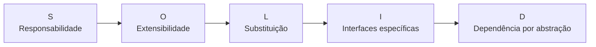

## 7.4 S — Princípio da Responsabilidade Única

O material resume: uma classe deve ter apenas uma razão para mudar, isto é, uma responsabilidade coerente.

A metáfora usa um robô que atua como chefe, jardineiro, pintor e motorista. Separar as funções facilita manutenção e diagnóstico.

### Violação

```java
public final class Employee {
    public BigDecimal calcularPagamento() {
        // regra salarial
        return BigDecimal.ZERO;
    }

    public void salvar() {
        // persistência
    }

    public byte[] gerarRelatorio() {
        // formatação e relatório
        return new byte[0];
    }
}
```

A classe pode mudar por três motivos diferentes:

- alteração na regra de pagamento;
- troca de persistência;
- mudança no formato do relatório.

### Separação didática

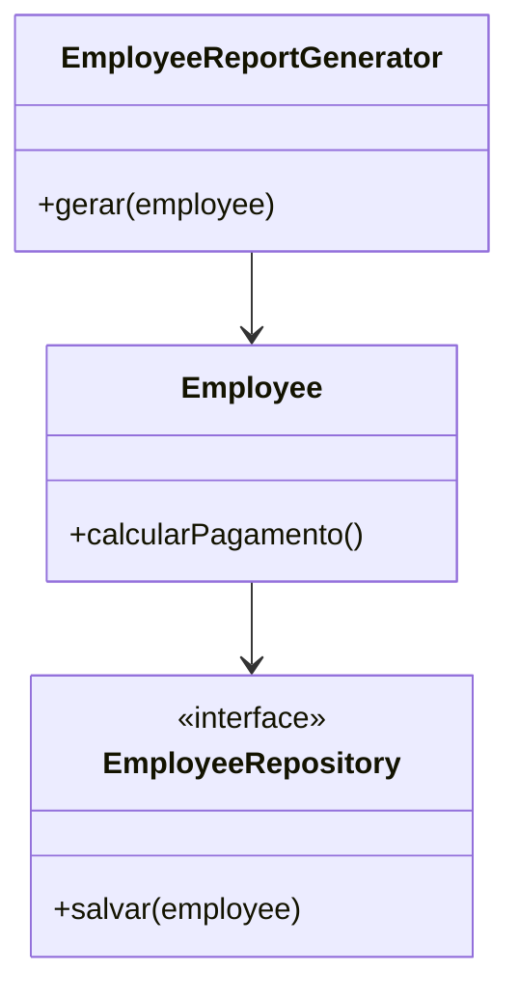

```java
public final class Employee {
    public BigDecimal calcularPagamento() {
        return BigDecimal.ZERO;
    }
}

public interface EmployeeRepository {
    void salvar(Employee employee);
}

public final class EmployeeReportGenerator {
    public byte[] gerar(Employee employee) {
        return new byte[0];
    }
}
```

> [!WARNING]
> Responsabilidade única não significa “uma classe com um único método”. Significa coesão em torno de um motivo de mudança.

## 7.5 O — Princípio Aberto/Fechado

Módulos devem estar abertos para extensão e fechados para modificação. O material usa um robô que inicialmente corta e depois precisa pintar: a nova capacidade deveria ser acrescentada sem alterar o código estável.

### Violação com condicionais crescentes

```java
public final class ProcessOrder {
    public void processar(String tipo) {
        if ("ONLINE".equals(tipo)) {
            // processamento online
        } else if ("VAREJO".equals(tipo)) {
            // processamento de varejo
        }
    }
}
```

Cada novo tipo exige alterar o método.

### Extensão por polimorfismo

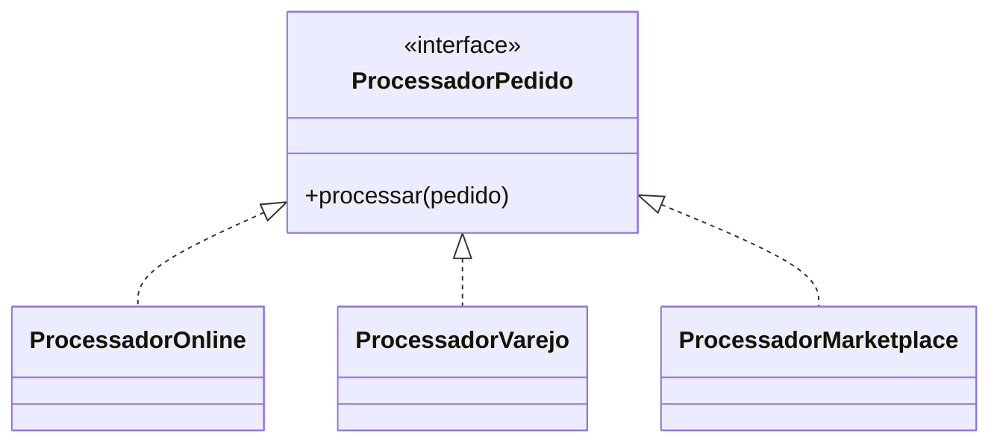

```java
public interface ProcessadorPedido {
    void processar(Pedido pedido);
}

public final class ProcessadorOnline implements ProcessadorPedido {
    @Override
    public void processar(Pedido pedido) {
        // fluxo online
    }
}
```

Adicionar `ProcessadorMarketplace` não exige modificar as implementações existentes.

> [!TIP]
> Fechado para modificação não significa que código nunca muda. Significa que pontos de variação conhecidos possuem mecanismos de extensão que reduzem alterações repetidas em código estável.

## 7.6 L — Princípio da Substituição de Liskov

Subtipos devem poder substituir seus tipos base sem alterar o comportamento correto esperado.

### Exemplo Bird, Eagle e Ostrich

O exercício do material apresenta uma classe `Bird` com método `fly()`. `Eagle` pode implementá-lo, mas `Ostrich` não voa. Fazer todo pássaro herdar a capacidade de voar cria uma abstração incorreta.

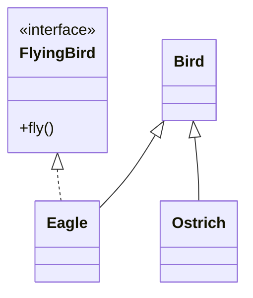

A capacidade de voar deve ser separada da identidade geral de pássaro.

### Clássico quadrado e retângulo

Se `Square` herda de `Rectangle`, mas sobrescreve largura e altura para mantê-las iguais, um cliente que espera alterar dimensões independentemente pode ser surpreendido.

```java
void redimensionarRetangulo(Rectangle r) {
    r.setWidth(5);
    r.setHeight(4);
    assert r.area() == 20; // pode falhar para Square
}
```

O material sugere uma abstração `Shape` da qual quadrado e retângulo herdam separadamente.

### Contratos comportamentais

> [!NOTE]
> **Complemento didático:** os itens a seguir detalham a noção de contrato comportamental, além da formulação resumida apresentada nos slides.

Uma substituição válida preserva:

- pré-condições esperadas;
- pós-condições;
- invariantes;
- significado das operações;
- tipos de resultado e efeitos observáveis relevantes.

> [!IMPORTANT]
> LSP não exige resultado numericamente idêntico em toda situação. Exige preservação do contrato e das expectativas do cliente.

## 7.7 I — Princípio da Segregação de Interface

Interfaces devem ser pequenas e específicas. Um cliente não deve ser obrigado a depender de métodos que não utiliza.

### Violação do exercício Printer

```java
public interface Printer {
    void print(Document document);
    void scan(Document document);
    void fax(Document document);
}
```

Uma impressora simples seria forçada a implementar `scan` e `fax`.

### Interfaces segregadas

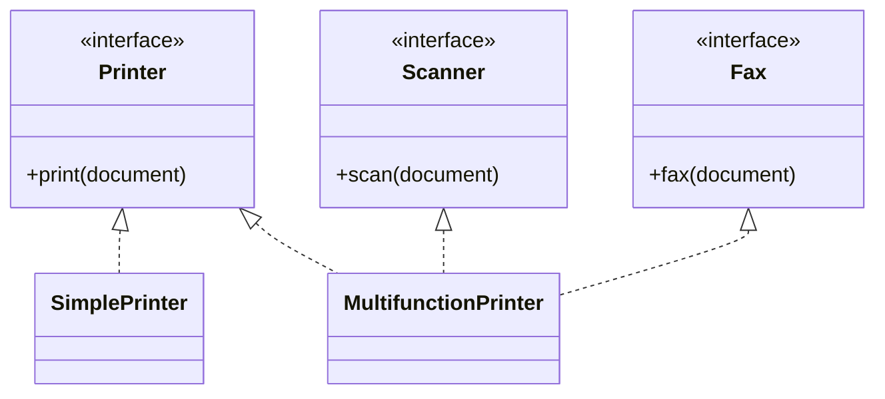

```java
public interface Printer {
    void print(Document document);
}

public interface Scanner {
    Document scan();
}
```

> [!WARNING]
> Interfaces pequenas não devem virar fragmentação arbitrária. A divisão deve refletir capacidades e clientes reais.

## 7.8 D — Princípio da Inversão de Dependência

Módulos de alto nível não devem depender de módulos de baixo nível. Ambos devem depender de abstrações.

O material usa o robô que corta pizza com diferentes ferramentas e o exemplo botão–lâmpada.

### Violação do exercício DatabaseReportGenerator

```java
public final class DatabaseReportGenerator {
    private final MySQLDatabase database = new MySQLDatabase();

    public Report gerar() {
        return new Report(database.query("..."));
    }
}
```

A política de relatório está presa ao MySQL.

### Dependência por abstração

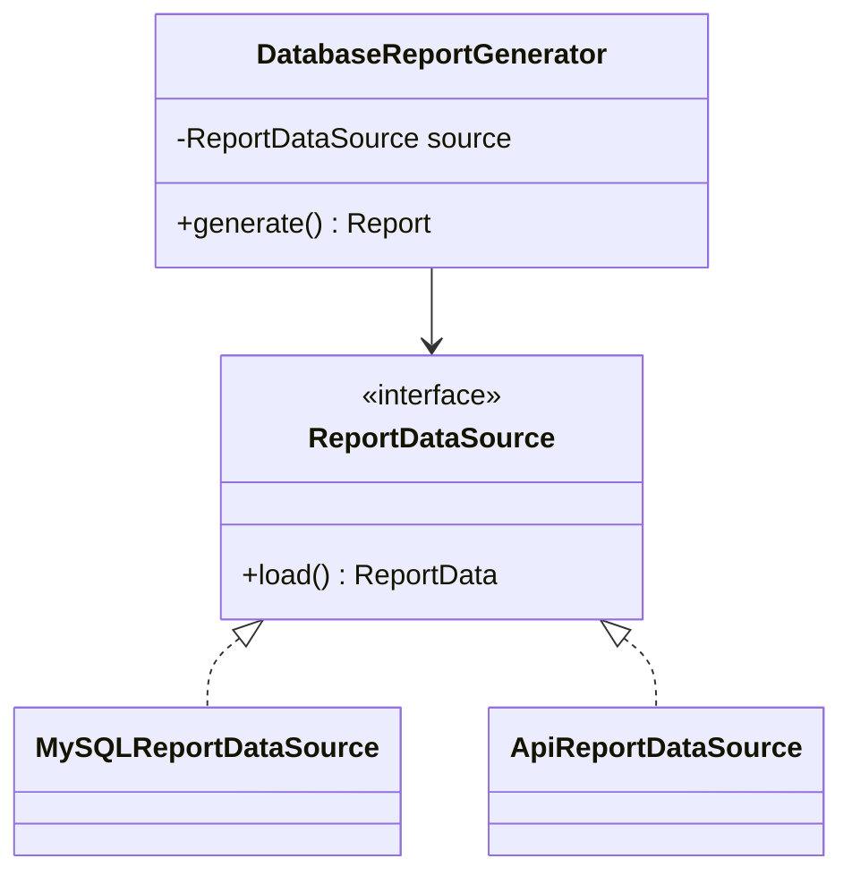

```java
public final class DatabaseReportGenerator {
    private final ReportDataSource source;

    public DatabaseReportGenerator(ReportDataSource source) {
        this.source = Objects.requireNonNull(source);
    }

    public Report gerar() {
        return new Report(source.load());
    }
}
```

A implementação é injetada. A política depende do contrato.

## 7.9 Relação entre os princípios SOLID

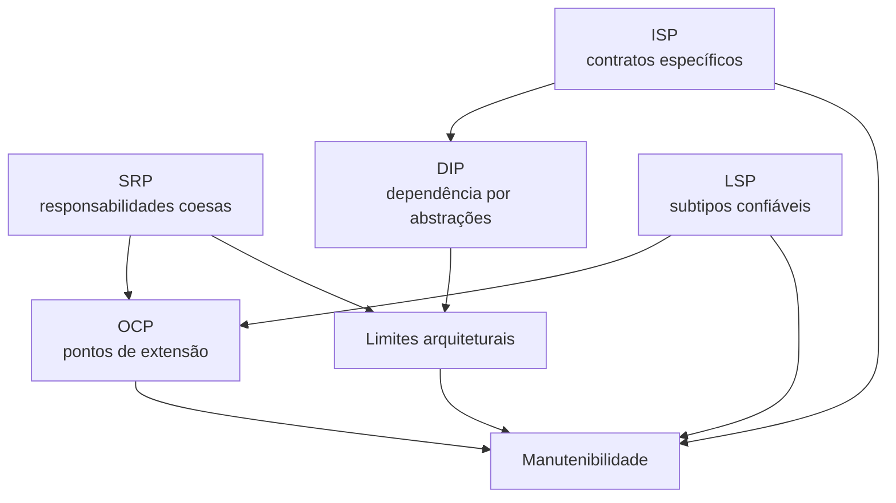

Os princípios se reforçam:

- SRP ajuda a criar componentes coesos;
- OCP depende de abstrações estáveis;
- LSP torna extensões polimórficas confiáveis;
- ISP evita contratos inflados;
- DIP orienta dependências para abstrações.

## 7.10 DRY — Don’t Repeat Yourself

O material atribui o princípio a Andrew Hunt e Dave Thomas em *The Pragmatic Programmer*. Seu objetivo é reduzir duplicação de informações ou métodos.

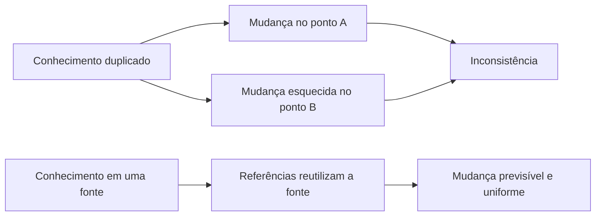

### Duplicação de código

```java
BigDecimal totalComDescontoCliente(BigDecimal total) {
    return total.subtract(total.multiply(new BigDecimal("0.10")));
}

BigDecimal totalComDescontoPedido(BigDecimal total) {
    return total.subtract(total.multiply(new BigDecimal("0.10")));
}
```

A mesma regra pode ser centralizada:

```java
BigDecimal aplicarDesconto(BigDecimal total, BigDecimal percentual) {
    return total.subtract(total.multiply(percentual));
}
```

### Duplicação de conhecimento

DRY vai além de copiar linhas. A mesma regra pode estar duplicada em:

- front-end e back-end;
- serviço e banco;
- código e configuração;
- documentação e constantes;
- vários microsserviços.

> [!WARNING]
> Código visualmente parecido pode representar conceitos diferentes. Unificar prematuramente pode criar acoplamento semântico. DRY evita duplicação do mesmo conhecimento, não toda semelhança textual.

## 7.11 KISS — Keep It Simple, Stupid

O material relaciona KISS a Kelly Johnson e à exigência de que uma aeronave pudesse ser reparada com ferramentas limitadas em condições de combate.

A solução deve privilegiar clareza e efetividade em vez de complexidade desnecessária.

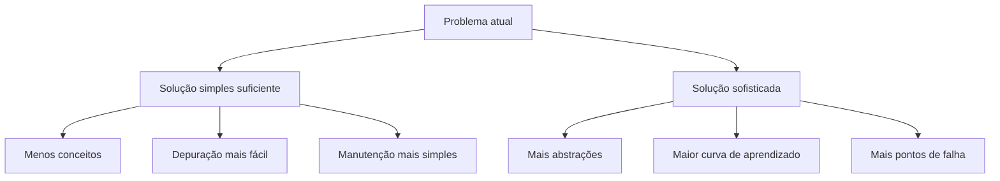

KISS não proíbe herança, polimorfismo ou padrões. Pede que sejam usados quando resolvem um problema real.

## 7.12 YAGNI — You Aren’t Gonna Need It

O material traduz didaticamente como “Talvez você não precise disso” e relaciona o princípio a *Extreme Programming Installed*.

YAGNI combate *overengineering*: construir agora mecanismos baseados apenas numa hipótese de necessidade futura.

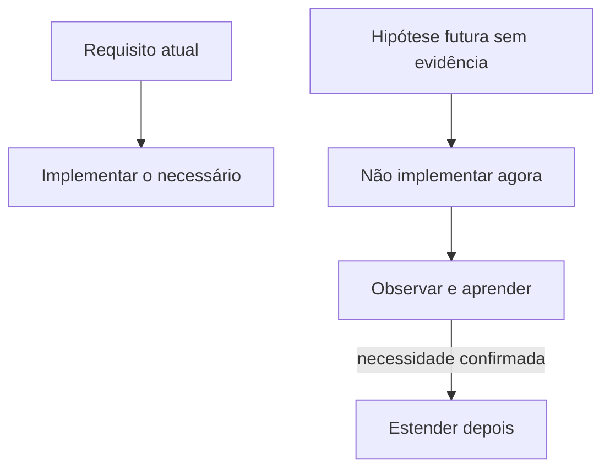

### Exemplo

Para um sistema que hoje envia e-mail, criar desde o primeiro dia uma plataforma genérica para 20 canais, roteamento global e regras dinâmicas pode ser desnecessário se não há requisito ou evidência.

YAGNI recomenda implementar a necessidade atual de forma que possa evoluir, sem antecipar toda possibilidade.

> [!IMPORTANT]
> YAGNI não significa ignorar segurança, disponibilidade ou requisitos não funcionais. Esses requisitos já existem no presente, mesmo que o incidente ainda não tenha ocorrido.

## 7.13 KISS, YAGNI e OCP: tensão aparente

OCP incentiva extensão; YAGNI evita extensibilidade hipotética; KISS evita complexidade.

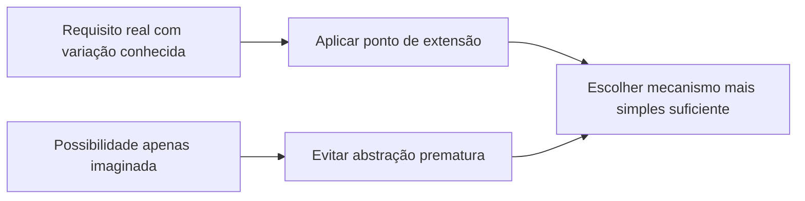

A conciliação é:

- criar extensibilidade onde existe variação real e recorrente;
- não generalizar sem evidência;
- preferir a menor abstração que preserve as necessidades conhecidas.

## 7.14 Nomes claros

O material reforça nomes significativos para variáveis, funções e classes e desencoraja abreviações ambíguas.

```java
// Ambíguo
var x = repo.get(c);

// Expressivo
var cliente = clienteRepository.buscarPorId(clienteId);
```

Bons nomes devem revelar:

- intenção;
- unidade;
- papel;
- regra do domínio;
- diferença entre conceitos próximos.

> [!TIP]
> Quando é difícil nomear uma classe, pode haver responsabilidades demais ou um conceito de domínio ainda não compreendido.

## 7.15 Regra do Escoteiro e refatoração

A “Regra do Escoteiro” é apresentada como deixar o código mais limpo do que foi encontrado.

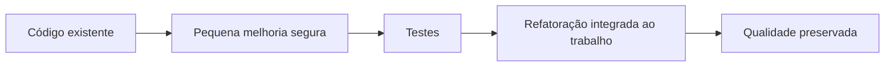

Refatoração altera a estrutura interna sem alterar o comportamento observável esperado.

Pequenas ações:

- renomear elemento ambíguo;
- extrair método;
- remover duplicação;
- simplificar condição;
- separar responsabilidade;
- melhorar tratamento de erro;
- adicionar teste de caracterização antes da mudança.

Sem refatoração contínua, o código acumula débito técnico e pode ficar mais caro de manter do que de substituir.

## 7.16 Comentários

O professor recomenda comentários quando necessários para fluxos complexos, não para explicar código confuso.

```java
// Ruim: repete o código
contador++; // incrementa contador

// Útil: explica uma restrição não óbvia
// O provedor rejeita reenvios antes de 30 segundos; preservar a janela evita bloqueio.
agendarNovaTentativa(Duration.ofSeconds(30));
```

Comentários não substituem nomes, estrutura e testes.

## 7.17 Tratamento de erros

O material destaca que ignorar exceções produz falhas silenciosas e reduz resiliência.

```java
try {
    pagamentoGateway.autorizar(pagamento);
} catch (PagamentoIndisponivelException ex) {
    log.warn("Gateway indisponível para pagamento {}", pagamento.id(), ex);
    throw new ProcessamentoTemporariamenteIndisponivelException(ex);
}
```

Uma estratégia adequada deve:

- não ocultar erro;
- manter contexto suficiente;
- evitar exposição indevida de dados;
- permitir recuperação quando aplicável;
- produzir observabilidade;
- traduzir falhas externas nas bordas.

## 7.18 Exercícios do material e diagnóstico

| Cenário | Violação principal | Direção da correção |
|---|---|---|
| `Bird` exige `fly()` e `Ostrich` herda | LSP | Separar capacidade de voo da abstração geral |
| `DatabaseReportGenerator` instancia `MySQLDatabase` | DIP | Depender de interface e injetar implementação |
| `Printer` obriga imprimir, escanear e enviar fax | ISP | Criar interfaces por capacidade |
| `ProcessOrder` cresce com `if` por tipo | OCP | Polimorfismo ou estratégia de processamento |
| `Square` altera semântica de `Rectangle` | LSP | Modelar ambos por abstração compatível |
| `Employee` calcula, salva e relata | SRP | Separar motivos de mudança |

## 7.19 Checklist de design

- A classe possui um propósito claro?
- Mudanças diferentes atingem sempre a mesma classe?
- Novas variantes exigem editar grandes condicionais?
- Subtipos preservam o contrato?
- Interfaces obrigam clientes a implementar operações inúteis?
- Regras de alto nível conhecem tecnologias concretas?
- Existe duplicação de conhecimento?
- A solução possui abstrações sem requisito atual?
- Os nomes revelam a linguagem do domínio?
- Erros são observados e tratados?

## 7.20 Síntese para a prova

- SRP: uma razão coerente para mudar.
- OCP: estender sem modificar repetidamente código estável.
- LSP: subtipo preserva expectativas do tipo base.
- ISP: interfaces pequenas e específicas aos clientes.
- DIP: alto e baixo nível dependem de abstrações.
- DRY: uma fonte de verdade para o mesmo conhecimento.
- KISS: solução simples e efetiva.
- YAGNI: não construir necessidade hipotética.
- Nomes e refatoração mantêm código compreensível.
- Comentário explica contexto, não compensa design ruim.
- Tratamento de erros é parte da resiliência.

## Questões de revisão

1. Qual é a diferença entre responsabilidade e quantidade de métodos?
2. Como OCP reduz condicionais que crescem continuamente?
3. Por que `Ostrich` não deve implementar um contrato geral de voo?
4. Qual problema existe numa interface de impressora multifuncional imposta a todos os modelos?
5. Como DIP se relaciona com injeção de dependência?
6. DRY se aplica apenas a código copiado?
7. Como KISS e YAGNI evitam overengineering?
8. Como conciliar OCP com YAGNI?
9. Por que comentários excessivos podem indicar necessidade de refatoração?
10. Qual princípio é violado por uma classe que calcula pagamento, salva no banco e gera relatório?

## Referência no material da disciplina

- Aula 3 — e-book, partes 1 e 2;
- Aula 3 — slides sobre SOLID, DRY, KISS, YAGNI, Clean Code e exercícios.
