# 8. Design Patterns

## Objetivos de aprendizagem

Ao concluir este capítulo, você deverá ser capaz de:

- explicar o que é um padrão de projeto;
- diferenciar padrões criacionais, estruturais e comportamentais;
- reconhecer Factory Method, Abstract Factory, Singleton, Adapter, Proxy, Observer, Mediator e Strategy;
- identificar o problema que cada padrão busca resolver;
- evitar aplicação de padrões sem necessidade.

## 8.1 Conceito

O material apresenta os Design Patterns como soluções reutilizáveis, descritas em alto nível, para problemas recorrentes no desenvolvimento orientado a objetos.

Os padrões não são trechos prontos para copiar. Eles oferecem:

- intenção;
- estrutura de participantes;
- forma de colaboração;
- consequências;
- contexto de aplicação.

A metáfora da aula compara padrões a andaimes: estruturas modulares, adaptáveis e escolhidas de acordo com a obra.

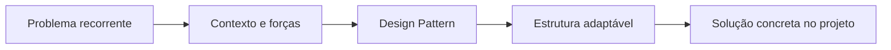

> [!WARNING]
> O padrão deve ser reconhecido a partir do problema. Começar pela vontade de “usar um pattern” costuma produzir complexidade artificial.

## 8.2 Gang of Four — GoF

A disciplina cita Erich Gamma, Richard Helm, Ralph Johnson e John Vlissides, conhecidos como Gang of Four. O livro *Design Patterns: Elements of Reusable Object-Oriented Software* cataloga 23 padrões em três grupos.

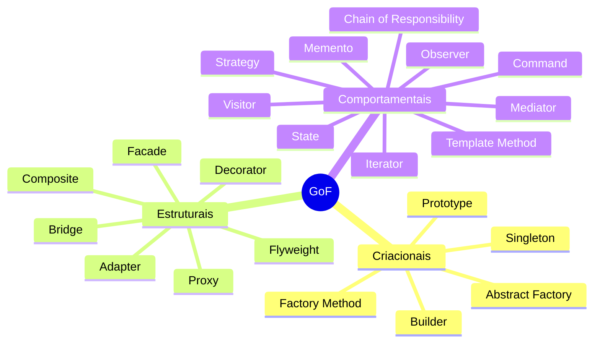

O curso aprofunda apenas parte desse catálogo.

## 8.3 Categorias

### Criacionais

Tratam da criação de objetos e da separação entre cliente e classes concretas.

### Estruturais

Organizam composição de classes e objetos para formar estruturas maiores.

### Comportamentais

Organizam algoritmos, comunicação e distribuição de responsabilidades.

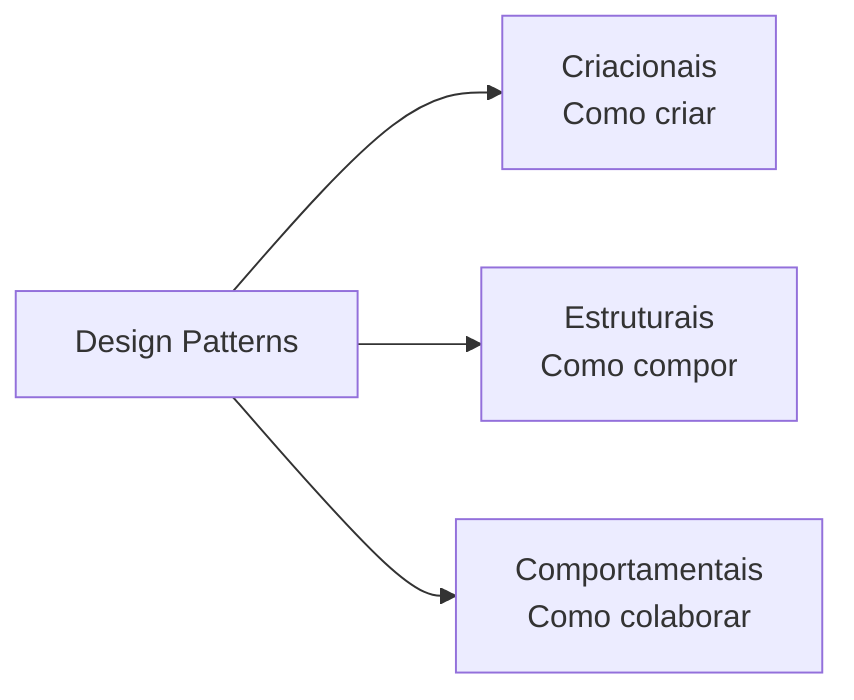

## 8.4 Factory Method

### Intenção

Definir uma interface para criação de objetos e permitir que subclasses ou implementações decidam qual produto concreto instanciar.

O exemplo da aula usa logística: inicialmente transporte terrestre; depois transporte aéreo e marítimo.

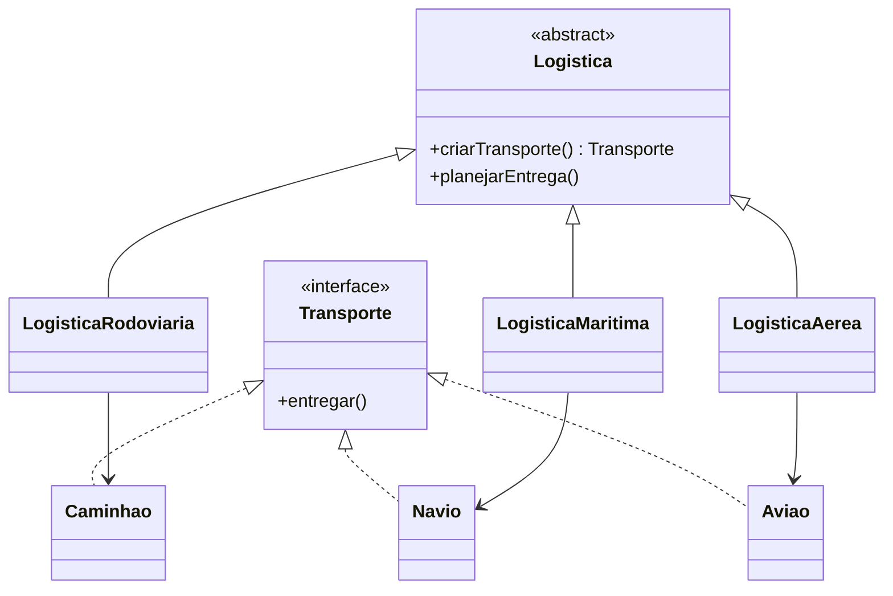

```java
public interface Transporte {
    void entregar();
}

public abstract class Logistica {
    protected abstract Transporte criarTransporte();

    public void planejarEntrega() {
        Transporte transporte = criarTransporte();
        transporte.entregar();
    }
}

public final class LogisticaRodoviaria extends Logistica {
    @Override
    protected Transporte criarTransporte() {
        return new Caminhao();
    }
}
```

### Quando considerar

- o código cliente não conhece antecipadamente a classe concreta;
- a criação varia entre subclasses;
- deseja-se isolar o cliente do `new` concreto.

### Trade-offs

- adiciona hierarquia e classes;
- pode ser excessivo quando uma construção direta é estável e simples.

## 8.5 Abstract Factory

### Intenção

Criar famílias de objetos relacionados sem expor classes concretas.

O exemplo da aula usa móveis de um mesmo estilo: sofá, cadeira e mesa precisam manter coerência visual.

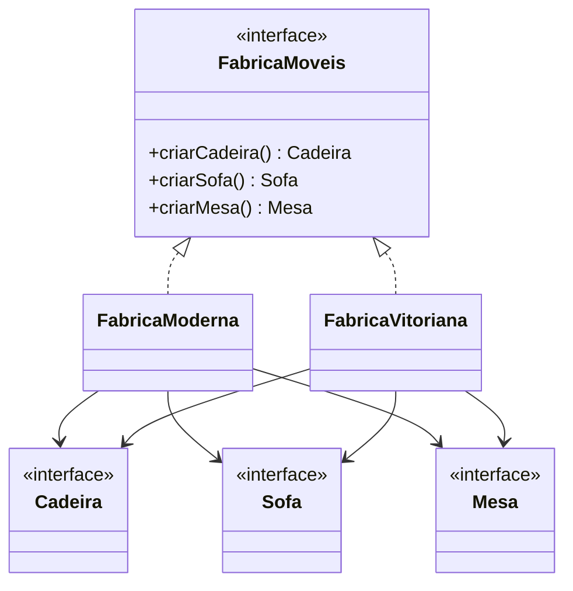

```java
public interface FabricaMoveis {
    Cadeira criarCadeira();
    Sofa criarSofa();
    Mesa criarMesa();
}
```

### Factory Method x Abstract Factory

| Critério | Factory Method | Abstract Factory |
|---|---|---|
| Foco | Criar um produto por método de fábrica | Criar família de produtos relacionados |
| Mecanismo típico | Herança ou método sobrescrito | Composição por objeto fábrica |
| Exemplo da aula | Transporte terrestre, marítimo ou aéreo | Conjunto de móveis de um estilo |

## 8.6 Singleton

### Intenção

Garantir uma única instância de uma classe e oferecer acesso controlado a ela.

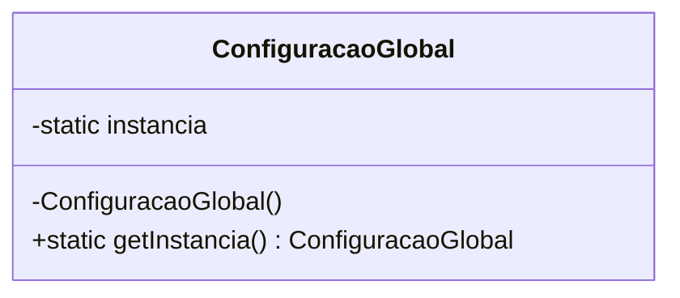

```java
public final class ConfiguracaoGlobal {
    private static final ConfiguracaoGlobal INSTANCIA = new ConfiguracaoGlobal();

    private ConfiguracaoGlobal() {}

    public static ConfiguracaoGlobal getInstancia() {
        return INSTANCIA;
    }
}
```

### Uso citado

O material menciona controle de variáveis globais e criação da instância na primeira solicitação.

### Cuidados

- introduz estado global;
- dificulta isolamento de testes;
- esconde dependências;
- exige atenção a concorrência em inicialização preguiçosa.

> [!WARNING]
> “Só existe um no negócio” não implica automaticamente Singleton no código. Uma instância pode ser gerenciada pelo contêiner de dependências sem usar acesso estático global.

## 8.7 Adapter

### Intenção

Permitir que interfaces incompatíveis trabalhem juntas.

O exemplo da aula converte XML fornecido pelo cliente em JSON esperado pelo serviço.

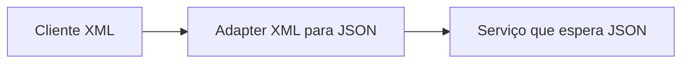

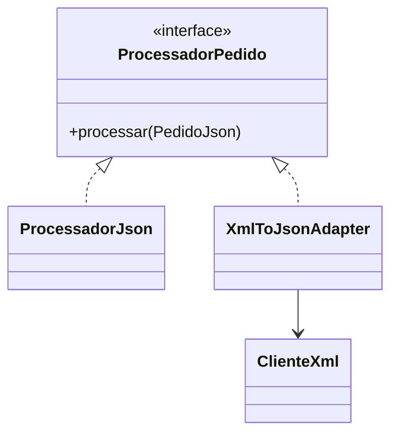

O material cita:

- adaptador de objeto: usa composição e é mais comum;
- adaptador de classe: usa herança múltipla e é menos comum por limitações de linguagens.

### Aplicação arquitetural

Adaptadores são fundamentais em Clean Architecture para converter formatos externos em modelos internos.

## 8.8 Proxy

### Intenção

Fornecer um substituto para outro objeto, controlando seu acesso e executando ações antes ou depois da chamada.

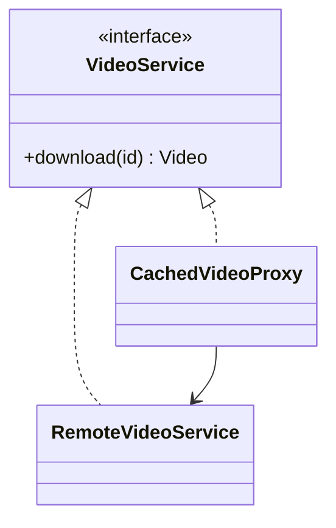

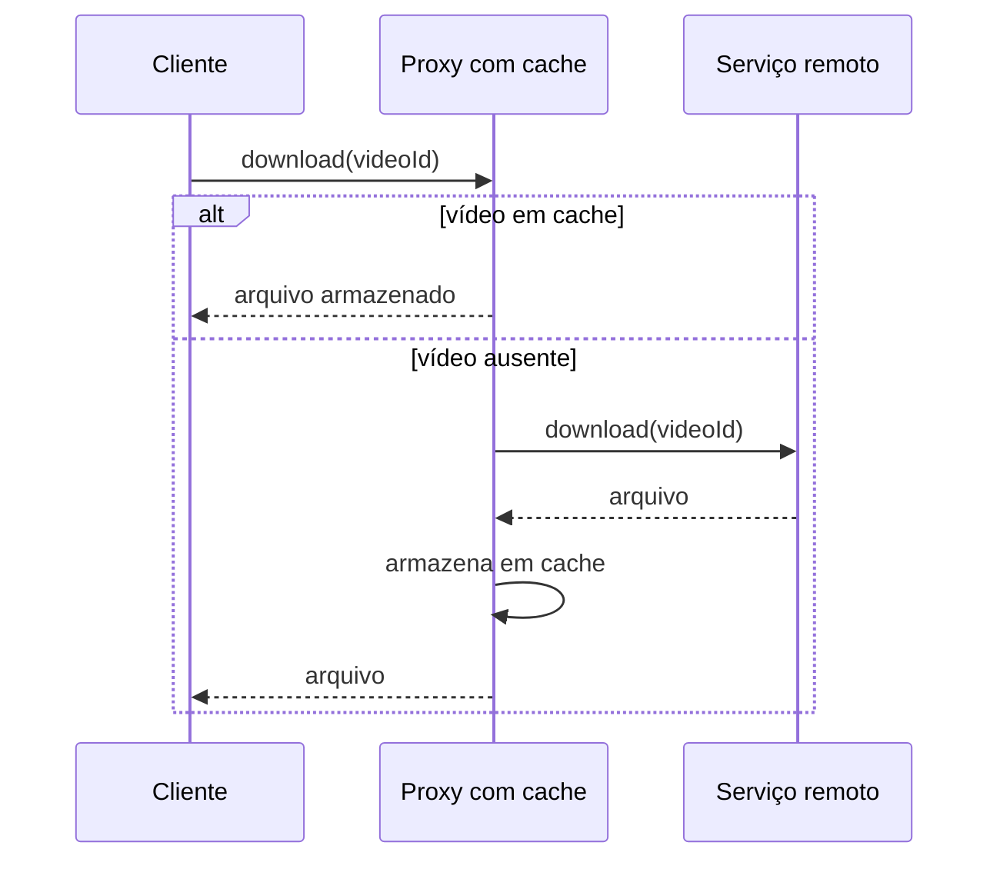

Usos citados:

- inicialização preguiçosa;
- controle de acesso;
- acesso a serviço remoto;
- registro de chamadas;
- cache.

### Proxy x Adapter

- Adapter altera a interface percebida.
- Proxy preserva a interface e controla o acesso ao objeto representado.

## 8.9 Observer

### Intenção

Definir uma relação de assinatura em que interessados são notificados quando o estado do sujeito muda.

A metáfora é o cliente interessado em um iPhone indisponível. Em vez de visitar a loja repetidamente, ele se inscreve e recebe notificação quando o produto chega.

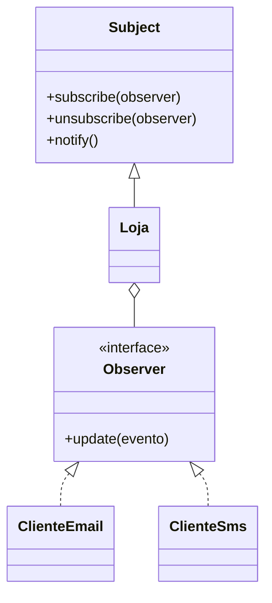

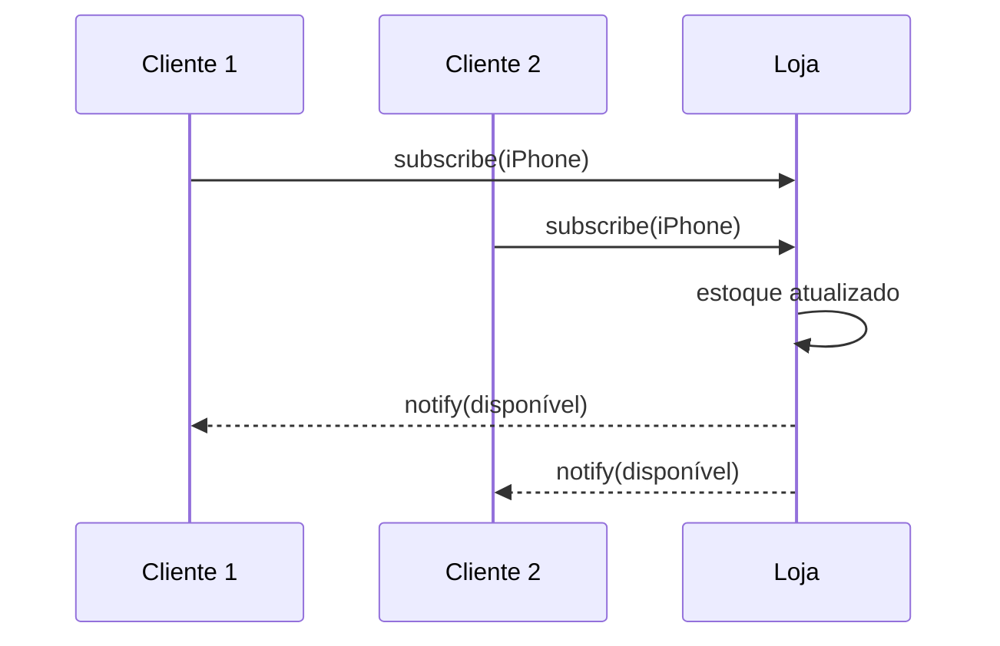

O padrão substitui consulta repetitiva (*polling*) por notificação.

### Cuidados

- ordem de notificação;
- assinaturas não removidas;
- efeitos em cascata;
- tratamento de falha de observadores;
- consistência em sistemas distribuídos.

## 8.10 Mediator

### Intenção

Centralizar a comunicação entre objetos para que eles não dependam diretamente uns dos outros.

O exemplo da aula é a torre de controle: aviões não coordenam tráfego diretamente; comunicam-se com o controlador.

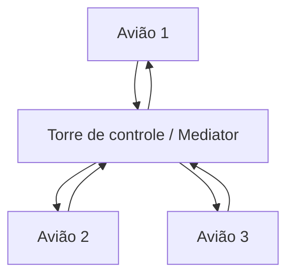

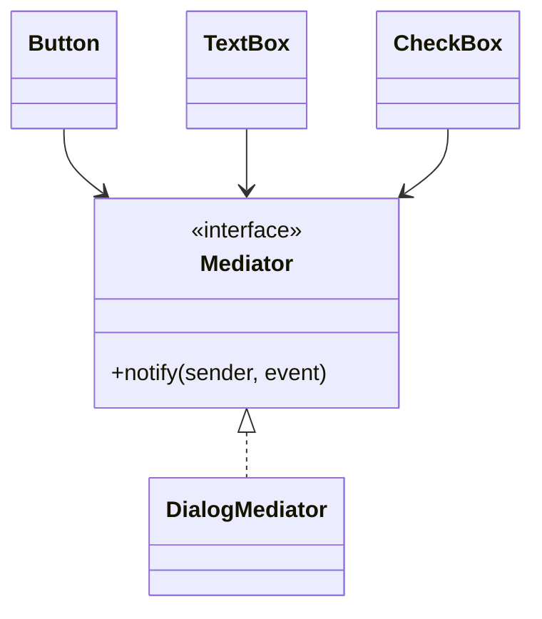

### Benefícios

- reduz dependências muitos-para-muitos;
- centraliza coordenação;
- facilita reutilização de componentes.

### Risco

O mediator pode se tornar um componente excessivamente grande e centralizador se acumular todas as regras.

## 8.11 Strategy

### Intenção

Encapsular algoritmos intercambiáveis por uma interface comum e permitir troca durante a execução.

O exemplo da aula calcula rotas para carro, ônibus e bicicleta.

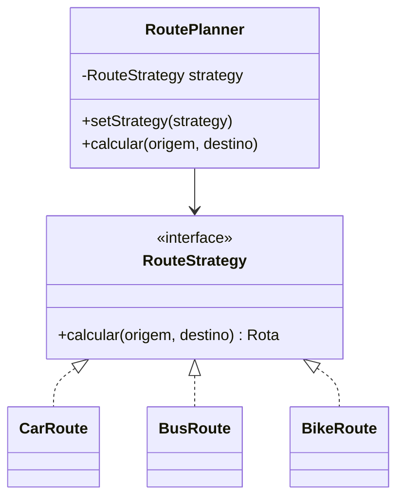

```java
public interface RouteStrategy {
    Rota calcular(Local origem, Local destino);
}

public final class RoutePlanner {
    private RouteStrategy strategy;

    public RoutePlanner(RouteStrategy strategy) {
        this.strategy = Objects.requireNonNull(strategy);
    }

    public void alterarEstrategia(RouteStrategy strategy) {
        this.strategy = Objects.requireNonNull(strategy);
    }

    public Rota calcular(Local origem, Local destino) {
        return strategy.calcular(origem, destino);
    }
}
```

### Quando considerar

- algoritmos variam por contexto;
- condicionais escolhem comportamentos;
- classes diferem apenas na forma de executar uma operação;
- deseja-se testar cada algoritmo isoladamente.

### Strategy x Factory

Strategy seleciona comportamento. Factory seleciona ou cria objetos. Uma fábrica pode criar estratégias, mas os padrões resolvem problemas diferentes.

## 8.12 Relação entre os padrões estudados

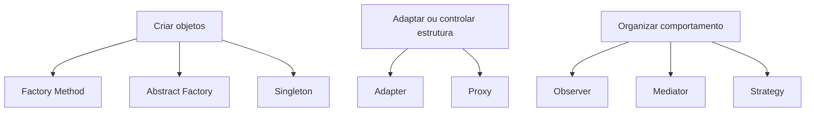

## 8.13 Exercícios apresentados no material

### Linha automotiva com modelos e variações

O material pede a identificação do padrão, mas o e-book não informa a resposta. Uma **inferência didática** é que uma fábrica pode representar criação de modelos, e uma família coerente de componentes pode sugerir Abstract Factory. Caso o foco seja construção passo a passo de muitas configurações, Builder — citado no catálogo, mas não aprofundado na aula — também poderia ser avaliado. A resposta depende do enunciado completo e da intenção considerada pelo professor.

### Notificação de preços de ações

O próprio e-book identifica **Observer**, pois investidores assinam ações e recebem atualizações.

### Métodos de pagamento em e-commerce

O material apresenta o problema, mas não fornece resposta explícita. Uma **inferência didática** é **Strategy**, pois cada método executa um algoritmo diferente sob um processo comum de pagamento.

### Download repetido de vídeo sem cache

O slide adapta um exemplo de **Proxy**, que pode armazenar o primeiro download e reutilizá-lo.

> [!IMPORTANT]
> As inferências acima estão identificadas porque o material não apresenta gabarito textual para todos os exercícios.

## 8.14 Como escolher um pattern

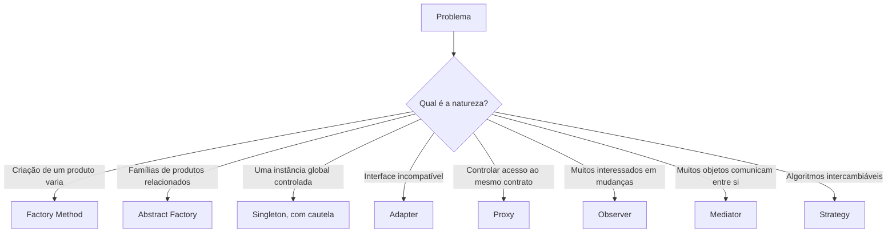

Perguntas de validação:

- O problema realmente se repete?
- A solução direta já é suficiente?
- O padrão reduz ou aumenta acoplamento?
- A equipe reconhece o padrão e suas consequências?
- Há testes que permitam refatorar para o padrão quando necessário?
- YAGNI e KISS recomendam esperar?

## 8.15 Síntese para a prova

- Design Pattern é solução generalizada, não código pronto.
- Criacionais tratam de criação; estruturais de composição; comportamentais de colaboração e algoritmos.
- Factory Method delega criação de um produto.
- Abstract Factory cria famílias de produtos.
- Singleton controla uma única instância, mas pode gerar estado global.
- Adapter converte uma interface em outra.
- Proxy representa o mesmo contrato e controla acesso.
- Observer notifica assinantes quando há mudança.
- Mediator centraliza comunicação entre objetos.
- Strategy encapsula algoritmos intercambiáveis.
- O padrão deve ser escolhido pelo problema e pelos trade-offs.

## Questões de revisão

1. Por que um design pattern não é um trecho de código pronto?
2. Qual a diferença entre Factory Method e Abstract Factory?
3. Quais riscos o Singleton introduz?
4. Como diferenciar Adapter e Proxy?
5. Que problema o Observer resolve em comparação com polling?
6. Por que Mediator reduz acoplamento muitos-para-muitos?
7. Quando Strategy é melhor do que um grande bloco `if/else`?
8. Em qual categoria GoF estão os padrões estudados?
9. Por que aplicar um padrão cedo demais pode violar KISS e YAGNI?
10. Qual padrão combina com notificação de preço em tempo real?

## Referência no material da disciplina

- Aula 3 — e-book, partes 3 e 4;
- Aula 3 — slides sobre catálogo GoF, Factory Method, Abstract Factory, Singleton, Adapter, Proxy, Observer, Mediator, Strategy e exercícios.
