# 9. Testes e Papel do Arquiteto

## Objetivos de aprendizagem

Ao concluir este capítulo, você deverá ser capaz de:

- explicar como testes sustentam qualidade e evolução;
- diferenciar testes manuais e automatizados;
- distinguir caixa branca, preta e cinza;
- separar testes funcionais e não funcionais;
- interpretar a pirâmide de testes;
- compreender TDD, BDD e ATDD no enquadramento do material;
- identificar atribuições técnicas e de liderança do arquiteto de software.

## 9.1 Por que testar?

O material apresenta testes como processo para melhorar a qualidade e a confiabilidade. Planejamento e modelagem arquitetural não garantem, sozinhos, que a implementação funciona.

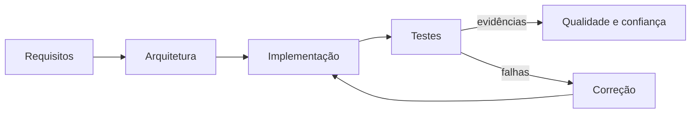

Testes ajudam a:

- verificar comportamento esperado;
- detectar regressões;
- validar integração entre camadas;
- observar requisitos de desempenho e segurança;
- permitir mudanças com menor risco.

> [!IMPORTANT]
> **Complemento didático:** a ausência de falhas nos testes não prova ausência de defeitos. Testes fornecem evidências dentro dos cenários cobertos.

## 9.2 Testes manuais e automatizados

### Testes manuais

São realizados por pessoas que interagem com o sistema e avaliam resultados.

Vantagens:

- adaptação a situações inesperadas;
- percepção visual e experiência de uso;
- exploração de fluxos não previstos;
- julgamento humano.

Limitações:

- repetição lenta;
- variabilidade de execução;
- custo elevado para regressão frequente;
- cobertura limitada pelo tempo.

### Testes automatizados

Utilizam scripts ou código para executar verificações repetíveis.

Vantagens:

- repetição rápida;
- execução frequente e fora do expediente;
- integração com CI/CD;
- feedback consistente;
- boa cobertura de regressão.

Limitações:

- custo de criação e manutenção;
- risco de testes frágeis;
- não substituem investigação humana;
- só verificam o que foi modelado.

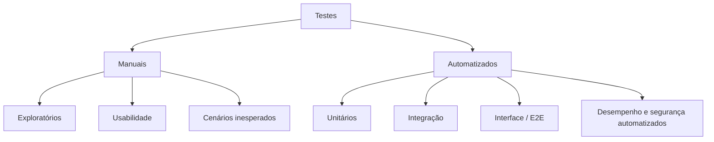

O melhor resultado combina automação para repetição e investigação humana para descoberta.

## 9.3 Caixa branca, preta e cinza

### Caixa branca

O testador conhece a implementação e usa esse conhecimento para criar cenários detalhados.

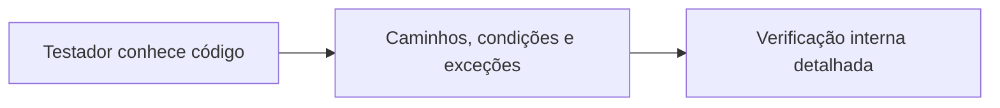

### Caixa preta

O testador observa entradas e saídas sem depender da implementação.

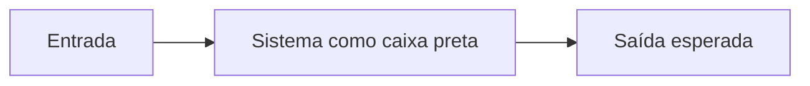

### Caixa cinza

Combina conhecimento parcial da estrutura com verificação orientada a requisitos e comportamento.

| Abordagem | Conhecimento interno | Foco |
|---|---:|---|
| Caixa branca | Alto | Estrutura e caminhos do código |
| Caixa preta | Nenhum ou mínimo | Contrato e resultado observável |
| Caixa cinza | Parcial | Riscos, integração e comportamento |

## 9.4 Testes funcionais e não funcionais

### Funcionais

Verificam o que o software deve fazer.

Exemplos apresentados ou compatíveis com a aula:

- finalizar uma venda;
- rastrear pedido;
- cadastrar contato;
- confirmar agendamento.

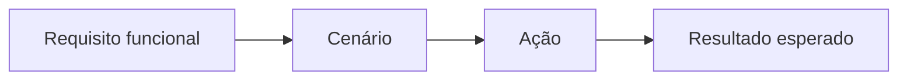

### Não funcionais

Avaliam características de qualidade, como:

- confiabilidade;
- manutenibilidade;
- segurança;
- desempenho;
- capacidade;
- disponibilidade.

O material cita teste de carga, no qual o sistema recebe grande volume de transações.

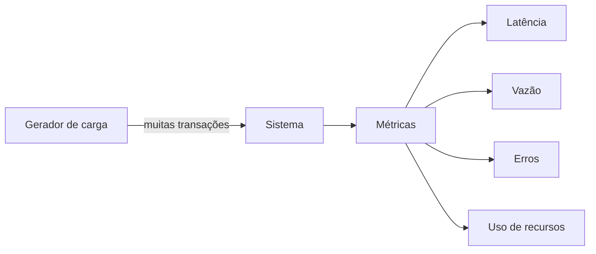

## 9.5 Pirâmide de testes

A aula apresenta uma pirâmide com muitos testes unitários na base, testes de integração no meio e testes de interface no topo.

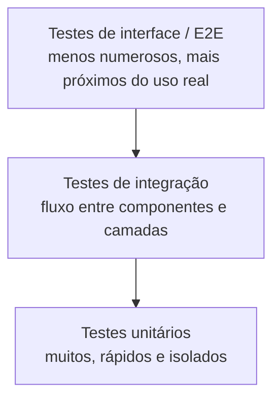

### Testes unitários

Verificam a menor parte relevante do software isoladamente, frequentemente uma classe ou função.

Características desejáveis:

- rápidos;
- determinísticos;
- independentes de rede e banco;
- focados numa regra.

### Testes de integração

Verificam colaboração entre componentes, camadas ou tecnologias.

Exemplos:

- repositório e banco;
- serviço e broker;
- API e autenticação;
- serialização e contrato.

### Testes de interface ou ponta a ponta

Avaliam o sistema de forma próxima ao uso real, atravessando vários componentes.

Tendem a ser:

- mais lentos;
- mais caros;
- mais frágeis;
- importantes para fluxos críticos.

## 9.6 Arquitetura em camadas e testabilidade

O material relaciona separação em camadas ao isolamento de testes, especialmente no domínio.

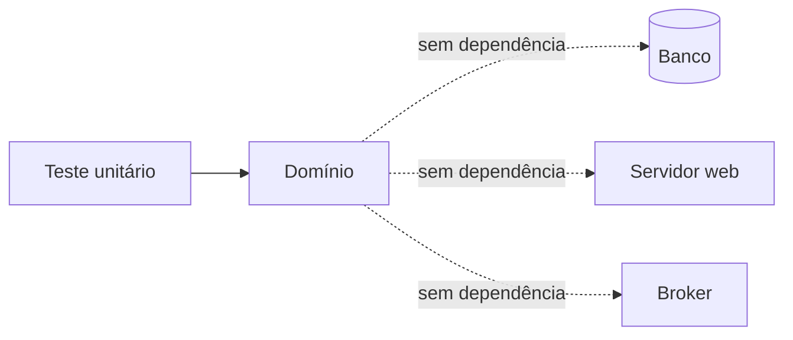

Quando o domínio depende de banco ou framework, um teste simples pode exigir ambiente completo. Ao inverter dependências, contratos podem ser substituídos por fakes.

```java
final class ContatoRepositoryEmMemoria implements ContatoRepository {
    private final Map<ContatoId, Contato> dados = new HashMap<>();

    @Override
    public void salvar(Contato contato) {
        dados.put(contato.id(), contato);
    }

    @Override
    public Optional<Contato> buscarPorId(ContatoId id) {
        return Optional.ofNullable(dados.get(id));
    }
}
```

> [!NOTE]
> Exemplo didático inspirado no domínio simples de cadastro de contatos mencionado na aula.

## 9.7 Testes exploratórios

São testes manuais orientados à descoberta de comportamentos indesejados ou não previstos.

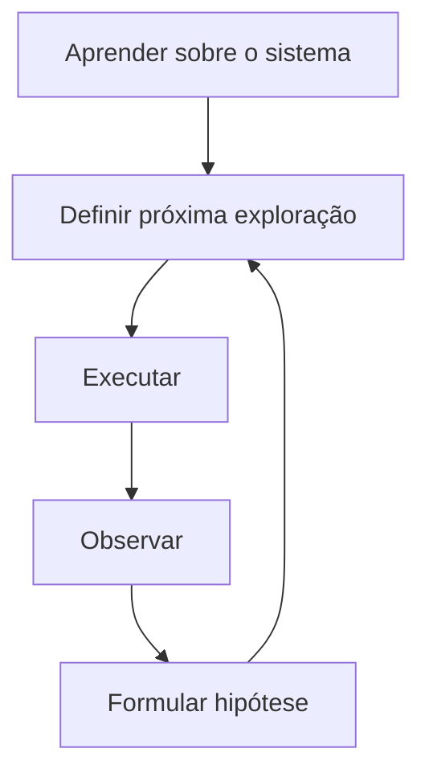

Podem explorar:

- acesso indevido;
- combinações de dados incomuns;
- interrupções de fluxo;
- mensagens de erro;
- estados inconsistentes;
- comportamento fora do escopo esperado.

## 9.8 TDD — Test Driven Development

O material define TDD como abordagem em que testes são criados antes do código para orientar a implementação.

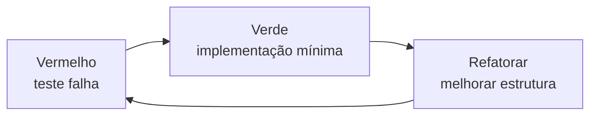

O ciclo ajuda a:

- explicitar comportamento esperado;
- construir design testável;
- receber feedback rápido;
- refatorar com segurança.

> [!WARNING]
> TDD não significa escrever todos os testes possíveis antes de toda a aplicação. É um ciclo incremental entre teste, implementação e refatoração.

## 9.9 BDD — Behavior Driven Development

O material enfatiza colaboração entre desenvolvedores, testadores e equipe de negócio por meio de cenários em linguagem acessível.

```gherkin
Cenário: impedir confirmação de pedido sem itens
  Dado que existe um pedido aberto sem itens
  Quando o usuário solicitar a confirmação
  Então o pedido deve permanecer aberto
  E deve ser informada a impossibilidade de confirmar
```

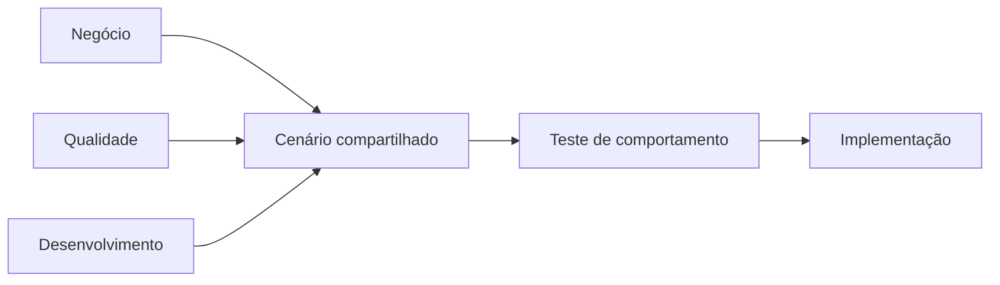

BDD busca alinhar linguagem e exemplos.

## 9.10 ATDD — Acceptance Test Driven Development

O material apresenta ATDD como abordagem que combina elementos de BDD e TDD e compartilha testes de aceitação com a equipe de negócio para garantir alinhamento.

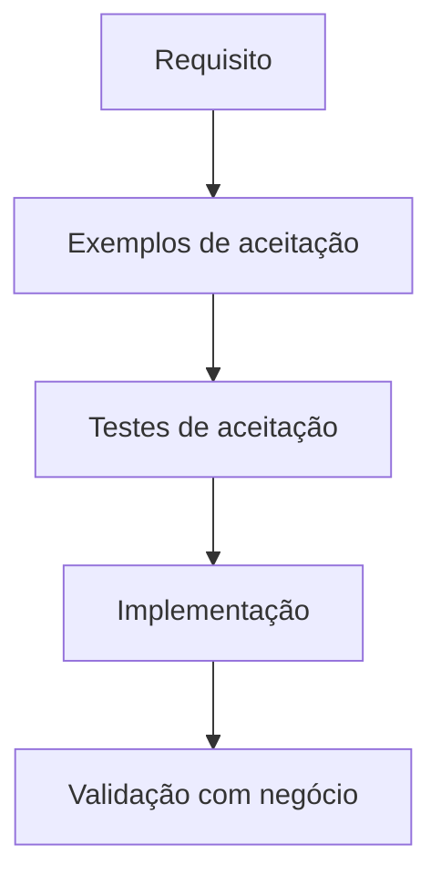

A diferença de ênfase:

| Abordagem | Ênfase |
|---|---|
| TDD | Ciclo de desenvolvimento guiado por testes técnicos |
| BDD | Comportamento e linguagem compartilhada |
| ATDD | Critérios de aceitação definidos colaborativamente |

## 9.11 Estratégia de testes por camada

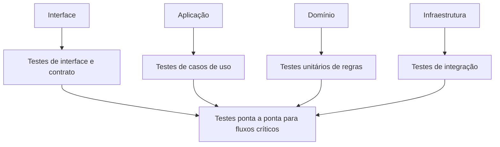

Uma estratégia equilibrada evita dois extremos:

- somente testes unitários, sem verificar integrações;
- somente testes ponta a ponta, lentos e difíceis de diagnosticar.

## 9.12 O papel do arquiteto de software

O professor define o arquiteto como responsável por definir e manter a arquitetura para atender necessidades atuais e futuras do negócio.

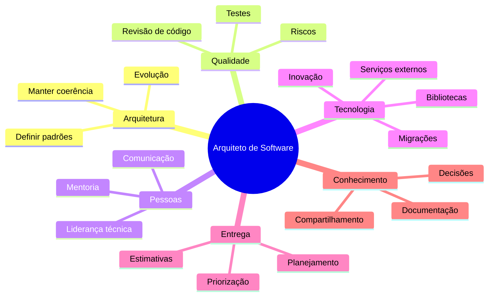

## 9.13 Definir padrões e orientar design

O arquiteto estabelece padrões de codificação e práticas que favorecem:

- qualidade;
- manutenção;
- escalabilidade;
- conformidade com a arquitetura;
- consistência entre equipes.

Revisões de código são apresentadas como atividade importante e oportunidade de aprendizado.

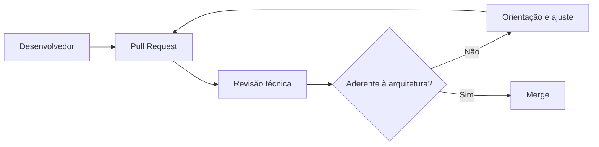

Uma boa revisão não é apenas fiscalização. Ela explica o motivo e eleva o nível técnico da equipe.

## 9.14 Liderança e comunicação

O arquiteto conecta desenvolvedores, produto, DevOps, qualidade e stakeholders.

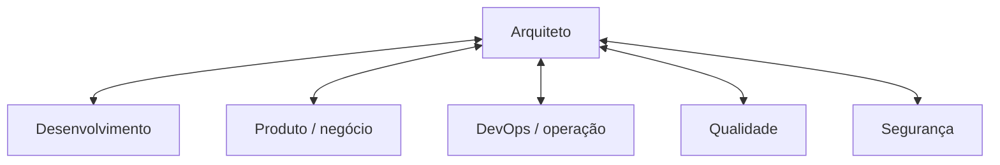

Ele precisa comunicar a mesma decisão em níveis diferentes:

- visão de negócio para stakeholders;
- trade-offs para liderança;
- contratos e limites para desenvolvimento;
- requisitos operacionais para DevOps;
- cenários de qualidade para testes.

## 9.15 Garantia de testes

O material enfatiza que o arquiteto deve garantir cobertura de:

- testes unitários;
- integração;
- desempenho;
- end-to-end.

Isso não significa escrever pessoalmente todos os testes, mas definir estratégia, padrões, critérios e responsabilidades.

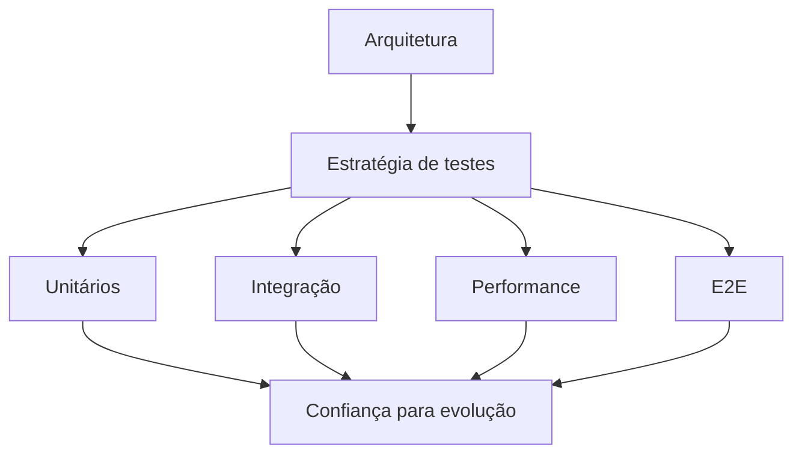

## 9.16 Gestão de riscos técnicos

O arquiteto identifica e mitiga riscos por meio de tecnologias, ferramentas e processos.

Exemplos coerentes com o material:

- biblioteca descontinuada;
- mudança de licenciamento;
- dependência de serviço externo;
- banco sem redundância;
- gargalo de desempenho;
- ausência de observabilidade;
- tecnologia sem conhecimento interno.

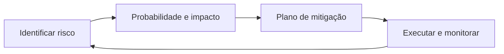

## 9.17 Bibliotecas, serviços e migrações

O arquiteto avalia contratação e uso de bibliotecas e serviços, dimensiona consumo e planeja substituições quando houver descontinuação ou mudança de licença.

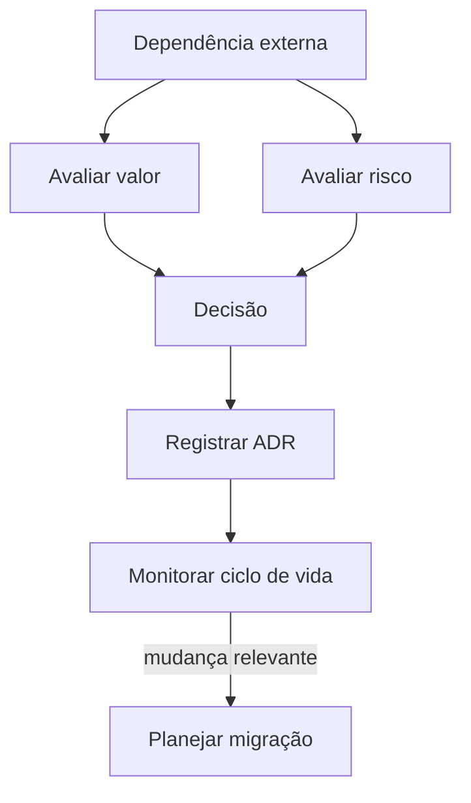

A migração deve buscar transparência para usuários e continuidade do negócio.

## 9.18 Planejamento, estimativa e priorização

O arquiteto participa de decisões de entrega, equilibrando:

- valor de negócio;
- risco técnico;
- débito técnico;
- capacidade da equipe;
- dependências;
- evolução arquitetural.

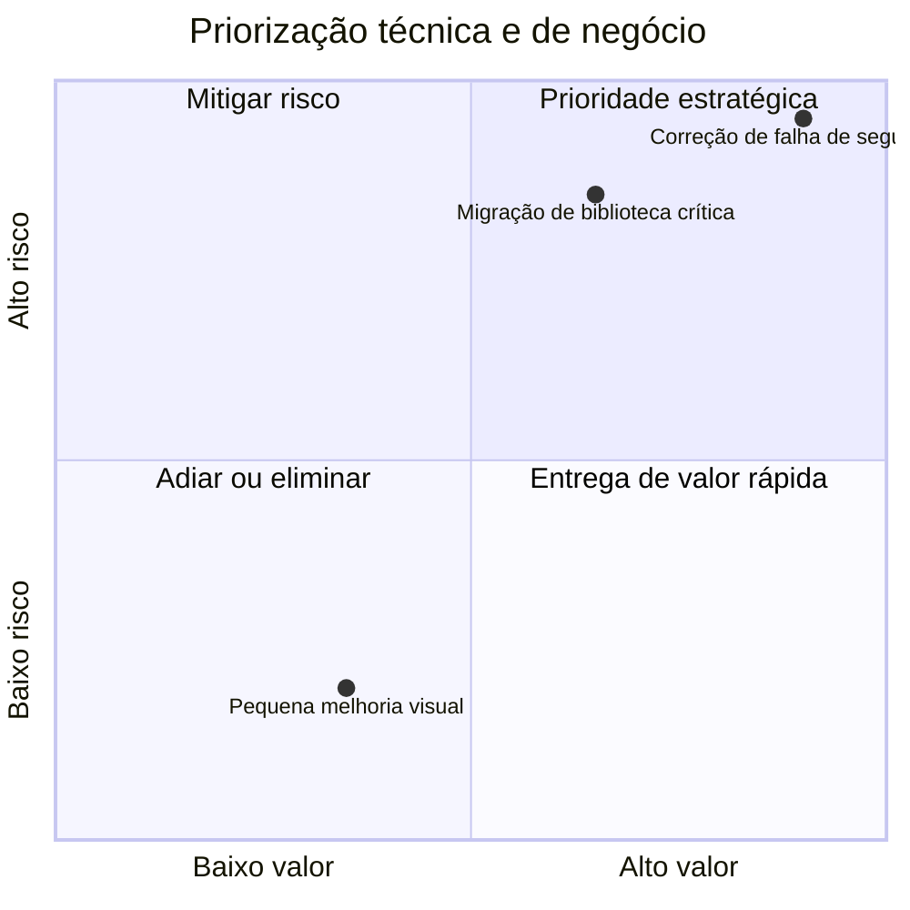

> [!NOTE]
> Diagrama qualitativo de elaboração didática.

## 9.19 Documentação e memória organizacional

Em projetos longos e com várias equipes, documentação nivela conhecimento e permite replicar decisões bem-sucedidas.

O arquiteto cria e atualiza:

- diagramas;
- ADRs;
- padrões;
- guias de desenvolvimento;
- glossário;
- riscos;
- runbooks;
- visão de evolução.

## 9.20 Habilidades técnicas e comportamentais

O material destaca habilidades técnicas:

- domínio profundo de uma linguagem;
- padrões de projeto;
- bancos relacionais e não relacionais;
- arquitetura e tecnologias emergentes;
- desempenho;
- resolução de problemas.

E habilidades comportamentais:

- comunicação;
- pensamento analítico;
- pensamento sistêmico;
- liderança técnica;
- capacidade de lidar com diferentes públicos.

```mermaid
flowchart LR
    T[Competência técnica] --> A[Atuação arquitetural]
    C[Comunicação e liderança] --> A
    N[Conhecimento do negócio] --> A
    A --> R[Decisões equilibradas]
```

## 9.21 Carreira e níveis de arquitetura

O material apresenta uma progressão possível:

```mermaid
flowchart LR
    S[Engenheiro sênior] --> AS[Arquiteto de software]
    AS --> SOL[Arquiteto de soluções]
    SOL --> ENT[Arquiteto corporativo]
```

- Arquiteto de software: foco em código, domínio e estrutura interna.
- Arquiteto de soluções: integra aspectos técnicos e de negócio numa solução.
- Arquiteto corporativo: atua estrategicamente no conjunto da organização.

Essa sequência não é obrigatória nem uniforme entre empresas.

## 9.22 Reflexões sobre inteligência artificial

O professor contrapõe programação tradicional, estruturada e lógica, ao desenvolvimento apoiado por IA, mais intuitivo e orientado ao fluxo.

Riscos destacados:

- aceitar código não compreendido;
- dificuldade para validar decisões;
- tradução inadequada das necessidades de negócio;
- perda de domínio técnico.

Competências que permanecem relevantes:

- conhecimento profundo;
- criatividade;
- pensamento crítico;
- ética;
- liderança.

```mermaid
flowchart LR
    IA[IA gera sugestão] --> V[Validação humana]
    V --> D{Atende domínio, segurança e arquitetura?}
    D -->|Não| R[Revisar ou rejeitar]
    D -->|Sim| T[Testar]
    T --> E[Integrar com responsabilidade]
```

## 9.23 Checklist do arquiteto

- A arquitetura atende requisitos atuais e cenários de evolução?
- Os limites e padrões estão claros para a equipe?
- Revisões de código verificam decisões arquiteturais?
- O sistema possui estratégia equilibrada de testes?
- Riscos técnicos têm responsáveis e mitigação?
- Dependências externas são inventariadas e monitoradas?
- Decisões relevantes possuem ADR?
- A documentação está atualizada?
- Há observabilidade e capacidade de diagnóstico?
- A equipe compreende o código gerado ou sugerido por IA?

## 9.24 Síntese para a prova

- Testes aumentam confiança e qualidade, mas não provam ausência de defeitos.
- Testes manuais exploram; automatizados repetem com velocidade.
- Caixa branca conhece código; preta observa contrato; cinza combina conhecimento parcial.
- Funcionais verificam comportamento; não funcionais verificam atributos de qualidade.
- Pirâmide: muitos unitários, integração intermediária, poucos E2E/interface.
- TDD usa ciclo teste falhando, implementação mínima e refatoração.
- BDD usa linguagem de comportamento e colaboração.
- ATDD orienta critérios de aceitação compartilhados.
- O arquiteto define e mantém arquitetura, orienta equipe, revisa código, gerencia riscos, garante estratégia de testes, planeja migrações e documenta.
- IA não elimina a necessidade de validação, conhecimento técnico e entendimento do domínio.

## Questões de revisão

1. Qual a diferença entre teste manual e automatizado?
2. Como caixa branca e caixa preta observam o sistema?
3. Dê um exemplo de teste funcional e um não funcional.
4. Por que a base da pirâmide possui mais testes?
5. Qual é o ciclo básico do TDD?
6. Como BDD contribui para comunicação com o negócio?
7. Qual a diferença de ênfase entre BDD e ATDD?
8. Por que o arquiteto deve permanecer próximo do código?
9. Quais riscos existem na dependência de bibliotecas externas?
10. Que papel o arquiteto exerce diante de código gerado por IA?

## Referência no material da disciplina

- Aula 3 — e-book, partes 5 e 6;
- Aula 3 — slides sobre testes, papel do arquiteto, carreira e reflexões sobre IA.
