# 10. Revisão para a Prova

Este capítulo concentra os pontos centrais dos três módulos. Use-o depois da leitura dos capítulos completos.

## 10.1 Mapa geral

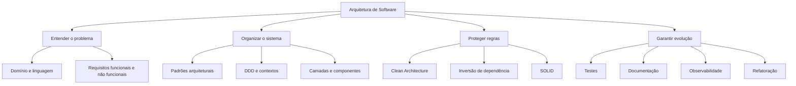

## 10.2 Definições essenciais

| Conceito | Definição para revisão |
|---|---|
| Arquitetura de software | Decisões importantes e difíceis de mudar, com impacto amplo sobre estrutura e evolução do sistema |
| Domínio | Campo de conhecimento e atividade que o software atende |
| Modelo | Abstração seletiva do domínio real |
| Bounded Context | Limite em que um modelo e sua linguagem permanecem consistentes |
| Context Map | Mapa dos contextos e suas relações |
| Acoplamento | Grau de dependência entre componentes |
| Coesão | Grau em que elementos de um módulo colaboram para um propósito comum |
| Granularidade | Tamanho e nível de detalhe das responsabilidades dos componentes |
| Escalabilidade vertical | Aumentar recursos de uma máquina |
| Escalabilidade horizontal | Adicionar máquinas ou instâncias |
| ADR | Registro do contexto, decisão, alternativas e consequências arquiteturais |
| Caso de uso | Ação da aplicação que coordena o domínio para cumprir um objetivo |
| Design Pattern | Estrutura reutilizável em alto nível para problema recorrente de design |

## 10.3 Comunicação e domínio

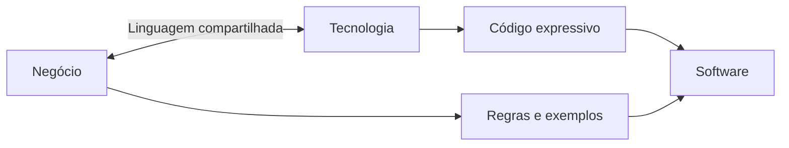

Pontos-chave:

- falhas de projeto estão relacionadas ao desalinhamento e ao desconhecimento do domínio;
- código é uma forma de documentação;
- nomes devem revelar intenção;
- DDD aproxima código, modelo e linguagem do negócio;
- o mesmo termo pode ter significado diferente em contextos distintos.

## 10.4 Recursos e monitoramento

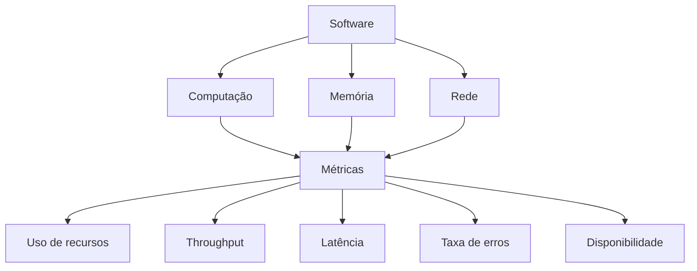

A arquitetura deve permitir monitorar o comportamento operacional, não apenas estruturar código.

## 10.5 Paradigmas

| Procedural | Orientado a objetos | Funcional |
|---|---|---|
| Funções, procedimentos, variáveis e fluxo de controle | Classes, objetos, encapsulamento, herança, polimorfismo e abstração | Funções puras, imutabilidade e composição |
| Ênfase em sequência de operações | Ênfase em objetos e responsabilidades | Ênfase em transformação e composição de funções |

## 10.6 Ciclo de vida e CI/CD

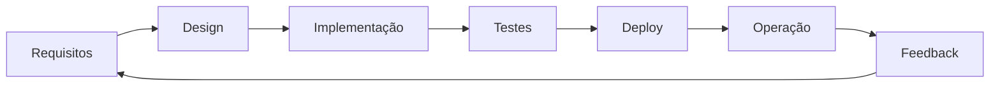

CI/CD automatiza build, testes, análise, empacotamento e implantação. A arquitetura deve reduzir etapas manuais e dependências implícitas.

## 10.7 Acoplamento, coesão e dependência

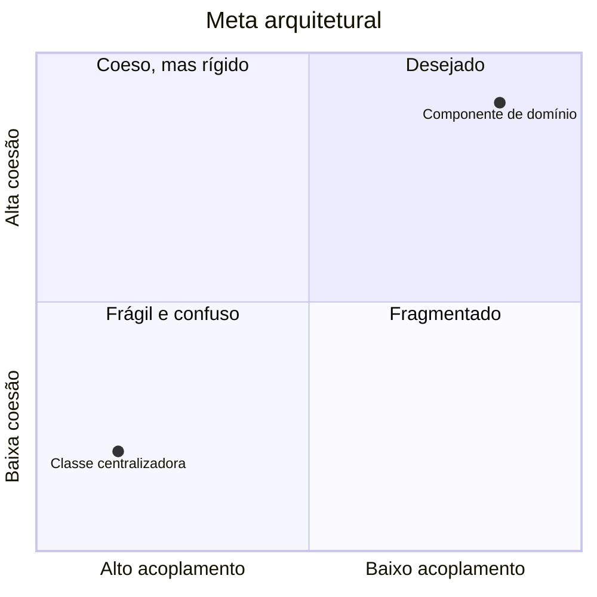

- baixo acoplamento reduz propagação de mudanças;
- alta coesão concentra responsabilidades relacionadas;
- inversão de dependência faz políticas dependerem de abstrações;
- encapsulamento protege invariantes;
- granularidade excessivamente fina aumenta coordenação; grossa demais concentra responsabilidades.

## 10.8 Comparação de padrões arquiteturais

| Aspecto | Monólito | MVC | Microsserviços | Eventos |
|---|---|---|---|---|
| Organização | Aplicação única | Model, View e Controller | Serviços autônomos | Produtores, broker e consumidores |
| Deploy | Conjunto | Depende da aplicação | Por serviço | Por componente |
| Comunicação | Interna | Entre responsabilidades lógicas | Rede/API/mensagem | Assíncrona |
| Escala | Geralmente conjunta | Não é foco principal | Individual | Consumidores escaláveis |
| Complexidade inicial | Baixa | Média | Alta | Alta |
| Principal benefício | Simplicidade | Separação da interface | Autonomia e escala | Desacoplamento |
| Principal risco | Ponto único e rigidez | Camadas mal usadas | Complexidade distribuída | Consistência e rastreamento |

### Regra de escolha apresentada

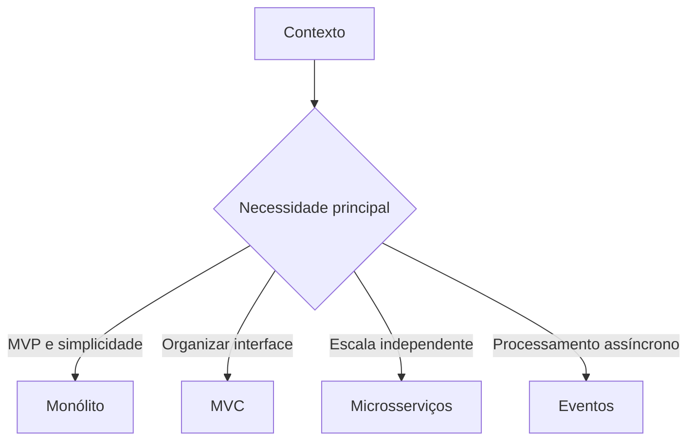

Não há melhor padrão universal.

## 10.9 DDD em uma página

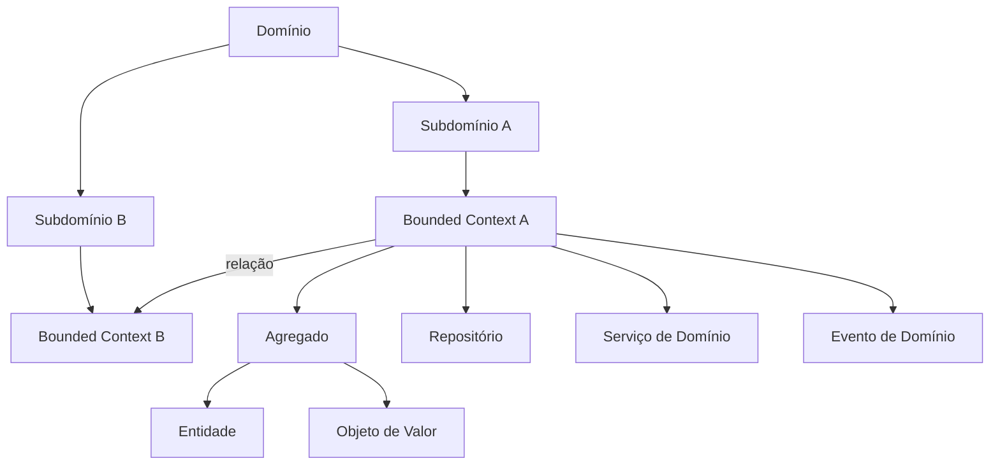

### Building blocks

| Elemento | Identificação rápida |
|---|---|
| Entidade | Possui identidade e ciclo de vida |
| Objeto de Valor | Definido pelos atributos e normalmente imutável |
| Agregado | Unidade de consistência com raiz |
| Repositório | Acesso a agregados |
| Serviço de Domínio | Operação de negócio sem dono natural |
| Fábrica | Criação complexa e válida |
| Evento de Domínio | Fato relevante ocorrido |

## 10.10 Clean Architecture em uma página

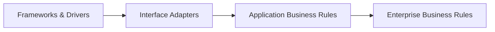

| Camada | Conteúdo |
|---|---|
| Enterprise Business Rules | Entidades, objetos de valor e regras do domínio |
| Application Business Rules | Casos de uso e orquestração |
| Interface Adapters | Controllers, presenters, mapeadores, gateways e implementações de portas |
| Frameworks & Drivers | Web, banco, broker, bibliotecas e protocolos |

### Regra de dependência

Dependências de código apontam para dentro. O domínio não conhece banco, HTTP, JSON ou framework.

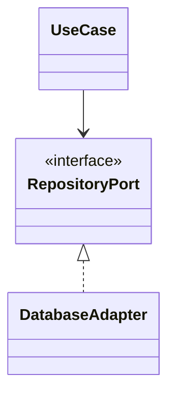

## 10.11 Documentação em uma página

### ADR

Registra:

- contexto;
- decisão;
- alternativas;
- consequências positivas e negativas;
- referências;
- status.

### C4

### arc42

Estrutura abrangente em 12 capítulos para objetivos, restrições, contexto, solução, building blocks, execução, implantação, conceitos transversais, decisões, qualidade, riscos e glossário.

## 10.12 SOLID em uma página

| Princípio | Resumo | Violação clássica do material |
|---|---|---|
| SRP | Uma razão coerente para mudar | `Employee` calcula, salva e gera relatório |
| OCP | Aberto para extensão, fechado para modificação repetitiva | `ProcessOrder` com `if` por tipo |
| LSP | Subtipo substitui base sem quebrar contrato | `Ostrich` obrigado a voar; quadrado como retângulo |
| ISP | Interface específica para clientes | `Printer` obriga fax e scanner |
| DIP | Alto nível depende de abstração | Relatório instancia MySQL diretamente |

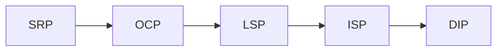

## 10.13 DRY, KISS e YAGNI

| Princípio | Evita | Pergunta de verificação |
|---|---|---|
| DRY | Duplicação do mesmo conhecimento | Esta regra possui mais de uma fonte de verdade? |
| KISS | Complexidade desnecessária | Existe solução mais simples que atende o problema? |
| YAGNI | Funcionalidade hipotética | Há requisito atual ou evidência de que isso é necessário? |

### Conciliação

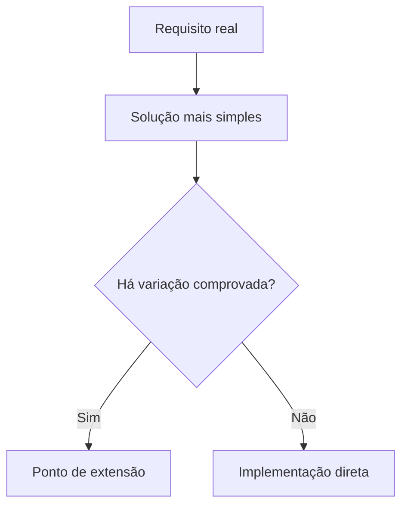

## 10.14 Design Patterns em uma página

| Padrão | Categoria | Problema |
|---|---|---|
| Factory Method | Criacional | Criação de um produto varia |
| Abstract Factory | Criacional | Criar família de objetos relacionados |
| Singleton | Criacional | Controlar uma única instância |
| Adapter | Estrutural | Interfaces incompatíveis |
| Proxy | Estrutural | Controlar acesso ao mesmo contrato |
| Observer | Comportamental | Notificar assinantes sobre mudanças |
| Mediator | Comportamental | Evitar comunicação direta muitos-para-muitos |
| Strategy | Comportamental | Trocar algoritmos ou comportamentos |

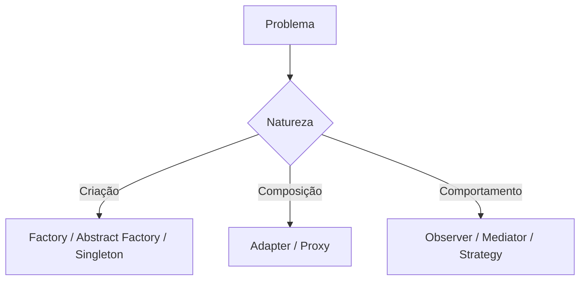

## 10.15 Testes em uma página

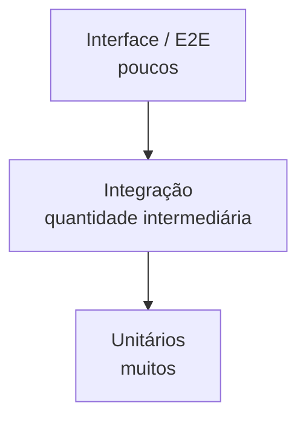

| Classificação | Distinção |
|---|---|
| Manual x automatizado | Execução humana adaptável x execução repetível por script |
| Caixa branca x preta x cinza | Conhecimento interno alto x contrato externo x conhecimento parcial |
| Funcional x não funcional | O que faz x como opera |
| Unitário x integração x E2E | Parte isolada x colaboração x fluxo completo |

### Metodologias

- TDD: vermelho, verde, refatorar;
- BDD: comportamento em linguagem compartilhada;
- ATDD: critérios de aceitação definidos colaborativamente.

## 10.16 Papel do arquiteto

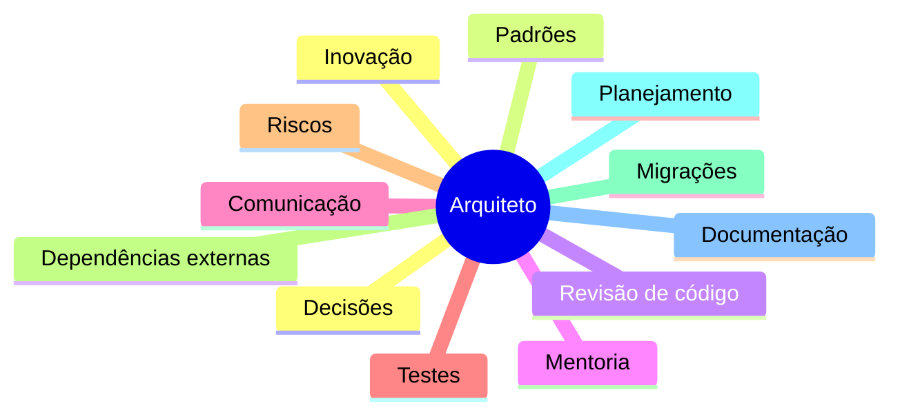

O arquiteto deve permanecer próximo do código e do negócio, evitando tornar-se apenas produtor de diagramas.

## 10.17 Armadilhas frequentes em questões

### “Microsserviços sempre são melhores”

Falso. Eles aumentam complexidade operacional e de comunicação. O padrão depende dos requisitos e da capacidade da equipe.

### “Monólito não possui módulos”

Falso. Pode ter módulos internos; a característica principal é implantação conjunta.

### “Clean Architecture exige quatro pastas com os nomes dos círculos”

Falso. A regra essencial é a direção das dependências.

### “DDD é uma arquitetura em camadas”

Incompleto. DDD é abordagem de modelagem do domínio; a arquitetura em camadas é uma forma de organizá-lo.

### “SRP significa uma função por classe”

Falso. Significa uma razão coerente para mudança.

### “DRY proíbe qualquer código parecido”

Falso. O foco é duplicação do mesmo conhecimento.

### “YAGNI significa ignorar requisitos futuros conhecidos”

Falso. Ele evita necessidades hipotéticas sem evidência.

### “Teste unitário substitui integração”

Falso. Cada nível fornece evidências diferentes.

### “ADR registra apenas a escolha final”

Falso. Deve registrar contexto, alternativas e consequências.

## 10.18 Perguntas objetivas simuladas

### 1. Qual opção melhor descreve uma decisão arquitetural?

A. Qualquer linha de código escrita pelo desenvolvedor.  
B. Uma decisão importante, de impacto amplo e difícil de mudar.  
C. Apenas a escolha do provedor de nuvem.  
D. Somente diagramas de infraestrutura.

### 2. Em um sistema, a classe de alto nível instancia diretamente `MySQLDatabase`. Qual princípio é principalmente violado?

A. SRP.  
B. OCP.  
C. DIP.  
D. ISP.

### 3. Qual característica diferencia uma Entidade de um Objeto de Valor?

A. Entidade nunca possui comportamento.  
B. Objeto de Valor precisa de banco relacional.  
C. Entidade é reconhecida por identidade; Objeto de Valor por atributos.  
D. Objeto de Valor é sempre mutável.

### 4. Na Clean Architecture, onde ficam os casos de uso?

A. Frameworks & Drivers.  
B. Interface Adapters.  
C. Application Business Rules.  
D. Enterprise Business Rules exclusivamente.

### 5. Qual padrão é adequado para notificar investidores inscritos quando o preço muda?

A. Adapter.  
B. Observer.  
C. Singleton.  
D. Factory Method.

### 6. Qual alternativa descreve escala horizontal?

A. Aumentar memória da máquina existente.  
B. Trocar linguagem de programação.  
C. Adicionar instâncias para dividir carga.  
D. Criar mais métodos numa classe.

### 7. Qual é a função principal de um ADR?

A. Substituir o código-fonte.  
B. Registrar decisão, contexto, alternativas e consequências.  
C. Desenhar apenas classes.  
D. Medir CPU e memória.

### 8. Uma interface obriga uma impressora simples a implementar fax e scanner. Qual princípio é violado?

A. ISP.  
B. LSP.  
C. DRY.  
D. KISS.

### 9. No C4 Model, qual nível mostra aplicações, serviços e bancos que compõem o sistema?

A. Contexto.  
B. Contêineres.  
C. Componentes.  
D. Código.

### 10. Qual afirmação sobre microsserviços é correta?

A. Eliminam falhas de rede.  
B. Não exigem monitoramento.  
C. Permitem escala individual, mas aumentam complexidade distribuída.  
D. Devem compartilhar diretamente o mesmo banco.

### 11. Qual princípio combate a construção de funcionalidade baseada apenas numa hipótese futura?

A. DRY.  
B. YAGNI.  
C. LSP.  
D. Observer.

### 12. Qual teste verifica o fluxo entre componentes e camadas?

A. Teste de integração.  
B. Teste unitário exclusivamente.  
C. Apenas teste exploratório.  
D. Compilação.

## 10.19 Gabarito comentado

1. **B.** Arquitetura envolve decisões importantes e difíceis de mudar.
2. **C.** O módulo de alto nível depende de implementação concreta, violando DIP.
3. **C.** Entidade preserva identidade; Objeto de Valor é definido por seus valores.
4. **C.** Casos de uso pertencem às Application Business Rules.
5. **B.** Observer mantém assinantes e os notifica diante de mudanças.
6. **C.** Escala horizontal adiciona máquinas ou instâncias.
7. **B.** ADR preserva o raciocínio da decisão, não apenas o resultado.
8. **A.** ISP impede que clientes dependam de operações que não utilizam.
9. **B.** Contêineres mostra aplicações executáveis e armazenamentos.
10. **C.** Autonomia e escala vêm acompanhadas de rede, observabilidade e consistência distribuída.
11. **B.** YAGNI evita implementar algo sem necessidade atual comprovada.
12. **A.** Integração verifica colaboração entre partes.

## 10.20 Perguntas discursivas simuladas

1. Compare monólito, microsserviços e arquitetura orientada a eventos, indicando um benefício, um risco e um cenário de uso para cada um.
2. Explique como Bounded Context e Linguagem Ubíqua reduzem ambiguidades num ERP.
3. Descreva a regra de dependência da Clean Architecture e mostre como um caso de uso persiste dados sem depender de PostgreSQL.
4. Analise uma classe que calcula salário, salva funcionário e gera relatório usando SOLID.
5. Explique a diferença entre Adapter e Proxy com exemplos.
6. Proponha uma estratégia de testes para uma API em Clean Architecture.
7. Crie a estrutura de um ADR para adoção de um broker de mensagens.
8. Explique como DRY, KISS, YAGNI e OCP podem orientar a mesma decisão sem se contradizerem.

## 10.21 Respostas esperadas — roteiro

### Questão 1

- Monólito: deploy único; simples; risco de escala conjunta e falha ampla; adequado a MVP.
- Microsserviços: serviços autônomos; escala individual; complexidade distribuída; adequado quando autonomia e escala justificam.
- Eventos: produtores e consumidores assíncronos; desacoplamento; desafios de ordem, consistência e rastreamento; adequado a reações independentes.

### Questão 2

- Contexto delimita significado.
- Linguagem é compartilhada dentro do contexto.
- “Produto” pode ter modelos diferentes em estoque, manufatura e vendas.
- Context Map registra relações.

### Questão 3

- Dependências apontam para dentro.
- Caso de uso depende de interface `Repository` interna.
- Adaptador externo implementa a interface com PostgreSQL.
- Injeção conecta implementação em tempo de execução.

### Questão 4

- viola SRP;
- separar regra salarial, repositório e gerador de relatório;
- aumenta coesão e reduz motivos de mudança.

### Questão 5

- Adapter muda a interface para compatibilidade;
- Proxy preserva contrato e controla acesso;
- XML para JSON é Adapter;
- cache de download remoto é Proxy.

### Questão 6

- muitos testes unitários no domínio;
- testes de casos de uso com fakes;
- integração para repositório, broker e contratos;
- E2E para fluxos críticos;
- testes não funcionais para desempenho e segurança.

### Questão 7

- contexto e necessidade de assíncrono;
- decisão e broker escolhido;
- alternativas;
- consequências positivas e negativas;
- plano de operação e observabilidade;
- critérios de revisão.

### Questão 8

- YAGNI elimina variação hipotética;
- KISS escolhe solução mínima;
- OCP cria extensão quando a variação é real;
- DRY evita duplicar a regra em variantes existentes.

## 10.22 Divergências e limites do material

- Projetos menores que US$ 1 milhão: slides indicam 76% de sucesso; e-book menciona 70%.
- Alguns exercícios de Design Patterns são apresentados sem gabarito textual; inferências estão marcadas no capítulo correspondente.
- As definições são sínteses didáticas da disciplina. Conceitos como DDD, C4, arc42 e padrões possuem literatura mais ampla do que o escopo das aulas.

## 10.23 Checklist final

Antes da prova, confirme que consegue explicar sem consultar:

- [ ] por que projetos falham por comunicação e domínio;
- [ ] diferença entre acoplamento, coesão e granularidade;
- [ ] escala vertical e horizontal;
- [ ] vantagens e desvantagens de monólito, microsserviços e eventos;
- [ ] domínio, modelo, Bounded Context e Context Map;
- [ ] building blocks do DDD;
- [ ] quatro camadas da Clean Architecture e regra de dependência;
- [ ] estrutura de ADR e níveis do C4;
- [ ] cinco princípios SOLID;
- [ ] DRY, KISS e YAGNI;
- [ ] padrões estudados e problema de cada um;
- [ ] pirâmide de testes e TDD/BDD/ATDD;
- [ ] responsabilidades do arquiteto.

## Referência no material da disciplina

- Aula 1 — e-book e slides;
- Aula 2 — e-book e slides;
- Aula 3 — e-book e slides.
