# 01 — Introdução à Inteligência Artificial

## 1. Objetivos da aula

A primeira aula constrói a base conceitual da disciplina. O foco está em compreender o que é Inteligência Artificial, como ela se diferencia da programação tradicional, quais são suas principais abordagens, como a área evoluiu historicamente e como a IA afeta aplicações, profissões e decisões humanas.

Ao final, o aluno deve conseguir explicar:

- o que caracteriza uma solução de IA;
- a relação entre IA, Machine Learning, Deep Learning e IA Generativa;
- a diferença entre uma abordagem determinística e uma abordagem baseada em aprendizado;
- os três tipos de Machine Learning apresentados no curso;
- marcos históricos da IA;
- exemplos de aplicações;
- impactos no trabalho;
- riscos ligados a viés, explicabilidade e privacidade.

---

## 2. O que é Inteligência Artificial?

O material define Inteligência Artificial como um segmento da computação que busca simular capacidades humanas como raciocinar, tomar decisões, resolver problemas e aprender, permitindo automatizar processos por meio de softwares e robôs.

> [!NOTE]
> **Ideia central:** IA não é uma única técnica. É um campo amplo que reúne diferentes abordagens para construir sistemas capazes de realizar tarefas associadas à inteligência.

### 2.1 Programação tradicional × aprendizado de máquina

Na programação tradicional, o desenvolvedor escreve explicitamente as regras que transformam dados de entrada em respostas.

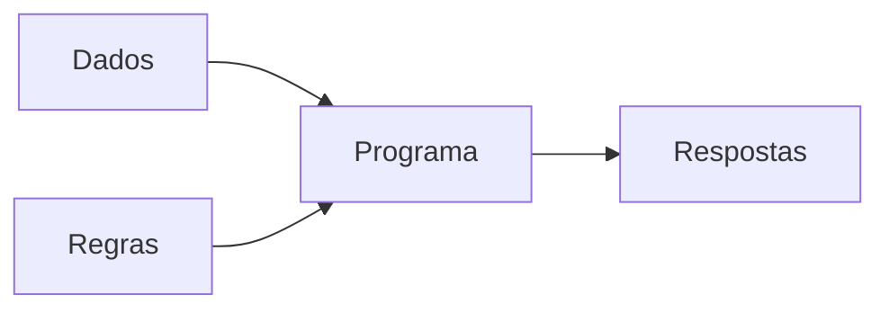

No Machine Learning supervisionado, o processo de treinamento recebe dados e respostas conhecidas para produzir um modelo. Depois, novos dados são enviados ao modelo para obter previsões.

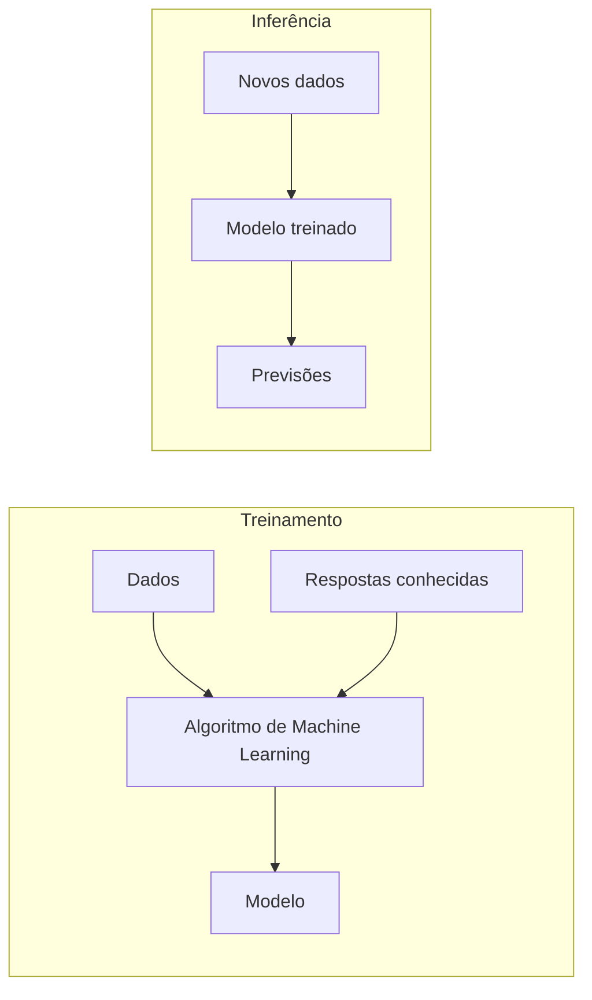

A aula utiliza a distinção:

| Aspecto | Programação tradicional | Machine Learning |
|---|---|---|
| Lógica principal | Regras escritas pelo programador | Padrões aprendidos a partir de dados |
| Natureza apresentada | Determinística | Probabilística |
| Entrada para construção | Dados + regras | Dados + exemplos/respostas |
| Resultado | Resposta calculada | Modelo aprendido |
| Uso posterior | Executa regras | Faz inferências/previsões |

> [!WARNING]
> O e-book usa o termo **alucinação** de forma ampla para representar erros de modelos probabilísticos. Para a prova, reconheça o uso feito no material. Em capítulos posteriores, o próprio curso utiliza “alucinação” principalmente no contexto de modelos generativos/LLMs que produzem conteúdo inventado ou inferido com confiança.

---

## 3. Relação entre IA, Machine Learning, Deep Learning e IA Generativa

A disciplina organiza os conceitos como níveis relacionados:

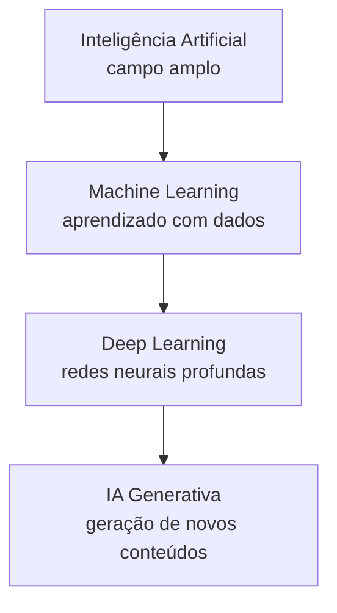

### Inteligência Artificial

Campo amplo dedicado à construção de sistemas que executam tarefas associadas à inteligência.

### Machine Learning

Prática de utilizar algoritmos que aprendem padrões a partir de dados para realizar determinações ou previsões.

### Deep Learning

Técnica de Machine Learning baseada em redes neurais artificiais com múltiplas camadas, capaz de aprender padrões complexos.

### IA Generativa

Ramo voltado à criação de novos conteúdos, como textos, imagens, áudio e outros dados semelhantes aos padrões encontrados nos dados de treinamento.

> [!IMPORTANT]
> **Relação fundamental:** Machine Learning está dentro de IA; Deep Learning está dentro de Machine Learning. IA Generativa aparece no curso associada aos avanços de Deep Learning e aos modelos capazes de criar conteúdo.

---

## 4. Linha do tempo da Inteligência Artificial

O curso apresenta a IA como resultado de uma longa evolução de ideias, matemática, computação e capacidade de processamento.

```mermaid
flowchart LR
    B["Thomas Bayes<br/>Inferência probabilística"] --> A["1842<br/>Ada Lovelace"]
    A --> T["Alan Turing<br/>Máquina de Turing / Teste de Turing"]
    T --> S["1952<br/>Arthur Samuel<br/>jogo de damas"]
    S --> D["1956<br/>Dartmouth<br/>termo IA"]
    D --> E["Década de 1960<br/>ELIZA"]
    E --> L["1973<br/>Lighthill Report<br/>inverno da IA"]
    L --> DB["1997<br/>Deep Blue"]
    DB --> H["2006<br/>avanços em Deep Learning"]
    H --> Y["2012<br/>reconhecimento de padrões em imagens"]
    Y --> G["2014<br/>GANs"]
    G --> AG["2016<br/>AlphaGo"]
    AG --> C["2022–2023<br/>popularização da IA generativa"]
```

### 4.1 Thomas Bayes

A inferência bayesiana fornece uma base probabilística para atualizar estimativas a partir de evidências anteriores.

### 4.2 Ada Lovelace

O material destaca sua visão de que máquinas poderiam ir além de cálculos numéricos e processar ideias e estruturas mais complexas.

### 4.3 Alan Turing

É apresentado como um dos pais da computação moderna. Entre os pontos destacados:

- conceito de Máquina de Turing;
- trabalho relacionado à quebra de códigos durante a Segunda Guerra Mundial;
- discussão sobre a possibilidade de máquinas pensarem;
- Teste de Turing.

### 4.4 Arthur Samuel

Em 1952, desenvolveu um programa capaz de jogar damas e aprender com partidas, sendo apresentado como um dos primeiros exemplos de aprendizado de máquina.

### 4.5 Conferência de Dartmouth — 1956

O encontro liderado por John McCarthy é apresentado como o marco de formalização do termo **Inteligência Artificial**.

### 4.6 ELIZA e o inverno da IA

A aula cita o chatbot ELIZA na década de 1960 e o **Lighthill Report**, em 1973, como parte do cenário que levou à redução de investimentos e expectativas — o chamado “inverno da IA”.

### 4.7 Deep Blue — 1997

O sistema da IBM derrotou Garry Kasparov, campeão mundial de xadrez, tornando-se um marco do retorno do interesse público e empresarial por sistemas capazes de enfrentar problemas complexos.

### 4.8 Geoffrey Hinton e Deep Learning

O curso destaca os avanços de 2006 em redes neurais profundas e reconhecimento de padrões. Também menciona o Prêmio Nobel de Física de 2024 recebido por Geoffrey Hinton.

### 4.9 GANs, AlphaGo e IA Generativa

- **2014:** GANs, associadas a Ian Goodfellow;
- **2016:** AlphaGo, da DeepMind, vence um dos principais jogadores de Go;
- **2022 em diante:** modelos generativos popularizam interfaces conversacionais e geração automática de conteúdo.

---

## 5. Machine Learning: três formas de aprendizado

A Aula 1 apresenta três categorias principais.

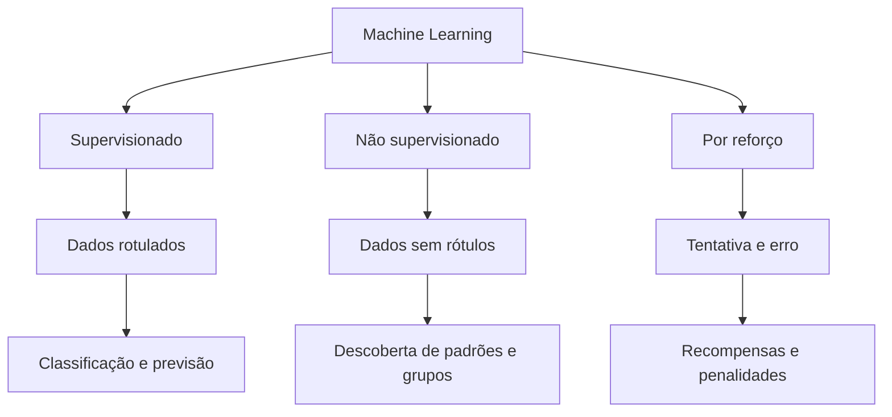

### 5.1 Aprendizado supervisionado

O sistema aprende usando exemplos nos quais a resposta correta já é conhecida.

Exemplos citados no material:

- análise de crédito;
- reconhecimento de imagens;
- classificação de sentimentos;
- extração de entidades em documentos.

### 5.2 Aprendizado não supervisionado

O modelo busca estruturas ou padrões sem receber previamente a resposta correta.

Exemplos didáticos do material:

- agrupamento/separação automática de dados;
- identificação de padrões em imagens;
- exploração de estruturas desconhecidas.

### 5.3 Aprendizado por reforço

O agente aprende por tentativa e erro, recebendo recompensas ou penalidades de acordo com suas decisões.

O curso utiliza jogos como Atari para exemplificar essa abordagem e cita o trabalho da DeepMind que combinou redes neurais profundas e Reinforcement Learning.

> [!IMPORTANT]
> **Supervisionado:** existe uma resposta conhecida.  
> **Não supervisionado:** o modelo procura estrutura sem rótulos.  
> **Reforço:** aprende a escolher ações com base em recompensas.

---

## 6. Dados como base da IA

O e-book apresenta uma sequência em que dados brutos ganham significado progressivamente.

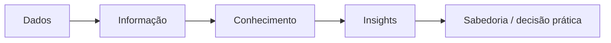

A mensagem é que IA não gera valor apenas porque existe um modelo. É necessário transformar dados em informação utilizável e, finalmente, em decisões.

### Exemplos de aplicações baseadas em dados citados

- previsão de faturamento;
- sistemas reativos à fala;
- detecção de fraude em cartões;
- segmentação de clientes;
- recomendação de produtos;
- análise de padrões para apoio a decisões de crédito.

---

## 7. Aplicações de IA

A aula mostra que IA é uma tecnologia transversal.

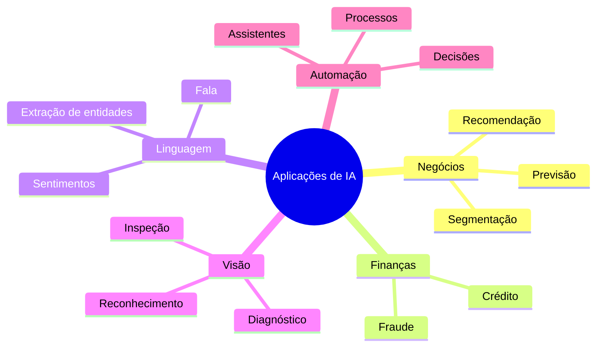

A principal mensagem é identificar **qual decisão ou processo** será melhorado pela IA, e não adotar a tecnologia apenas por tendência.

---

## 8. Habilidades para trabalhar com IA e Ciência de Dados

O material separa competências técnicas e comportamentais.

### Competências técnicas

- matemática;
- estatística;
- programação;
- bancos de dados;
- visualização de dados;
- conhecimento do domínio de negócio.

### Competências comportamentais

- curiosidade;
- capacidade de fazer boas perguntas;
- comunicação;
- pensamento crítico;
- decisões baseadas em evidências;
- interesse por dados e tecnologia.

### BI × Ciência de Dados

A aula contrasta os perfis de forma didática:

| Perfil | Ênfase apresentada |
|---|---|
| Business Intelligence | entender e descrever o que ocorreu |
| Ciência de Dados | formular hipóteses, prever e recomendar ações futuras |

---

## 9. Impacto real da IA no trabalho

O material propõe analisar tarefas em dois eixos:

1. de **repetitivas** a **criativas/complexas**;
2. de **baixa** a **alta necessidade de compaixão/interação humana**.

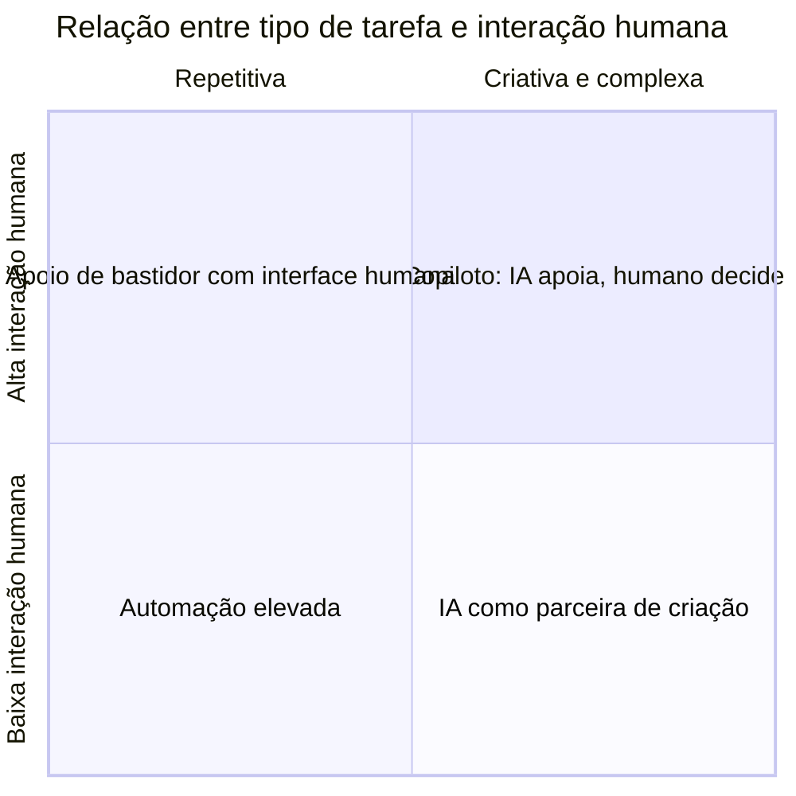

A interpretação apresentada é:

- **repetitiva + baixa compaixão:** alto potencial de automação;
- **complexa + alta compaixão:** IA atua como copiloto, mantendo decisão humana;
- **criativa + baixa compaixão:** IA pode executar partes do processo e atuar como parceira;
- **repetitiva + alta interação:** IA apoia nos bastidores, enquanto a pessoa continua na interface humana.

> [!IMPORTANT]
> A aula não reduz o debate a “profissões serão substituídas”. O foco está na transformação das **tarefas** e na capacidade de pessoas utilizarem IA para ampliar desempenho.

---

## 10. Ética e uso responsável

O e-book destaca três temas principais.

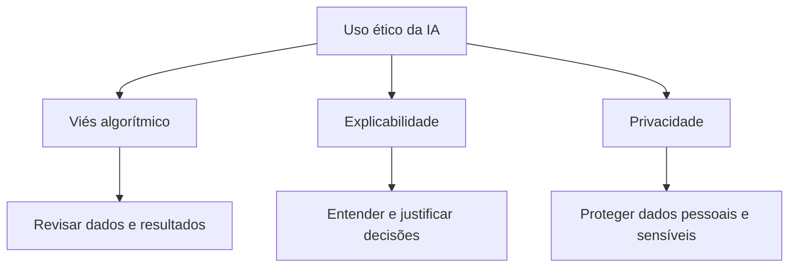

### 10.1 Viés algorítmico

Modelos aprendem padrões existentes nos dados. Caso os dados reproduzam distorções ou preconceitos, o sistema pode perpetuá-los.

### 10.2 Explicabilidade

Em decisões sensíveis, compreender como o sistema chegou ao resultado aumenta confiança e capacidade de auditoria.

### 10.3 Privacidade

Dados pessoais ou corporativos não devem ser enviados indiscriminadamente a ferramentas de IA. O curso enfatiza proteção das informações e responsabilidade sobre o uso.

### 10.4 Trolley Problem

O material utiliza o **Dilema do Bonde** para discutir decisões automatizadas em situações nas quais qualquer escolha possui consequência moral.

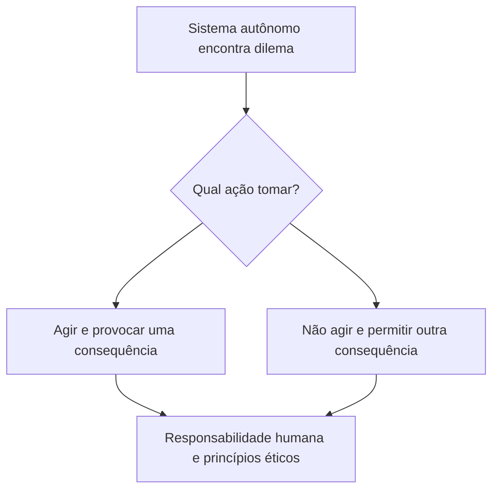

O ponto não é encontrar uma resposta única, mas reconhecer que decisões automatizadas exigem valores, governança e responsabilidade humana.

---

## 11. Evolução apresentada no material

Os slides apresentam uma progressão de capacidades:

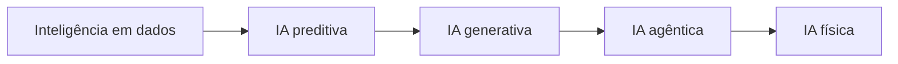

A progressão sugere uma passagem de sistemas que analisam dados para sistemas que preveem, geram conteúdo, tomam ações de forma mais autônoma e, finalmente, interagem com o mundo físico.

---

## 12. Resumo para a prova

> [!IMPORTANT]
> Memorize estas relações:
>
> - IA é o campo amplo.
> - Machine Learning aprende padrões a partir de dados.
> - Deep Learning usa redes neurais profundas.
> - IA Generativa cria novos conteúdos.
> - Programação tradicional usa regras explícitas; ML aprende um modelo.
> - Supervisionado = dados rotulados.
> - Não supervisionado = padrões sem rótulos.
> - Reforço = tentativa, erro e recompensa.
> - Dados precisam ser transformados em informação e decisão para gerar valor.
> - A adoção responsável exige atenção a viés, explicabilidade e privacidade.
> - O impacto da IA deve ser analisado no nível das tarefas e da interação humano-máquina.

### Linha do tempo mínima

**Bayes → Ada Lovelace → Turing → Arthur Samuel → Dartmouth/1956 → ELIZA → inverno da IA → Deep Blue/1997 → avanços de Deep Learning/2006 → GANs/2014 → AlphaGo/2016 → popularização da IA generativa.**

---

## 13. Perguntas de revisão

1. Qual é a diferença entre programação tradicional e Machine Learning?
2. Por que Machine Learning é considerado um subconjunto da IA?
3. Como Deep Learning se relaciona com Machine Learning?
4. O que caracteriza IA Generativa?
5. O que diferencia aprendizado supervisionado, não supervisionado e por reforço?
6. Por que a conferência de Dartmouth de 1956 é importante?
7. Qual é o papel histórico de Alan Turing?
8. O que o Deep Blue demonstrou em 1997?
9. Por que dados de qualidade são importantes para IA?
10. Quais competências técnicas e comportamentais o curso associa a IA e Ciência de Dados?
11. Como a matriz “tipo de tarefa × compaixão” ajuda a discutir impacto no trabalho?
12. Quais são os três temas éticos centrais apresentados na aula?
13. Como o Trolley Problem se relaciona com sistemas autônomos?
14. O que significa a evolução de IA preditiva para IA generativa, agêntica e física?

---

## 14. Mapa mental da Aula 1

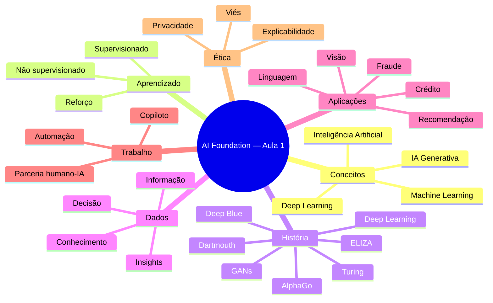

## Referência no material da disciplina

- Aula 1 — E-book *Introdução à Inteligência Artificial*, páginas 2–19.
- Aula 1 — Slides *AI Foundation*, tópicos “O que é”, “A História”, “Aplicações”, “Impacto no trabalho” e “Futuro”.
