# 02 — Panorama da Inteligência Artificial Moderna

## 1. Objetivos da aula

A segunda aula aprofunda as tecnologias que compõem a IA moderna. O eixo central é entender **quando usar Machine Learning tradicional, Deep Learning e modelos de linguagem**, além de conhecer as principais arquiteturas, bibliotecas e aplicações de NLP, visão computacional, GANs e LLMs.

A agenda apresentada nos slides é:

- Machine Learning;
- Deep Learning;
- NLP;
- Visão Computacional;
- GANs;
- LLMs.

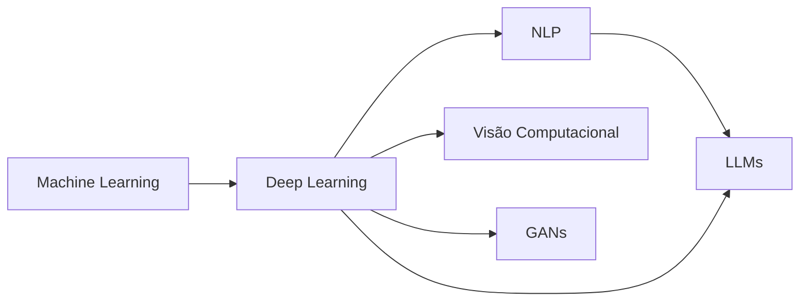

---

# Parte I — Machine Learning

## 2. O que é Machine Learning?

Machine Learning é apresentado como um subconjunto da IA que permite criar sistemas capazes de identificar padrões em grandes volumes de dados. Em vez de depender apenas de regras fixas, algoritmos aprendem com exemplos e ajustam seu comportamento a partir dos dados.

As aplicações citadas incluem:

- previsão de demanda;
- churn;
- recomendação de produtos;
- otimização logística e de produção;
- precificação dinâmica.

> [!NOTE]
> No material, **dados são a principal matéria-prima do modelo**. Quantidade isolada não basta: qualidade e representatividade dos dados influenciam diretamente as inferências.

---

## 3. Tipos de Machine Learning

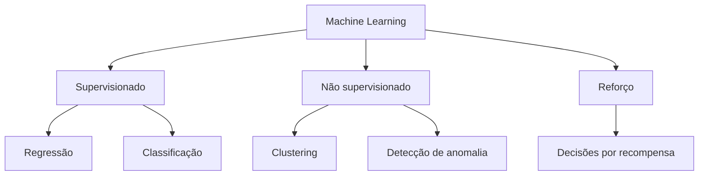

### 3.1 Aprendizado supervisionado

O modelo aprende a partir de dados rotulados.

- **Regressão:** prever valores contínuos.
- **Classificação:** atribuir uma classe ou categoria.

### 3.2 Aprendizado não supervisionado

O modelo procura estrutura nos dados sem rótulos previamente definidos.

- clustering;
- descoberta de grupos;
- detecção de padrões e anomalias.

### 3.3 Aprendizado por reforço

O modelo aprende por tentativa e erro utilizando recompensas e penalidades.

---

## 4. Qual tipo de modelo escolher?

Os slides apresentam um quadro didático baseado na pergunta de negócio.

| Pergunta | Modelo | Tipo apresentado |
|---|---|---|
| Quanto custa? Quantos existem? | Regressão | Supervisionado |
| A qual categoria pertence? | Classificação | Supervisionado |
| Existem grupos diferentes? | Clustering | Não supervisionado |
| Isso é estranho? | Detecção de anomalia | Não supervisionado |
| Qual opção escolher? | Recomendação | Não supervisionado no quadro da aula |

> [!WARNING]
> Esse quadro deve ser estudado como **classificação didática do material**. Em projetos reais, recomendação e detecção de anomalias podem ser implementadas com diferentes estratégias de aprendizado, dependendo do problema e dos dados disponíveis.

---

## 5. Principais algoritmos apresentados

| Algoritmo | Uso principal apresentado | Ideia central |
|---|---|---|
| Regressão Linear | preços, faturamento | ajusta relação linear entre variáveis |
| Regressão Logística | churn, aprovação sim/não | estima probabilidade de classe binária |
| Árvore de Decisão | crédito, triagem | decisões por regras em ramos |
| Random Forest | risco, crédito | combina várias árvores |
| KNN | recomendação, classificação | usa exemplos mais próximos |
| SVM | fraude, classificação | busca um hiperplano com boa margem |
| Naive Bayes | spam, texto | usa probabilidade condicional |
| Gradient Boosting | modelos de alta performance | árvores sequenciais corrigem erros anteriores |
| K-Means | segmentação | agrupa dados por distância |
| Redes Neurais | imagem, voz, texto | múltiplas camadas aprendem representações |

### 5.1 Regressão Linear

Usada para prever valores contínuos.

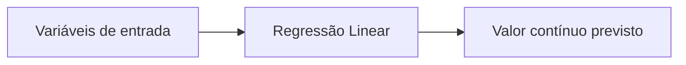

Exemplos: preço de imóvel e faturamento.

### 5.2 Regressão Logística

Apesar do nome “regressão”, é usada no curso como algoritmo de **classificação binária**, estimando a probabilidade de uma das duas classes.

### 5.3 Árvores de Decisão

Dividem o espaço de dados por perguntas sucessivas.

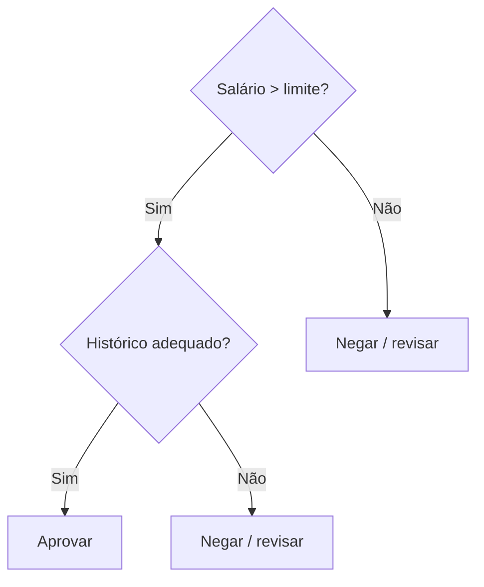

### 5.4 Random Forest

Combina várias árvores de decisão e agrega suas respostas, buscando maior robustez e menor tendência ao overfitting do que uma única árvore.

### 5.5 K-Nearest Neighbors — KNN

Classifica um exemplo com base nos exemplos mais próximos segundo uma medida de distância.

### 5.6 Support Vector Machines — SVM

Procura separar classes por um hiperplano com a maior margem possível.

### 5.7 Naive Bayes

Classificador probabilístico baseado no Teorema de Bayes, apresentado com aplicações de spam e classificação textual.

### 5.8 Gradient Boosting

O material cita **XGBoost, LightGBM e CatBoost** como abordagens que combinam árvores sequencialmente, buscando corrigir os erros das etapas anteriores.

### 5.9 K-Means

Algoritmo de clustering que organiza exemplos em `k` grupos segundo proximidade.

---

## 6. scikit-learn

A biblioteca é apresentada como o “canivete suíço” do Machine Learning tradicional em Python.

Principais características citadas:

- código aberto;
- classificação;
- regressão;
- clustering;
- redução de dimensionalidade;
- validação de modelos;
- integração com NumPy e Pandas;
- boa aplicação em dados tabulares/estruturados;
- prototipagem rápida.

### 6.1 Fluxo do exemplo Iris

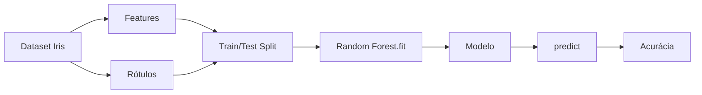

Código apresentado nos slides, reorganizado para estudo:

```python
from sklearn.datasets import load_iris
from sklearn.model_selection import train_test_split
from sklearn.ensemble import RandomForestClassifier
from sklearn.metrics import accuracy_score

iris = load_iris()
X = iris.data
y = iris.target

X_train, X_test, y_train, y_test = train_test_split(
    X, y, test_size=0.3, random_state=42
)

modelo = RandomForestClassifier(n_estimators=100, random_state=42)
modelo.fit(X_train, y_train)

y_pred = modelo.predict(X_test)
acc = accuracy_score(y_test, y_pred)
print(f"Acurácia: {acc:.2f}")
```

> [!IMPORTANT]
> O fluxo **carregar dados → dividir treino/teste → treinar → prever → avaliar** é uma estrutura fundamental de projetos supervisionados.

---

# Parte II — Deep Learning

## 7. O que é Deep Learning?

Deep Learning é apresentado como uma vertente avançada de Machine Learning que utiliza redes neurais artificiais profundas para aprender representações diretamente dos dados.

### ML tradicional × Deep Learning

| Aspecto | ML tradicional | Deep Learning |
|---|---|---|
| Extração de características | frequentemente depende de engenharia humana | aprende representações automaticamente |
| Volume de dados | pode funcionar bem com bases menores/estruturadas | normalmente se beneficia de grandes volumes |
| Dados comuns | tabelas e features definidas | imagem, áudio, texto, sinais complexos |
| Modelos | regressões, árvores, SVM etc. | redes neurais profundas |

---

## 8. Estrutura de uma rede neural

Uma rede neural é composta por:

- camada de entrada;
- uma ou mais camadas ocultas;
- camada de saída.

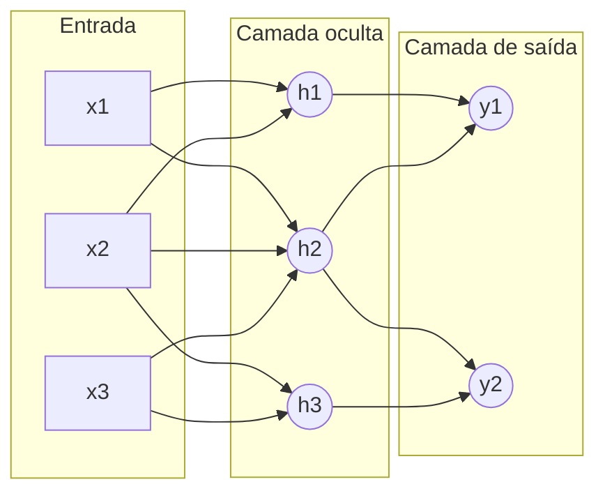

Quanto maior o número de camadas ocultas, mais “profunda” é a rede segundo a explicação didática do curso.

---

## 9. Neurônio, pesos, viés e ativação

Cada neurônio recebe entradas e aplica pesos. O material também cita viés e função de ativação.

Uma forma compacta de representar o processamento é:

```text
entrada ponderada = soma(entrada × peso) + viés
saída = função_de_ativação(entrada ponderada)
```

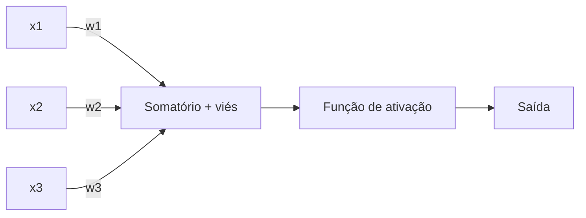

### Perceptron

Frank Rosenblatt é associado no material ao Perceptron, apresentado como uma das primeiras formas práticas de neurônio/rede artificial e como classificador binário.

---

## 10. Como a rede aprende?

O curso descreve o treinamento supervisionado como um ciclo de ajustes sucessivos dos pesos.

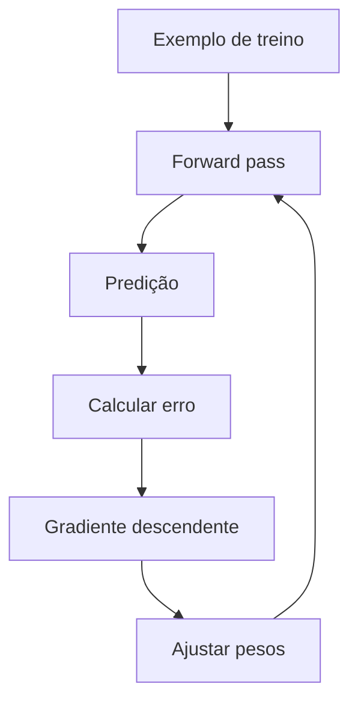

O objetivo é reduzir o erro para que o modelo generalize para dados não vistos.

### Etapas de dados

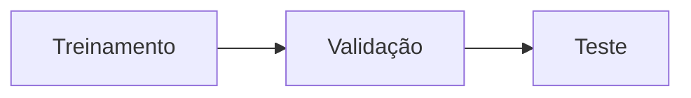

- **treinamento:** ajusta parâmetros;
- **validação:** auxilia escolha e ajuste do modelo;
- **teste:** mede desempenho final em dados separados.

---

## 11. Arquiteturas de Deep Learning

### 11.1 CNN — Convolutional Neural Networks

Indicadas no material para visão computacional:

- classificação de imagens;
- detecção de objetos;
- OCR;
- diagnóstico por imagem;
- inspeção industrial;
- biometria facial.

### 11.2 RNN — Recurrent Neural Networks

Capturam dependências temporais ou sequenciais.

Exemplos:

- séries temporais;
- texto;
- tradução;
- reconhecimento de voz;
- predição de sequências.

### 11.3 LSTM — Long Short-Term Memory

Variante de RNN apresentada para lidar melhor com dependências de longo prazo.

### 11.4 Transformers

Arquitetura baseada em **atenção/self-attention**, apresentada como base de modelos modernos de NLP e LLMs, incluindo famílias como GPT, BERT e T5.

### 11.5 GANs

Arquitetura generativa composta por dois modelos que competem entre si: Gerador e Discriminador.

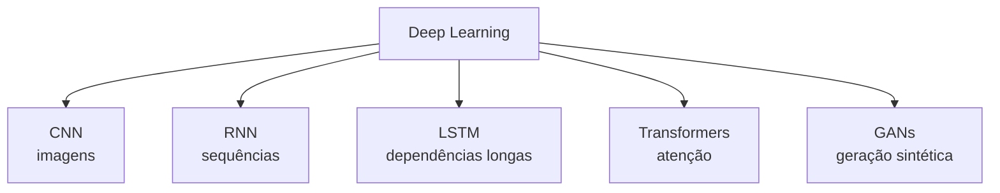

---

## 12. Por que Deep Learning avançou?

O material destaca a combinação de quatro fatores:

- Big Data;
- GPUs;
- computação em nuvem;
- modelos, APIs e bibliotecas mais acessíveis.

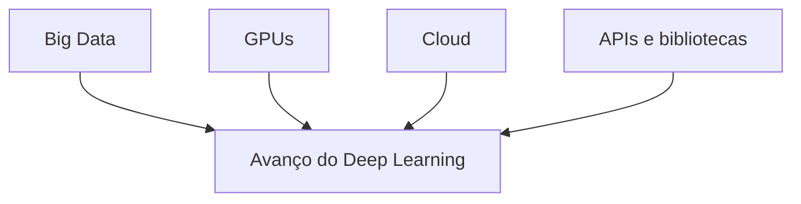

Aplicações citadas:

- reconhecimento facial;
- tradução em tempo real;
- diagnóstico por imagem;
- veículos autônomos.

---

## 13. TensorFlow em ação — MNIST

O e-book demonstra uma rede neural para classificar dígitos manuscritos de 0 a 9 utilizando TensorFlow.

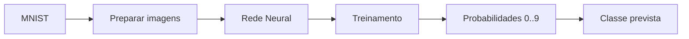

Na compilação do modelo, a aula destaca:

- otimizador relacionado a descida do gradiente;
- função de perda baseada em entropia cruzada categórica;
- métrica de acurácia.

> [!IMPORTANT]
> A rede não “vê” o dígito como um humano. Ela recebe números correspondentes aos pixels e aprende padrões estatísticos associados a cada classe.

---

# Parte III — NLP

## 14. O que é Processamento de Linguagem Natural?

NLP é a área da IA voltada a permitir que máquinas processem, interpretem e gerem linguagem humana.

O material destaca que linguagem é um tipo de dado **não estruturado**.

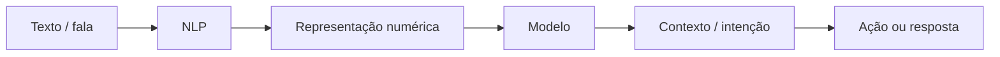

### 14.1 Tarefas de NLP

- classificação de texto;
- análise de sentimentos;
- extração de entidades;
- geração de texto;
- resumo;
- pesquisa semântica;
- respostas automatizadas.

### 14.2 Embeddings

O curso apresenta embeddings como representações vetoriais de texto usadas para permitir que modelos operem sobre similaridade semântica.

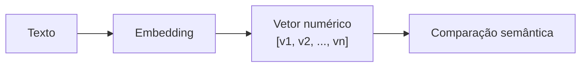

### 14.3 Técnicas e modelos citados

- Word2Vec;
- BERT;
- Transformers.

### 14.4 Bibliotecas

| Ferramenta | Ênfase apresentada |
|---|---|
| NLTK | educação, pesquisa, fundamentos |
| spaCy | performance e pipelines de produção |
| Transformers / Hugging Face | modelos modernos e fine-tuning |

### 14.5 Aplicações corporativas

- Jurídico: localizar cláusulas;
- RH: triagem de currículos;
- Vendas: redação personalizada;
- Suporte: respostas automáticas;
- Marketing: análise de reputação e sentimento.

### 14.6 Desafios

- ambiguidade;
- duplo sentido;
- viés herdado dos dados;
- necessidade de curadoria humana em tarefas críticas.

---

# Parte IV — Visão Computacional

## 15. O que é Visão Computacional?

Visão Computacional é apresentada como a área que permite a computadores analisar imagens e vídeos, reconhecendo padrões, objetos, regiões e movimentos.

### 15.1 Como o computador representa uma imagem?

Em tons de cinza, um pixel é representado por um valor de `0` a `255`.

- `0` → preto;
- `255` → branco;
- valores intermediários → tons de cinza.

Em uma imagem colorida RGB, cada pixel possui três componentes:

```text
Pixel = (R, G, B)
R ∈ [0,255]
G ∈ [0,255]
B ∈ [0,255]
```

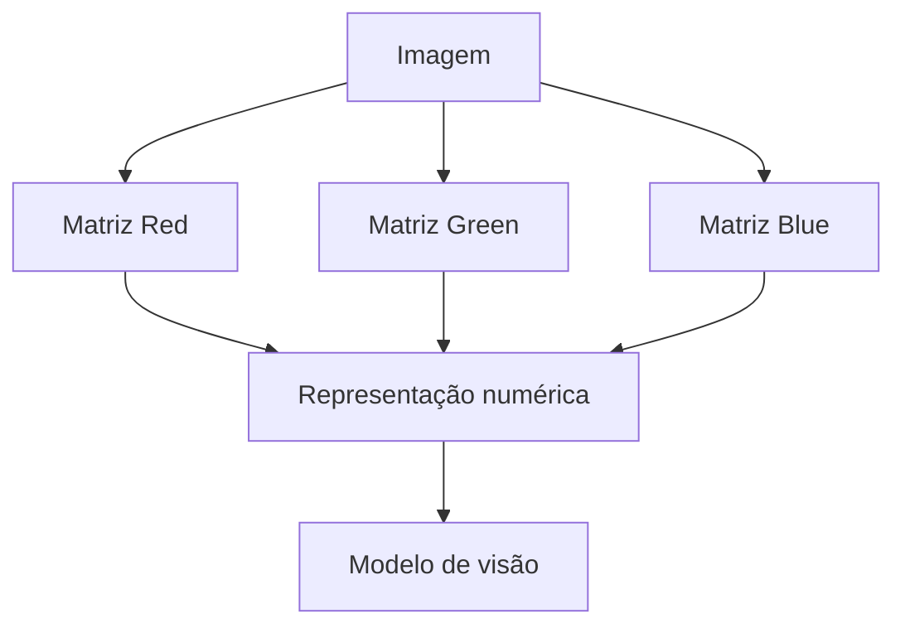

> [!NOTE]
> O computador processa **matrizes numéricas**; o significado visual é aprendido a partir dos padrões existentes nessas matrizes.

### 15.2 Tarefas comuns

| Tarefa | Pergunta |
|---|---|
| Classificação | O que existe na imagem? |
| Detecção | Onde está o objeto? |
| Segmentação | Qual é a área/forma exata? |
| OCR | Qual texto aparece? |
| Reconhecimento | Quem/o que é? |
| Rastreamento | Para onde o objeto se move? |

### 15.3 Aplicações

- inspeção industrial;
- leitura de documentos;
- reconhecimento facial e de placas;
- medicina;
- segurança;
- veículos autônomos;
- monitoramento de estoques e operações.

### 15.4 Limitações

- necessidade de dados representativos;
- viés em reconhecimento;
- custo de processamento em vídeo e tempo real.

### 15.5 Ferramentas citadas

- OpenCV;
- MediaPipe;
- Detectron2;
- YOLO.

---

# Parte V — GANs

## 16. O que são GANs?

GAN significa **Generative Adversarial Network**.

O sistema possui dois componentes:

- **Gerador:** tenta produzir amostras sintéticas convincentes;
- **Discriminador:** tenta distinguir dados reais de dados gerados.

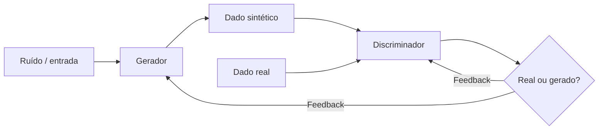

A competição melhora gradualmente a qualidade das amostras geradas.

### 16.1 Aplicações

- rostos sintéticos;
- cenários simulados;
- data augmentation;
- arte generativa;
- design;
- moda;
- entretenimento;
- imagens de produtos;
- interiores de imóveis;
- simulações automotivas.

### 16.2 Riscos

- deepfakes;
- manipulação de informação;
- conteúdo visual realista sem transparência;
- necessidade de rastreabilidade e políticas de uso.

### 16.3 Frameworks citados

- PyTorch;
- TensorFlow + Keras;
- TorchGAN.

---

# Parte VI — Large Language Models

## 17. O que é um LLM?

LLM significa **Large Language Model**. A explicação didática do curso é que um modelo de linguagem aprende a prever a continuação de uma sequência textual com base no contexto anterior, em escala muito maior do que um simples autocompletar.

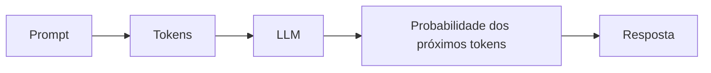

### NLP × LLM

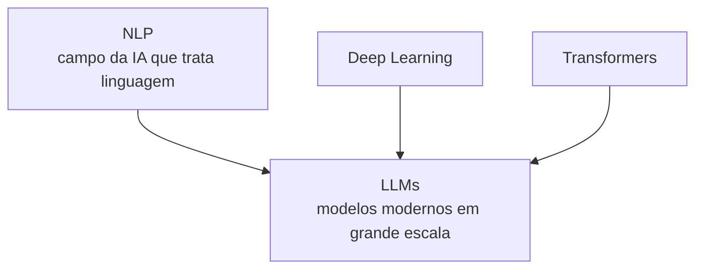

> [!IMPORTANT]
> NLP é o **campo**. LLM é uma **família de modelos** usada para executar diversas tarefas de NLP.

---

## 18. Conceitos fundamentais de LLMs

### Token

Unidade em que o texto é dividido para processamento pelo modelo.

### Inferência

Processo de utilizar um modelo já treinado para produzir uma resposta.

### Prompt

Instrução enviada ao modelo.

### Prompt Engineering

Uso estruturado de instruções para guiar respostas. O tema é aprofundado na Aula 3.

### Zero-shot e Few-shot

- **zero-shot:** executar tarefa sem exemplos explícitos no prompt;
- **few-shot:** fornecer poucos exemplos para orientar o comportamento.

### Fine-tuning

Ajuste de um modelo já treinado utilizando exemplos adicionais para adaptar o comportamento a um contexto.

### Multimodalidade

Capacidade de lidar com mais de uma modalidade, como texto, imagem, áudio ou vídeo.

### Guardrails

Regras e proteções usadas para limitar comportamentos e respostas.

### Copilot / Assistente

Interface de IA incorporada ao fluxo de trabalho do usuário.

---

## 19. RAG — Retrieval-Augmented Generation

O material define RAG como uma técnica que conecta o modelo a uma fonte confiável de dados para reduzir erros e contextualizar respostas.

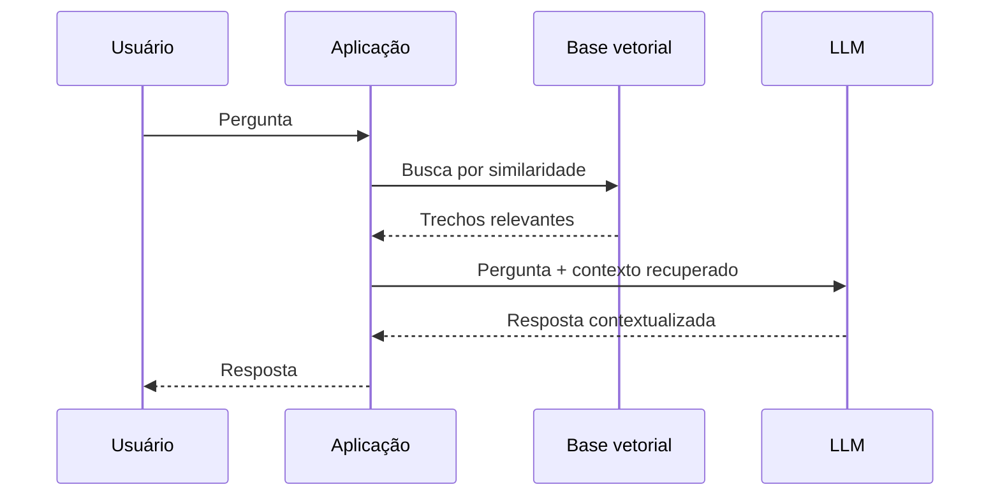

### Embeddings + base vetorial

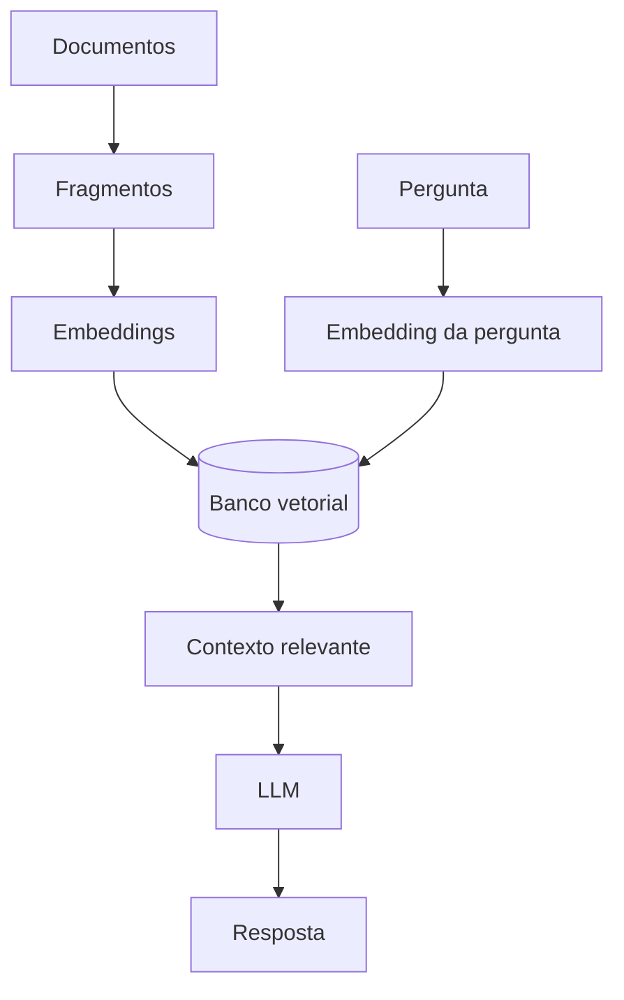

---

## 20. LLMs em empresas

Aplicações mencionadas:

- atendimento;
- análise jurídica;
- vendas;
- RH;
- análise de documentos;
- comparação de contratos;
- resumo e extração de insights;
- automação de comunicação.

### Exemplo: análise de contratos

```mermaid
flowchart LR
    C1[Contrato analisado] --> L[LLM / solução de IA]
    PAD[Contrato padrão] --> L
    L --> DIF[Divergências]
    DIF --> H[Validação humana]
```

---

## 21. Riscos de LLMs

O material enfatiza:

- alucinação;
- viés;
- vazamento de dados;
- riscos legais;
- uso inadequado de informações sensíveis.

### Controles apresentados

```mermaid
flowchart TD
    R[Riscos de LLM] --> P[Prompting responsável]
    R --> DLP[DLP]
    R --> S[Rotulagem de sensibilidade]
    R --> H[Humano no loop]
    R --> G[Guardrails]
```

### Modelo híbrido

O material resume a ideia de humano no loop da seguinte forma:

```mermaid
flowchart LR
    IA[IA produz primeira análise] --> H[Humano valida/corrige]
    H --> A[Ação final]
```

A IA acelera; a pessoa continua responsável pela validação em cenários relevantes.

---

## 22. Como decidir entre ML, DL e LLM?

```mermaid
flowchart TD
    P[Qual é o problema?] --> T{Dados tabulares e previsão/classificação?}
    T -->|Sim| ML[ML tradicional]
    T -->|Não| U{Imagem, áudio ou padrões complexos?}
    U -->|Sim| DL[Deep Learning]
    U -->|Não| L{Problema centrado em linguagem/conhecimento textual?}
    L -->|Sim| LLM[LLM / NLP]
    L -->|Não| X[Reformular problema e dados]
```

| Cenário | Tecnologia que o curso destaca |
|---|---|
| previsão de preço estruturada | ML / regressão |
| churn | ML / classificação |
| segmentação | clustering |
| classificação de imagens | CNN / Deep Learning |
| sequência ou série temporal | RNN/LSTM |
| linguagem moderna | Transformers / LLMs |
| geração de dados sintéticos | GANs |
| perguntas sobre documentos internos | LLM + RAG |

---

## 23. Resumo para a prova

> [!IMPORTANT]
> - **Regressão** prevê valor contínuo.
> - **Classificação** prevê categoria.
> - **Clustering** encontra grupos.
> - **Random Forest** combina árvores.
> - **Gradient Boosting** corrige erros sequencialmente.
> - **scikit-learn** é a biblioteca apresentada para ML tradicional.
> - **Deep Learning** utiliza redes neurais profundas.
> - **CNN** → imagens.
> - **RNN/LSTM** → sequências.
> - **Transformer** → atenção; base dos LLMs modernos.
> - **GAN** → Gerador + Discriminador.
> - **NLP** trata linguagem humana.
> - **Visão Computacional** transforma imagens em dados numéricos analisáveis.
> - **LLM** é um grande modelo de linguagem.
> - **RAG** recupera contexto externo para apoiar geração.
> - **Fine-tuning** adapta um modelo já treinado.
> - **Guardrails, DLP e humano no loop** reduzem riscos operacionais.

---

## 24. Perguntas de revisão

1. Quando usar regressão e quando usar classificação?
2. O que diferencia aprendizado supervisionado e não supervisionado?
3. Como Random Forest difere de uma Árvore de Decisão isolada?
4. Como funciona Gradient Boosting em alto nível?
5. O que K-Means faz?
6. Qual é o fluxo básico de treinamento com scikit-learn?
7. Qual a diferença entre ML tradicional e Deep Learning?
8. Quais são as três camadas conceituais de uma rede neural?
9. Como o gradiente descendente participa do treinamento?
10. Para que servem CNN, RNN, LSTM, Transformers e GANs?
11. O que é NLP?
12. O que é um embedding?
13. Como uma imagem RGB é representada numericamente?
14. Qual a diferença entre classificação, detecção e segmentação de imagem?
15. Como Gerador e Discriminador interagem em uma GAN?
16. O que é um LLM?
17. Qual a relação entre NLP, Deep Learning, Transformers e LLMs?
18. O que é token?
19. O que é RAG?
20. Qual a diferença entre RAG e fine-tuning conforme os conceitos apresentados?
21. O que significa multimodalidade?
22. Quais riscos corporativos são associados a LLMs?
23. Por que o humano no loop é importante?

---

## 25. Mapa mental da Aula 2

```mermaid
mindmap
  root((AI Foundation — Aula 2))
    Machine Learning
      Supervisionado
      Não supervisionado
      Reforço
      Regressão
      Classificação
      Clustering
      scikit-learn
    Deep Learning
      Redes neurais
      Perceptron
      Gradiente
      CNN
      RNN
      LSTM
      Transformers
    NLP
      Classificação
      Sentimento
      Entidades
      Embeddings
      spaCy
      Hugging Face
    Visão Computacional
      Pixels
      RGB
      Classificação
      Detecção
      Segmentação
      OCR
    GANs
      Gerador
      Discriminador
      Dados sintéticos
      Deepfakes
    LLMs
      Tokens
      Inferência
      Prompt
      RAG
      Fine-tuning
      Multimodalidade
      Guardrails
```

## Referência no material da disciplina

- Aula 2 — E-book *Panorama da Inteligência Artificial Moderna*, páginas 2–21.
- Aula 2 — Slides *AI Foundation*, agenda Machine Learning, Deep Learning, NLP, Visão Computacional, GANs e LLMs.
