# 03 — Implementando IA na Prática

## 1. Objetivos da aula

A terceira aula desloca o foco de “o que é IA?” para “como implementar IA de forma útil, segura e sustentável?”. O conteúdo combina metodologia de projetos, descoberta de problemas, priorização, adoção organizacional, métricas, governança, Prompt Engineering, agentes e sistemas multiagentes.

A agenda apresentada é:

- metodologias;
- adoção;
- Prompt Engineering;
- agentes;
- multiagentes;
- futuro.

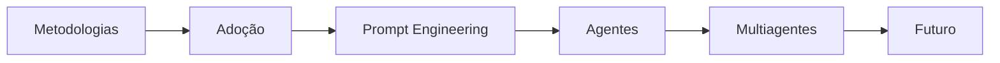

> [!NOTE]
> A mensagem estratégica da aula é que **IA é meio, não fim**. O projeto deve começar pelo problema de negócio e terminar em valor mensurável.

---

# Parte I — Metodologias

## 2. Por que usar metodologia em projetos de IA?

Projetos de IA possuem incerteza técnica e de negócio. Uma metodologia ajuda a:

- definir objetivos;
- estruturar etapas;
- organizar dados e hipóteses;
- criar critérios de avaliação;
- reduzir risco de construir uma solução sem utilidade;
- alinhar tecnologia e negócio.

O curso apresenta três abordagens:

1. CRISP-DM;
2. 7 Passos do Google;
3. Design Sprint + Canvas.

---

## 3. CRISP-DM

O **CRISP-DM** é apresentado como um framework clássico de ciência de dados e mineração de dados com seis etapas.

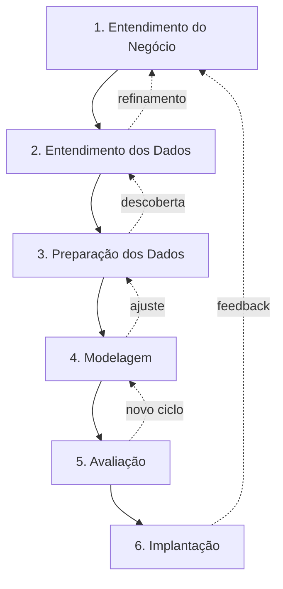

### 3.1 Entendimento do negócio

Perguntas centrais:

- qual é o problema?
- qual objetivo de negócio deve ser atingido?
- como saberemos que houve sucesso?

### 3.2 Entendimento dos dados

- explorar fontes;
- entender qualidade;
- identificar variáveis;
- avaliar cobertura e limitações.

### 3.3 Preparação dos dados

- seleção;
- limpeza;
- transformação;
- engenharia de características.

### 3.4 Modelagem

Escolha e treinamento de algoritmos apropriados ao problema.

### 3.5 Avaliação

Verificar se o modelo atende critérios técnicos e objetivos do negócio.

### 3.6 Implantação

Colocar a solução em uso, integrar ao processo e acompanhar resultados.

> [!IMPORTANT]
> CRISP-DM é **iterativo**. Descobertas em uma fase podem exigir retorno a etapas anteriores.

---

## 4. Os 7 passos do Google apresentados na aula

Os slides apresentam um ciclo de Data Science com sete etapas:

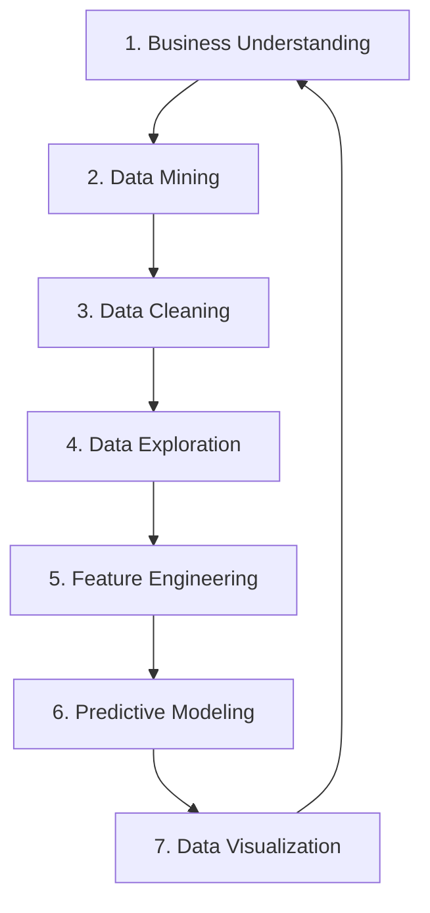

| Etapa | Finalidade didática |
|---|---|
| Business Understanding | entender problema e objetivos |
| Data Mining | obter os dados necessários |
| Data Cleaning | corrigir inconsistências e faltas |
| Data Exploration | investigar padrões e hipóteses |
| Feature Engineering | escolher/construir variáveis úteis |
| Predictive Modeling | treinar e avaliar modelos |
| Data Visualization | comunicar conclusões e resultados |

A lógica é próxima do CRISP-DM, mas apresentada como um fluxo prático de projeto de dados.

---

## 5. Distância entre expectativa e realidade

Um dos slides contrasta um “plano” linear com uma realidade cheia de obstáculos. O objetivo pedagógico é mostrar que projetos reais não avançam em linha reta.

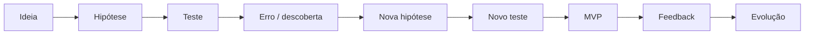

> [!TIP]
> Projetos de IA devem ser conduzidos como ciclos de descoberta, validação e aprendizado, e não como execução cega de um plano inicial.

---

# Parte II — Design Sprint + Canvas

## 6. Design Sprint

O curso referencia o método de Jake Knapp, John Zeratsky e Braden Kowitz, criado no Google e aperfeiçoado no Google Ventures, para testar ideias e reduzir incerteza rapidamente.

O objetivo é evitar grandes investimentos antes de validar problema e solução.

---

## 7. Design Sprint + Canvas — fluxo apresentado

A abordagem combina ideação, participação colaborativa e priorização.

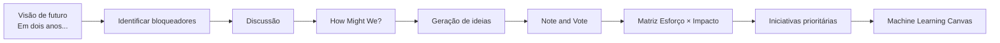

### 7.1 Together Alone

Os participantes registram ideias individualmente antes da discussão em grupo. O objetivo é garantir participação independente da habilidade de comunicação ou influência na sala.

### 7.2 Bloqueadores

Depois de definir a visão futura, o grupo identifica obstáculos que impedem alcançá-la.

### 7.3 How Might We — HMW

“Como poderíamos...?” transforma um problema em uma pergunta aberta que estimula geração de soluções.

Um bom HMW, segundo os slides:

- não contém a solução dentro da pergunta;
- foca na necessidade do usuário;
- convida à exploração.

Exemplo do material:

**Problema:** usuários esquecem a senha com frequência.

Possíveis HMWs:

- Como poderíamos tornar a recuperação de acesso mais simples?
- Como poderíamos reduzir a dependência de memorização de senhas mantendo segurança?

### 7.4 Note and Vote

Ideias são registradas, discutidas e votadas para reduzir dispersão e construir decisão coletiva.

### 7.5 Matriz Esforço × Impacto

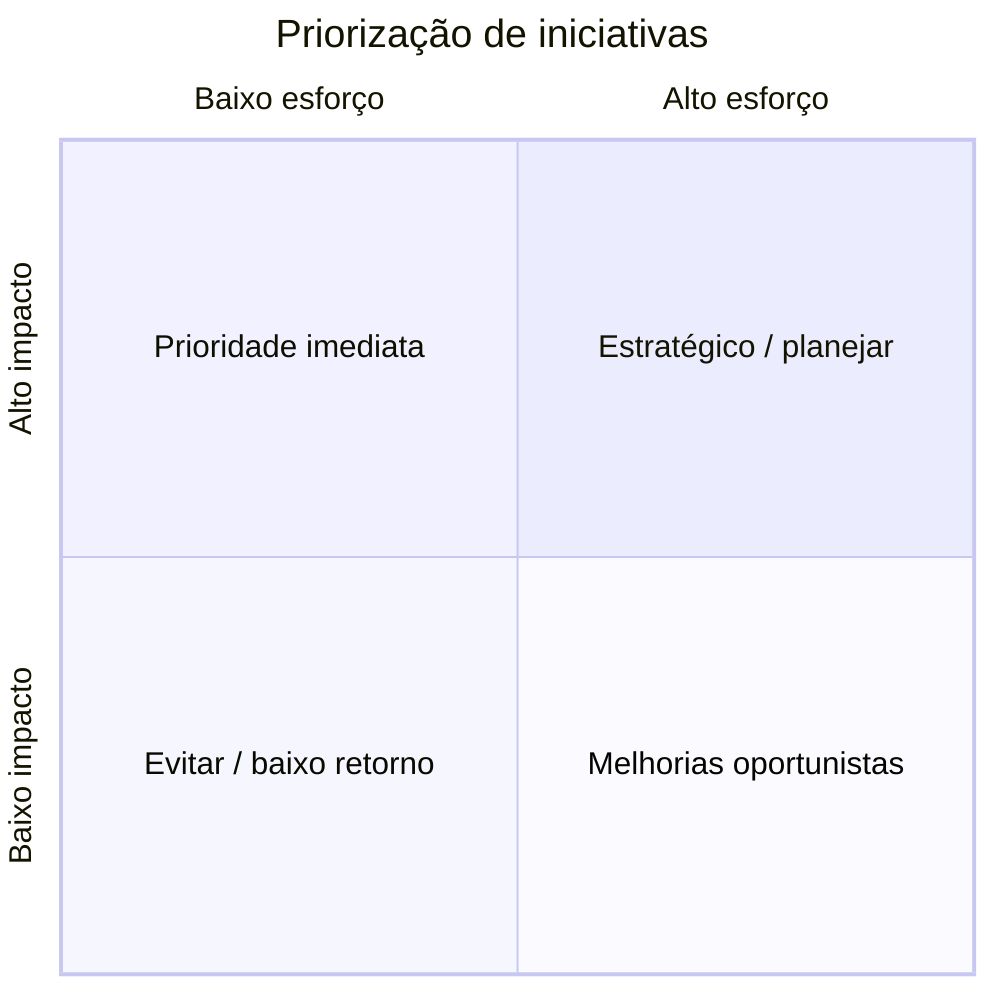

O quadrante de **alto impacto e baixo esforço** é o principal candidato para piloto/MVP.

---

## 8. Machine Learning Canvas

Depois da ideação, o Canvas organiza a proposta de IA.

O material destaca quatro grandes perguntas:

- **GOAL:** o que, por que e para quem?
- **LEARN:** como o modelo aprenderá?
- **PREDICT:** como fará previsões?
- **EVALUATE:** como medir se funciona?

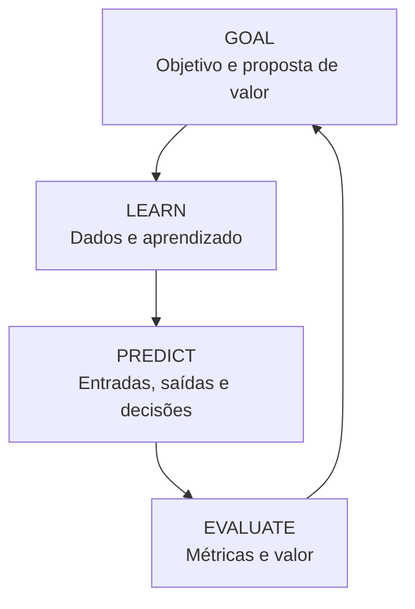

### 8.1 Proposta de valor

Perguntas:

- por que gestores apoiariam a iniciativa?
- qual benefício de negócio será criado?
- quais objetivos buscamos?

O exemplo da aula trata de **fazer melhores investimentos imobiliários**, comparando preço previsto com preço pedido.

### 8.2 Fontes de dados

O Canvas exige mapear fontes internas e externas. No estudo de caso imobiliário, os slides citam exemplos como:

- base interna;
- Google Maps;
- portais imobiliários.

### 8.3 Features

São características usadas pelo modelo. O e-book cita exemplos como:

- localização;
- valor;
- presença de piscina;
- características do imóvel.

### 8.4 Tarefa de Machine Learning

Exemplo do material:

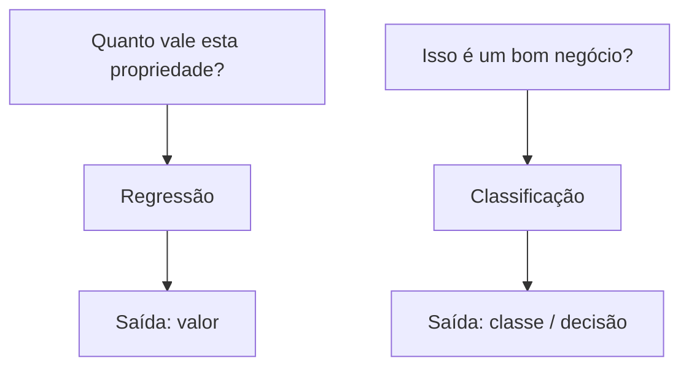

### 8.5 Decisões

O modelo só cria valor quando sua previsão modifica uma decisão.

No caso do exemplo imobiliário:

1. calcular previsões periodicamente;
2. comparar preço pedido × preço estimado;
3. filtrar oportunidades;
4. ordenar propriedades mais interessantes;
5. orientar a análise do profissional.

### 8.6 Avaliação

O Canvas deve estabelecer:

- métrica técnica;
- tempo de processamento;
- impacto financeiro;
- ROI;
- critério de sucesso para o negócio.

> [!IMPORTANT]
> O Canvas conecta **modelo → decisão → valor**. Um modelo com boa acurácia, mas sem efeito útil no processo, não resolve o problema de negócio.

---

# Parte III — Estratégia de adoção

## 9. Quatro princípios de adoção

Os slides apresentam uma estratégia simples:

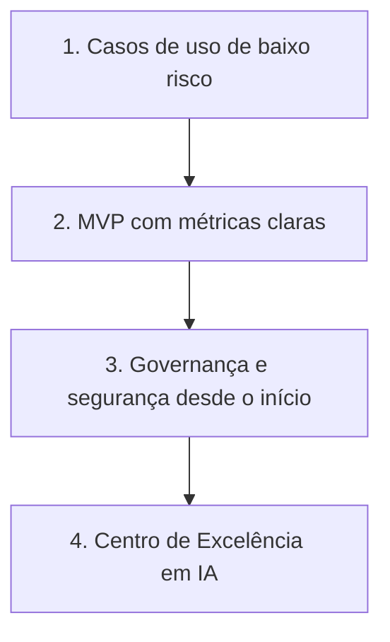

### 9.1 Começar com baixo risco e alto impacto

Evita expectativas irreais e reduz custo de falha.

### 9.2 Criar um MVP

O piloto deve possuir:

- escopo definido;
- time ou departamento específico;
- baseline;
- métricas de sucesso.

KPIs citados:

- percentual de tarefas automatizadas;
- feedback dos usuários;
- tempo médio de resposta;
- comparação antes × depois.

### 9.3 Governança e segurança desde o início

Evita a proliferação descontrolada de ferramentas, dados e soluções sem políticas corporativas.

### 9.4 Formar um CoE

O Centro de Excelência permite transformar experimentos isolados em capacidade organizacional.

---

## 10. Como identificar áreas candidatas

A aula combina ideação e análise de produtividade.

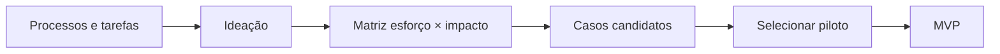

O conteúdo também cruza:

- experiência do colaborador;
- complexidade da tarefa.

A IA pode ajudar tanto profissionais iniciantes em tarefas simples quanto especialistas em tarefas complexas, mas de maneiras diferentes.

---

## 11. Como medir valor

A aula insiste que **tempo economizado não é a única métrica**.

Três dimensões principais:

1. produtividade e eficiência;
2. satisfação do usuário;
3. custo evitado / impacto financeiro.

### 11.1 Produtividade

| Indicador | Como medir |
|---|---|
| Tempo médio por tarefa | comparar antes × depois |
| Retrabalho | versões/correções necessárias |
| Volume de entregas | tarefas por período |
| Taxa de automação | percentual assumido por IA |

### 11.2 Satisfação

Pode incluir feedback, adesão e NPS de usuários internos ou externos.

### 11.3 Custo evitado

| Indicador | Exemplo |
|---|---|
| custo por tarefa automatizada | hora humana × custo da solução |
| crescimento evitado de equipe | escalar sem novas contratações proporcionais |
| redução de erros | revisão automatizada |
| tempo de resposta a riscos | detecção mais rápida |

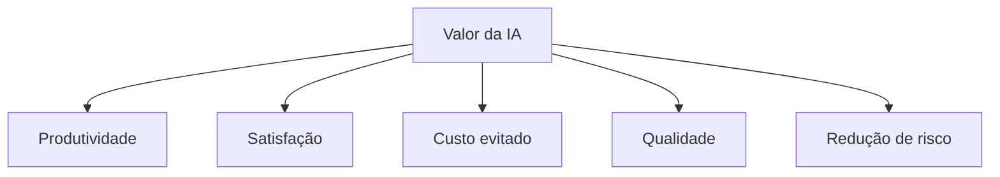

---

## 12. Governança e capacitação

A adoção não termina com a implantação técnica.

O material recomenda:

- cultura de experimentação;
- aulas e workshops;
- hackathons;
- compartilhamento de boas práticas;
- comunidade interna;
- biblioteca de prompts;
- onboarding contínuo;
- canais de suporte;
- feedback recorrente;
- monitoramento de viés;
- proteção de dados;
- controle de acesso;
- auditoria.

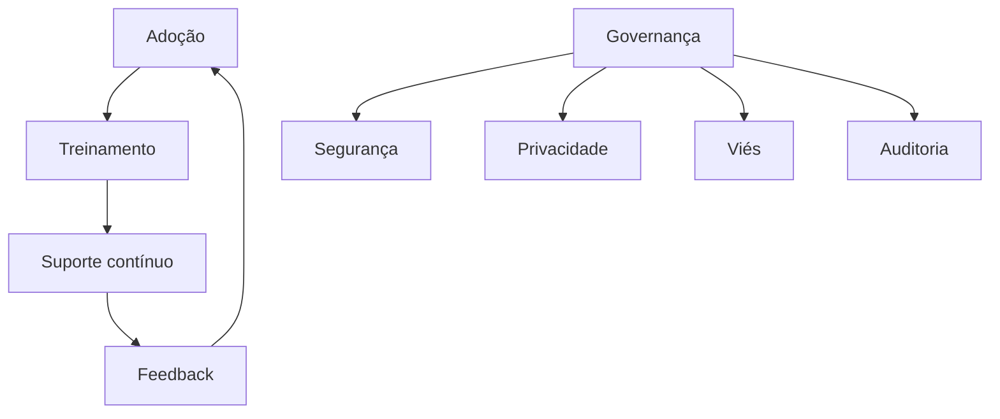

---

## 13. Centro de Excelência — CoE

O CoE é apresentado como uma estrutura multidisciplinar para organizar e expandir IA dentro da empresa. Pode ser centralizado, descentralizado, matricial ou virtual.

Quatro pilares do material:

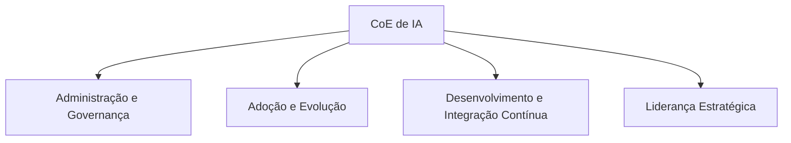

### 13.1 Administração e governança

- custos;
- compliance;
- DLP;
- usuários;
- capacidade;
- licenciamento.

### 13.2 Adoção e evolução

- treinamentos;
- hackathons;
- boas práticas;
- cases internos.

### 13.3 Desenvolvimento e integração contínua

- sustentação;
- atualização de modelos;
- ALM;
- DevOps;
- arquitetura;
- gestão de ambientes.

### 13.4 Liderança estratégica

- alinhamento com estratégia;
- decisões de priorização;
- gestão de mudança;
- execução do plano do CoE.

---

## 14. Engajamento executivo

Sem apoio executivo, a aula considera difícil escalar projetos de IA.

A recomendação é falar em linguagem de negócio:

- receita;
- custo;
- risco;
- eficiência;
- conversão;
- retrabalho;
- produtividade.

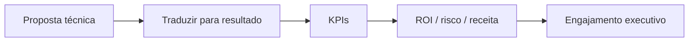

> [!TIP]
> “IA é tendência” não é justificativa de projeto. O caso deve mostrar **problema, resultado esperado e métrica**.

---

# Parte IV — Prompt Engineering

## 15. O que é Prompt Engineering?

É a habilidade de escrever comandos claros e estruturados para orientar LLMs na produção de respostas úteis e relevantes.

O e-book apresenta três componentes principais de um bom prompt:

1. **contexto**;
2. **tarefa**;
3. **formato/detalhamento**.

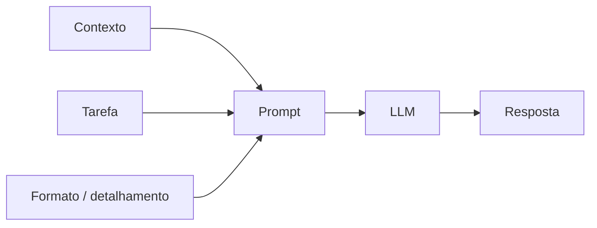

### 15.1 Contexto

Define cenário, objetivo e eventualmente o papel que o modelo deve assumir.

### 15.2 Tarefa

Diz exatamente o que deve ser produzido ou analisado.

### 15.3 Formato

Define estrutura da saída: tabela, tópicos, JSON, resumo, relatório etc.

---

## 16. Tipos de prompt citados

- prompt direto;
- prompt contextual;
- prompt multi-etapas;
- zero-shot;
- few-shot;
- role prompt;
- meta prompt / scaffold.

### Zero-shot

Sem exemplos fornecidos.

### Few-shot

Fornece alguns exemplos para orientar a resposta.

### Role prompt

Define um papel ou perspectiva.

### Scaffold

Estrutura progressiva de prompts para construir uma solução em etapas.

### Chain of Thought

O glossário do material cita a técnica como indução de raciocínio passo a passo para promover profundidade e lógica.

> [!NOTE]
> Para documentação e uso prático, o ponto mais importante da aula é **decompor problemas complexos em etapas claras**, e não depender de uma única pergunta vaga.

---

## 17. Processo iterativo de prompt

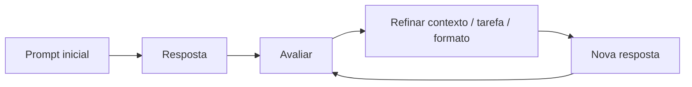

Boas práticas:

- ser específico;
- fornecer contexto;
- definir restrições;
- explicitar formato;
- testar variações;
- iterar.

Erros comuns:

- instrução vaga;
- ausência de contexto;
- não definir limites;
- não considerar o modelo utilizado;
- aceitar a primeira resposta sem revisão.

---

## 18. Template didático de prompt

```text
Contexto:
Você está trabalhando em [cenário].

Tarefa:
Analise / produza / compare [objetivo].

Dados disponíveis:
[conteúdo relevante]

Restrições:
- não invente dados;
- sinalize incertezas;
- use apenas as fontes fornecidas quando aplicável.

Formato de saída:
1. resumo;
2. análise;
3. riscos;
4. recomendação.
```

> [!IMPORTANT]
> Prompt Engineering não elimina a necessidade de validação. O usuário continua responsável por avaliar se a saída faz sentido para o contexto.

---

# Parte V — Agentes de IA

## 19. O que são agentes?

Os slides definem agentes como sistemas que utilizam LLMs para tomar decisões de forma dinâmica e executar tarefas.

O material posiciona agentes em um espectro entre fluxos guiados e maior autonomia.

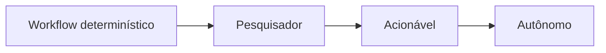

### Pesquisador

- recupera informação;
- raciocina sobre dados recuperados;
- resume;
- responde perguntas.

### Acionável

- executa ações;
- automatiza fluxos;
- substitui etapas repetitivas.

### Autônomo

- planeja dinamicamente;
- opera com maior independência;
- pode orquestrar outros agentes;
- adapta execução conforme contexto.

---

## 20. Workflow × Agente

| Aspecto | Workflow | Agente |
|---|---|---|
| Execução | predefinida em código | dinâmica e controlada pelo modelo |
| Flexibilidade | baixa | alta |
| Confiabilidade | alta/reprodutível | variável/adaptativa |
| Custo e latência | menores | maiores |
| Exemplo | RPA, chatbot guiado | vendas, análise, codificação autônoma |

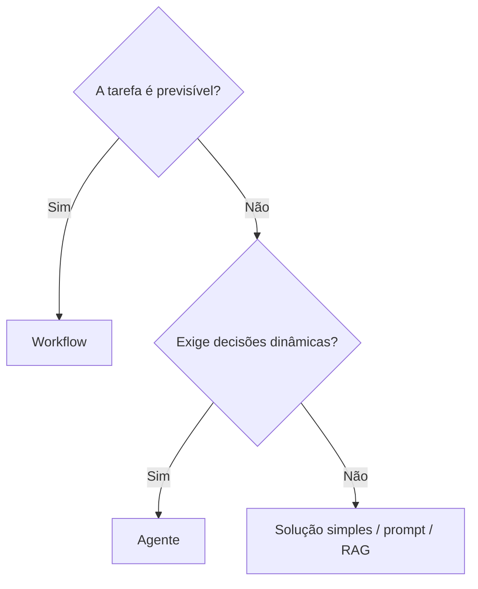

> [!IMPORTANT]
> O curso recomenda **não usar agentes quando um prompt, RAG ou workflow simples resolve o problema**.

---

## 21. Quando usar agentes?

Use quando:

- a tarefa é complexa e variável;
- há múltiplos caminhos;
- decisões dependem do contexto;
- ferramentas externas precisam ser escolhidas dinamicamente.

Evite quando:

- a tarefa é simples e previsível;
- custo e latência são muito sensíveis;
- um fluxo determinístico é suficiente;
- o risco de ação autônoma é incompatível com o processo.

---

## 22. Arquiteturas e padrões de agentes citados

- LLM + ferramentas externas;
- Prompt Chaining;
- Routing;
- agentes paralelos com votação/ensemble;
- orquestrador + subagentes;
- agente + avaliador/reflexão.

### 22.1 Tool Use

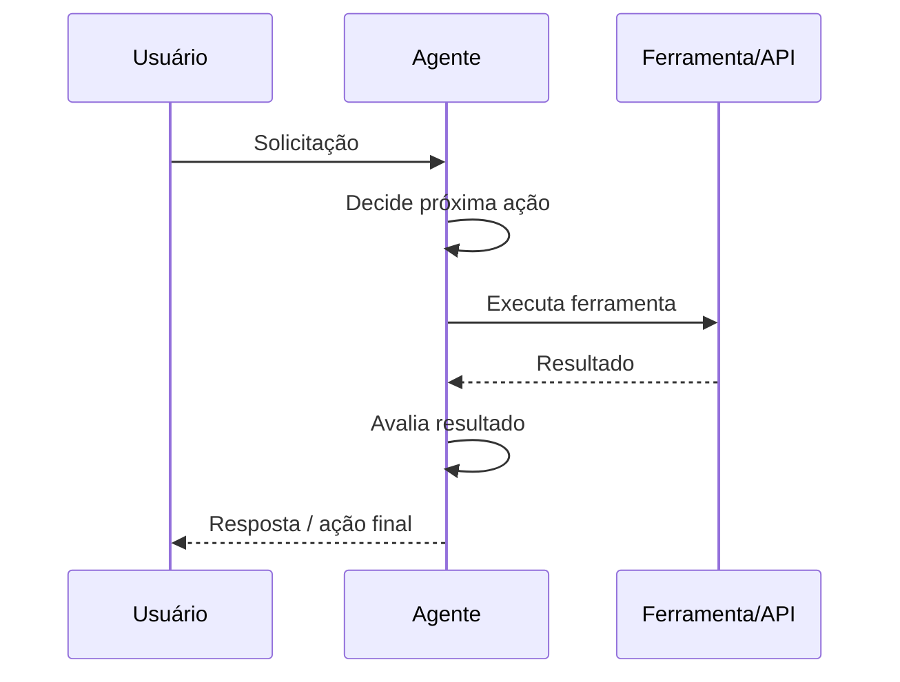

### 22.2 Routing

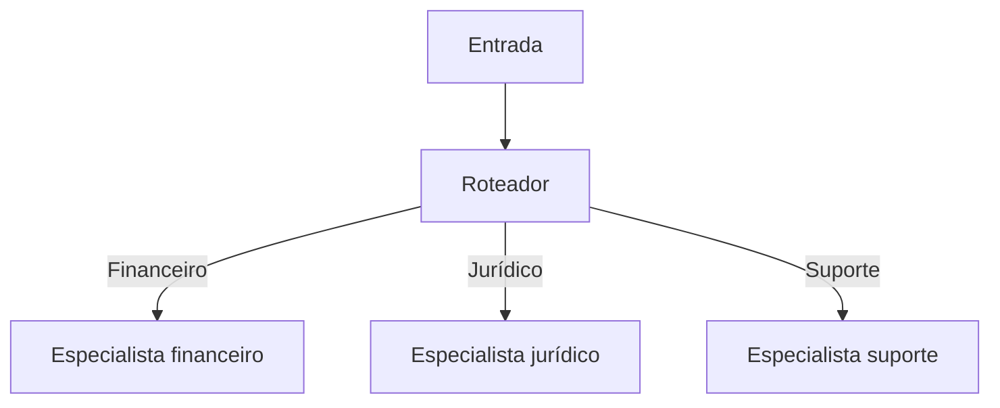

### 22.3 Orquestrador + subagentes

```mermaid
flowchart TD
    U[Usuário] --> O[Orquestrador / Planner]
    O --> A1[Agente de pesquisa]
    O --> A2[Agente executor]
    O --> A3[Agente revisor]
    A1 --> O
    A2 --> O
    A3 --> O
    O --> R[Resultado consolidado]
```

### 22.4 Agente + avaliador

```mermaid
flowchart LR
    G[Agente gerador] --> O[Saída]
    O --> E[Agente avaliador]
    E -->|Aprovado| F[Final]
    E -->|Revisar| G
```

---

## 23. Boas práticas para agentes

O material recomenda:

- começar simples;
- limitar ferramentas;
- documentar capacidades;
- impedir loops infinitos;
- observar alucinações de ferramenta;
- criar logs detalhados;
- testar;
- evoluir incrementalmente;
- monitorar custo e latência;
- avaliar segurança de execução.

### Principais riscos

```mermaid
mindmap
  root((Riscos de Agentes))
    Custo
    Latência
    Loops
    Alucinação
    Ferramentas
      Execução indevida
      Código
      Dados sensíveis
    Controle
      Decisões
      Auditoria
    Avaliação
      Definir sucesso
```

---

# Parte VI — Sistemas Multiagentes

## 24. O que são multiagentes?

Sistemas multiagentes são compostos por diversos agentes especializados que colaboram, delegam e trocam informações para resolver problemas mais complexos.

Objetivos citados:

- divisão de responsabilidades;
- modularidade;
- reusabilidade;
- eficiência;
- escalabilidade.

---

## 25. Agente único × multiagentes

| Característica | Agente único | Multiagentes |
|---|---|---|
| Complexidade | moderada | alta / composta |
| Especialização | genérica ou única | papéis específicos |
| Paralelismo | limitado | possível e vantajoso |
| Comunicação interna | não se aplica | agentes trocam informações |
| Organização | uma unidade | equipe coordenada |

```mermaid
flowchart TD
    P[Problema complexo] --> O[Orquestrador]
    O --> W[Writer]
    O --> R[Reviewer]
    O --> E[Evaluator]
    W --> R
    R --> E
    E --> O
    O --> F[Entrega final]
```

A analogia da aula é pensar nos agentes como um **time de especialistas**.

---

## 26. Tecnologias citadas no material

O e-book cita tecnologias para construção/orquestração de agentes, entre elas:

- AutoGen;
- AutoGPT;
- Ray Stack;
- um framework registrado no e-book como **“ClearCard”**.

> [!WARNING]
> O nome “ClearCard” aparece dessa forma no PDF fornecido. Como a documentação deve permanecer fiel ao material e não há descrição técnica suficiente no e-book para validar o nome, ele é registrado aqui apenas como **referência textual da aula**, sem extrapolar funcionalidades além do que a fonte informa.

---

## 27. Estratégia para começar com multiagentes

O curso recomenda iniciar com dois ou três papéis claros.

Exemplo:

```mermaid
flowchart LR
    T[Tarefa] --> W[Redator]
    W --> R[Revisor]
    R --> E[Avaliador]
    E --> F[Resultado]
```

Princípio:

> não “deixar a IA pensar sozinha”, mas **orquestrar inteligências especializadas com objetivos e responsabilidades claras**.

---

# Parte VII — Futuro

## 28. Futuro: inteligente, autônomo e humano

O material projeta ambientes de trabalho com:

- agentes como colaboradores digitais;
- equipes humanas + agentes;
- agentes conectados a APIs, RPA, ERPs e bancos de dados;
- tomada de decisão apoiada por agentes;
- cultura de teste rápido;
- ciclos constantes de feedback.

```mermaid
flowchart TD
    H[Humano] --> O[Orquestra agentes]
    O --> C[Compras]
    O --> J[Jurídico]
    O --> D[Dados]
    O --> M[Marketing]
    O --> V[Vendas]
    C --> DEC[Decisões e ações]
    J --> DEC
    D --> DEC
    M --> DEC
    V --> DEC
    DEC --> H
```

---

## 29. Habilidades humanas destacadas

| Habilidade | Por que importa no cenário apresentado |
|---|---|
| Prompt Design | orientar modelos e agentes |
| Curadoria e revisão | validar resultados |
| Soft skills | liderar, colaborar e comunicar |
| Pensamento crítico | questionar respostas e decisões |
| Aprendizado contínuo | acompanhar novas ferramentas |
| Empatia | preservar qualidade da interação humana |
| Criatividade | formular soluções novas |

A aula encerra convidando o aluno a escolher uma tarefa de rotina e experimentar automatizá-la com IA de forma simples e iterativa.

---

## 30. Fluxo completo de implementação de IA

```mermaid
flowchart TD
    P[Problema de negócio] --> D[Descoberta / Design Sprint]
    D --> PRI[Priorização esforço × impacto]
    PRI --> C[Machine Learning Canvas]
    C --> MVP[MVP]
    MVP --> K[KPI e avaliação]
    K --> G[Governança]
    G --> A[Adoção e capacitação]
    A --> S[Escala]
    S --> AG[Agentes / automação avançada]
    AG --> F[Feedback e melhoria contínua]
    F --> P
```

---

## 31. Checklist de projeto de IA

- [ ] problema de negócio claramente definido;
- [ ] patrocinador e usuários identificados;
- [ ] proposta de valor explícita;
- [ ] fontes de dados conhecidas;
- [ ] riscos de dados mapeados;
- [ ] tarefa de ML/IA definida;
- [ ] métrica técnica definida;
- [ ] métrica de negócio definida;
- [ ] baseline disponível;
- [ ] MVP com escopo controlado;
- [ ] segurança e governança desde o início;
- [ ] humano no loop quando necessário;
- [ ] logs e auditoria;
- [ ] treinamento dos usuários;
- [ ] feedback e melhoria contínua;
- [ ] critério claro para escalar, ajustar ou encerrar a solução.

---

## 32. Resumo para a prova

> [!IMPORTANT]
> - **CRISP-DM:** negócio → dados → preparação → modelagem → avaliação → implantação.
> - **7 passos:** entendimento → mineração → limpeza → exploração → features → modelo → visualização.
> - **Design Sprint + Canvas:** entender futuro e bloqueios → HMW → ideias → votação → esforço × impacto → Canvas.
> - **Machine Learning Canvas:** Goal → Learn → Predict → Evaluate.
> - Priorize **alto impacto + baixo esforço**.
> - Comece com **baixo risco**, faça **MVP** e meça valor.
> - Valor inclui produtividade, satisfação, qualidade, custo evitado e risco.
> - Governança deve começar junto com a adoção.
> - CoE organiza governança, adoção, desenvolvimento e estratégia.
> - Prompt bom possui **contexto + tarefa + formato/detalhamento**.
> - Agente toma decisões dinâmicas; workflow segue fluxo predefinido.
> - Não use agente quando um fluxo simples ou prompt + RAG resolver.
> - Multiagentes dividem responsabilidades entre agentes especializados.
> - O futuro apresentado combina humanos e agentes, valorizando pensamento crítico, empatia, criatividade e aprendizado contínuo.

---

## 33. Perguntas de revisão

1. Quais são as seis etapas do CRISP-DM?
2. Por que CRISP-DM é iterativo?
3. Quais são os sete passos apresentados no ciclo do Google?
4. Qual problema o Design Sprint busca resolver?
5. Para que serve Together Alone?
6. O que é How Might We?
7. Como funciona a matriz Esforço × Impacto?
8. Quais iniciativas devem ser priorizadas?
9. O que é Machine Learning Canvas?
10. O que significam Goal, Learn, Predict e Evaluate?
11. Qual a diferença entre uma previsão e uma decisão de negócio?
12. Por que um modelo de alta acurácia ainda pode gerar pouco valor?
13. Quais são os quatro princípios de adoção apresentados?
14. Quais métricas além de tempo podem medir valor?
15. Qual é o papel da governança?
16. O que é um CoE e quais seus quatro pilares?
17. Como obter engajamento executivo?
18. Quais são os três elementos principais de um bom prompt?
19. Qual a diferença entre zero-shot e few-shot?
20. O que é scaffold?
21. Qual a diferença entre workflow e agente?
22. Quando um agente não deve ser usado?
23. Quais níveis de agentes são apresentados?
24. O que é Tool Use?
25. O que é Routing?
26. Como funciona o padrão orquestrador + subagentes?
27. Quais riscos operacionais um agente introduz?
28. Qual a diferença entre agente único e sistema multiagente?
29. Por que começar com poucos agentes especializados?
30. Quais habilidades humanas o curso considera essenciais no futuro?

---

## 34. Mapa mental da Aula 3

```mermaid
mindmap
  root((AI Foundation — Aula 3))
    Metodologias
      CRISP-DM
      7 passos Google
      Design Sprint
      HMW
      Esforço x Impacto
      ML Canvas
    Adoção
      Baixo risco
      MVP
      KPIs
      Governança
      Capacitação
      CoE
      Engajamento executivo
    Prompt Engineering
      Contexto
      Tarefa
      Formato
      Zero-shot
      Few-shot
      Role Prompt
      Scaffold
      Iteração
    Agentes
      Workflow vs Agente
      Pesquisador
      Acionável
      Autônomo
      Tool Use
      Routing
      Orquestrador
      Avaliador
    Multiagentes
      Especialização
      Delegação
      Comunicação
      Paralelismo
      Coordenação
    Futuro
      Humanos + agentes
      Pensamento crítico
      Empatia
      Criatividade
      Curadoria
      Aprendizado contínuo
```

## Referência no material da disciplina

- Aula 3 — E-book *Implementando IA na Prática*, páginas 2–17.
- Aula 3 — Slides *AI Foundation*, agenda Metodologias, Adoção, Prompt Engineering, Agentes, Multi-Agentes e Futuro.
