# Revisão para a Prova — AI Foundation

Este documento consolida as três aulas em formato de revisão rápida. Use-o **depois** da leitura dos capítulos completos.

---

## 1. Visão geral das três aulas

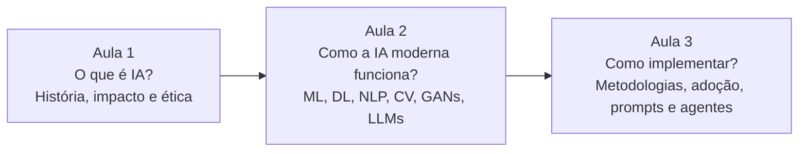

| Aula | Pergunta central | Conceitos-chave |
|---|---|---|
| 1 | O que é IA e por que importa? | IA, ML, DL, GenAI, história, tipos de aprendizado, impacto, ética |
| 2 | Quais tecnologias compõem a IA moderna? | algoritmos, redes neurais, NLP, visão, GANs, LLMs, RAG |
| 3 | Como transformar IA em valor? | CRISP-DM, Design Sprint, Canvas, MVP, CoE, prompts, agentes |

---

# 2. Conceitos que você precisa distinguir

## 2.1 IA × ML × DL × IA Generativa × LLM

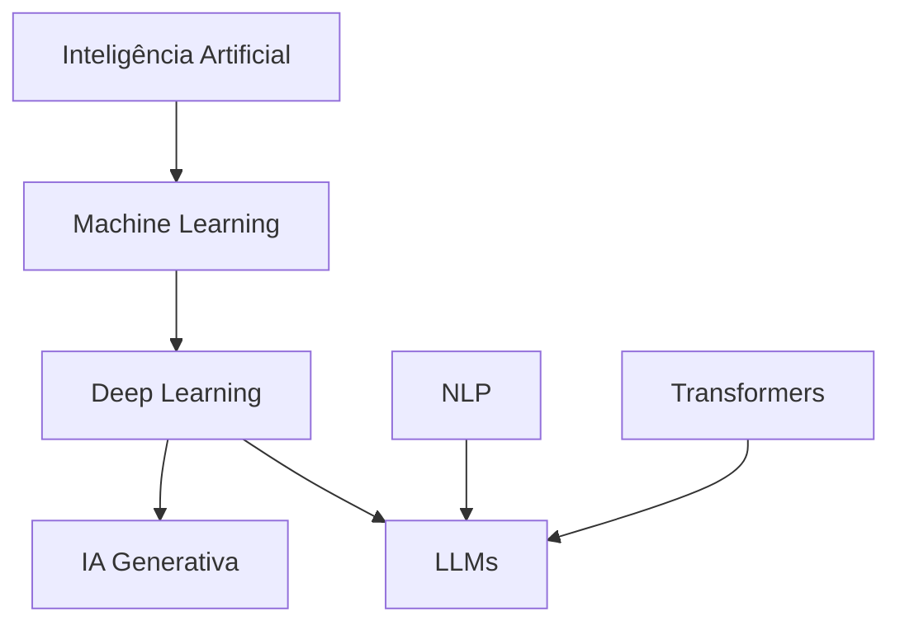

| Conceito | Definição curta para a prova |
|---|---|
| IA | campo amplo de sistemas que executam tarefas associadas à inteligência |
| Machine Learning | algoritmos que aprendem padrões a partir de dados |
| Deep Learning | ML baseado em redes neurais profundas |
| IA Generativa | sistemas que criam novos conteúdos |
| NLP | área de IA que trata linguagem humana |
| LLM | grande modelo de linguagem treinado em escala para processar e gerar linguagem |

### Frase de memorização

**IA contém ML; ML contém DL; DL sustenta várias soluções generativas; LLMs são modelos modernos de linguagem construídos com Deep Learning/Transformers.**

---

## 2.2 Programação tradicional × Machine Learning

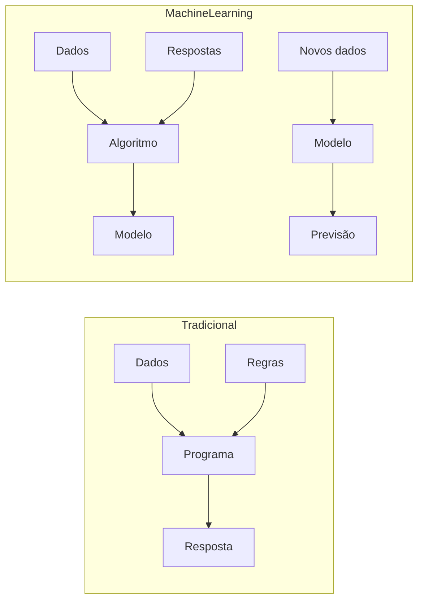

**Tradicional:** regras são programadas.  
**ML:** regras/padrões são aprendidos a partir de dados.

---

## 2.3 Supervisionado × Não supervisionado × Reforço

| Tipo | O que recebe | Objetivo | Exemplo didático |
|---|---|---|---|
| Supervisionado | dados + rótulos | aprender relação entrada/saída | crédito, classificação |
| Não supervisionado | dados sem rótulos | descobrir estrutura | segmentação |
| Reforço | estado + ações + recompensa | aprender política de decisão | jogos |

**Memória:** `rótulo → supervisionado`; `sem rótulo → não supervisionado`; `recompensa → reforço`.

---

## 2.4 Regressão × Classificação × Clustering

| Pergunta | Tipo |
|---|---|
| “Quanto vale?” | Regressão |
| “A qual classe pertence?” | Classificação |
| “Quais grupos existem?” | Clustering |

---

# 3. Algoritmos de Machine Learning

| Algoritmo | Palavra-chave |
|---|---|
| Regressão Linear | valor contínuo |
| Regressão Logística | classe binária/probabilidade |
| Árvore de Decisão | regras em árvore |
| Random Forest | conjunto de árvores |
| KNN | vizinhos próximos |
| SVM | hiperplano/margem |
| Naive Bayes | probabilidade condicional |
| Gradient Boosting | árvores sequenciais corrigindo erros |
| K-Means | `k` agrupamentos |

### Associações rápidas

- **Preço de imóvel:** regressão.
- **Cliente cancela ou não:** regressão logística/classificação.
- **Segmentar clientes:** K-Means.
- **Spam:** Naive Bayes.
- **Combinar muitas árvores:** Random Forest.
- **Alta performance com árvores sequenciais:** XGBoost/LightGBM/CatBoost.

---

# 4. Fluxo de Machine Learning

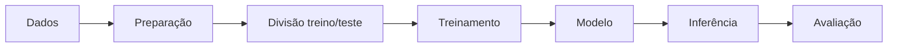

O exemplo de scikit-learn usa:

1. `load_iris()`;
2. `train_test_split()`;
3. `RandomForestClassifier()`;
4. `fit()`;
5. `predict()`;
6. `accuracy_score()`.

---

# 5. Deep Learning e redes neurais

## 5.1 Camadas

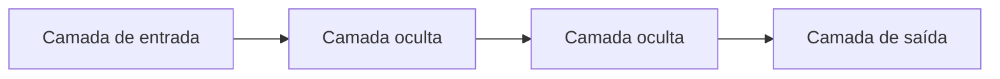

Cada neurônio trabalha conceitualmente com:

- entradas;
- pesos;
- viés;
- função de ativação;
- saída.

## 5.2 Treinamento

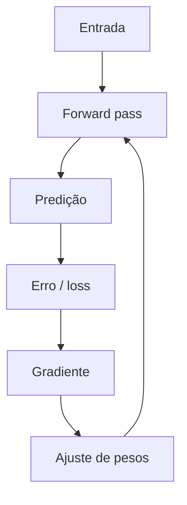

Objetivo: **reduzir o erro e generalizar para dados novos**.

---

# 6. Arquiteturas de Deep Learning

| Arquitetura | Associação principal no curso |
|---|---|
| CNN | imagem / visão computacional |
| RNN | sequências |
| LSTM | dependências de longo prazo |
| Transformer | atenção / NLP / LLM |
| GAN | geração de dados sintéticos |

### Mnemônico

**C**NN = **C**âmera/imagem.  
**R**NN = informação **R**ecorrente/sequencial.  
**L**STM = memória **L**onga.  
**T**ransformer = a**T**enção.  
**G**AN = **G**eração.

---

# 7. NLP

NLP = **Processamento de Linguagem Natural**.

Tarefas:

- classificação textual;
- sentimento;
- extração de entidades;
- geração;
- resumo;
- pesquisa inteligente.

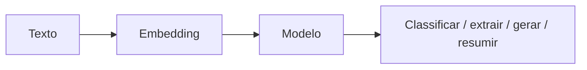

Ferramentas citadas:

- NLTK;
- spaCy;
- Hugging Face Transformers.

---

# 8. Visão Computacional

Uma imagem é processada como números.

### Escala de cinza

`0 = preto`, `255 = branco`.

### RGB

Cada pixel possui três valores: `(R, G, B)`.

| Tarefa | Pergunta |
|---|---|
| Classificação | O que é? |
| Detecção | Onde está? |
| Segmentação | Qual a região exata? |
| OCR | Qual texto está na imagem? |

Ferramentas citadas:

- OpenCV;
- MediaPipe;
- Detectron2;
- YOLO.

---

# 9. GANs

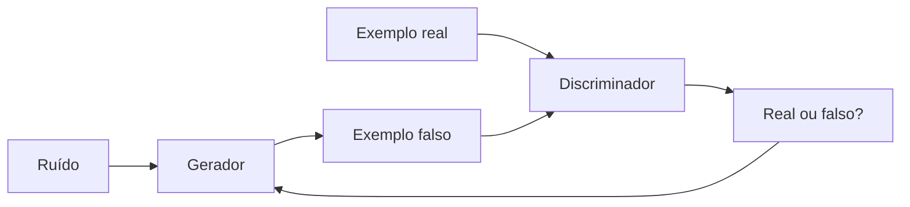

**Gerador:** cria.  
**Discriminador:** avalia se parece real.

Aplicações:

- imagens sintéticas;
- data augmentation;
- simulações;
- arte e design.

Risco-chave: **deepfake/manipulação**.

---

# 10. LLMs

## Conceitos para memorizar

| Termo | Significado curto |
|---|---|
| LLM | Large Language Model |
| Token | unidade textual processada |
| Inferência | geração de resposta usando modelo treinado |
| Prompt | instrução ao modelo |
| Embedding | representação vetorial semântica |
| Fine-tuning | adaptação de modelo já treinado |
| RAG | recuperação de contexto + geração |
| Zero-shot | sem exemplos no prompt |
| Few-shot | poucos exemplos |
| Multimodalidade | texto + imagem + áudio etc. |
| Guardrails | controles/restrições |
| Alucinação | conteúdo incorreto/inventado produzido com confiança |

---

# 11. RAG em uma figura

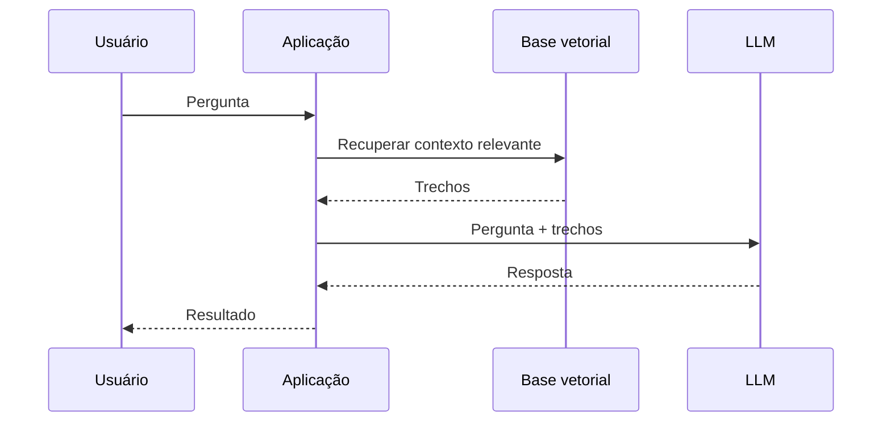

**RAG:** traz conhecimento externo no momento da pergunta.  
**Fine-tuning:** ajusta o comportamento do modelo com novos exemplos de treinamento.

---

# 12. Riscos e controles de LLMs

| Risco | Controle apresentado |
|---|---|
| alucinação | contexto confiável, RAG, validação |
| vazamento de dados | DLP |
| exposição indevida | rotulagem de sensibilidade |
| resposta inadequada | guardrails |
| decisão crítica | humano no loop |

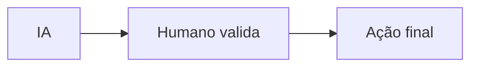

---

# 13. CRISP-DM

Memorize a ordem:

```text
Negócio → Dados → Preparação → Modelagem → Avaliação → Implantação
```

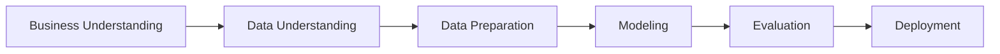

---

# 14. 7 passos do Google

```text
Business Understanding
→ Data Mining
→ Data Cleaning
→ Data Exploration
→ Feature Engineering
→ Predictive Modeling
→ Data Visualization
```

---

# 15. Design Sprint + Canvas

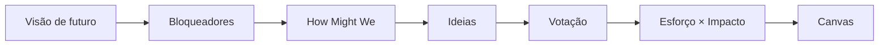

### HMW

Transforma problema em **pergunta aberta**.

### Priorização

**Alto impacto + baixo esforço = melhor candidato para começar.**

---

# 16. Machine Learning Canvas

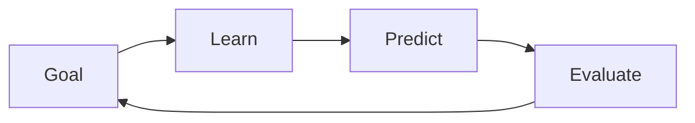

- **Goal:** por quê, o quê, para quem?
- **Learn:** quais dados e como aprender?
- **Predict:** quais entradas e saídas?
- **Evaluate:** como saber se funciona e gera valor?

---

# 17. Estratégia de adoção

```text
1. Caso de uso de baixo risco
2. MVP com métricas
3. Governança e segurança
4. CoE
```

### Métricas de valor

Não pense apenas em tempo.

- produtividade;
- retrabalho;
- volume;
- automação;
- satisfação;
- qualidade;
- custo evitado;
- redução de erros;
- risco.

---

# 18. Centro de Excelência — CoE

Quatro pilares:

1. administração e governança;
2. adoção e evolução;
3. desenvolvimento e integração contínua;
4. liderança estratégica.

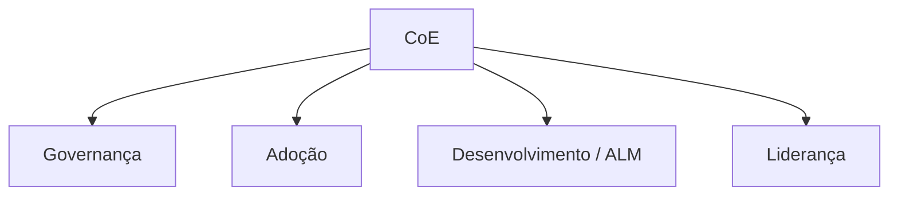

---

# 19. Prompt Engineering

Estrutura principal apresentada:

```text
Contexto + Tarefa + Formato/Detalhamento
```

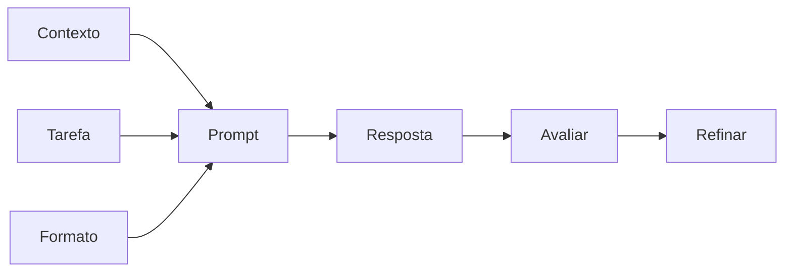

Tipos citados:

- direto;
- contextual;
- multi-etapas;
- zero-shot;
- few-shot;
- role prompt;
- scaffold/meta prompt.

---

# 20. Workflow × Agente

| Aspecto | Workflow | Agente |
|---|---|---|
| caminho | predefinido | dinâmico |
| flexibilidade | baixa | alta |
| previsibilidade | maior | menor |
| custo | menor | maior |
| decisão | código | modelo |

### Regra de prova

**Se um workflow, prompt ou RAG simples resolve, não há motivo para adicionar agente.**

---

# 21. Espectro de agentes


- **Pesquisador:** busca, resume, responde.
- **Acionável:** executa tarefas.
- **Autônomo:** planeja e age com maior independência.

---

# 22. Padrões de agentes

- LLM + ferramentas;
- Prompt Chaining;
- Routing;
- paralelos/ensemble;
- orquestrador + subagentes;
- gerador + avaliador.

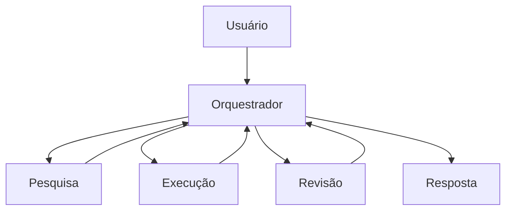

---

# 23. Agente único × Multiagentes

| Característica | Único | Multiagentes |
|---|---|---|
| especialização | uma | múltiplas |
| complexidade | moderada | alta |
| paralelismo | limitado | possível |
| comunicação interna | não | sim |
| modularidade | menor | maior |

---

# 24. Linha lógica do curso inteiro

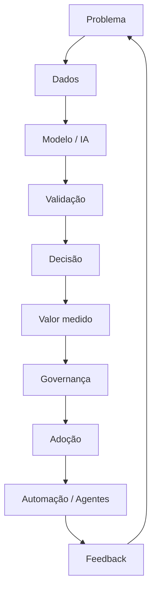

Se precisar memorizar **uma única ideia**, memorize esta:

> **IA só gera valor quando um problema relevante é conectado a dados adequados, um modelo útil, uma decisão real, métricas e governança.**

---

# 25. Pegadinhas conceituais prováveis

### “Regressão logística prevê valor contínuo.”

**Falso.** No material, regressão logística é usada para classificação binária.

### “K-Means é supervisionado.”

**Falso.** É apresentado como não supervisionado.

### “NLP e LLM são sinônimos.”

**Falso.** NLP é o campo; LLM é uma classe de modelos modernos usada em NLP.

### “GAN possui apenas um modelo gerador.”

**Falso.** Gerador e Discriminador treinam em competição.

### “RAG modifica permanentemente os pesos do LLM.”

**Falso.** RAG recupera contexto para a inferência; ajuste de pesos está relacionado a treinamento/fine-tuning.

### “Quanto mais autonomia, sempre melhor.”

**Falso.** A Aula 3 recomenda usar agentes somente quando a complexidade justificar custo, latência e risco adicionais.

### “O principal KPI de IA é tempo economizado.”

**Incompleto.** O material inclui satisfação, qualidade, custo evitado, erro, risco e impacto financeiro.

### “CoE é apenas o time que programa modelos.”

**Falso.** Inclui governança, adoção, desenvolvimento e liderança estratégica.

---

# 26. Questões de múltipla escolha

## Questão 1

Em Machine Learning supervisionado, o elemento que distingue o processo de treinamento é:

A. ausência completa de exemplos.  
B. presença de dados com respostas/rótulos conhecidos.  
C. uso obrigatório de redes neurais profundas.  
D. inexistência de função de avaliação.  
E. uso exclusivo de clustering.

## Questão 2

Qual algoritmo está diretamente associado no material à segmentação de clientes?

A. Regressão Linear.  
B. K-Means.  
C. Regressão Logística.  
D. SVM.  
E. Perceptron.

## Questão 3

Random Forest pode ser resumido como:

A. uma única árvore com profundidade infinita.  
B. um método de clusterização.  
C. combinação de várias árvores de decisão.  
D. modelo exclusivamente de linguagem.  
E. técnica de geração adversarial.

## Questão 4

A arquitetura indicada no curso para visão computacional é principalmente:

A. CNN.  
B. LSTM.  
C. K-Means.  
D. Naive Bayes.  
E. Regressão Linear.

## Questão 5

A principal característica dos Transformers destacada é:

A. uso de votação entre árvores.  
B. agrupamento por distância.  
C. mecanismo de atenção/self-attention.  
D. ausência de redes neurais.  
E. uso exclusivo para imagens.

## Questão 6

Em uma GAN, o Discriminador:

A. traduz texto.  
B. tenta diferenciar dados reais e gerados.  
C. somente cria amostras.  
D. executa clustering.  
E. armazena embeddings.

## Questão 7

NLP é:

A. um algoritmo específico de classificação.  
B. um banco vetorial.  
C. a área de IA que trata linguagem humana.  
D. sinônimo de LLM.  
E. uma função de perda.

## Questão 8

Em visão computacional, um pixel RGB possui:

A. apenas um valor binário.  
B. três componentes de cor.  
C. obrigatoriamente um token.  
D. um rótulo textual.  
E. uma classe K-Means.

## Questão 9

RAG é usado para:

A. eliminar a necessidade de dados.  
B. conectar a geração a contexto recuperado de uma base.  
C. substituir toda validação humana.  
D. criar árvores de decisão.  
E. converter CNN em RNN.

## Questão 10

Fine-tuning corresponde a:

A. recuperar documentos em tempo de consulta.  
B. ajustar um modelo já treinado com exemplos adicionais.  
C. adicionar uma segunda árvore ao Random Forest.  
D. converter pixels em RGB.  
E. apenas alterar o prompt.

## Questão 11

A primeira etapa do CRISP-DM é:

A. Deployment.  
B. Modeling.  
C. Business Understanding.  
D. Data Cleaning.  
E. Evaluation.

## Questão 12

Na matriz Esforço × Impacto, o curso recomenda priorizar:

A. baixo impacto e alto esforço.  
B. alto impacto e baixo esforço.  
C. qualquer item de alto esforço.  
D. somente projetos sem dados.  
E. apenas agentes autônomos.

## Questão 13

O Machine Learning Canvas conecta principalmente:

A. linguagem e imagem.  
B. hardware e redes.  
C. objetivo, aprendizado, previsão e avaliação.  
D. segurança e criptografia apenas.  
E. UX e banco de dados apenas.

## Questão 14

Qual NÃO é um eixo de valor enfatizado na Aula 3?

A. produtividade.  
B. satisfação.  
C. custo evitado.  
D. redução de erros.  
E. quantidade de parâmetros do modelo como fim em si mesma.

## Questão 15

Um bom prompt, segundo o e-book, deve conter principalmente:

A. contexto, tarefa e formato/detalhamento.  
B. somente uma pergunta curta.  
C. exclusivamente exemplos.  
D. um modelo de regressão.  
E. um banco vetorial.

## Questão 16

Few-shot significa:

A. nenhum exemplo.  
B. poucos exemplos fornecidos para orientar a tarefa.  
C. treinamento do zero.  
D. execução sem prompt.  
E. uso exclusivo de imagens.

## Questão 17

A principal diferença entre workflow e agente é que:

A. workflow sempre usa LLM.  
B. agente tem execução mais dinâmica, enquanto workflow segue fluxo predefinido.  
C. agente sempre custa menos.  
D. workflow é sempre menos confiável.  
E. não existe diferença.

## Questão 18

Quando evitar agentes?

A. quando a tarefa exige múltiplas decisões.  
B. quando há necessidade de ferramentas externas.  
C. quando um prompt/RAG ou fluxo simples já resolve bem.  
D. quando há variação contextual.  
E. quando é necessário planejar.

## Questão 19

Em um sistema multiagente:

A. todos os agentes precisam ter exatamente o mesmo papel.  
B. não existe comunicação.  
C. agentes especializados podem colaborar e delegar tarefas.  
D. paralelismo é impossível.  
E. não existe orquestração.

## Questão 20

O CoE apresentado no curso combina:

A. apenas desenvolvimento de software.  
B. governança, adoção, desenvolvimento/integração e liderança.  
C. apenas treinamento.  
D. apenas compliance.  
E. apenas compra de ferramentas.

---

# 27. Gabarito comentado

| Questão | Resposta | Comentário |
|---:|:---:|---|
| 1 | B | supervisionado aprende com exemplos rotulados |
| 2 | B | K-Means é o algoritmo de clustering associado à segmentação |
| 3 | C | Random Forest agrega várias árvores |
| 4 | A | CNN é a arquitetura destacada para imagens |
| 5 | C | Transformers são apresentados com mecanismo de atenção |
| 6 | B | Discriminador tenta reconhecer real × gerado |
| 7 | C | NLP é o campo dedicado a linguagem |
| 8 | B | RGB = Red, Green, Blue |
| 9 | B | RAG adiciona contexto recuperado à geração |
| 10 | B | fine-tuning ajusta modelo pré-treinado |
| 11 | C | CRISP-DM começa pelo entendimento do negócio |
| 12 | B | alto impacto + baixo esforço é o quadrante prioritário |
| 13 | C | Goal, Learn, Predict, Evaluate |
| 14 | E | tamanho do modelo não é tratado como valor de negócio por si só |
| 15 | A | contexto + tarefa + formato/detalhamento |
| 16 | B | few-shot = poucos exemplos |
| 17 | B | workflow é mais determinístico; agente decide dinamicamente |
| 18 | C | complexidade sem necessidade aumenta custo e risco |
| 19 | C | especialização e colaboração são características centrais |
| 20 | B | o CoE possui quatro pilares organizacionais |

---

# 28. Revisão oral — responda sem consultar

Antes da prova, tente explicar em voz alta, em no máximo 30 segundos cada:

- [ ] IA, ML, DL e IA Generativa;
- [ ] supervisionado, não supervisionado e reforço;
- [ ] regressão, classificação e clustering;
- [ ] Random Forest e Gradient Boosting;
- [ ] estrutura de uma rede neural;
- [ ] CNN, RNN, LSTM, Transformer e GAN;
- [ ] NLP e embedding;
- [ ] representação RGB;
- [ ] LLM, token e inferência;
- [ ] RAG × fine-tuning;
- [ ] CRISP-DM;
- [ ] Design Sprint + HMW;
- [ ] Matriz Esforço × Impacto;
- [ ] Machine Learning Canvas;
- [ ] métricas de valor;
- [ ] CoE;
- [ ] estrutura de um bom prompt;
- [ ] workflow × agente;
- [ ] agente único × multiagentes;
- [ ] riscos e governança.

---

# 29. Mapa mental final

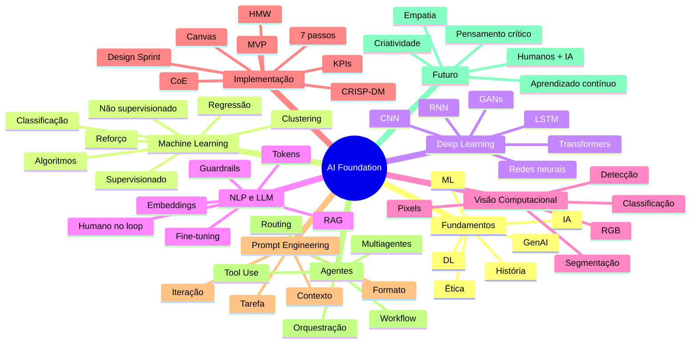

## Referências no material da disciplina

- Aula 1 — e-book e slides.
- Aula 2 — e-book e slides.
- Aula 3 — e-book e slides.
