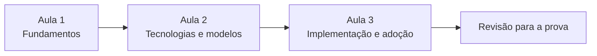
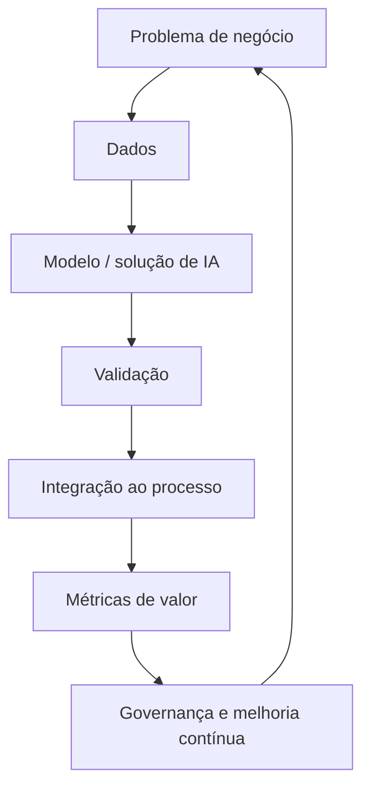

# AI Foundation

Documentação de estudo baseada nos materiais das três aulas da disciplina **AI Foundation**, ministrada por Leandro César Lopes.

O objetivo deste repositório é transformar o conteúdo dos e-books e slides em uma referência técnica, didática e visual para consulta no GitHub e revisão para prova.

## Navegação

| Ordem | Documento | Conteúdo |
|---:|---|---|
| 1 | [Introdução à Inteligência Artificial](01-introducao-inteligencia-artificial.md) | Conceitos fundamentais, história, tipos de aprendizado, aplicações, impacto no trabalho, ética e futuro |
| 2 | [Panorama da IA Moderna](02-panorama-ia-moderna.md) | Machine Learning, algoritmos, Deep Learning, redes neurais, NLP, visão computacional, GANs e LLMs |
| 3 | [Implementando IA na Prática](03-implementando-ia-na-pratica.md) | Metodologias, adoção, Canvas, governança, CoE, Prompt Engineering, agentes e multiagentes |
| 4 | [Revisão para a Prova](README-revisao-prova.md) | Resumo consolidado, comparações, mapa mental, perguntas, questões e gabarito comentado |

## Fontes utilizadas

- **Aula 1** — E-book: *Introdução à Inteligência Artificial*; slides: *AI Foundation*.
- **Aula 2** — E-book: *Panorama da Inteligência Artificial Moderna*; slides: *AI Foundation*.
- **Aula 3** — E-book: *Implementando IA na Prática*; slides: *AI Foundation*.

Os e-books são usados como eixo narrativo e os slides como complemento técnico e visual. Diagramas presentes nas apresentações foram reconstruídos em **Mermaid** quando isso melhora a compreensão.

## Como estudar

Para uma primeira leitura, siga a ordem 1 → 2 → 3. Depois utilize o arquivo de revisão para consolidar os conceitos e testar a memória.

## Convenções didáticas

> [!NOTE]
> **Conceito:** definição ou síntese do conteúdo apresentado na disciplina.

> [!TIP]
> **Aplicação:** consequência prática, exemplo de negócio ou orientação de uso.

> [!IMPORTANT]
> **Para a prova:** ponto com alto potencial para questão conceitual ou comparativa.

> [!WARNING]
> **Atenção:** simplificação, risco, limitação ou formulação do material que deve ser interpretada com cuidado.

## Princípio central da disciplina

O curso apresenta IA como uma tecnologia que combina aspectos técnicos e estratégicos. A compreensão dos modelos é importante, mas a geração de valor depende de identificar problemas adequados, utilizar dados de qualidade, estabelecer métricas, adotar governança e manter participação humana nas decisões relevantes.

## Escopo e fidelidade

Esta documentação preserva a terminologia, exemplos e organização conceitual do material da disciplina. Quando uma frase do material é claramente apresentada como simplificação didática, ela é tratada como tal e não transformada em uma regra universal.

Os diagramas Mermaid são reconstruções didáticas e não reproduções gráficas exatas dos slides.
