# 01 — Fundamentos de UX e Prototipagem

## 1. Objetivos da aula

A Aula 1 cria a base conceitual da disciplina. O material relaciona o crescimento dos produtos digitais com o desafio de criar experiências que sejam compreensíveis, fáceis e úteis para pessoas reais.

Ao final, deve ser possível explicar:

- por que a complexidade aumentou com a evolução tecnológica;
- como a transformação digital acelerou durante a pandemia;
- o que é experiência do usuário;
- como usabilidade se relaciona com UX;
- os cinco componentes de usabilidade apresentados por Nielsen;
- como Design Thinking e UX Design trabalham com problemas reais;
- a diferença entre UX e UI;
- por que prototipagem é importante dentro do processo de UX.

---

# Parte I — Complexidade e transformação digital

## 2. O paradoxo da complexidade

A aula parte do **Paradoxo da Complexidade**, associado a Don Norman e ao livro *Living with Complexity* (2010): para simplificar a vida, criamos ferramentas cada vez mais poderosas — e, por consequência, mais complexas.

O ponto central não é que toda complexidade seja ruim. O material afirma que:

- a complexidade é inevitável em produtos e sistemas modernos;
- o desafio do design é torná-la compreensível, acessível e manejável;
- boas soluções organizam a complexidade usando conceitos familiares, metáforas e feedback.

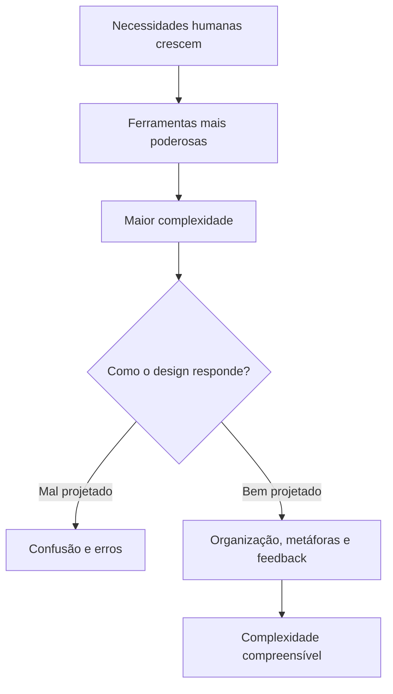

### 2.1 Controle remoto como exemplo

Os slides usam a evolução do controle remoto para mostrar que o aumento de funcionalidades pode aumentar a dificuldade de uso. O problema não é apenas a quantidade de recursos, mas a forma como eles são organizados e apresentados.

## 3. Massificação de produtos e falhas de design

Com a ampliação de produtos e funcionalidades, surgem interfaces carregadas de botões, opções e comportamentos pouco claros. A aula apresenta exemplos de falhas cotidianas de design — caixas eletrônicos, controles, mouses, embalagens e outros produtos — para reforçar que o projeto pode se afastar da necessidade real de quem usa.

> [!IMPORTANT]
> **Ideia central:** desenhar com base no uso e na necessidade real das pessoas, não com base em como a equipe imagina que elas deveriam usar o produto.

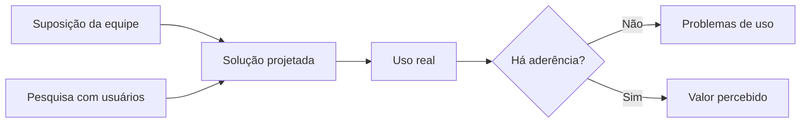

## 4. A aceleração digital pela pandemia

O material destaca a pandemia de COVID-19 como aceleradora da transformação digital. Organizações e pessoas tiveram que migrar rapidamente atividades para canais digitais, alterando:

- oferta de serviços;
- estruturas tecnológicas;
- organização do trabalho;
- comportamentos sociais;
- expectativas dos usuários.

O e-book cita estimativas da McKinsey de aceleração da digitalização em anos, além da percepção de executivos do setor financeiro de uma aceleração ainda maior. A mensagem pedagógica é que hábitos digitais incorporados durante a crise permaneceram no pós-pandemia.

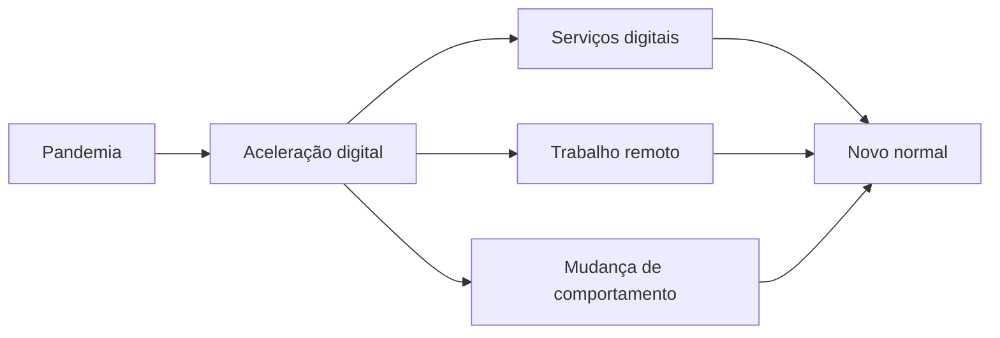

---

# Parte II — Experiência do Usuário

## 5. O que é UX

A experiência do usuário (**UX — User Experience**) é apresentada como o conjunto de percepções, emoções e respostas que surgem quando uma pessoa interage com um produto, serviço ou sistema.

Ela não se limita à tela. A experiência engloba a jornada completa.

Exemplos usados no material:

- em um restaurante, envolve reserva, chegada, atendimento, consumo, pagamento e retorno;
- em um serviço de fast food, envolve pedido, precisão, entrega e consumo;
- em um produto digital, envolve o que acontece antes, durante e depois da interação principal.

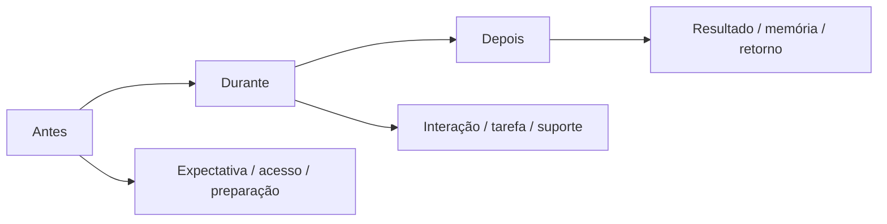

### 5.1 Por que boas experiências são importantes

O material associa UX diretamente à sobrevivência de produtos digitais. Se um site ou aplicativo:

- é difícil de usar;
- não explica claramente o que oferece;
- deixa o usuário perdido;
- apresenta informações difíceis de encontrar ou ler;

as pessoas tendem a abandonar a solução.

A aula enfatiza que usuários não deveriam precisar ler manuais extensos ou estudar uma interface para conseguir cumprir tarefas básicas.

---

## 6. O “iceberg” da experiência

A interface visível é apresentada como apenas uma camada do produto. O exemplo do Uber mostra que o usuário vê uma experiência relativamente simples, mas por trás dela existe uma estrutura de decisões de produto.

A sequência apresentada pode ser sintetizada assim:

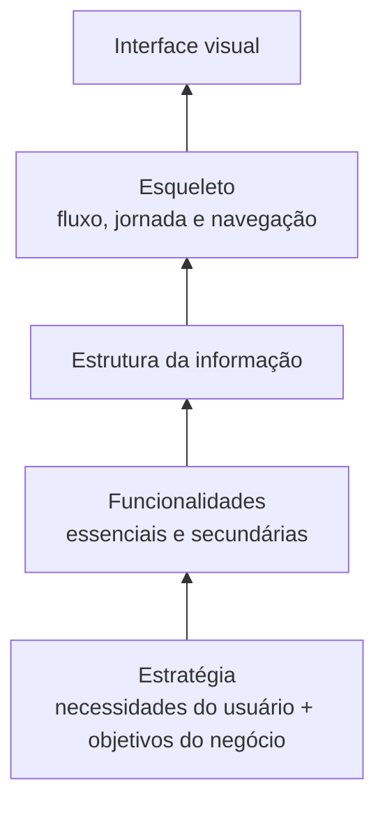

A estratégia é a parte mais abstrata. A interface é a parte mais concreta e visível.

### 6.1 MVP no contexto da Aula 1

O **MVP — Produto Mínimo Viável** é apresentado como uma versão inicial com o conjunto mínimo de funcionalidades essenciais para colocar uma proposta em uso e validar hipóteses com usuários reais.

A diferença entre MVP e protótipo é aprofundada na Aula 2.

---

# Parte III — Usabilidade

## 7. Usabilidade dentro da UX

A aula define usabilidade como a facilidade com que as pessoas conseguem usar uma interface para atingir objetivos.

O material relaciona usabilidade a:

- eficácia;
- eficiência;
- satisfação;
- facilidade de aprendizado;
- prevenção de erros;
- produtividade.

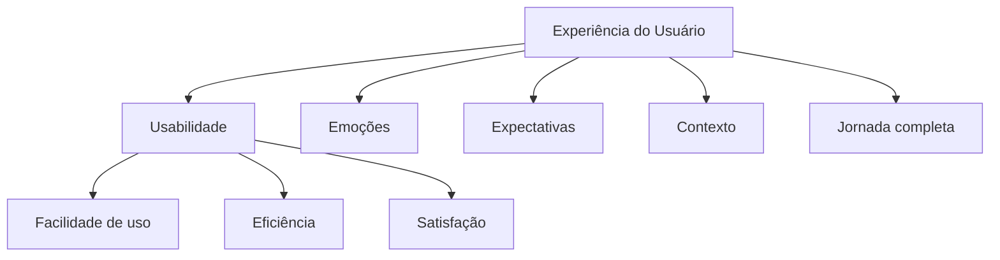

> [!IMPORTANT]
> **Usabilidade é parte da UX. UX é mais ampla.**

## 8. Ergonomia × usabilidade

Os slides fazem uma distinção didática:

| Ergonomia | Usabilidade |
|---|---|
| Adaptação de ambiente, equipamentos e processos às capacidades e necessidades físicas | Facilidade de uso de um produto ou sistema |
| Segurança, conforto e eficiência | Eficácia, eficiência e satisfação |

Em experiências que misturam ambiente físico e digital, os dois conceitos podem se aproximar.

## 9. Cinco componentes de usabilidade segundo Nielsen

O material apresenta cinco componentes:

1. **Facilidade de aprendizado** — conseguir completar tarefas básicas no primeiro contato.
2. **Eficiência de uso** — realizar tarefas rapidamente depois que o uso foi aprendido.
3. **Facilidade de memorização** — voltar a usar a solução após um período sem contato.
4. **Erros** — frequência, gravidade e capacidade de recuperação.
5. **Satisfação** — quão agradável, motivadora e confiante é a experiência.

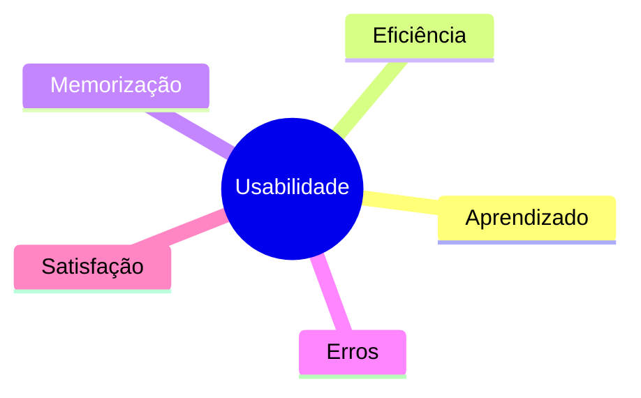

### 9.1 Utilidade × usabilidade

A aula ressalta que uma solução precisa combinar:

- **utilidade** — resolve uma necessidade real;
- **usabilidade** — é fácil e eficiente de usar.

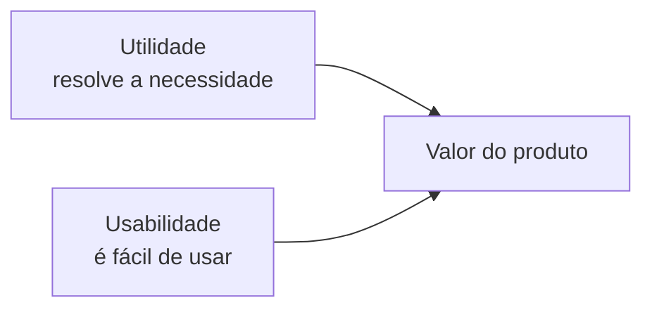

## 10. Exemplos de boa usabilidade

O e-book cita:

- **Duolingo** — simplicidade, gamificação, feedback e personalização;
- **Pinterest** — interface intuitiva e poucas funções repetitivas;
- **Netflix** — hierarquia clara, recomendações e feedback visual;
- **Metrô de São Paulo** — padronização de cores, ícones e feedback de navegação.

O objetivo dos exemplos é mostrar repetição de padrões, clareza, feedback e redução de carga cognitiva.

## 11. Benefícios da usabilidade

Uma boa usabilidade pode:

- reduzir curva de aprendizagem;
- diminuir erros;
- aumentar produtividade;
- reduzir solicitações de suporte;
- aumentar engajamento;
- reduzir necessidade de manuais e tutoriais;
- aumentar percepção de valor.

---

# Parte IV — Design Thinking e processo de UX

## 12. Design Thinking

O Design Thinking é apresentado como abordagem criativa, colaborativa e centrada nas pessoas para resolução de problemas complexos.

Princípios destacados:

- centrado no usuário;
- explorar antes de solucionar;
- cocriação;
- prototipagem rápida;
- iteração;
- pensamento divergente e convergente.

## 13. Duplo Diamante

O modelo do Duplo Diamante organiza o processo em quatro fases:

1. **Descoberta** — ampliar a compreensão do problema e do contexto;
2. **Definição** — convergir para um desafio mais claro;
3. **Desenvolvimento** — explorar alternativas de solução;
4. **Entrega** — prototipar, testar e refinar.

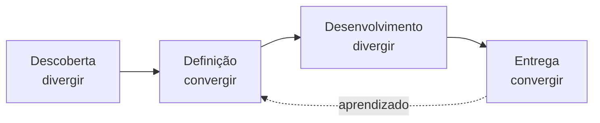

> [!NOTE]
> O processo não é rigidamente linear. Testes podem exigir retorno a fases anteriores.

## 14. Processo de UX Design

O material organiza o processo de UX em etapas de pesquisa, análise, design/criação, teste/validação e desenvolvimento.

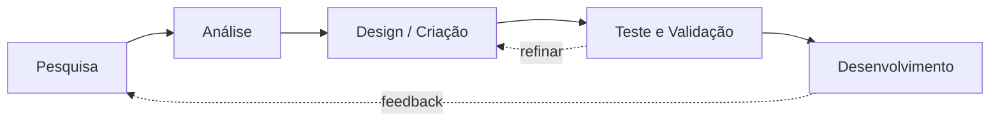

### 14.1 Exemplos de atividades mostradas nos slides

**Pesquisa:**

- entrevista com stakeholder;
- entrevista com usuário;
- estudos de campo.

**Análise:**

- mapa de afinidade;
- persona;
- jornada do usuário;
- histórias do usuário.

**Design:**

- arquitetura da informação;
- wireframe;
- prototipagem.

**Teste e validação:**

- teste de usabilidade;
- analytics;
- teste A/B;
- análise heurística.

---

## 15. Tripé do UX: negócio, usuário e tecnologia

A aula afirma que um UX eficaz considera três pilares em conjunto:

- **Negócio:** objetivos, resultados e necessidades da organização;
- **Usuário:** necessidades, dores e contexto de uso;
- **Tecnologia:** viabilidade técnica e disponibilidade de recursos.

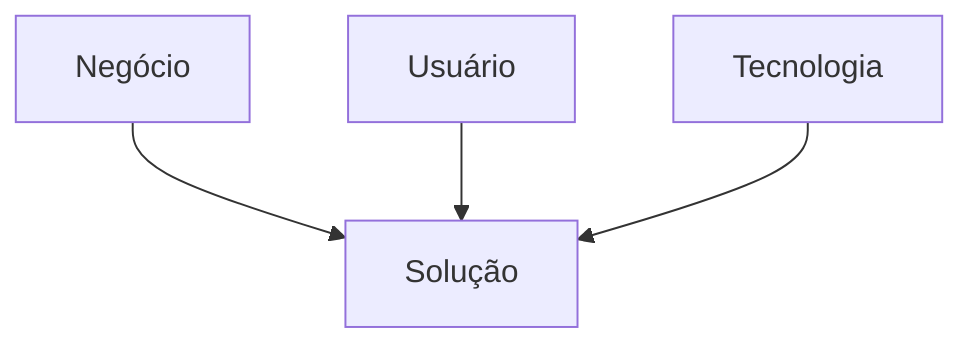

Uma solução que ignora qualquer uma dessas dimensões corre risco de não ser desejável, viável ou sustentável.

---

# Parte V — UX × UI

## 16. Diferença fundamental

O material reforça que **UX não é UI**.

| UX — User Experience | UI — User Interface |
|---|---|
| Experiência completa | Camada visual e de interação |
| Pesquisa, estratégia, conteúdo e jornada | Cores, tipografia, ícones, botões e layout |
| Personas, jornada, arquitetura da informação, prototipagem e testes | Desenho de telas e consistência visual |
| Pergunta “como é a experiência como um todo?” | Pergunta “como a interface se apresenta e responde?” |

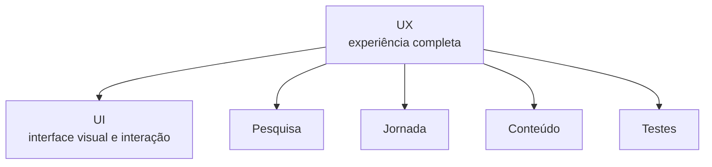

A analogia das garrafas de ketchup ilustra que uma solução pode ser visualmente atraente, mas ruim de usar.

---

# Parte VI — Custos de uma má experiência

## 17. Exemplos do material

A Aula 1 utiliza casos para mostrar que UX ruim pode gerar desde pequenas frustrações até consequências graves:

- cartão do **Miss Universo 2015**, cuja hierarquia contribuiu para anúncio incorreto;
- **alerta de míssil no Havaí**, disparado por escolha errada em uma interface;
- mensagem de armazenamento cheio sem orientação suficiente;
- autoplay com som;
- mensagens deletadas que deixam vestígios;
- cores desconfortáveis;
- chamada em espera confusa;
- Magic Mouse que não pode ser usado enquanto carrega;
- embalagem que exige uma tesoura para abrir uma tesoura.

> [!IMPORTANT]
> O ponto pedagógico não é o produto isolado, mas o custo de decisões de design que não consideram comportamento, contexto e clareza.

---

# Parte VII — Entrada na prototipagem

## 18. Por que prototipar

A prototipagem é apresentada como fase crucial do UX porque permite testar hipóteses e refinar soluções antes de grandes investimentos.

Benefícios recorrentes ao longo das aulas:

- identificar problemas cedo;
- facilitar comunicação;
- melhorar a experiência;
- agilizar decisões;
- reduzir riscos.

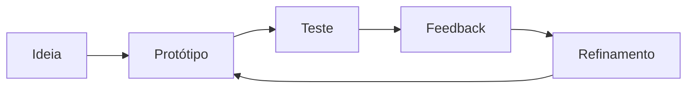

## 19. Prototipagem em diferentes contextos

Os slides mostram que prototipagem não é exclusiva de UX:

| Contexto | Uso apresentado |
|---|---|
| Design | versões preliminares para validação estética e funcional |
| UX Design | protótipos interativos para entender usabilidade e jornada |
| Engenharia | modelos físicos ou simulações digitais para testar viabilidade |
| Negócios | validação de ideias e modelos antes de grandes investimentos |

## 20. Resumo da Aula 1

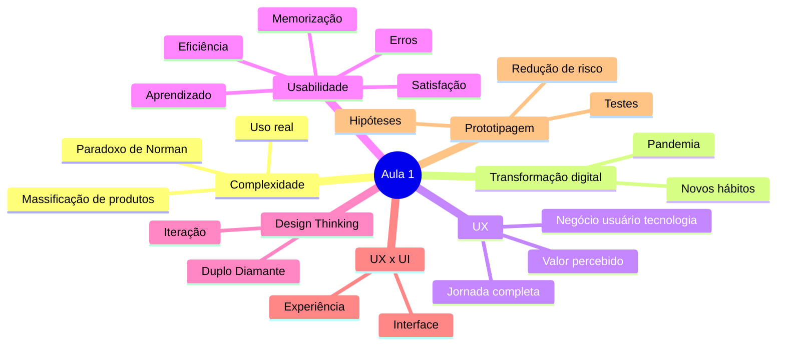

## 21. Perguntas de revisão

1. O que é o paradoxo da complexidade?
2. Por que a complexidade não deve ser simplesmente eliminada?
3. Como a pandemia alterou o consumo de produtos digitais segundo a aula?
4. O que caracteriza UX?
5. Por que a interface é apenas parte da experiência?
6. Qual é a diferença entre usabilidade e UX?
7. Quais são os cinco componentes de usabilidade apresentados por Nielsen?
8. Qual é a relação entre utilidade e usabilidade?
9. Quais são as quatro fases do Duplo Diamante?
10. Por que UX deve considerar negócio, usuário e tecnologia?
11. Qual é a diferença entre UX e UI?
12. Que tipos de consequência uma má experiência pode provocar?
13. Por que prototipagem reduz risco?

## Referência no material da disciplina

- Aula 1 — e-book **Fundamentos e Contexto**, páginas 2–19.
- Aula 1 — slides **Fundamentos e conceitos de Prototyping**, com ênfase nos blocos de complexidade, transformação digital, UX, usabilidade, Design Thinking, UX × UI e prototipagem.

