# 02 — Tipos, Fidelidade e Ferramentas de Prototipagem

## 1. Objetivos da aula

A Aula 2 desloca o foco dos fundamentos de UX para a prototipagem propriamente dita.

Ao final, deve ser possível explicar:

- o que é e o que não é um protótipo;
- quais características um protótipo deve possuir;
- formas comuns de prototipagem;
- níveis de fidelidade;
- como escolher fidelidade com base no objetivo do teste;
- diferença entre protótipo exploratório e validador;
- diferença entre protótipo e MVP;
- como ferramentas digitais como Marvel App e Figma apoiam o processo.

---

# Parte I — O que é um protótipo

## 2. Definição

O material define protótipo como uma **representação simplificada e preliminar de uma ideia ou solução**, criada para explorar, comunicar e testar.

Características conceituais:

- é uma representação, não o produto final;
- serve para experimentação e aprendizado;
- permite testar usabilidade, fluxo, interação e linguagem;
- ajuda a alinhar equipe, stakeholders e usuários;
- reduz risco antes de investir mais tempo e dinheiro.

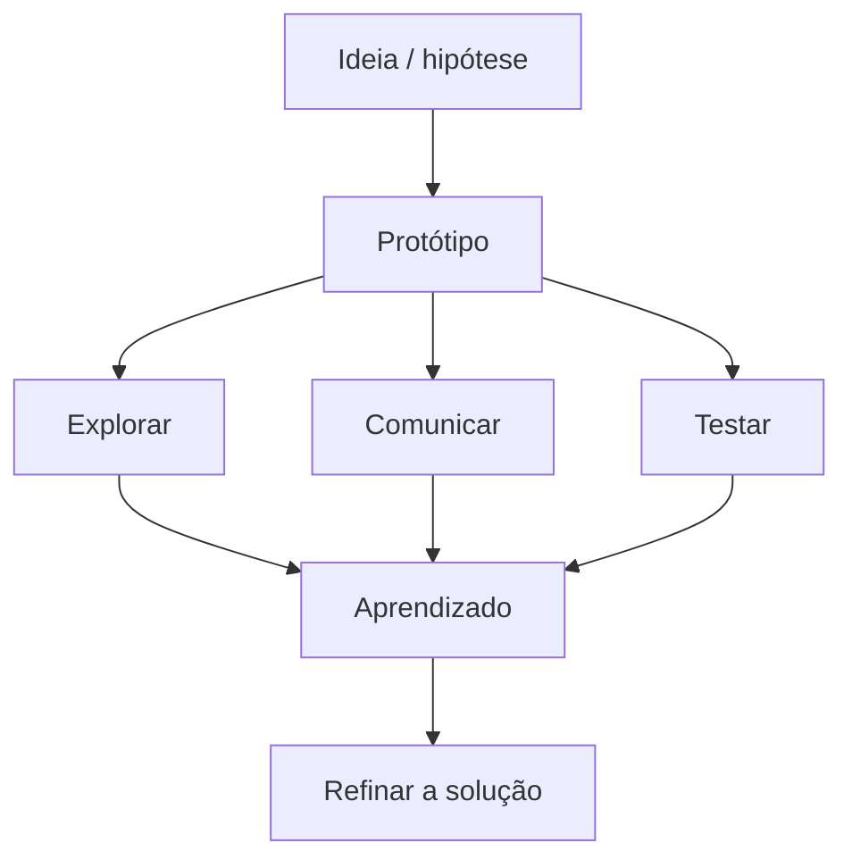

> [!IMPORTANT]
> A frase que resume o conceito no material é: **aprender antes de construir**.

## 3. O que um protótipo não é

O material explicitamente diferencia protótipo de:

- produto finalizado;
- sistema completamente funcional;
- produto pronto para produção;
- versão beta.

Um protótipo pode simular comportamentos sem que toda a lógica esteja implementada.

## 4. Características essenciais

Três características são destacadas:

### 4.1 Representação

Deve representar a essência do produto, serviço ou aplicativo e aquilo que precisa ser testado.

### 4.2 Funcionalidade

Mesmo simplificado, deve permitir experimentar as funções ou fluxos essenciais para a hipótese em questão.

### 4.3 Improvisação

Deve ser fácil de construir, alterar e adaptar conforme surgem feedbacks e novas ideias.

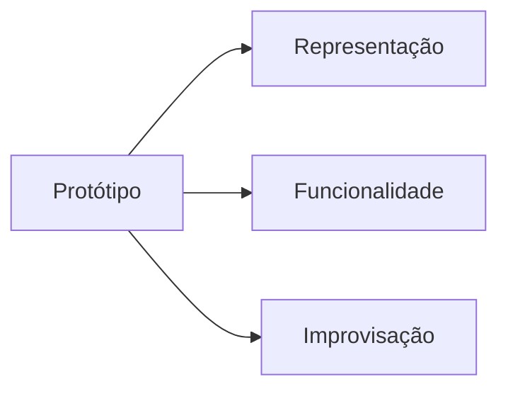

---

# Parte II — Por que prototipar

## 5. Benefícios

A aula apresenta quatro benefícios principais:

1. **Identificar problemas cedo** — encontrar falhas antes da produção final.
2. **Facilitar a comunicação** — tornar uma ideia visível e compartilhável.
3. **Melhorar a experiência do usuário** — testar fluxo, interação e entendimento com pessoas.
4. **Agilizar decisões** — iterar rapidamente antes de grandes investimentos.

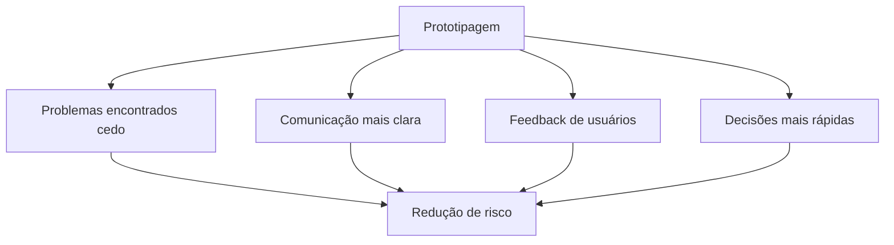

---

# Parte III — Formas comuns de protótipo

## 6. Protótipo de papel

É simples, rápido e barato. O material o recomenda para:

- fluxos iniciais;
- navegação;
- arquitetura básica;
- alinhamento de equipe;
- feedback rápido.

Pode utilizar desenhos, folhas, post-its ou telas impressas.

## 7. Protótipo de volume

É uma representação tridimensional, útil para produtos físicos e questões de forma, ergonomia e usabilidade.

Materiais citados:

- papelão;
- isopor;
- materiais improvisados;
- impressão 3D.

## 8. Storyboard

É uma sequência de quadros estáticos, composta por desenhos, colagens ou fotografias, usada para:

- comunicar uma história;
- representar a jornada;
- visualizar o encadeamento de uma solução ou serviço.

## 9. Encenação

É uma simulação improvisada de uma situação de uso para compreender:

- interação entre pessoas;
- fluidez da experiência;
- reações dos usuários;
- pontos de atrito e lacunas.

É útil especialmente em serviços e experiências com múltiplos atores.

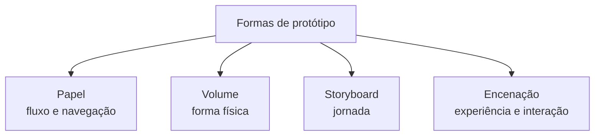

---

# Parte IV — Evolução e fidelidade

## 10. Evolução de um protótipo

Os slides apresentam uma progressão visual:

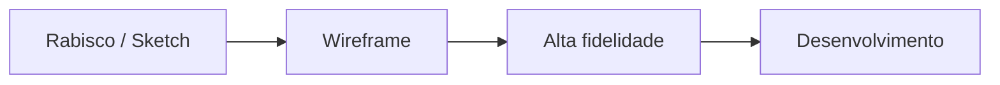

### 10.1 Rabisco / Sketch

Representação conceitual e analógica da ideia. Serve para posicionar elementos principais sem preocupação com acabamento.

### 10.2 Wireframe

Representa com maior precisão a estrutura da interface e a arquitetura básica da informação:

- cards;
- imagens;
- textos;
- campos;
- barras de pesquisa;
- áreas de navegação.

### 10.3 Alta fidelidade

Aproxima-se da aparência e do comportamento do produto final. Pode incluir:

- identidade visual;
- textos e imagens;
- componentes refinados;
- interações;
- transições;
- fluxos completos e exceções.

Ainda assim, **continua sendo protótipo** e não necessariamente possui todas as funcionalidades implementadas.

### 10.4 Desenvolvimento

Após validações e refinamentos, o foco passa à implementação dos fluxos e do produto.

---

## 11. Baixa, média e alta fidelidade

| Fidelidade | Características | Quando usar |
|---|---|---|
| **Baixa** | simples, barata, rápida, foco estrutural | ideias iniciais, brainstorming, wireframes rápidos |
| **Média** | estrutura mais definida, navegação e layout intermediário | validação de fluxo, navegação e usabilidade |
| **Alta** | visual refinado, interações e maior proximidade do produto | testes finais, apresentação e validação visual/funcional |

> [!IMPORTANT]
> O material resume: **quanto mais próxima a entrega ou mais crítico o teste, maior deve ser a fidelidade.**

Porém, alta fidelidade não deve ser tratada como objetivo automático. A fidelidade deve responder ao que se quer testar.

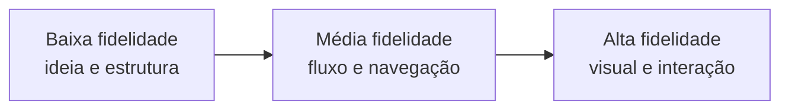

---

# Parte V — Prototipagem como processo iterativo

## 12. Perguntas antes de prototipar

Os slides recomendam sempre responder:

1. Para quê estamos prototipando isso?
2. O que queremos saber?
3. O que queremos testar?
4. O que queremos descobrir?

Essas perguntas impedem que a equipe produza telas bonitas sem uma hipótese clara.

## 13. Ciclo de prototipagem

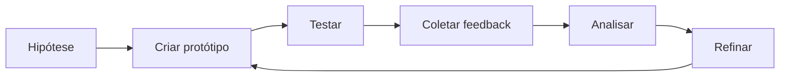

Cada iteração deve ter um objetivo específico: validar nomes, elementos, casos de uso, fluxos ou exceções.

---

# Parte VI — Explorar × validar

## 14. Protótipos exploratórios

São versões iniciais usadas quando há mais incerteza. Servem para:

- explorar possibilidades;
- levantar hipóteses;
- comparar alternativas;
- errar rápido e com baixo custo.

## 15. Protótipos validadores

São versões mais definidas usadas quando já existe uma hipótese de solução que precisa ser confrontada com usuários.

Podem simular com clareza:

- layout;
- botões;
- fluxos;
- interação.

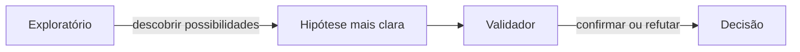

| Exploratórios | Validadores |
|---|---|
| mais iniciais | mais refinados |
| incerteza alta | solução mais definida |
| descobrir caminhos | validar hipótese |
| custo baixo e mudança rápida | interação mais próxima da solução esperada |

---

# Parte VII — O que pode ser prototipado

## 16. Quase tudo

A aula afirma que prototipagem pode ser aplicada a muitos tipos de solução:

- **produtos físicos** — dispositivos, eletrodomésticos, peças;
- **interfaces digitais** — telas e fluxos;
- **serviços e experiências** — cafeterias, hospitais, salas de aula;
- **alimentos** — sabores, massas, recheios e formatos.

O princípio é representar suficientemente uma hipótese para que ela possa ser experimentada e avaliada.

## 17. Caso Nike e impressão 3D

O material apresenta a Nike como exemplo de uso da impressão 3D para acelerar prototipagem de calçados. O objetivo pedagógico é mostrar como prototipagem física pode reduzir tempo de experimentação e acelerar inovação.

---

# Parte VIII — Protótipo × MVP

## 18. Diferença essencial

### Protótipo

- representação visual ou funcional;
- criado antes da implementação completa;
- testa, explora e valida soluções;
- foco em aprendizado rápido e feedback;
- frase-chave: **aprender antes de construir**.

### MVP

- versão funcional do produto;
- entrega valor real;
- é colocado em uso com usuários reais;
- permite observar métricas e comportamento real;
- foco em validação de negócio;
- frase-chave: **aprender com o produto funcionando**.

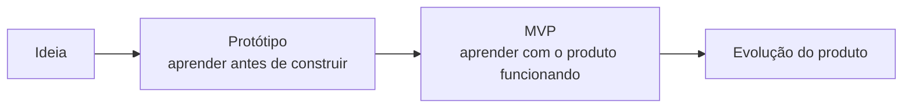

| Aspecto | Protótipo | MVP |
|---|---|---|
| Natureza | representação | produto funcional mínimo |
| Objetivo | explorar e validar solução | validar uso e negócio em ambiente real |
| Usuário | pode participar em teste controlado | usa um produto funcionando |
| Métrica principal | aprendizado qualitativo/fluxo | uso real, métricas e aceitação |
| Produção | não necessariamente | sim, como versão funcional mínima |

> [!IMPORTANT]
> **Protótipo ≠ MVP ≠ produto final.**

---

# Parte IX — Ferramentas

## 19. Ferramenta deve acompanhar o objetivo

A escolha da ferramenta depende de:

- fase do projeto;
- fidelidade necessária;
- rapidez desejada;
- colaboração;
- tipo de interação a testar.

O material apresenta ferramentas digitais como apoio, mas também reforça que papel e caneta continuam sendo válidos e recomendáveis nas fases iniciais.

## 20. Marvel App

O Marvel App é apresentado como forma simples de transformar desenhos em protótipos interativos:

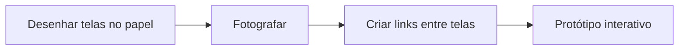

É especialmente útil quando se quer validar rapidamente um fluxo durante workshops, reuniões ou exploração inicial.

## 21. Figma

O Figma é apresentado como uma ferramenta de design e prototipagem:

- colaborativa;
- 100% online;
- baseada em nuvem;
- com edição simultânea;
- adequada a interfaces, wireframes, protótipos, sistemas de design, apresentações e elementos visuais.

O material também menciona o **FigJam** para fluxos, jornadas e atividades estratégicas.

### 21.1 Dicas para prototipar no Figma

- comece simples;
- priorize o fluxo principal;
- evite perfeccionismo inicial;
- use setas e transições;
- utilize comentários;
- teste no modo de apresentação (*play*).

### 21.2 Frames, layers e propriedades

Na prática apresentada:

- telas são criadas em **frames**;
- elementos são organizados em **layers**;
- propriedades visuais são ajustadas no painel;
- assets podem fornecer componentes prontos;
- alinhamento e espaçamento ajudam a manter consistência.

### 21.3 Prototype

Na aba de prototipagem, elementos são ligados entre telas para simular a navegação. Exemplo apresentado: botão “Entrar” levando à página principal.

### 21.4 Auto Layout

O **Auto Layout** é usado para organizar cards, manter espaçamentos e facilitar adaptação do layout quando o conteúdo muda.

---

## 22. Inconsistência aparente no e-book

Nas páginas 10–11 do e-book aparecem blocos sobre **Rate Limiting**, **LLM** e **SOAR** em meio à seção de ferramentas. Como esses blocos não se conectam ao restante da aula nem aos slides, esta documentação não os trata como conteúdo de prototipagem.

> [!WARNING]
> Para revisão da prova, priorize as ferramentas e práticas efetivamente relacionadas ao conteúdo: prototipagem em papel, Marvel App, Figma, FigJam, construção de frames, layers, componentes, interações e Auto Layout.

---

## 23. Resumo da Aula 2

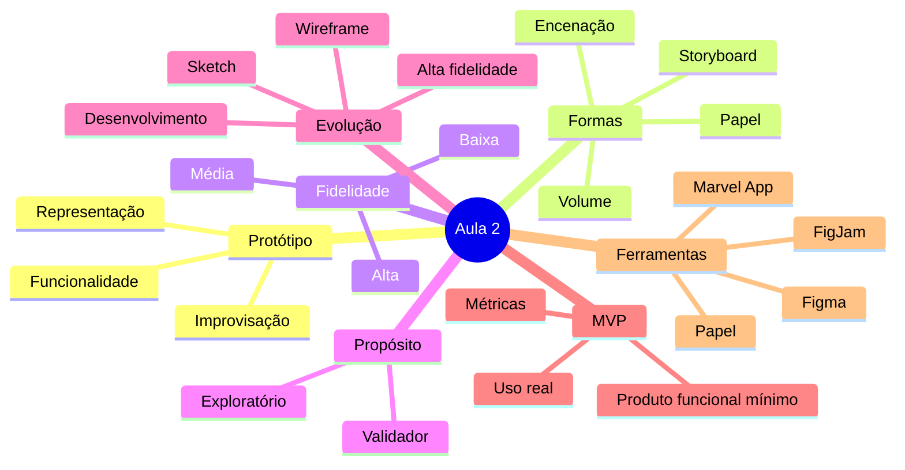

## 24. Perguntas de revisão

1. O que é um protótipo?
2. O que não deve ser confundido com protótipo?
3. Quais são as três características essenciais de um protótipo?
4. Quando um protótipo de papel é adequado?
5. O que diferencia protótipo de volume, storyboard e encenação?
6. Qual é a evolução sketch → wireframe → alta fidelidade → desenvolvimento?
7. Qual é a diferença entre baixa, média e alta fidelidade?
8. O que determina o nível de fidelidade apropriado?
9. Quais perguntas devem ser respondidas antes de prototipar?
10. O que diferencia protótipo exploratório de validador?
11. Qual é a diferença entre protótipo e MVP?
12. Como o Marvel App transforma papel em protótipo interativo?
13. Quais recursos do Figma são destacados no material?
14. Para que serve Auto Layout?

## Referência no material da disciplina

- Aula 2 — e-book **Tipos, Ferramentas e Prática**, páginas 2–17.
- Aula 2 — slides **Ferramentas e técnicas de Prototyping**, incluindo definição de protótipo, tipos, fidelidade, propósito, protótipo × MVP e prática em Figma.

