# 03 — Validação, Testes e Heurísticas

## 1. Objetivos da aula

A Aula 3 concentra-se em validar produtos e protótipos. O ponto de partida é que o comportamento do usuário depende do contexto e que um produto digital nunca está totalmente “pronto”: necessidades, tecnologias e hábitos mudam.

Ao final, deve ser possível explicar:

- o que significa contexto em UX;
- como contexto altera o uso de uma interface;
- principais tipos de teste e validação citados;
- diferenças entre teste de conceito, usabilidade e A/B;
- teste remoto moderado e não moderado;
- como planejar e conduzir teste de usabilidade;
- o que observar e como analisar dados;
- o que é análise heurística;
- quais são as dez heurísticas de Nielsen apresentadas no material.

---

# Parte I — Contexto do usuário

## 2. O que é contexto

A aula enfatiza que contexto não é apenas “o que está ao redor” fisicamente. Ele envolve diversas dimensões que influenciam pensamento e comportamento.

Dimensões apresentadas:

- emocional;
- pessoal;
- espacial;
- temporal;
- cultural;
- social.

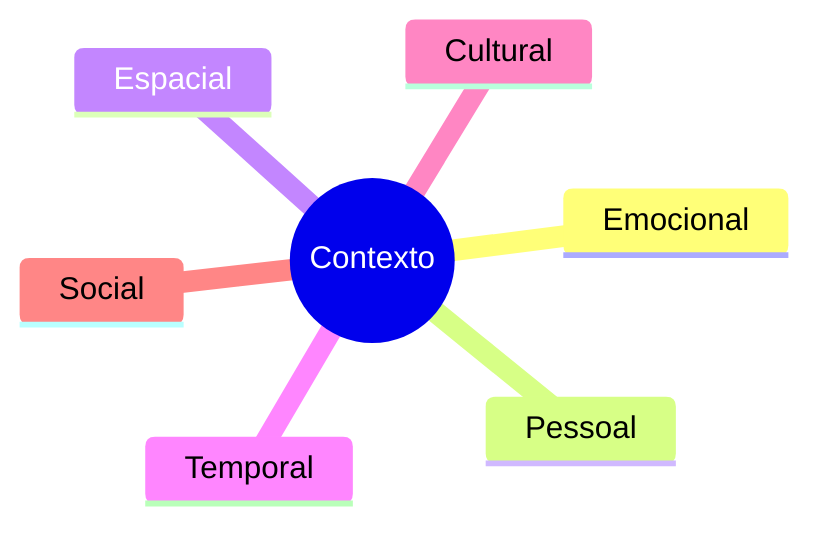

O material relaciona contexto também a:

- motivações;
- rotinas;
- experiências;
- marcas e produtos consumidos;
- sonhos;
- comportamentos.

## 3. Contexto influencia o uso

Uma mesma pessoa pode se comportar de forma diferente dependendo do ambiente. Usar um aplicativo na rua pode aumentar preocupação com rapidez, atenção e segurança; em casa, pode haver mais tempo para explorar informações.

### 3.1 Waze

O Waze é usado como exemplo de solução projetada para uso em movimento. Características destacadas:

- botões grandes;
- cores fortes;
- contraste elevado;
- interface sonora.

### 3.2 Amazon

A Amazon é apresentada em contexto de busca e exploração mais detalhada:

- alta densidade de informação;
- profundidade de detalhes;
- imagens;
- textos extensos.

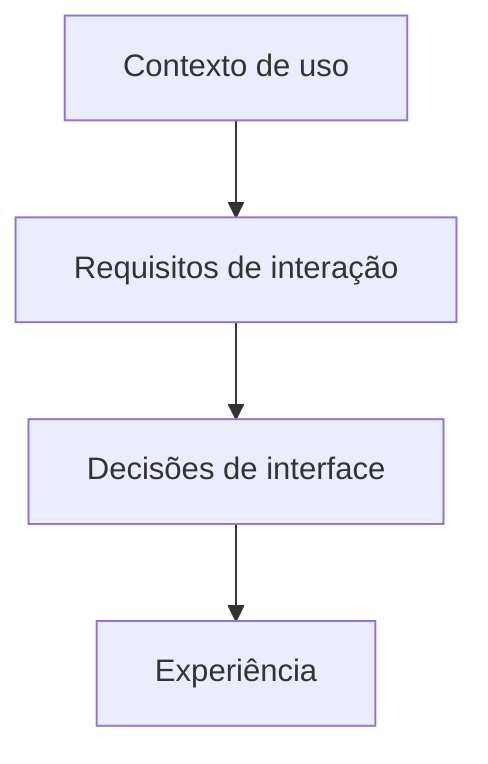

> [!IMPORTANT]
> Conhecer o contexto permite **potencializar o produto**, não apenas “personalizar a aparência”.

---

# Parte II — Produto digital é iterativo

## 4. Nunca está 100% pronto

A aula usa Facebook, Instagram e Gmail como exemplos de produtos que evoluem continuamente.

Razões:

- necessidades mudam;
- tecnologia muda;
- contexto social muda;
- novas gerações trazem novos comportamentos;
- usuários podem descobrir usos não previstos pela equipe.

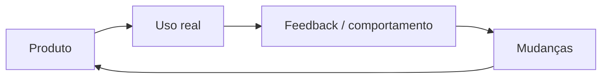

## 5. Insiders × outsiders

A equipe que trabalha no produto conhece termos, fluxos e decisões internas. Por isso, é “atípica” em relação a quem chega de fora.

> [!IMPORTANT]
> O material recomenda projetar e testar para **outsiders**, e não assumir que o comportamento da equipe representa o comportamento dos usuários reais.

---

# Parte III — Métodos de validação

## 6. Visão geral

A aula cita diversos métodos:

- teste de usabilidade;
- teste A/B;
- teste de cliques;
- teste de cinco segundos;
- teste de conceito;
- teste de preferência;
- análise heurística;
- testes remotos moderados e não moderados;
- mapa de calor;
- teste de guerrilha;
- sala espelho.

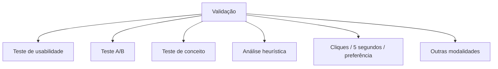

---

## 7. Teste de conceito

Foca na **primeira impressão e compreensão da proposta**. Serve para avaliar se:

- o conceito faz sentido;
- a proposta é relevante;
- o usuário entende a ideia geral;
- a hierarquia visual parece clara.

É mais adequado às fases iniciais e pode usar mockups, wireframes ou telas principais.

> [!NOTE]
> Teste de conceito não busca validar todo o produto; avalia partes-chave da proposta.

## 8. Teste A/B

Compara duas ou mais versões de uma solução para medir qual apresenta melhor resultado em uma métrica.

Exemplos de elementos que podem variar:

- layout;
- texto;
- cor;
- fluxo;
- funcionalidade.

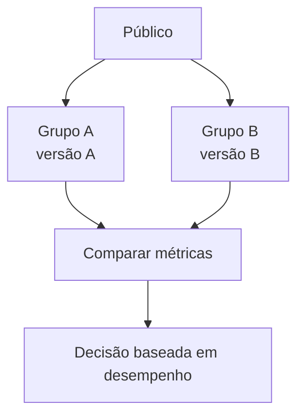

É apresentado como especialmente útil com público maior e para coleta quantitativa.

## 9. Análise heurística

A análise heurística aplica princípios consolidados de usabilidade como um checklist para identificar problemas de interface.

Características:

- realizada por avaliadores com conhecimento em UX/usabilidade;
- pode ser feita antes de testes com usuários;
- pode ser repetida periodicamente;
- ajuda a encontrar inconsistências e problemas básicos;
- não depende diretamente de participantes reais.

> [!IMPORTANT]
> **Análise heurística ≠ teste de usabilidade.** Uma avalia a interface com princípios; o outro observa pessoas interagindo com ela.

---

# Parte IV — Teste de usabilidade

## 10. O que é

O teste de usabilidade observa pessoas usando um produto ou protótipo para compreender:

- se conseguem navegar;
- se concluem tarefas;
- onde hesitam;
- quais erros cometem;
- como reagem;
- que barreiras surgem.

O material enfatiza que o teste de usabilidade olha principalmente para **o que e como as pessoas fazem**, e não apenas para o que dizem.

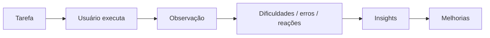

## 11. Linguagem verbal × não verbal

Pode existir dissonância entre discurso e comportamento. Uma pessoa pode dizer “foi fácil”, mesmo depois de:

- clicar em vários lugares;
- hesitar;
- voltar etapas;
- demorar;
- cometer erros.

O facilitador deve observar comportamento, expressões e tempo, e estimular o participante a **pensar em voz alta**.

## 12. Pesquisa qualitativa

O teste de usabilidade é apresentado como método qualitativo, preocupado com profundidade e compreensão dos comportamentos observados.

Pode ser utilizado:

- em produtos novos, antes do lançamento;
- em produtos existentes;
- em redesigns;
- em novas funcionalidades;
- em mudanças de fluxo.

---

# Parte V — Modalidades de teste

## 13. Remoto moderado

Realizado normalmente por videochamada, com pesquisador acompanhando em tempo real.

Vantagens:

- maior controle sobre tarefas e perguntas;
- observação de comportamento e emoções;
- aprofundamento imediato;
- adequado a testes exploratórios ou complexos.

## 14. Remoto não moderado

O usuário realiza as tarefas sozinho, guiado por uma ferramenta automatizada, como o **Maze** citado no material.

Vantagens:

- escala;
- rapidez;
- menor custo.

Limitação principal:

- menor profundidade, pois não há pesquisador para perguntar em tempo real.

| Moderado | Não moderado |
|---|---|
| pesquisador presente | usuário executa sozinho |
| maior profundidade | maior escala |
| perguntas de acompanhamento | roteiro pré-configurado |
| melhor para fluxos complexos | melhor para volume e rapidez |

## 15. Presencial e contexto natural

Testes podem ocorrer:

- em laboratório;
- em sala espelho;
- no ambiente de trabalho;
- na casa da pessoa;
- no próprio contexto em que o produto será usado.

O contexto natural pode revelar decisões e dificuldades que não aparecem em laboratório.

---

# Parte VI — Outros métodos apresentados

## 16. Mapa de calor

Visualiza áreas de maior e menor interação em uma interface. O material cita ferramentas como:

- Google Analytics;
- Hotjar;
- Mouseflow.

Pode registrar cliques, movimentos de mouse e padrões de interação.

## 17. Teste de guerrilha

Pesquisa rápida e informal realizada em locais públicos, sem recrutamento complexo. Vantagens:

- agilidade;
- baixo custo;
- acesso rápido a participantes.

A principal cautela é a adequação do público ao objetivo da pesquisa.

## 18. Sala espelho

Ambiente dividido por vidro/espelho, permitindo que equipe e clientes observem sem ficar diretamente na sala do participante.

Vantagem:

- observação controlada.

Desvantagens citadas:

- custo de infraestrutura;
- possível inibição da pessoa testada.

---

# Parte VII — Quantos usuários testar

## 19. A referência dos cinco usuários

O e-book apresenta a ideia de Nielsen de que, em muitos casos, **cinco usuários podem revelar cerca de 80% dos problemas gerais** de um fluxo.

Entretanto, o próprio material ressalta que isso não é universal.

Podem exigir mais participantes:

- fluxos bancários;
- muitas subtelas;
- submenus;
- jornadas mais complexas;
- produtos com maior maturidade e mais cenários.

> [!IMPORTANT]
> O número de usuários deve estar subordinado ao **objetivo e à complexidade do teste**.

---

# Parte VIII — Planejamento do teste

## 20. Definir objetivos

É necessário saber exatamente o que se quer aprender.

Exemplo do material: verificar se a pessoa consegue salvar uma receita com poucos cliques.

## 21. Criar roteiro de tarefas

As tarefas devem:

- representar situações reais;
- permitir exploração suficiente;
- evitar dar a resposta ou o caminho;
- produzir observações que respondam às hipóteses.

## 22. Selecionar participantes

Os participantes precisam representar o público-alvo relevante.

Critérios citados:

- idade;
- hábitos de uso;
- familiaridade com tecnologia;
- relação com o contexto do produto.

> [!WARNING]
> **Testar com pessoas erradas pode gerar conclusões inválidas.**

## 23. Preparar consentimento e gravação

O material reforça que, quando houver gravação ou tratamento de dados pessoais, é necessário consentimento e transparência, em conformidade com a LGPD.

O termo deve explicar:

- quais dados serão coletados;
- finalidade;
- como serão usados;
- como privacidade e sigilo serão tratados.

---

# Parte IX — Condução

## 24. Postura do facilitador

Boas práticas destacadas:

- explicar o propósito sem criar viés;
- reforçar que o produto está sendo testado, não a pessoa;
- pedir permissão para gravar;
- estimular pensamento em voz alta;
- manter postura neutra;
- não guiar;
- não elogiar ou corrigir durante a tarefa;
- tomar notas ou contar com segundo observador.

> [!IMPORTANT]
> A aula resume: **o usuário é a estrela do teste; o facilitador observa.**

## 25. O que observar

- confusão ou hesitação;
- erros;
- tempo para concluir tarefas;
- reações verbais;
- reações não verbais;
- feedback espontâneo;
- cliques e caminhos inesperados.

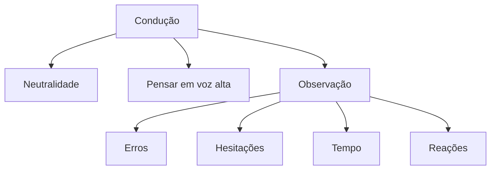

---

# Parte X — Coleta, análise e relatório

## 26. Coletar dados

Depois das sessões, a equipe reúne observações e busca padrões.

O material cita:

- dificuldades recorrentes;
- erros repetidos;
- comportamentos inesperados;
- feedback verbal;
- reações emocionais;
- tempo;
- cliques;
- hesitações.

## 27. Agrupar e identificar padrões

Um método visual citado usa post-its e cores para organizar pontos de dor por tela ou por usuário.

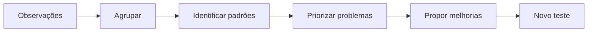

---

# Parte XI — As dez heurísticas de Nielsen no material

## 28. Visão geral

Os slides apresentam as heurísticas como dez princípios gerais de design de interface, associados a Jakob Nielsen e Rolf Molich.

A nomenclatura abaixo preserva a formulação usada no material:

1. **Visibilidade do estado do sistema**
2. **Relação entre o sistema e o mundo real (linguagem dos usuários)**
3. **Controle e liberdade para os usuários**
4. **Coerência e padrões**
5. **Prevenção de erros**
6. **Pequena dependência da memória**
7. **Flexibilidade e eficiência de uso**
8. **Estética e design minimalista**
9. **Ajuda para o usuário reconhecer erros**
10. **Ajuda e documentação**

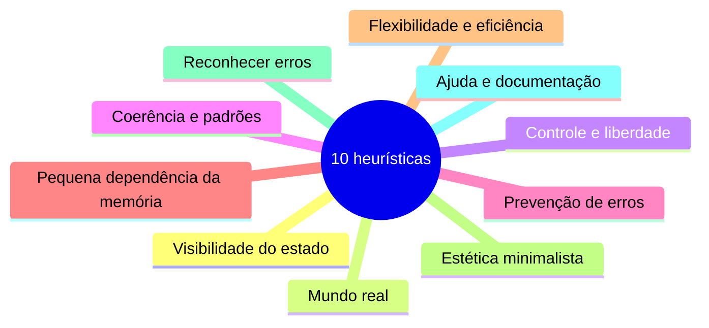

## 29. Como aplicar a análise heurística

Na prática proposta com o PetitChef, a equipe deve:

1. verificar se houve violação;
2. indicar onde ocorre;
3. classificar severidade;
4. sugerir melhoria.

A escala apresentada nos slides:

| Gravidade | Interpretação |
|---:|---|
| 1 — Leve | não afeta muito a experiência |
| 2 — Médio | causa frustração moderada |
| 3 — Grave | impede o uso ou confunde muito |

Modelo de registro:

| Tela | Heurística | Problema encontrado | Gravidade | Sugestão |
|---|---|---|---:|---|
| Exemplo | Visibilidade do estado | sistema não informa que ação foi concluída | 2 | adicionar feedback visível |

> [!NOTE]
> A linha de exemplo acima é apenas um **modelo didático de preenchimento**, não um achado atribuído ao aplicativo estudado.

---

# Parte XII — Análise heurística × teste de usabilidade

## 30. Comparação

| Aspecto | Análise heurística | Teste de usabilidade |
|---|---|---|
| Quem avalia | especialista/avaliador | usuário representativo |
| Base | princípios de usabilidade | comportamento observado |
| Precisa de participante? | não necessariamente | sim |
| Resultado | violações e inconsistências | barreiras, erros, hesitações e entendimento real |
| Momento | antes ou depois do lançamento | em protótipos e produtos |
| Relação | complementar | complementar |

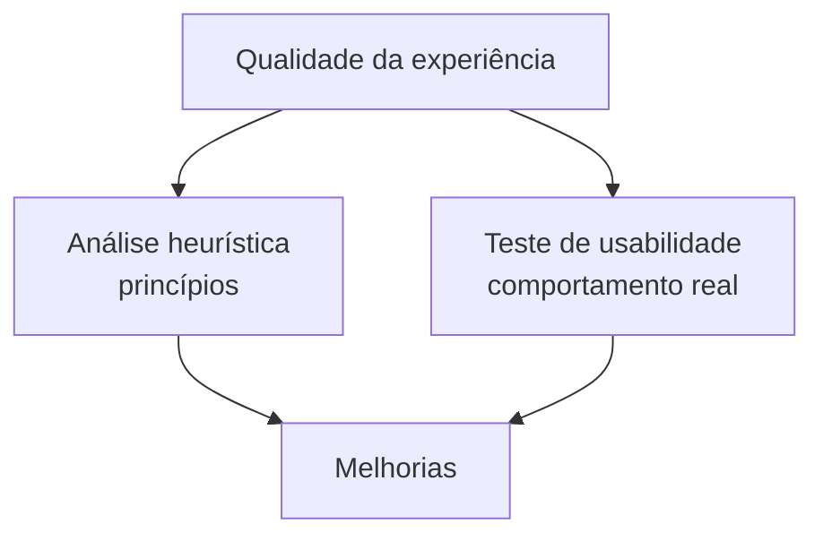

---

## 31. Resumo da Aula 3

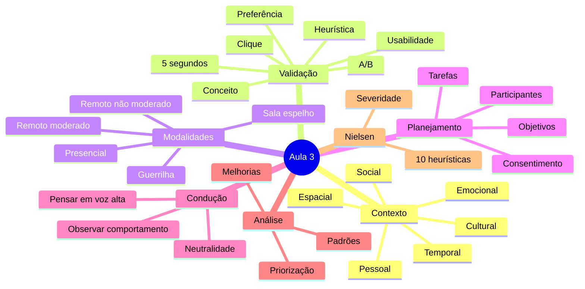

## 32. Perguntas de revisão

1. O que significa contexto em UX?
2. Quais dimensões de contexto são apresentadas?
3. Por que Waze e Amazon possuem interfaces diferentes?
4. Por que um produto digital nunca está 100% pronto?
5. Qual a diferença entre insiders e outsiders?
6. O que é teste de conceito?
7. O que é teste A/B?
8. O que é análise heurística?
9. O que é teste de usabilidade?
10. Por que comportamento não verbal é importante?
11. Qual é a diferença entre teste remoto moderado e não moderado?
12. Qual é a ideia dos cinco usuários apresentada no material?
13. Quais são as etapas principais de planejamento?
14. Como o facilitador deve se comportar durante o teste?
15. O que deve ser observado?
16. Como os dados podem ser agrupados após as sessões?
17. Quais são as dez heurísticas apresentadas?
18. Qual a diferença entre análise heurística e teste de usabilidade?

## Referência no material da disciplina

- Aula 3 — e-book **Validação, Testes e Heurísticas**, páginas 2–19.
- Aula 3 — slides **Testes de Validação de Protótipos**, incluindo contexto, métodos de validação, planejamento, condução, análise e heurísticas de Nielsen.

