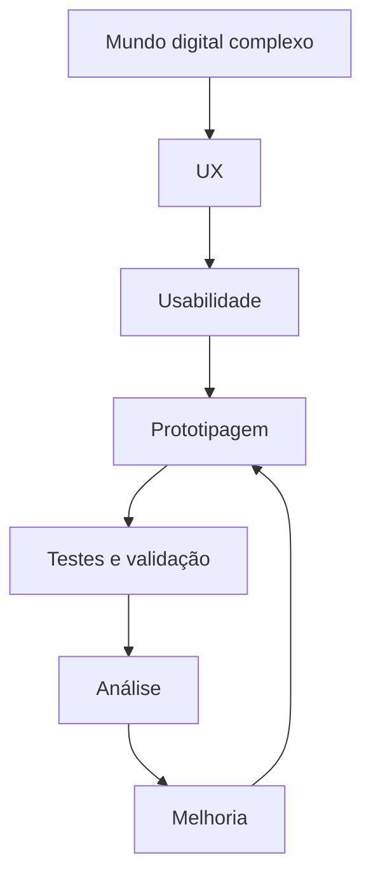
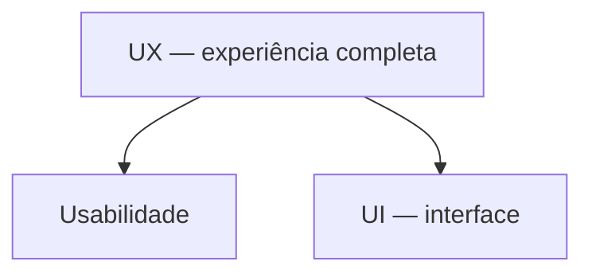
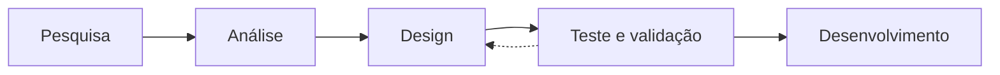
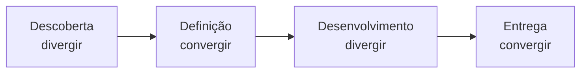
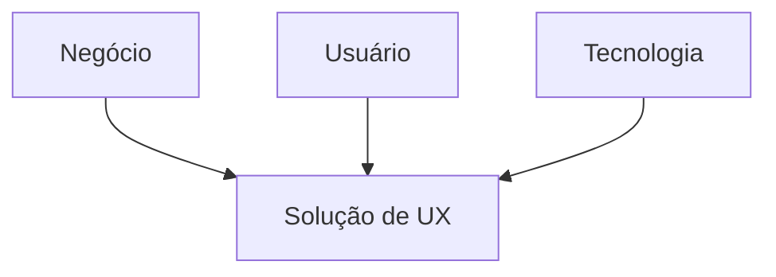
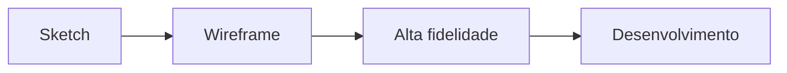
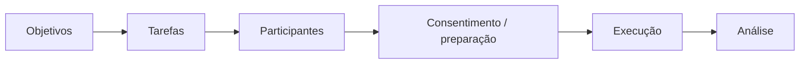
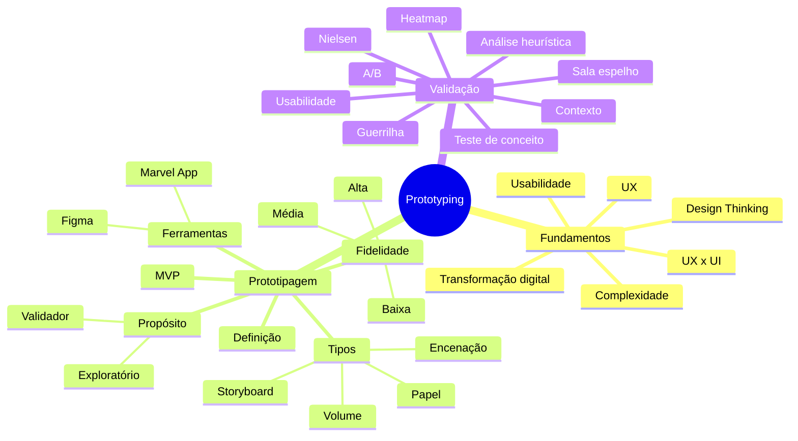

# 04 — Revisão para a Prova

Este capítulo consolida as três aulas em uma sequência curta para revisão.

---

# 1. Linha lógica do curso

A disciplina pode ser memorizada como:

> **Entender pessoas e contexto → representar uma solução → testar → aprender → refinar.**

---

# 2. Conceitos fundamentais

## 2.1 UX

Experiência completa de uma pessoa com produto, serviço ou sistema, antes, durante e depois do uso.

## 2.2 UI

Camada visual e interativa: cores, tipografia, ícones, botões, layout e demais elementos visíveis.

## 2.3 Usabilidade

Facilidade e eficiência para completar tarefas e alcançar objetivos, com satisfação e baixa incidência de erros.

## 2.4 Protótipo

Representação simplificada e preliminar usada para explorar, comunicar e testar uma solução.

## 2.5 MVP

Produto funcional mínimo que entrega valor real e é usado para aprender em contexto real de uso e negócio.

## 2.6 Teste de usabilidade

Observação de usuários representativos realizando tarefas para identificar barreiras, erros e oportunidades.

## 2.7 Análise heurística

Avaliação da interface com base em princípios de usabilidade, sem depender necessariamente de participantes reais.

---

# 3. UX × UI × usabilidade

| Conceito | Foco |
|---|---|
| UX | experiência completa |
| UI | aparência e interação visual |
| Usabilidade | facilidade, eficiência e satisfação no uso |

> [!IMPORTANT]
> UI e usabilidade fazem parte do universo de UX, mas não são sinônimos de UX.

---

# 4. Cinco componentes da usabilidade

Memorize:

1. facilidade de aprendizado;
2. eficiência de uso;
3. facilidade de memorização;
4. erros;
5. satisfação.

Mnemônico sugerido para estudo: **A-E-M-E-S** — Aprendizado, Eficiência, Memorização, Erros, Satisfação.

---

# 5. Processo de UX

Atividades relevantes:

- pesquisa: entrevistas e estudos de campo;
- análise: mapa de afinidade, persona, jornada, histórias;
- design: arquitetura da informação, wireframe e prototipagem;
- validação: usabilidade, analytics, A/B e heurísticas.

---

# 6. Duplo Diamante

Memorize: **Descobrir → Definir → Desenvolver → Entregar**.

---

# 7. Tripé do UX

- Negócio: resultado e objetivos.
- Usuário: necessidades, dores e contexto.
- Tecnologia: viabilidade.

---

# 8. O que é e o que não é protótipo

## É

- representação simplificada;
- modelo preliminar;
- instrumento de experimentação;
- ferramenta de comunicação;
- mecanismo de aprendizagem e redução de risco.

## Não é

- produto final;
- sistema totalmente funcional;
- produto pronto para produção;
- versão beta.

---

# 9. Características essenciais do protótipo

1. **Representação**
2. **Funcionalidade**
3. **Improvisação**

---

# 10. Formas de protótipo

| Tipo | Principal objetivo |
|---|---|
| Papel | fluxo e navegação |
| Volume | forma física e ergonomia |
| Storyboard | jornada e encadeamento |
| Encenação | experiência e interação |

---

# 11. Evolução do protótipo

---

# 12. Fidelidade

| Baixa | Média | Alta |
|---|---|---|
| ideia e estrutura | fluxo e navegação | validação visual e funcional |
| rápida e barata | intermediária | mais detalhada e custosa |
| sem acabamento | estrutura mais clara | próxima do produto |

> [!IMPORTANT]
> **Quanto mais próxima a entrega ou mais crítico o teste, maior tende a ser a fidelidade.**

---

# 13. Exploratório × validador

| Exploratório | Validador |
|---|---|
| descobrir possibilidades | testar uma hipótese definida |
| maior incerteza | solução mais refinada |
| mudar rápido | validar fluxo/comportamento |

---

# 14. Protótipo × MVP

| Protótipo | MVP |
|---|---|
| representação | produto funcional mínimo |
| antes de construir completamente | colocado em uso real |
| testa solução | testa uso e negócio |
| feedback e aprendizado | métricas e aceitação real |
| “aprender antes de construir” | “aprender com o produto funcionando” |

---

# 15. Perguntas antes de prototipar

1. Para quê estamos prototipando?
2. O que queremos saber?
3. O que queremos testar?
4. O que queremos descobrir?

---

# 16. Ferramentas e práticas

## Marvel App

Papel → foto → links → protótipo interativo.

## Figma

- colaboração online;
- frames;
- layers;
- assets;
- Prototype;
- comentários;
- modo Play;
- Auto Layout.

---

# 17. Contexto em UX

Dimensões:

- emocional;
- pessoal;
- espacial;
- temporal;
- cultural;
- social.

> [!IMPORTANT]
> Contexto influencia diretamente como a pessoa usa a interface.

---

# 18. Métodos de validação

| Método | Pergunta principal |
|---|---|
| Teste de conceito | “A proposta faz sentido?” |
| Teste de usabilidade | “A pessoa consegue usar?” |
| Teste A/B | “Qual versão performa melhor?” |
| Análise heurística | “A interface viola princípios de usabilidade?” |
| Mapa de calor | “Onde as pessoas interagem mais?” |
| Guerrilha | “O que podemos descobrir rapidamente com baixo custo?” |

---

# 19. Teste remoto moderado × não moderado

| Moderado | Não moderado |
|---|---|
| pesquisador presente | pesquisador ausente |
| perguntas em tempo real | tarefas guiadas pela ferramenta |
| profundidade | escala |
| mais indicado para complexidade | mais rápido e econômico |

---

# 20. Planejamento do teste de usabilidade

## Durante o teste

- teste o produto, não o usuário;
- estimule pensamento em voz alta;
- mantenha neutralidade;
- não dê pistas;
- observe comportamento e não apenas discurso.

---

# 21. Cinco usuários e 80%

O material apresenta a referência de que cerca de **cinco usuários** podem revelar aproximadamente **80% dos problemas gerais**, com a ressalva de que jornadas complexas podem exigir mais participantes.

---

# 22. Dez heurísticas de Nielsen — nomenclatura do material

1. Visibilidade do estado do sistema
2. Relação entre o sistema e o mundo real
3. Controle e liberdade para os usuários
4. Coerência e padrões
5. Prevenção de erros
6. Pequena dependência da memória
7. Flexibilidade e eficiência de uso
8. Estética e design minimalista
9. Ajuda para o usuário reconhecer erros
10. Ajuda e documentação

---

# 23. Análise heurística × usabilidade

| Análise heurística | Teste de usabilidade |
|---|---|
| princípios | comportamento real |
| avaliador especialista | usuário representativo |
| não exige usuário | exige participantes |
| aponta violações | revela barreiras e padrões de uso |

---

# 24. Pegadinhas conceituais prováveis

### “UX e UI são sinônimos.”

**Falso.** UI é parte da experiência; UX cobre a jornada completa.

### “Usabilidade é toda a experiência do usuário.”

**Falso.** Usabilidade é uma dimensão importante da UX.

### “Protótipo precisa estar totalmente funcional.”

**Falso.** Pode simular apenas o necessário para testar a hipótese.

### “Protótipo de alta fidelidade já é produto final.”

**Falso.** Continua sendo uma ferramenta de teste e refinamento.

### “MVP é um protótipo mais bonito.”

**Falso.** MVP é uma versão funcional mínima em uso real.

### “Sempre devemos começar com alta fidelidade.”

**Falso.** A fidelidade deve ser adequada à pergunta que precisa ser respondida.

### “Análise heurística substitui testes com usuários.”

**Falso.** São técnicas diferentes e complementares.

### “Cinco usuários sempre são suficientes.”

**Falso.** O material apresenta cinco como referência, mas reconhece que a complexidade pode exigir mais.

### “O que o usuário diz é mais importante do que o que ele faz.”

**Falso.** A aula enfatiza observar comportamento verbal e não verbal, com atenção especial ao comportamento real.

---

# 25. Questões de múltipla escolha

## Questão 1

No material, usabilidade é melhor entendida como:

A. apenas a aparência visual de uma interface.  
B. a facilidade e eficiência de uso para atingir objetivos.  
C. o modelo de negócio do produto.  
D. qualquer tipo de protótipo em papel.  
E. a identidade visual da marca.

## Questão 2

Qual item **não** é um dos cinco componentes de usabilidade apresentados por Nielsen?

A. Facilidade de aprendizado.  
B. Eficiência de uso.  
C. Memorização.  
D. Escalabilidade técnica.  
E. Satisfação.

## Questão 3

No Duplo Diamante, a sequência correta é:

A. Definição → Descoberta → Entrega → Desenvolvimento.  
B. Descoberta → Definição → Desenvolvimento → Entrega.  
C. Pesquisa → Código → Deploy → Suporte.  
D. Ideação → Produção → Venda → Manutenção.  
E. UI → UX → MVP → Produto.

## Questão 4

Qual afirmação diferencia corretamente UX de UI?

A. UX trata apenas de cores; UI trata da jornada.  
B. UX e UI são a mesma disciplina.  
C. UX cobre a experiência completa; UI concentra-se na interface visual/interativa.  
D. UX não envolve pesquisa.  
E. UI não participa da experiência.

## Questão 5

Um protótipo é:

A. obrigatoriamente um produto em produção.  
B. uma representação preliminar usada para explorar, comunicar e testar.  
C. sempre um código funcional completo.  
D. sinônimo de versão beta.  
E. sinônimo de MVP.

## Questão 6

Qual forma de protótipo representa uma jornada por quadros estáticos?

A. Volume.  
B. Storyboard.  
C. MVP.  
D. Teste A/B.  
E. Heatmap.

## Questão 7

A frase “aprender antes de construir” está associada principalmente a:

A. MVP.  
B. protótipo.  
C. produto final.  
D. teste A/B.  
E. deploy.

## Questão 8

A frase “aprender com o produto funcionando” está associada a:

A. sketch.  
B. wireframe.  
C. MVP.  
D. análise heurística.  
E. storyboard.

## Questão 9

O teste de conceito procura principalmente:

A. medir desempenho de servidor.  
B. verificar se a proposta é compreendida e relevante.  
C. comparar duas versões em produção exclusivamente.  
D. substituir qualquer teste de usabilidade.  
E. implementar o produto.

## Questão 10

No teste A/B:

A. todos os usuários recebem sempre a mesma versão.  
B. especialistas aplicam heurísticas.  
C. versões diferentes são comparadas por métricas.  
D. não há hipótese.  
E. só se avalia protótipo de papel.

## Questão 11

No teste remoto moderado:

A. não existe pesquisador.  
B. o pesquisador acompanha e pode aprofundar perguntas.  
C. não há observação de comportamento.  
D. não pode ser online.  
E. só pode ocorrer em sala espelho.

## Questão 12

Qual é uma boa prática de facilitação?

A. Dar pistas quando o usuário hesitar.  
B. Corrigir o usuário imediatamente.  
C. Manter neutralidade e estimular pensamento em voz alta.  
D. Explicar antecipadamente todos os caminhos.  
E. Avaliar a inteligência do participante.

## Questão 13

Análise heurística é:

A. observação obrigatória de cinco usuários.  
B. avaliação com base em princípios de usabilidade.  
C. teste de carga.  
D. sinônimo de A/B.  
E. pesquisa quantitativa de mercado.

## Questão 14

Qual é uma heurística apresentada no material?

A. Escalabilidade horizontal.  
B. Coerência e padrões.  
C. Normalização de banco.  
D. Alta disponibilidade.  
E. Integração contínua.

## Questão 15

A recomendação sobre fidelidade é:

A. sempre usar alta fidelidade.  
B. sempre usar papel.  
C. adequar a fidelidade ao estágio e ao que precisa ser testado.  
D. evitar wireframes.  
E. usar somente Figma.

---

# 26. Gabarito comentado

| Questão | Resposta | Comentário |
|---:|:---:|---|
| 1 | B | Usabilidade está ligada a facilidade, eficiência e satisfação no uso. |
| 2 | D | Escalabilidade técnica não está entre os cinco componentes apresentados. |
| 3 | B | Descoberta, Definição, Desenvolvimento e Entrega. |
| 4 | C | UX é a experiência completa; UI é a camada de interface. |
| 5 | B | Protótipo é preliminar e orientado a aprendizado. |
| 6 | B | Storyboard representa a história/jornada por quadros. |
| 7 | B | Protótipo = aprender antes de construir. |
| 8 | C | MVP = aprender com um produto funcional em uso real. |
| 9 | B | Teste de conceito verifica compreensão, primeira impressão e relevância. |
| 10 | C | A/B compara versões por desempenho. |
| 11 | B | O moderador acompanha e pode fazer perguntas. |
| 12 | C | Neutralidade e pensamento em voz alta são boas práticas centrais. |
| 13 | B | Heurística usa princípios de usabilidade, não necessariamente usuários. |
| 14 | B | Coerência e padrões integra a lista da aula. |
| 15 | C | Fidelidade é uma decisão de teste, não um fim em si mesma. |

---

# 27. Checklist final

Antes da prova, confirme que consegue explicar sem consultar:

- [ ] paradoxo da complexidade;
- [ ] diferença entre UX, UI e usabilidade;
- [ ] cinco componentes de usabilidade;
- [ ] Duplo Diamante;
- [ ] processo de UX;
- [ ] tripé negócio × usuário × tecnologia;
- [ ] definição de protótipo;
- [ ] o que não é protótipo;
- [ ] representação, funcionalidade e improvisação;
- [ ] papel, volume, storyboard e encenação;
- [ ] sketch, wireframe, alta fidelidade e desenvolvimento;
- [ ] baixa, média e alta fidelidade;
- [ ] exploratório × validador;
- [ ] protótipo × MVP;
- [ ] contexto emocional, pessoal, espacial, temporal, cultural e social;
- [ ] teste de conceito × usabilidade × A/B;
- [ ] remoto moderado × não moderado;
- [ ] referência dos cinco usuários / cerca de 80%;
- [ ] planejamento e condução de teste;
- [ ] comportamento verbal × não verbal;
- [ ] análise heurística × teste de usabilidade;
- [ ] dez heurísticas de Nielsen usadas no material.

---

# 28. Mapa mental final

## Referência no material da disciplina

- Aula 1 — e-book e slides.
- Aula 2 — e-book e slides.
- Aula 3 — e-book e slides.

