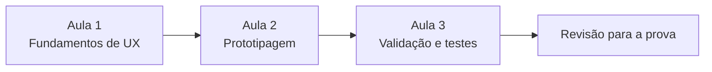
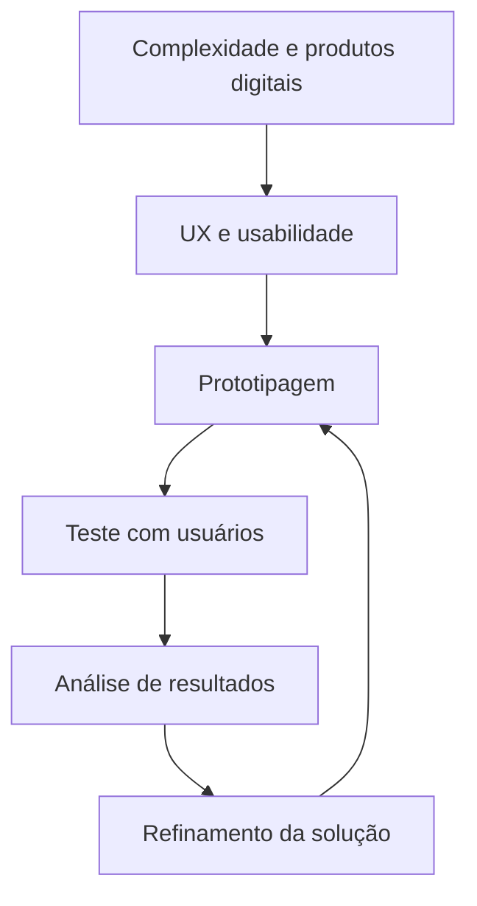

# Prototyping

Documentação de estudo, em português, preparada a partir dos e-books e slides da disciplina **Prototyping**, ministrada pela professora **Fernanda Vogt**.

O objetivo deste repositório é transformar o conteúdo das três aulas em uma referência didática para:

- consulta contínua no GitHub;
- revisão para prova;
- compreensão progressiva de UX, prototipagem e validação;
- reconstrução de conceitos e figuras em diagramas Mermaid;
- comparação entre conceitos que costumam ser confundidos, como UX × UI, protótipo × MVP e análise heurística × teste com usuários.

> [!IMPORTANT]
> Esta documentação foi construída **somente a partir do material fornecido**. Os e-books funcionam como eixo narrativo e os slides como complemento técnico e visual. Quando há um ponto aparentemente inconsistente no material, ele é registrado em vez de ser corrigido silenciosamente.

## Navegação

| Ordem | Documento | Conteúdo |
|---:|---|---|
| 0 | [Matriz de rastreabilidade](docs/00-matriz-rastreabilidade.md) | Relação entre os capítulos e os PDFs, critérios de fidelidade e inconsistências observadas |
| 1 | [Fundamentos de UX e Prototipagem](docs/01-fundamentos-ux-e-prototipagem.md) | Complexidade, transformação digital, UX, usabilidade, Design Thinking, processo de UX, UX × UI e papel da prototipagem |
| 2 | [Tipos, Fidelidade e Ferramentas](docs/02-tipos-fidelidade-e-ferramentas.md) | Definição de protótipo, formas, fidelidade, protótipos exploratórios e validadores, protótipo × MVP, Marvel App e Figma |
| 3 | [Validação, Testes e Heurísticas](docs/03-validacao-testes-e-heuristicas.md) | Contexto de uso, métodos de validação, teste de usabilidade, planejamento, condução, análise de dados e heurísticas de Nielsen |
| 4 | [Revisão para a Prova](docs/04-revisao-para-prova.md) | Resumo consolidado, tabelas comparativas, mapas mentais, pegadinhas conceituais, checklist e questões com gabarito |

## Como estudar

Para uma primeira leitura, siga a ordem das aulas. Depois use o capítulo de revisão para consolidar os conceitos.

## Convenções didáticas

> [!NOTE]
> **Conceito:** definição ou síntese apresentada no material.

> [!TIP]
> **Aplicação:** consequência prática, exemplo ou orientação de uso apresentada nas aulas.

> [!IMPORTANT]
> **Para a prova:** relação conceitual com alto potencial de cobrança.

> [!WARNING]
> **Atenção:** simplificação, ambiguidade ou inconsistência presente no material.

## Linha lógica da disciplina

A disciplina começa pelo problema de criar boas experiências em um mundo cada vez mais digital e complexo. Em seguida, apresenta a prototipagem como mecanismo de aprendizagem e redução de risco. Por fim, mostra como validar as soluções observando usuários reais e aplicando princípios de usabilidade.

## Ideias centrais para memorizar

1. **A complexidade não precisa ser eliminada; precisa ser projetada de forma compreensível.**
2. **UX é a experiência completa; UI é a camada visual e interativa da interface.**
3. **Usabilidade é parte da UX e envolve facilidade de aprendizado, eficiência, memorização, erros e satisfação.**
4. **Protótipo é uma representação preliminar para explorar, comunicar e testar.**
5. **A fidelidade deve ser adequada ao que se quer aprender.**
6. **Protótipo e MVP não são sinônimos:** protótipo ajuda a aprender antes de construir; MVP permite aprender com um produto funcional em uso real.
7. **O contexto do usuário influencia diretamente o uso de um produto.**
8. **Testar com usuários reais é essencial porque comportamento observado pode diferir do que as pessoas dizem.**
9. **Análise heurística não substitui teste de usabilidade:** são métodos diferentes e complementares.
10. **Produtos digitais evoluem continuamente; validação e melhoria são iterativas.**

## Fontes utilizadas

- Aula 1 — e-book **Fundamentos e Contexto** e slides **Fundamentos e conceitos de Prototyping**.
- Aula 2 — e-book **Tipos, Ferramentas e Prática** e slides **Ferramentas e técnicas de Prototyping**.
- Aula 3 — e-book **Validação, Testes e Heurísticas** e slides **Testes de Validação de Protótipos**.

