# Business Agility

> Documentação de estudo baseada no material das Aulas 1, 2 e 3 da disciplina de **Business Agility**.
>
> Objetivo: consolidar os conceitos em uma visão única, didática e orientada à revisão, preservando a terminologia e o encadeamento apresentados no material-base.

---

## Sumário

1. [Visão geral](#1-visão-geral)
2. [O que é Business Agility](#2-o-que-é-business-agility)
3. [As quatro dimensões do Business Agility](#3-as-quatro-dimensões-do-business-agility)
4. [VUCA e BANI](#4-vuca-e-bani)
5. [Da agilidade de software à agilidade de negócios](#5-da-agilidade-de-software-à-agilidade-de-negócios)
6. [Manifesto Ágil](#6-manifesto-ágil)
7. [Iterativo, incremental, MVP e feedback](#7-iterativo-incremental-mvp-e-feedback)
8. [Experiência do cliente e fluxo de valor](#8-experiência-do-cliente-e-fluxo-de-valor)
9. [Métricas de valor: NPS, churn, OKRs e KPIs](#9-métricas-de-valor-nps-churn-okrs-e-kpis)
10. [Roadmap para Business Agility](#10-roadmap-para-business-agility)
11. [Cultura ágil e cultura catalisadora](#11-cultura-ágil-e-cultura-catalisadora)
12. [Liderança catalisadora](#12-liderança-catalisadora)
13. [Autonomia, segurança psicológica e Delegation Poker](#13-autonomia-segurança-psicológica-e-delegation-poker)
14. [Scrum e Business Agility](#14-scrum-e-business-agility)
15. [Kanban e gestão do fluxo](#15-kanban-e-gestão-do-fluxo)
16. [SAFe, Design Thinking, Lean Startup e DevOps](#16-safe-design-thinking-lean-startup-e-devops)
17. [Governança ágil](#17-governança-ágil)
18. [Mindset de inovação](#18-mindset-de-inovação)
19. [Growth Mindset](#19-growth-mindset)
20. [Gestão de mudanças e ADKAR](#20-gestão-de-mudanças-e-adkar)
21. [Value Stream Mapping](#21-value-stream-mapping)
22. [Team Topologies e modelos organizacionais](#22-team-topologies-e-modelos-organizacionais)
23. [Transformação digital, dados e IA](#23-transformação-digital-dados-e-ia)
24. [Design Thinking, Duplo Diamante e CX](#24-design-thinking-duplo-diamante-e-cx)
25. [CX, UX, UI, Service Design e Customer Success](#25-cx-ux-ui-service-design-e-customer-success)
26. [Inovação e tendências](#26-inovação-e-tendências)
27. [Síntese integrada](#27-síntese-integrada)
28. [Glossário](#28-glossário)
29. [Revisão para prova](#29-revisão-para-prova)

---

# 1. Visão geral

Business Agility trata da capacidade de uma organização **perceber mudanças, aprender, decidir e responder rapidamente**, mantendo o foco na geração de valor sustentável.

A ideia central do material pode ser resumida assim:

> **Agilidade nos negócios não significa apenas “fazer Scrum”. Significa tornar a organização inteira capaz de aprender e se adaptar continuamente.**

Isso envolve estratégia, liderança, cultura, pessoas, processos, tecnologia, parceiros, dados e experiência do cliente.

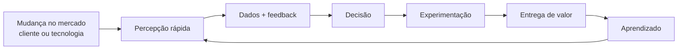

A organização ágil opera como um **sistema adaptativo**, não como uma sequência rígida de projetos.

---

# 2. O que é Business Agility

## 2.1 Definição

Business Agility é a capacidade organizacional de:

- perceber mudanças internas ou externas;
- adaptar estratégia, estrutura e processos;
- responder com velocidade e flexibilidade;
- aprender em ciclos curtos;
- tomar decisões orientadas por dados;
- entregar valor sustentável ao cliente e aos demais stakeholders.

O material destaca a ideia de uma empresa em **“modo beta permanente”**: a organização não considera sua forma de trabalhar definitiva. Ela observa, testa, aprende e se reajusta.

## 2.2 Business Agility não é apenas Agile em TI

| Agile restrito à TI | Business Agility |
|---|---|
| Foco em desenvolvimento de software | Foco na organização inteira |
| Scrum, Kanban e práticas técnicas | Estratégia, cultura, operação, clientes e tecnologia |
| Otimização do trabalho de equipes | Otimização do fluxo de valor ponta a ponta |
| Entregas frequentes | Aprendizado e adaptação organizacional contínuos |
| Métricas técnicas | Métricas de fluxo, cliente e negócio |
| Autonomia do time | Autonomia com alinhamento estratégico |

Uma organização pode executar Scrum corretamente e, ainda assim, ter baixa agilidade empresarial se jurídico, financeiro, compras, segurança, governança ou liderança forem gargalos permanentes.

---

# 3. As quatro dimensões do Business Agility

O material estrutura Business Agility em quatro dimensões interdependentes:

1. **Relacionamentos**
2. **Liderança**
3. **Indivíduos**
4. **Operações**

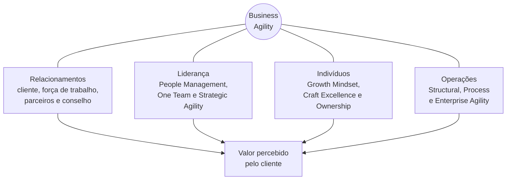

## 3.1 Relacionamentos

Abrange o ecossistema humano da organização:

- clientes;
- colaboradores;
- parceiros;
- fornecedores;
- conselho e stakeholders.

**Pergunta-guia:** todos estão alinhados ao valor percebido pelo cliente?

Práticas associadas:

- voz do cliente;
- cocriação;
- parcerias;
- métricas compartilhadas;
- comunidades de prática;
- comunicação transparente.

Indicadores apresentados no material incluem NPS, eNPS e indicadores relacionados a parceiros.

## 3.2 Liderança

A liderança reúne três aspectos principais:

### People Management
Desenvolver pessoas, remover impedimentos e criar condições para autonomia.

### One Team
Romper silos e favorecer colaboração entre áreas.

### Strategic Agility
Manter a estratégia clara, adaptativa e responsiva às mudanças.

A liderança ágil orienta sem microgerenciar.

## 3.3 Indivíduos

Três elementos recebem destaque:

- **Growth Mindset** — aprendizado contínuo;
- **Craft Excellence** — busca de excelência na função;
- **Ownership & Accountability** — responsabilidade pelo resultado.

O profissional deixa de atuar apenas como executor de tarefas e passa a compreender o impacto de suas decisões.

## 3.4 Operações

A operação ágil é apresentada em três níveis:

- **Structural Agility:** estruturas e redes de equipes reconfiguráveis;
- **Process Agility:** otimização dos fluxos de valor;
- **Enterprise Agility:** expansão das práticas de adaptação para toda a empresa.

O objetivo é mudar estrutura e processos sem paralisar a organização.

---

# 4. VUCA e BANI

O material usa os conceitos VUCA e BANI para explicar por que organizações precisam desenvolver capacidade adaptativa.

## 4.1 VUCA

VUCA representa:

- **Volatility — Volatilidade**
- **Uncertainty — Incerteza**
- **Complexity — Complexidade**
- **Ambiguity — Ambiguidade**

## 4.2 BANI

BANI acrescenta dimensões humanas e sistêmicas:

- **Brittle — Frágil**
- **Anxious — Ansioso**
- **Non-linear — Não linear**
- **Incomprehensible — Incompreensível**

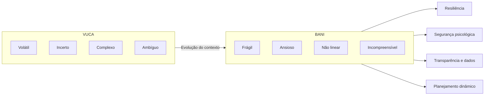

## 4.3 Respostas organizacionais

| Condição | Resposta ágil destacada |
|---|---|
| Volatilidade | reduzir time-to-market |
| Incerteza | experimentar e revisar hipóteses |
| Complexidade | usar times multifuncionais |
| Ambiguidade | medir valor ao cliente |
| Fragilidade | desenvolver resiliência |
| Ansiedade | segurança psicológica |
| Não linearidade | planejamento dinâmico |
| Incompreensibilidade | transparência de dados |

### Ponto de prova

**VUCA enfatiza turbulência e dificuldade de previsão. BANI acrescenta fragilidade, ansiedade, não linearidade e incompreensibilidade.**

---

# 5. Da agilidade de software à agilidade de negócios

O material apresenta uma evolução histórica da agilidade.

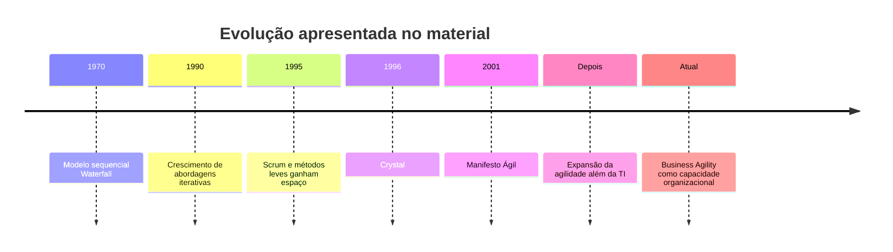

A mudança principal é de escopo:

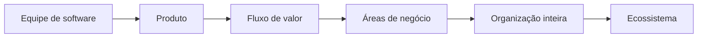

---

# 6. Manifesto Ágil

O Manifesto Ágil é apresentado como marco importante da passagem de modelos rígidos para abordagens adaptativas.

## 6.1 Quatro valores

1. **Indivíduos e interações** mais que processos e ferramentas.
2. **Software em funcionamento** mais que documentação abrangente.
3. **Colaboração com o cliente** mais que negociação de contratos.
4. **Responder a mudanças** mais que seguir um plano.

Isso não significa eliminar processos, documentação, contratos ou planejamento. O valor maior é atribuído à capacidade de gerar resultado, colaborar e adaptar.

## 6.2 Princípios associados

O material enfatiza:

- entregas frequentes;
- aceitação de mudanças;
- colaboração entre negócio e desenvolvimento;
- equipes motivadas;
- comunicação contínua;
- ritmo sustentável;
- excelência técnica;
- simplicidade;
- times auto-organizados;
- inspeção e adaptação.

---

# 7. Iterativo, incremental, MVP e feedback

Um dos pontos centrais da disciplina é distinguir **iterativo** de **incremental**.

## 7.1 Iterativo

Iteração significa repetir ciclos de aprendizado e melhorar uma solução com base em feedback.

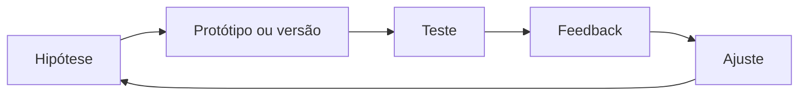

## 7.2 Incremental

Incremental significa entregar partes funcionais progressivamente.

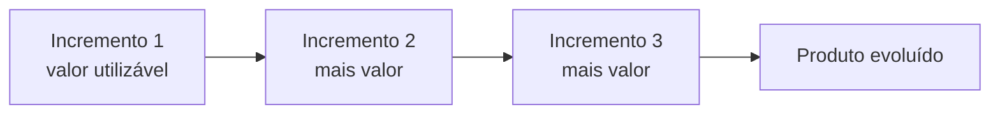

## 7.3 Iterativo + incremental

A combinação dos dois reduz o risco de passar muito tempo construindo algo sem validar valor.

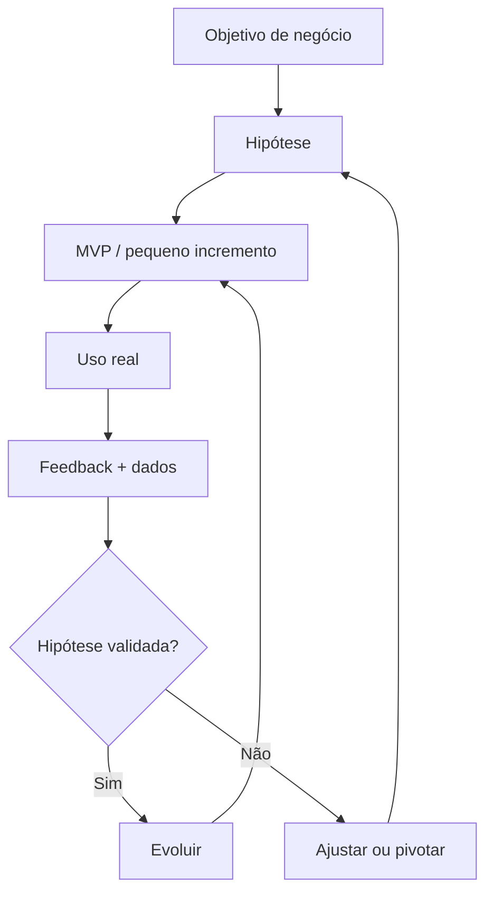

## 7.4 MVP

**MVP — Minimum Viable Product** é uma versão mínima utilizada para validar hipóteses com usuários reais.

O foco não é construir um produto “ruim e incompleto”, mas aprender com o **menor investimento coerente com a hipótese que se deseja testar**.

## 7.5 ROI

O ROI relaciona o retorno obtido ao investimento realizado. O material associa ciclos menores à capacidade de antecipar valor e otimizar retorno.

---

# 8. Experiência do cliente e fluxo de valor

A experiência do cliente aparece como eixo central do Business Agility.

A organização deixa de estruturar todo o trabalho apenas por departamentos e passa a observar **jornadas**.

Exemplos de jornadas:

- descoberta;
- compra;
- cadastro;
- onboarding;
- pagamento;
- suporte;
- renovação.

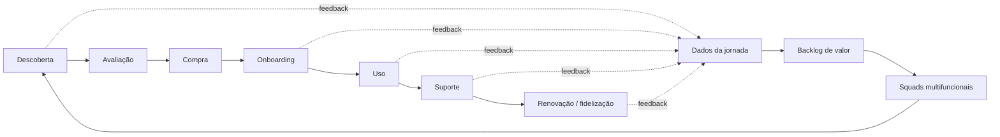

## 8.1 Customer Experience

CX representa a percepção total do cliente sobre as interações com uma organização ao longo do tempo.

Inclui aspectos:

- funcionais;
- emocionais;
- relacionais.

## 8.2 Backlog de valor

Diferentemente de uma lista puramente técnica, o backlog de valor prioriza:

- problemas;
- oportunidades;
- melhorias;
- funcionalidades;

com base no impacto esperado para cliente e negócio.

## 8.3 Churn

Churn mede cancelamento ou abandono de clientes e pode sinalizar redução de valor percebido.

---

# 9. Métricas de valor: NPS, churn, OKRs e KPIs

## 9.1 NPS

**Net Promoter Score** é apresentado como indicador associado à probabilidade de recomendação e à percepção de satisfação/lealdade.

## 9.2 eNPS

O material relaciona o NPS do cliente ao **eNPS**, usado para observar a experiência e o engajamento das pessoas da organização.

A lógica é que a experiência interna influencia a capacidade de entregar experiência externa.

## 9.3 KPI

KPI acompanha continuamente a saúde de um processo, sistema ou resultado.

Exemplos:

- lead time;
- throughput;
- churn;
- taxa de conversão;
- tempo de resolução;
- disponibilidade.

## 9.4 OKR

OKR conecta:

- um **Objetivo** qualitativo e inspirador;
- a **Resultados-Chave** mensuráveis.

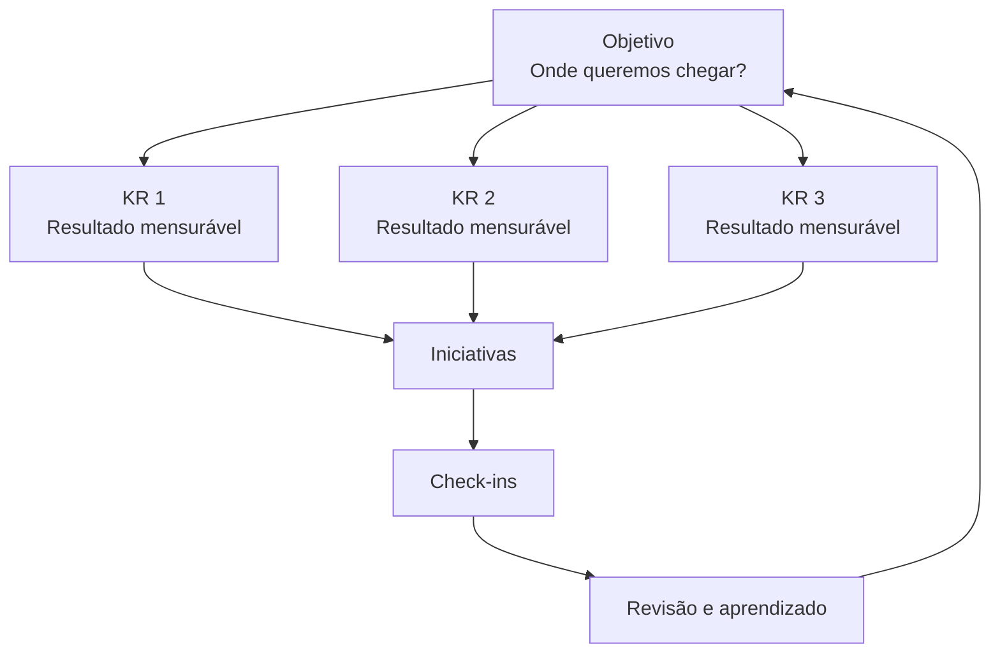

## 9.5 KPI x OKR

| KPI | OKR |
|---|---|
| Monitora saúde ou desempenho | Direciona mudança |
| Pode ser permanente | Trabalha em ciclos |
| Normalmente quantitativo | Objetivo qualitativo + KRs quantitativos |
| Ajuda a observar estabilidade | Ajuda a orientar evolução |
| Pode compor um KR | Pode usar KPIs como resultados-chave |

**Não são concorrentes. São complementares.**

---

# 10. Roadmap para Business Agility

O material resume a evolução em quatro movimentos:

1. diagnóstico;
2. piloto;
3. revisão;
4. escala.

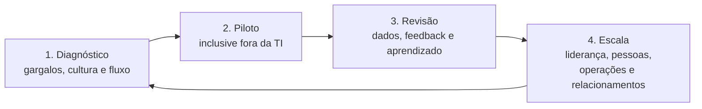

A escala depende de sincronizar a cadeia de valor. Uma área muito ágil não compensa permanentemente outra área que bloqueia o fluxo.

---

# 11. Cultura ágil e cultura catalisadora

O material alerta que práticas ágeis sem cultura compatível tendem a perder eficácia.

Uma **cultura catalisadora** promove:

- autonomia;
- propósito compartilhado;
- segurança psicológica;
- transparência;
- aprendizado;
- experimentação;
- responsabilidade.

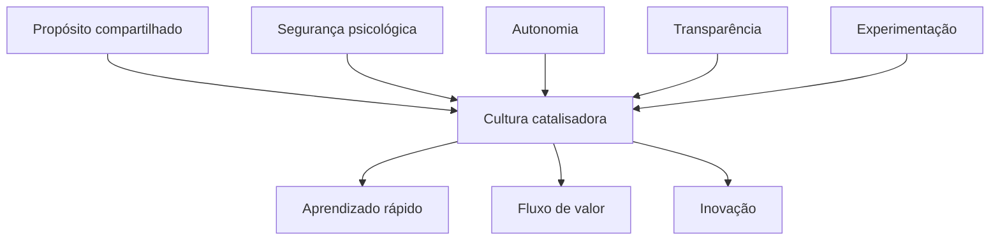

## 11.1 Segurança psicológica

É descrita como ambiente no qual pessoas podem:

- propor ideias;
- questionar;
- admitir incerteza;
- relatar erros;
- aprender com falhas;

sem medo de punições inadequadas.

Segurança psicológica não elimina responsabilidade. Ela busca separar **aprendizado com erro** de **culpabilização improdutiva**.

---

# 12. Liderança catalisadora

O líder deixa de ser o centro de todas as decisões e passa a atuar como facilitador do sistema.

## 12.1 Principais comportamentos

- construir visão compartilhada;
- promover segurança psicológica;
- exercer curiosidade;
- remover impedimentos;
- reduzir burocracia;
- desenvolver pessoas;
- distribuir decisões;
- criar transparência;
- orientar por métricas e propósito.

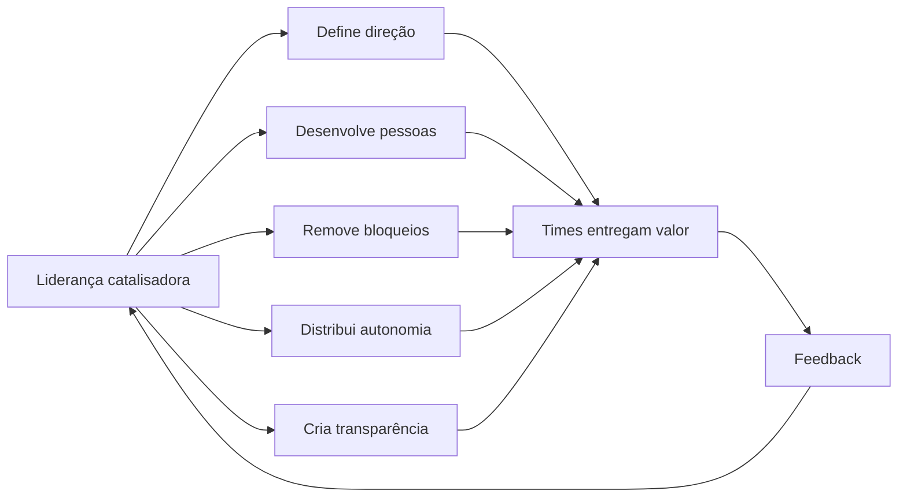

## 12.2 Gemba

O material apresenta **Gemba** como a prática de observar diretamente onde o trabalho acontece.

A finalidade é compreender:

- gargalos reais;
- dependências;
- desperdícios;
- dificuldades operacionais;

antes de tomar decisões apenas por relatórios.

## 12.3 One Team

A cultura One Team reduz fronteiras entre departamentos e promove objetivo comum.

Isso favorece:

- missão única;
- métricas compartilhadas;
- squads multifuncionais;
- planejamento conjunto;
- transparência.

---

# 13. Autonomia, segurança psicológica e Delegation Poker

Autonomia não significa ausência de limites. Significa permitir que decisões sejam tomadas próximo de onde existe conhecimento, dentro de regras claras.

## 13.1 Delegation Poker

O material apresenta os sete níveis de delegação do Management 3.0:

1. **Dizer**
2. **Vender**
3. **Consultar**
4. **Concordar**
5. **Aconselhar**
6. **Perguntar**
7. **Delegar**

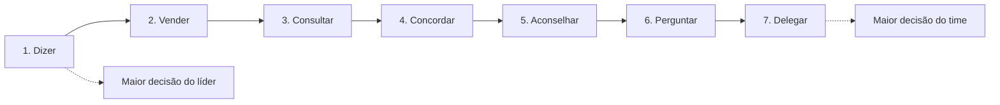

O objetivo não é levar todas as decisões ao nível 7. O objetivo é **deixar explícito quem decide o quê e qual grau de autonomia existe**.

## 13.2 Delegation Board

O Delegation Board registra tipos de decisão e o nível de autonomia esperado.

Exemplos de decisões:

- contratação;
- arquitetura;
- roadmap;
- orçamento;
- tecnologias;
- definição de prioridades.

---

# 14. Scrum e Business Agility

Scrum é apresentado como um framework que sustenta ciclos curtos de inspeção e adaptação.

## 14.1 Elementos enfatizados

### Sprint Goal
Deve estar relacionado a um resultado relevante, não apenas a uma lista de tarefas.

### Backlog orientado a outcomes
Prioriza impacto de negócio e cliente.

### Time cross-functional
Reúne competências suficientes para reduzir dependências externas.

### Review
Valida o incremento e coleta feedback.

### Retrospectiva
Melhora o sistema de trabalho.

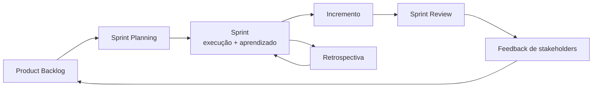

## 14.2 Scrum como meio, não fim

O valor do Scrum para Business Agility está em:

- ciclos curtos;
- feedback frequente;
- redução de risco;
- transparência;
- adaptação;
- conexão entre estratégia e execução.

---

# 15. Kanban e gestão do fluxo

Kanban torna o fluxo visível e ajuda a gerenciar trabalho em andamento.

## 15.1 Conceitos-chave

- visualização do trabalho;
- limitação de WIP;
- lead time;
- throughput;
- bloqueios;
- eficiência de fluxo;
- melhoria contínua.

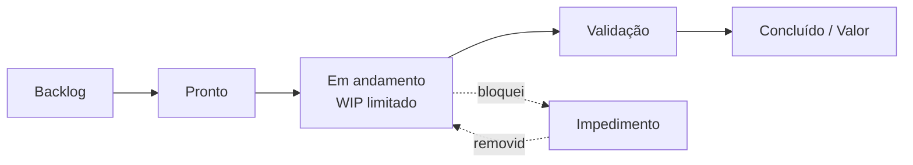

## 15.2 Métricas de fluxo

### Lead Time
Tempo entre solicitação e entrega.

### Throughput
Quantidade de itens concluídos por período.

### WIP
Quantidade de trabalho simultaneamente em andamento.

### Tempo de bloqueio
Tempo em que um item permanece impedido.

## 15.3 Fora da TI

O material destaca a aplicação de Kanban em:

- jurídico;
- RH;
- operações;
- outras áreas de negócio.

---

# 16. SAFe, Design Thinking, Lean Startup e DevOps

Essas abordagens aparecem como componentes complementares.

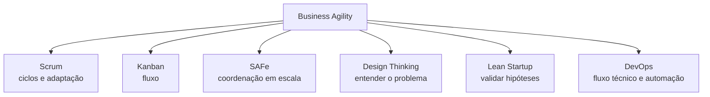

## 16.1 SAFe

É apresentado como framework para escalar agilidade em organizações grandes, integrando:

- planejamento;
- portfólio;
- execução;
- múltiplas equipes;
- PI Planning.

## 16.2 Design Thinking

Foco em:

- empatia;
- entendimento do problema;
- ideação;
- prototipação;
- teste.

## 16.3 Lean Startup

Foco em validação rápida de hipóteses, especialmente com MVPs e feedback real.

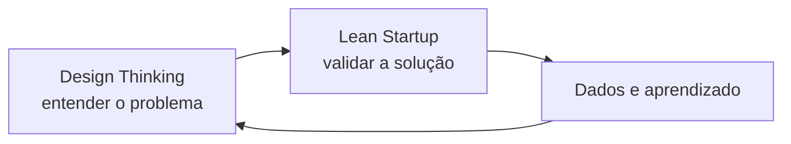

## 16.4 DevOps

DevOps integra desenvolvimento e operações por meio de:

- colaboração;
- automação;
- entregas frequentes;
- redução de silos;
- qualidade;
- segurança;
- escalabilidade.

---

# 17. Governança ágil

Governança ágil não significa ausência de governança.

Significa manter os controles necessários com menor latência decisória e maior transparência.

## 17.1 Componentes

- papéis claros;
- cerimônias;
- artefatos;
- dashboards;
- métricas;
- decisões distribuídas;
- revisão frequente;
- comitês leves quando necessários.

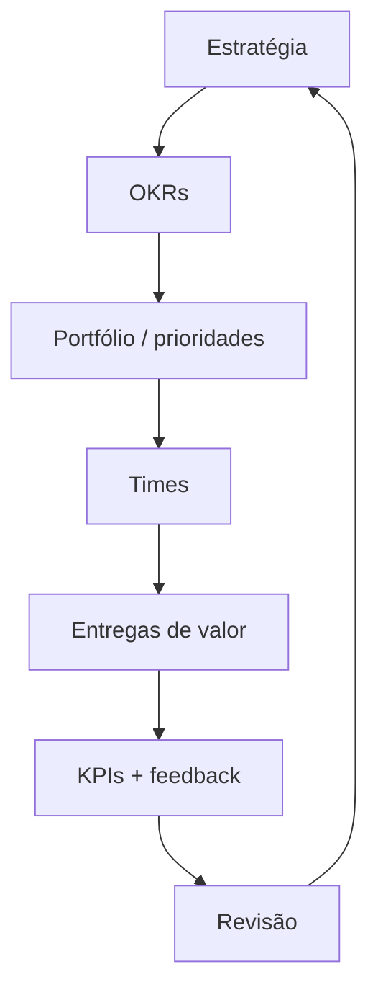

## 17.2 Cadências

O material enfatiza diferentes ritmos:

- daily;
- sprint;
- review;
- retrospectiva;
- refinamento;
- encontros estratégicos;
- revisões mensais ou trimestrais;
- Big Room Planning.

Cadência cria uma estrutura previsível para adaptação.

---

# 18. Mindset de inovação

A Aula 3 posiciona a inovação como elemento essencial para sustentar Business Agility.

Uma organização pode ser eficiente e ainda assim deixar de ser relevante se não questionar continuamente:

- o problema;
- o produto;
- o modelo de negócio;
- a tecnologia;
- as necessidades do cliente.

## 18.1 Cultura de inovação x Business Agility

| Cultura de inovação | Business Agility |
|---|---|
| Valores e comportamentos | Capacidade organizacional |
| Experimentação e curiosidade | Adaptação estratégica e operacional |
| Foco forte em pessoas e aprendizado | Foco em fluxo de valor e resposta ao ambiente |
| Incentiva novas ideias | Reconfigura prioridades e recursos |
| Mede clima, aprendizado e experimentos | Mede negócio, fluxo e cliente |

São complementares.

## 18.2 DNA ágil da inovação

O material destaca:

- propósito coletivo;
- resiliência emocional;
- curiosidade;
- autodidatismo;
- cocriação;
- diversidade;
- governança leve;
- ética;
- responsabilidade.

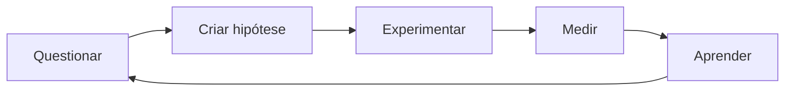

---

# 19. Growth Mindset

O material utiliza a distinção de Carol Dweck entre mindset fixo e mindset de crescimento.

## 19.1 Mindset fixo

Tende a:

- evitar desafios;
- temer falhas;
- evitar feedback;
- tratar habilidade como algo pouco modificável.

## 19.2 Mindset de crescimento

Tende a:

- buscar desafios;
- aprender com erros;
- valorizar esforço e desenvolvimento;
- utilizar feedback para evoluir.

## 19.3 Práticas sugeridas

- feedback construtivo;
- metas de aprendizado;
- exposição controlada a desafios;
- reconhecimento de esforço;
- comunidades de aprendizagem;
- show-and-tell;
- compartilhamento de falhas e aprendizados;
- tempo reservado à inovação.

---

# 20. Gestão de mudanças e ADKAR

Business Agility implica mudança contínua. Por isso, gestão de mudança não aparece como evento isolado.

## 20.1 ADKAR

O modelo ADKAR organiza a transição em cinco dimensões:

- **Awareness — Consciência**
- **Desire — Desejo**
- **Knowledge — Conhecimento**
- **Ability — Habilidade**
- **Reinforcement — Reforço**

```mermaid
flowchart LR
    A["Awareness<br/>Consciência"] --> D["Desire<br/>Desejo"]
    D --> K["Knowledge<br/>Conhecimento"]
    K --> AB["Ability<br/>Habilidade"]
    AB --> R["Reinforcement<br/>Reforço"]
    R --> N["Nova prática incorporada"]
```

## 20.2 Agente de mudança

O agente de mudança atua como facilitador entre transformação e pessoas.

Responsabilidades destacadas:

- comunicar;
- preparar;
- coletar feedback;
- acompanhar adoção;
- reduzir resistência;
- conectar estratégia e execução.

## 20.3 Mudança contínua

```mermaid
flowchart LR
    M["Mudança"] --> C["Comunicar"]
    C --> A["Adoção"]
    A --> F["Feedback"]
    F --> AJ["Ajustar"]
    AJ --> R["Reforçar"]
    R --> M
```

---

# 21. Value Stream Mapping

O **Value Stream Mapping — VSM** ajuda a enxergar o sistema ponta a ponta.

## 21.1 Objetivos

- representar o fluxo atual;
- identificar esperas;
- localizar gargalos;
- visualizar handoffs;
- desenhar estado futuro;
- priorizar intervenções.

```mermaid
flowchart LR
    C["Demanda do cliente"] --> A["Etapa A<br/>2 dias"]
    A --> W1["Espera<br/>5 dias"]
    W1 --> B["Etapa B<br/>1 dia"]
    B --> W2["Espera<br/>4 dias"]
    W2 --> D["Etapa C<br/>1 dia"]
    D --> V["Valor entregue"]

    W1:::gargalo
    W2:::gargalo

    classDef gargalo stroke-width:3px,stroke-dasharray:5 5;
```

A principal lição é que otimizar apenas uma etapa não necessariamente otimiza o fluxo completo.

---

# 22. Team Topologies e modelos organizacionais

O material apresenta quatro tipos de time.

## 22.1 Tipos de equipe

### 1. Times alinhados ao fluxo
Responsáveis por um fluxo de valor específico.

### 2. Times de suporte / enabling
Ajudam outras equipes a adquirir capacidades e superar impedimentos.

### 3. Times de subsistemas complexos
Concentram conhecimento especializado em componentes de alta complexidade.

### 4. Times de plataforma
Oferecem capacidades comuns para que outros times trabalhem com autonomia.

```mermaid
flowchart TB
    C["Cliente / Fluxo de valor"] --> ST["Time alinhado ao fluxo"]

    EN["Time de suporte"] -.capacita.-> ST
    CS["Subsistema complexo"] -.componente especializado.-> ST
    PF["Plataforma"] -.self-service.-> ST

    ST --> V["Valor"]
```

## 22.2 Modos de interação

O material apresenta:

- **Colaboração**
- **Serviço**
- **Facilitação**

## 22.3 Modelo Spotify

São citados:

- squads;
- tribes;
- chapters;
- guilds.

O ponto conceitual relevante é a combinação de autonomia dos times com mecanismos de alinhamento e compartilhamento de conhecimento.

---

# 23. Transformação digital, dados e IA

O material trata transformação digital como mudança organizacional, e não apenas aquisição de tecnologia.

## 23.1 Pilares

- cultura digital;
- infraestrutura em nuvem;
- plataformas integradas;
- dados;
- segurança;
- privacidade;
- governança.

```mermaid
flowchart TD
    TD["Transformação Digital"]

    TD --> C["Cultura digital"]
    TD --> CL["Cloud"]
    TD --> P["Plataformas integradas"]
    TD --> D["Dados"]
    TD --> S["Segurança e privacidade"]
    TD --> IA["IA e automação"]

    D --> DG["Data Governance"]
    IA --> EX["Experimentação"]
    EX --> V["Valor"]
    DG --> V
```

## 23.2 Governança de dados

Inclui:

- políticas;
- processos;
- responsabilidades;
- qualidade;
- glossários;
- segurança;
- conformidade;
- comitês multidisciplinares.

Dados devem se tornar ativos para decisão, não apenas registros históricos.

## 23.3 Inteligência Artificial

O material associa IA a:

- produtividade;
- criatividade;
- desenvolvimento de software;
- análise de dados;
- comunicação;
- automação;
- prototipação.

Ao mesmo tempo, reforça o papel humano em decisões de convergência, julgamento e estratégia.

## 23.4 Método Forth apresentado no material

A sequência destacada é:

1. insights;
2. ideação;
3. prototipação rápida.

```mermaid
flowchart LR
    I["Insights<br/>dores e oportunidades"] --> ID["Ideação"]
    ID --> P["Prototipação rápida"]
    P --> V["Validação"]
    V --> I
```

---

# 24. Design Thinking, Duplo Diamante e CX

Business Agility e Design Thinking se encontram no foco em aprendizado rápido e valor ao usuário.

## 24.1 Duplo Diamante

O modelo alterna divergência e convergência.

```mermaid
flowchart LR
    D1["Descobrir<br/>divergir"] --> D2["Definir<br/>convergir"]
    D2 --> D3["Desenvolver<br/>divergir"]
    D3 --> D4["Entregar<br/>convergir"]

    D1 -->|"Problema"| D2
    D2 -->|"Problema certo"| D3
    D3 -->|"Alternativas"| D4
    D4 -->|"Solução validada"| F["Feedback"]
    F --> D1
```

## 24.2 Técnicas citadas

- entrevistas;
- mapa de empatia;
- personas;
- jornada;
- ideação colaborativa;
- storyboard;
- wireframes;
- protótipos;
- MVP;
- testes;
- NPS;
- CSAT;
- CES.

---

# 25. CX, UX, UI, Service Design e Customer Success

Esses conceitos são relacionados, mas não equivalentes.

| Conceito | Foco principal |
|---|---|
| **CX** | experiência do cliente em toda a relação com a organização |
| **UX** | experiência de uso de um produto ou serviço |
| **UI** | camada visual e interativa |
| **Service Design** | processos, sistemas e interações que sustentam o serviço |
| **Customer Success** | garantir que o cliente alcance o resultado esperado |

## 25.1 Relação entre eles

```mermaid
flowchart TB
    CX["Customer Experience<br/>jornada completa"]

    CX --> UX["UX<br/>experiência de uso"]
    UX --> UI["UI<br/>interface"]

    CX --> SD["Service Design<br/>processos e bastidores"]
    CX --> CS["Customer Success<br/>resultado contínuo do cliente"]
```

## 25.2 Métricas mencionadas

- NPS;
- CSAT;
- CES;
- churn;
- retenção;
- tempo de resolução;
- taxa de adoção.

---

# 26. Inovação e tendências

O material finaliza conectando Business Agility a tendências tecnológicas e modelos de inovação.

São citados:

- TRIZ;
- Estratégia do Oceano Azul;
- Web3;
- blockchain;
- DAOs;
- metaverso;
- hiperautomação;
- RPA;
- machine learning;
- realidade aumentada;
- realidade virtual;
- gêmeos digitais;
- computação quântica;
- venture building;
- Corporate Venture Capital;
- sustentabilidade.

## 26.1 TRIZ

Abordagem estruturada para resolução de problemas inventivos por meio de padrões.

## 26.2 Oceano Azul

Busca criar espaços de mercado menos dependentes da competição direta.

## 26.3 Hiperautomação

Integra tecnologias como:

- automação;
- IA;
- machine learning;
- RPA;

para automatizar processos mais amplos.

## 26.4 Ética e governança

O material ressalta que velocidade tecnológica precisa ser acompanhada de:

- transparência;
- responsabilidade;
- mitigação de vieses;
- privacidade;
- governança;
- sustentabilidade.

---

# 27. Síntese integrada

A disciplina pode ser compreendida como um grande ciclo de adaptação empresarial.

```mermaid
flowchart TB
    ENV["Mercado, cliente,<br/>tecnologia e regulação"] --> STR["Estratégia adaptativa"]
    STR --> GOV["Governança leve + OKRs"]
    GOV --> ORG["Estrutura organizacional"]
    ORG --> TEAMS["Times autônomos<br/>e multifuncionais"]
    TEAMS --> FLOW["Fluxo de valor"]
    FLOW --> CX["Experiência do cliente"]
    CX --> DATA["Dados, NPS, churn,<br/>KPIs e feedback"]
    DATA --> LEARN["Aprendizado"]
    LEARN --> INNOV["Experimentação e inovação"]
    INNOV --> STR

    CULT["Cultura + segurança psicológica"] --- TEAMS
    LEAD["Liderança catalisadora"] --- GOV
    TECH["Cloud + DevOps + IA + automação"] --- FLOW
```

A lógica é:

> **Estratégia orienta. Governança conecta. Times executam. Fluxo entrega. Cliente responde. Dados ensinam. A organização aprende e se adapta.**

---

# 28. Glossário

| Termo | Definição resumida |
|---|---|
| **Business Agility** | capacidade organizacional de perceber e responder rapidamente a mudanças |
| **Backlog adaptativo** | backlog repriorizado de acordo com valor e mudanças |
| **Backlog de valor** | lista priorizada por impacto no cliente e negócio |
| **BANI** | frágil, ansioso, não linear e incompreensível |
| **Big Room Planning** | planejamento conjunto envolvendo múltiplas áreas |
| **Churn** | taxa de cancelamento ou abandono |
| **Craft Excellence** | busca de excelência na execução profissional |
| **Customer Experience** | percepção do cliente em toda a jornada |
| **Delegation Poker** | técnica para explicitar níveis de delegação |
| **DevOps** | integração entre desenvolvimento e operações |
| **eNPS** | indicador relacionado à experiência/recomendação dos colaboradores |
| **Flow Efficiency** | relação entre tempo efetivamente trabalhado e tempo total do fluxo |
| **Gemba** | observação direta do local onde o trabalho ocorre |
| **Growth Mindset** | mentalidade orientada ao aprendizado e desenvolvimento |
| **KPI** | indicador de desempenho ou saúde de processo |
| **Lead Time** | tempo entre solicitação e entrega |
| **MVP** | versão mínima usada para validar hipóteses |
| **NPS** | indicador associado à recomendação/lealdade do cliente |
| **OKR** | objetivos e resultados-chave mensuráveis |
| **Outcome** | impacto ou resultado gerado |
| **Output** | artefato ou entrega produzida |
| **Ownership** | senso de responsabilidade pelo resultado |
| **PI Planning** | planejamento coordenado utilizado no SAFe |
| **ROI** | retorno sobre investimento |
| **SAFe** | framework de escalabilidade ágil |
| **Squad** | time multidisciplinar e orientado a um objetivo |
| **Throughput** | quantidade de itens concluídos em um período |
| **Time-to-market** | tempo necessário para colocar uma solução no mercado |
| **Value Stream** | fluxo ponta a ponta de geração de valor |
| **VSM** | técnica visual de mapeamento do fluxo de valor |
| **VUCA** | volátil, incerto, complexo e ambíguo |
| **WIP** | trabalho em andamento |

---

# 29. Revisão para prova

## 29.1 Conceitos que devem estar muito claros

### Business Agility
Não é framework. É uma **capacidade organizacional**.

### Quatro dimensões
- relacionamentos;
- liderança;
- indivíduos;
- operações.

### VUCA x BANI
VUCA descreve turbulência; BANI acrescenta fragilidade e aspectos humanos/cognitivos.

### Iterativo x incremental
- iterativo = aprender e ajustar;
- incremental = entregar partes funcionais.

### Output x outcome
- output = o que foi produzido;
- outcome = efeito ou valor gerado.

### KPI x OKR
- KPI acompanha desempenho;
- OKR direciona mudança estratégica.

### Scrum
Favorece inspeção, adaptação, entrega incremental e feedback.

### Kanban
Favorece visualização, controle de WIP e melhoria de fluxo.

### Design Thinking x Lean Startup
- Design Thinking ajuda a entender o problema;
- Lean Startup ajuda a validar hipóteses de solução.

### Liderança catalisadora
Facilita, desenvolve pessoas, remove impedimentos e distribui decisões.

### Segurança psicológica
Permite aprender, questionar e experimentar sem cultura de punição.

### ADKAR
Consciência → Desejo → Conhecimento → Habilidade → Reforço.

### Team Topologies
- stream-aligned;
- enabling;
- complicated subsystem;
- platform.

### Transformação digital
Não é apenas tecnologia. Envolve cultura, dados, processos, governança e modelo operacional.

---

## 29.2 Mapa mental final

```mermaid
mindmap
  root((Business Agility))
    Estratégia
      OKRs
      adaptação
      governança leve
    Pessoas
      growth mindset
      ownership
      segurança psicológica
    Liderança
      catalisadora
      autonomia
      remover impedimentos
    Operações
      fluxo de valor
      Kanban
      VSM
      DevOps
    Métodos
      Scrum
      SAFe
      Design Thinking
      Lean Startup
    Cliente
      CX
      jornada
      NPS
      churn
    Mudança
      ADKAR
      agentes de mudança
      feedback
    Inovação
      experimentação
      MVP
      IA
      dados
    Estrutura
      Team Topologies
      squads
      plataformas
```

---

## 29.3 Revisão em 15 perguntas

1. Por que Business Agility não pode ser reduzido a Scrum?
2. Quais são as quatro dimensões do Business Agility?
3. Qual é a diferença essencial entre VUCA e BANI?
4. O que significa operar em “modo beta permanente”?
5. Qual é a diferença entre iterativo e incremental?
6. Qual é a função de um MVP?
7. Por que a jornada do cliente é relevante para Business Agility?
8. Qual é a diferença entre KPI e OKR?
9. O que caracteriza uma liderança catalisadora?
10. Como segurança psicológica contribui para inovação?
11. Qual é a finalidade do Delegation Poker?
12. Como WIP afeta o fluxo em Kanban?
13. Como Design Thinking e Lean Startup se complementam?
14. Quais são os cinco elementos do ADKAR?
15. Quais são os quatro tipos de times do Team Topologies?

---

## 29.4 Respostas rápidas

1. Porque Business Agility é capacidade organizacional; Scrum é apenas um framework.
2. Relacionamentos, liderança, indivíduos e operações.
3. BANI acrescenta fragilidade, ansiedade, não linearidade e incompreensibilidade.
4. Aprender, testar e ajustar continuamente.
5. Iterativo aprende/refina; incremental entrega partes funcionais.
6. Validar hipóteses com menor investimento e feedback real.
7. Porque conecta áreas ao valor efetivamente percebido pelo cliente.
8. KPI monitora desempenho; OKR orienta mudança e resultados estratégicos.
9. Facilita, desenvolve, remove impedimentos, distribui decisões e cria alinhamento.
10. Permite questionamento, experimentação e aprendizado com erros.
11. Tornar explícito o nível de autonomia de cada tipo de decisão.
12. WIP excessivo aumenta filas e tempo de entrega; limitá-lo melhora o fluxo.
13. Design Thinking entende o problema; Lean Startup valida a solução.
14. Consciência, Desejo, Conhecimento, Habilidade e Reforço.
15. Alinhado ao fluxo, suporte/enabling, subsistema complexo e plataforma.

---

# Fontes-base da disciplina

Documentação consolidada a partir dos materiais fornecidos:

- **Aula 1 — Ebook: O que é Agilidade nos Negócios**
- **Aula 1 — Slides: Business Agility — Módulo 1**
- **Aula 2 — Ebook: Cultura & Liderança Ágil**
- **Aula 2 — Slides: Business Agility — Módulo 2**
- **Aula 3 — Ebook: Mindset de Inovação**
- **Aula 3 — Slides: Business Agility — Módulo 3**

> Os exemplos empresariais, percentuais e estudos de caso apresentados durante a disciplina devem ser entendidos no contexto das fontes e aulas originais. Esta documentação prioriza os conceitos, relações e práticas utilizados no material didático.
