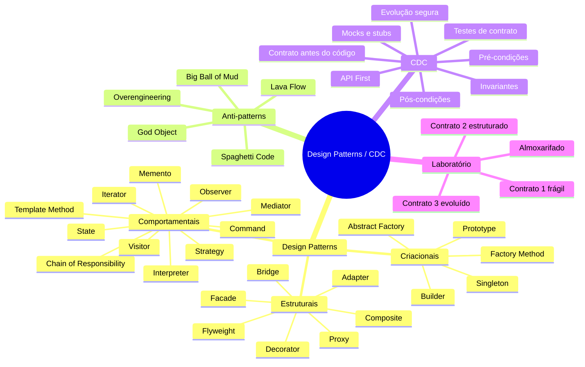
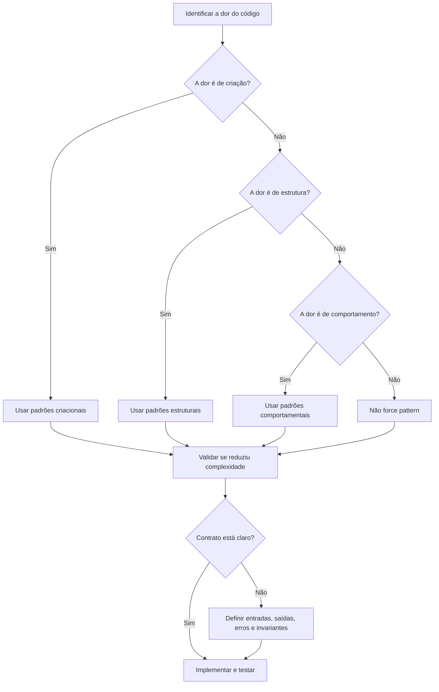

# 00 - Mapa Mental da Disciplina

## Ideia central

A disciplina conecta três assuntos:

1. **Design Patterns**: soluções conceituais reutilizáveis para problemas recorrentes de design de software.
2. **Anti-patterns**: soluções aparentes que parecem resolver no curto prazo, mas degradam manutenção, testabilidade e evolução.
3. **CDC / Contract-Driven Design**: abordagem em que o contrato vem antes do código e orienta implementação, testes, integração e evolução arquitetural.

## Mapa geral

## Três perguntas que resumem a disciplina

| Pergunta | Tema relacionado | Exemplo |
|---|---|---|
| Como crio objetos sem acoplar tudo? | Padrões criacionais | Factory, Builder, Singleton |
| Como organizo classes e integrações? | Padrões estruturais | Adapter, Facade, Repository |
| Como objetos se comunicam e variam comportamento? | Padrões comportamentais | Strategy, Observer, Command |
| Como garanto que módulos não quebrem entre si? | CDC | OpenAPI, interfaces, eventos, Pact |
| Como evito código que cresce sem controle? | Anti-patterns | God Object, Spaghetti Code, Big Ball of Mud |

## Linha de raciocínio para prova

## Frase-chave

> Design Patterns não são objetivo. São consequência de uma dor real de design. CDC ajuda a explicitar essa dor antes do código.
