# 01 - Fundamentos de Design Patterns

## O que são Design Patterns

Design Patterns são **modelos de solução** para problemas recorrentes no desenvolvimento de software orientado a objetos. Eles não são trechos de código para copiar e colar. São formas conhecidas de organizar classes, objetos, responsabilidades e colaborações.

Na prática, um pattern ajuda a responder perguntas como:

- Como criar objetos sem espalhar `new` pelo sistema?
- Como evitar uma função gigante cheia de `if/else`?
- Como integrar uma API externa sem contaminar o domínio?
- Como permitir que vários componentes reajam a um evento?

## Para que servem

Design Patterns servem para:

- organizar melhor o código;
- evitar retrabalho;
- reduzir erros recorrentes;
- facilitar manutenção;
- melhorar comunicação entre desenvolvedores;
- tornar o sistema mais flexível, testável e evolutivo.

A ideia mais importante é que patterns criam um **vocabulário comum**. Quando alguém diz “aqui cabe Strategy”, a equipe entende que há um comportamento variável que pode ser isolado em classes intercambiáveis.

## Exemplo clássico: cálculo de frete sem pattern

```javascript
function calcularFrete(tipo, peso) {
  if (tipo === "sedex") {
    return peso * 12 + 10;
  }

  if (tipo === "pac") {
    return peso * 7 + 5;
  }

  if (tipo === "motoboy") {
    return peso * 15 + 3;
  }

  throw new Error("Tipo de frete inválido!");
}
```

### Problemas

- Cada novo frete exige mexer na função.
- A função cresce indefinidamente.
- Viola o **OCP**: aberto para extensão, fechado para modificação.
- Mistura várias regras em um único ponto.
- Testar uma regra isolada fica mais difícil.

## Solução com Strategy

```javascript
class SedexStrategy {
  calcular(peso) {
    return peso * 12 + 10;
  }
}

class PacStrategy {
  calcular(peso) {
    return peso * 7 + 5;
  }
}

class MotoboyStrategy {
  calcular(peso) {
    return peso * 15 + 3;
  }
}

class CalculadoraFrete {
  constructor(strategy) {
    this.strategy = strategy;
  }

  calcular(peso) {
    return this.strategy.calcular(peso);
  }
}
```

### Diagrama Mermaid - Strategy

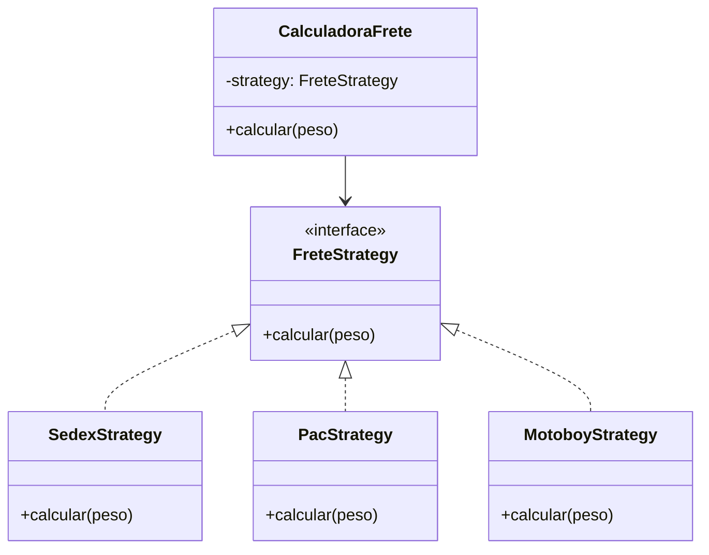

## As três famílias de padrões

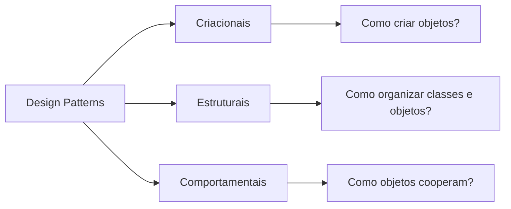

## Padrões criacionais

Foco: **como criar objetos da melhor forma possível**.

| Pattern | Problema que resolve | Quando usar |
|---|---|---|
| Singleton | Múltiplas instâncias indesejadas | Configuração global, logger, cache, pool de conexões |
| Factory Method | Criação variável por tipo | Subclasse ou fábrica decide qual objeto concreto criar |
| Abstract Factory | Famílias de objetos compatíveis | Tema claro/escuro, família de componentes relacionados |
| Builder | Muitos parâmetros opcionais | Objetos complexos com montagem passo a passo |
| Prototype | Criação custosa ou repetitiva | Clonar objetos existentes em vez de montar do zero |

### Singleton

Garante que uma classe tenha apenas uma instância e oferece um ponto global de acesso.

```java
public class Configuracoes {
    private static volatile Configuracoes instancia;

    private Configuracoes() {}

    public static Configuracoes getInstancia() {
        if (instancia == null) {
            synchronized (Configuracoes.class) {
                if (instancia == null) {
                    instancia = new Configuracoes();
                }
            }
        }
        return instancia;
    }
}
```

#### Use Singleton quando

- múltiplas instâncias realmente quebrariam o sistema;
- há necessidade de estado global controlado;
- o custo de criação é alto e deve ser centralizado.

#### Evite Singleton quando

- ele vira variável global disfarçada;
- esconde dependências;
- dificulta testes unitários;
- é usado apenas porque parece elegante.

### Factory Method

Centraliza a criação de objetos e permite que o cliente dependa de abstrações, não de classes concretas.

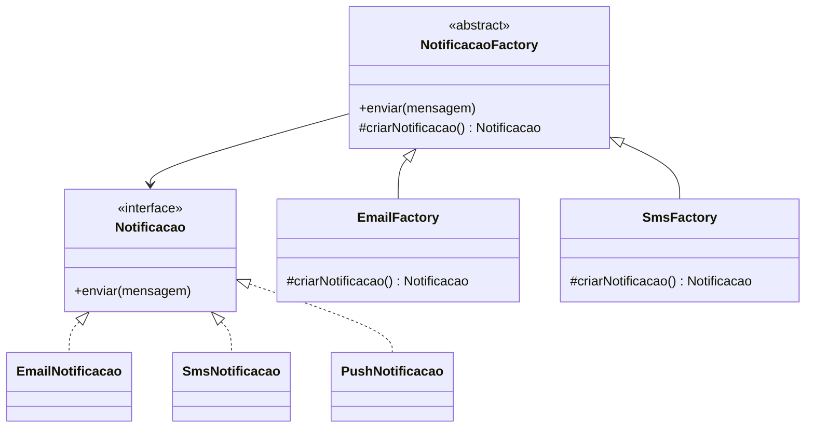

### Abstract Factory

Cria famílias de objetos relacionados, garantindo compatibilidade entre eles.

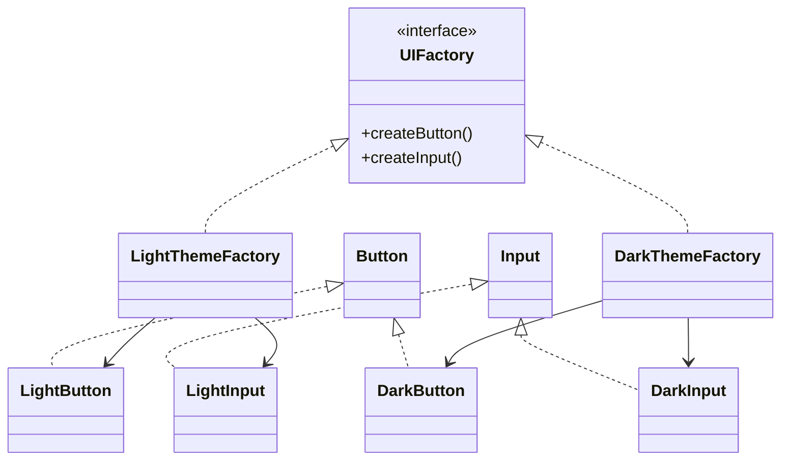

### Builder

Evita construtores gigantes e permite montar objetos complexos passo a passo.

```java
Pessoa pessoa = new Pessoa.Builder()
    .nome("Ana")
    .idade(25)
    .cpf("00000000000")
    .build();
```

### Prototype

Cria novos objetos por clonagem quando montar do zero é custoso ou repetitivo.

```java
Documento base = new Documento("Modelo", "Texto padrão");
Documento copia = base.clone();
```

## Padrões estruturais

Foco: **como organizar classes e objetos para formar estruturas maiores sem acoplamento excessivo**.

| Pattern | Problema que resolve | Exemplo mental |
|---|---|---|
| Adapter | Interfaces incompatíveis | Tradutor entre sistema antigo e novo |
| Facade | Subsistema complexo | Uma porta simples para várias operações internas |
| Decorator | Adicionar comportamento sem herdar | Café base + leite + chocolate |
| Composite | Tratar item e grupo igualmente | Arquivo e pasta |
| Proxy | Controlar acesso ao objeto real | Crachá, segurança, cache, log |
| Bridge | Separar abstração de implementação | Forma x Cor sem explodir subclasses |
| Flyweight | Economizar memória compartilhando estado | Objetos repetidos em mapas/jogos |

### Adapter

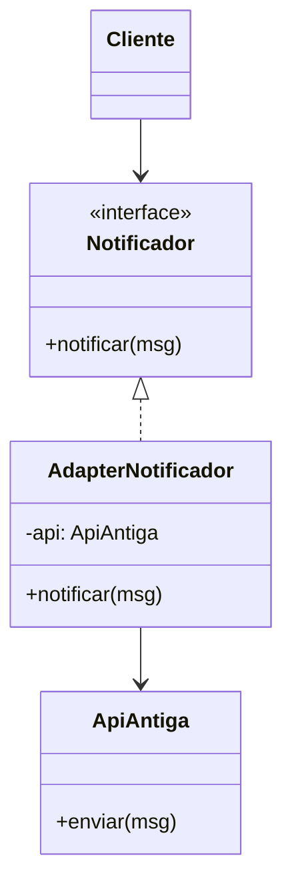

### Facade

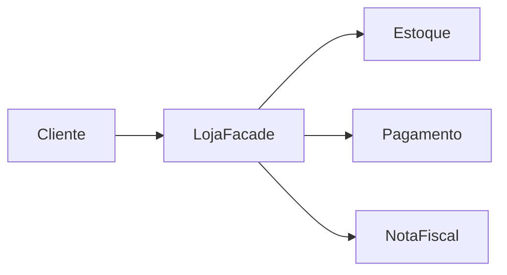

Sem Facade, o cliente precisa conhecer `Estoque`, `Pagamento` e `NotaFiscal`. Com Facade, chama apenas `comprar()`.

### Decorator

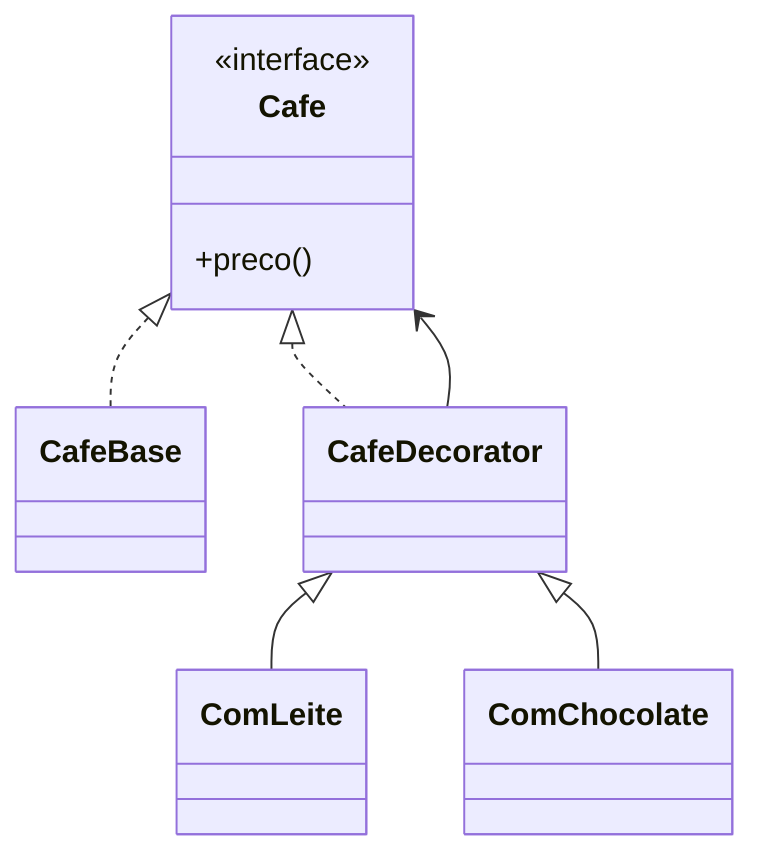

### Composite

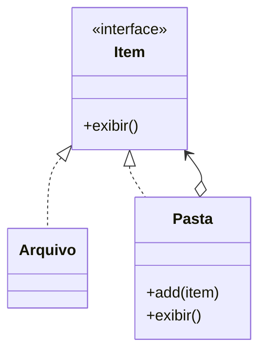

## Padrões comportamentais

Foco: **como objetos se comunicam, distribuem responsabilidades e variam comportamentos**.

| Pattern | Problema que resolve | Quando usar |
|---|---|---|
| Strategy | Troca de algoritmo | Frete, desconto, validação |
| Observer | Um evento notifica vários interessados | Notificações, eventos, UI |
| Command | Encapsular ação como objeto | Fila, log, desfazer, botão |
| Chain of Responsibility | Processamento encadeado | Validações sequenciais |
| State | Comportamento muda com estado interno | Pedido, TV, corrida, transação |
| Template Method | Padronizar fluxo com etapas variáveis | Relatório com cabeçalho/corpo/rodapé |
| Iterator | Percorrer coleção sem expor estrutura | Lista, árvore, coleção customizada |
| Mediator | Centralizar comunicação entre objetos | Chat, orquestrador, broker interno |
| Memento | Salvar/restaurar estado | Ctrl+Z, histórico, desfazer |
| Visitor | Adicionar operação sem alterar hierarquia | Exportar, validar, auditar objetos |
| Interpreter | Interpretar linguagem/regra simples | DSL, expressões, regras |

### Observer

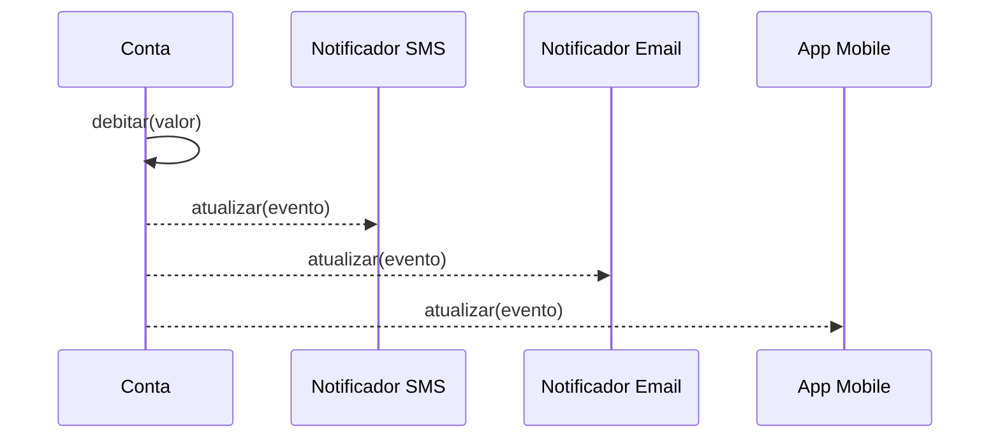

### Chain of Responsibility

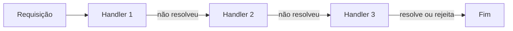

### State

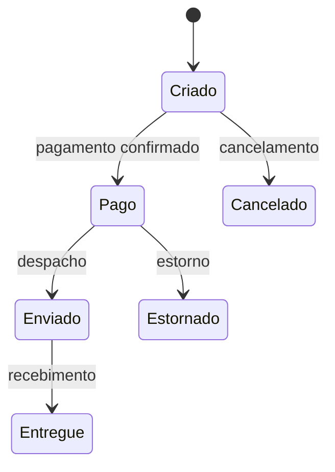

## Tabela comparativa rápida

| Dor no código | Pattern provável |
|---|---|
| Muitos `new` espalhados | Factory Method / Abstract Factory |
| Objeto com muitos parâmetros opcionais | Builder |
| Precisa de uma única instância global | Singleton |
| API externa incompatível | Adapter |
| Cliente conhece subsistemas demais | Facade |
| Muitos `if/else` de regras | Strategy / State / Chain of Responsibility |
| Vários componentes reagem a um evento | Observer |
| Precisa salvar ação para executar depois | Command |
| Precisa desfazer/restaurar estado | Memento |
