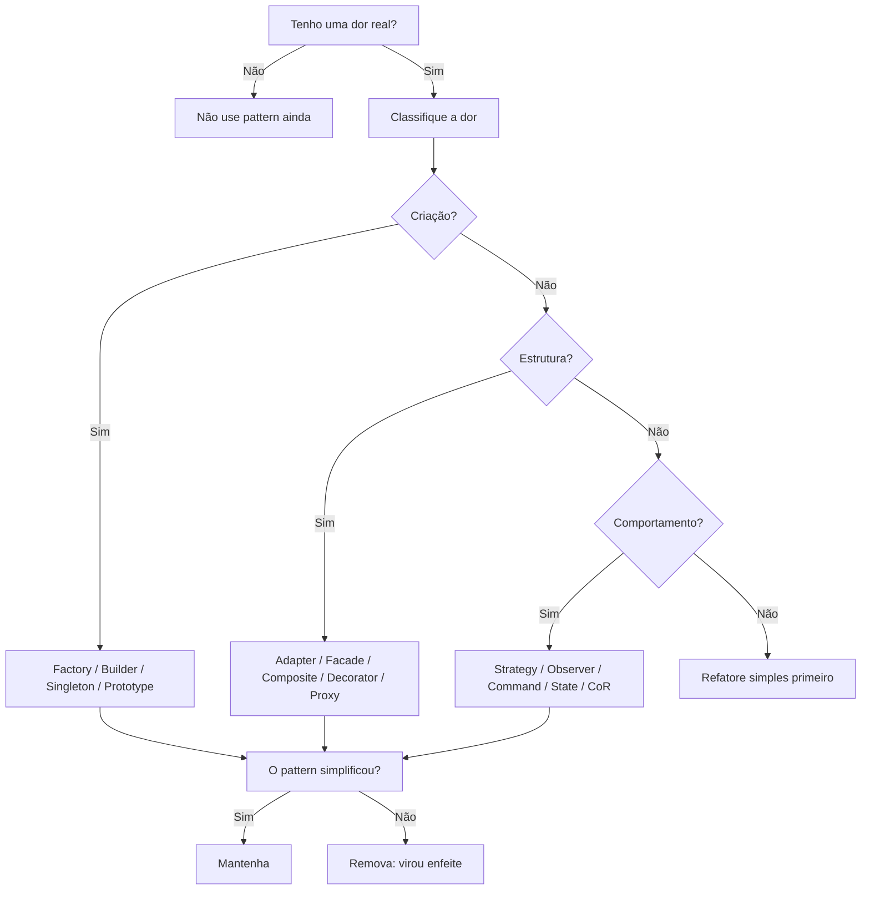

# 02 - Anti-patterns e Escolha Consciente de Padrões

## O que são anti-patterns

Anti-patterns são soluções comuns que parecem resolver o problema no curto prazo, mas geram consequências ruins no médio e longo prazo: acoplamento excessivo, baixa coesão, baixa testabilidade, medo de refatorar e aumento de dívida técnica.

## Anti-patterns mais cobrados

### God Object

Uma classe “deus” concentra responsabilidades demais, conhece quase tudo e executa quase tudo.

**Sintomas:**

- centenas ou milhares de linhas;
- métodos sem relação clara;
- variáveis globais;
- referências para muitos módulos;
- alteração pequena quebra várias partes.

**Problema principal:** viola o **SRP**. A classe tem muitos motivos para mudar.

**Como combater:** separar responsabilidades, criar serviços menores, extrair domínio, usar Facade/Strategy/Repository apenas se houver dor real.

### Spaghetti Code

Código sem fluxo claro, cheio de condicionais aninhadas, dependências circulares e lógica espalhada.

**Sintomas:**

- `if/else` aninhado;
- funções longas;
- regra de negócio espalhada;
- ausência de separação entre camadas;
- refatoração quase impossível.

**Como combater:** extrair métodos, separar camadas, aplicar Strategy, State ou Chain of Responsibility quando a dor for variação de comportamento.

### Lava Flow

Código morto ou legado que ninguém remove por medo de quebrar.

**Sintomas:**

- classes sem dono;
- comentários como “não mexa”;
- versões antigas convivendo com novas;
- ninguém sabe se pode apagar.

**Como combater:** testes de caracterização, análise de uso, remoção incremental, documentação de decisão.

### Big Ball of Mud

Sistema sem arquitetura, sem camadas claras e com dependências cruzadas.

**Sintomas:**

- controller chamando SQL direto;
- regras espalhadas;
- módulos dependendo uns dos outros em círculo;
- ninguém entende a estrutura;
- cada alteração cria novos bugs.

**Como combater:** estabelecer fronteiras, contratos, camadas, modularização e refatorações pequenas.

## Como escolher um pattern sem forçar

A regra da disciplina é: **comece pela dor, não pelo pattern**.

## Sinais que apontam para cada família

### Sinais de padrões criacionais

| Sinal | Padrão provável |
|---|---|
| Muitos `new` espalhados | Factory / Abstract Factory |
| Objeto com muitos parâmetros | Builder |
| Cópia profunda complexa | Prototype |
| Instância global manual | Singleton |

### Sinais de padrões estruturais

| Sinal | Padrão provável |
|---|---|
| APIs incompatíveis | Adapter |
| Classe orquestrando muitos subsistemas | Facade |
| Objetos em hierarquia | Composite |
| Muitos objetos repetidos com estado pesado | Flyweight |
| Precisa adicionar comportamento sem herdar | Decorator |
| Precisa controlar acesso | Proxy |

### Sinais de padrões comportamentais

| Sinal | Padrão provável |
|---|---|
| Muitos `if/else` de regra | Strategy |
| Validações em cadeia | Chain of Responsibility |
| Comportamento muda por status | State |
| Evento dispara várias reações | Observer |
| Ação precisa virar objeto | Command |

## Princípios antes de padrões

Padrões são ferramentas. Princípios são formas de pensar.

| Princípio | Sinal de violação | Pattern que pode surgir |
|---|---|---|
| SRP | Classe faz coisas demais | Facade, Strategy, Service Layer |
| OCP | Toda regra nova exige alterar a mesma classe | Strategy, Factory, State |
| DIP | Código depende de classes concretas | Adapter, Repository, Factory, interfaces |
| LSP | Subclasse não substitui corretamente a classe base | Revisar herança, preferir composição |

## Checklist mental antes de aplicar pattern

- Existe um problema claro?
- Esse problema é recorrente ou vai crescer?
- O acoplamento atual dificulta testes ou mudanças?
- O pattern resolve do jeito mais simples possível?
- O código fica mais fácil para alguém novo entender?
- Estou usando o pattern por necessidade ou por vaidade técnica?

## Erros comuns

1. Criar pattern porque “fica bonito”.
2. Usar Adapter, Decorator ou Strategy onde uma função simples bastaria.
3. Criar abstrações prematuras em sistemas pequenos.
4. Criar muitas classes sem reduzir a complexidade real.
5. Confundir arquitetura com quantidade de arquivos.

## Frase-chave

> Se o pattern não elimina uma dor real, ele é enfeite. E enfeite atrapalha.
