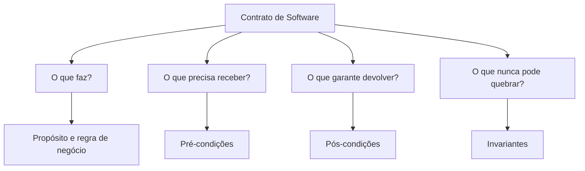
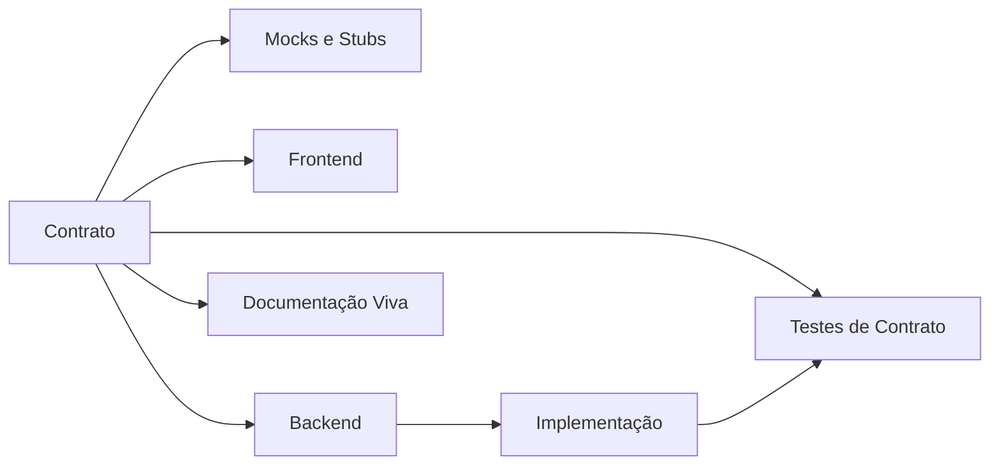
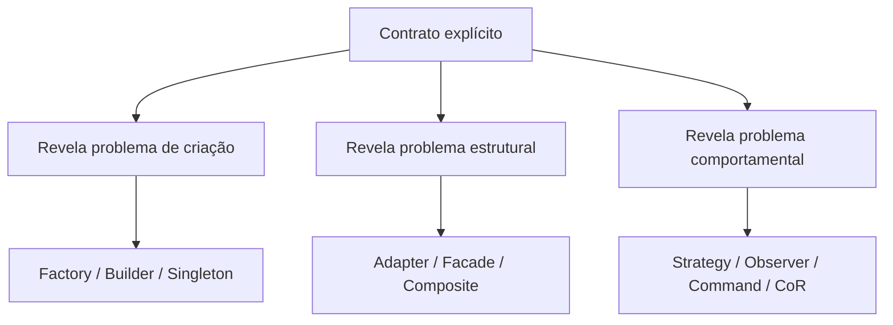
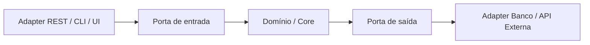
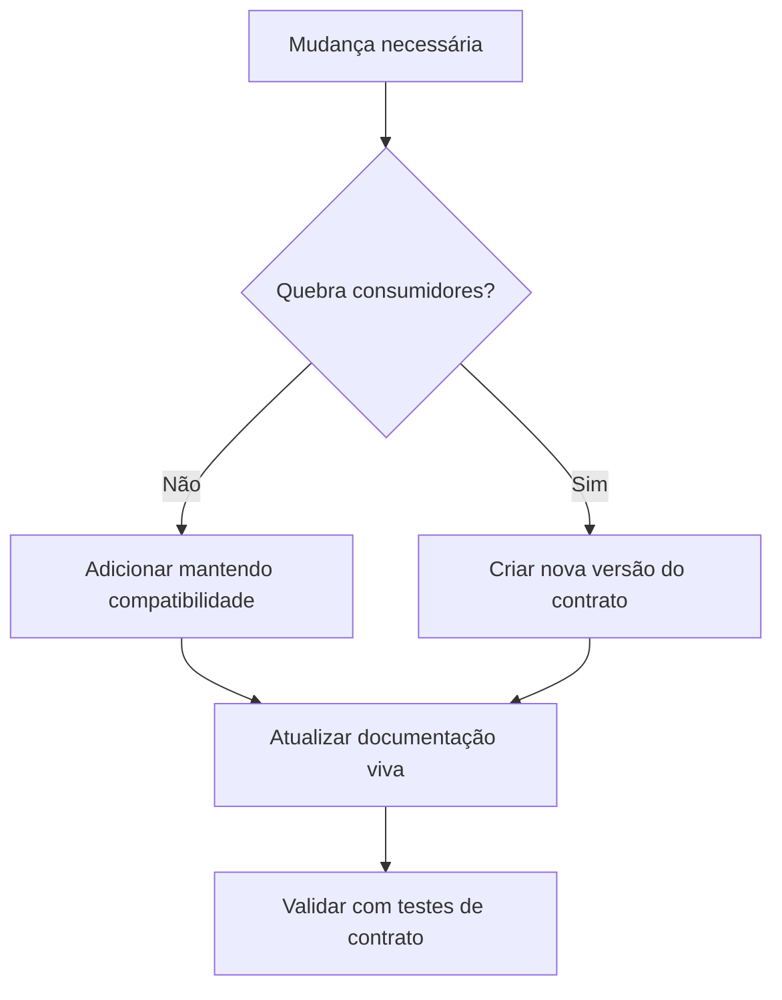

# 03 - Contratos de Software e CDC

## O que é contrato em software

Contrato em software é um acordo explícito sobre como um componente deve se comportar.

Ele define:

- o que o componente faz;
- o que precisa receber para funcionar;
- o que garante devolver;
- quais regras nunca podem ser quebradas.

Em outras palavras, contrato define **o quê** deve acontecer, não necessariamente **como** será implementado.

## As quatro perguntas de um contrato



## Conceitos fundamentais

| Conceito | Definição | Exemplo |
|---|---|---|
| Pré-condição | O que precisa ser verdadeiro antes da operação | valor > 0, clienteId obrigatório |
| Pós-condição | O que será garantido após a operação | recibo válido, pedido criado |
| Invariante | Regra que nunca pode ser violada | saldo não pode ficar negativo |
| Interface | Forma técnica de expressar um contrato | `Pagamento.pagar(valor)` |
| Schema | Forma estrutural de contrato de dados | JSON Schema, Avro, Protobuf |

## Exemplo: contrato em interface

```java
public interface Pagamento {
    Recibo pagar(BigDecimal valor);
}
```

Contrato implícito:

- `valor` deve ser maior que zero;
- sempre retorna um `Recibo` válido;
- não deve lançar exceções inesperadas;
- Pix, Boleto e Cartão devem respeitar o mesmo acordo.

## Exemplo: contrato em API REST

```http
POST /v1/pedidos
Content-Type: application/json
```

Request esperado:

```json
{
  "clienteId": "123",
  "itens": [
    { "produtoId": "P001", "quantidade": 2 }
  ]
}
```

Responses possíveis:

| Status | Significado |
|---|---|
| 201 | Pedido criado |
| 400 | Request inválido, por exemplo itens vazios |
| 404 | Cliente ou produto não encontrado |
| 500 | Erro interno não esperado |

## O que é CDC - Contract-Driven Design

CDC é uma abordagem em que o **contrato é a fonte da verdade**. Antes de escrever código, define-se o acordo que governa a interação entre partes do sistema.



A ordem muda:

```text
Antes: código -> documentação -> testes -> integração
CDC: contrato -> testes/mocks -> implementação -> validação
```

## Por que pensar contrato antes do código

Pensar no contrato antes do código:

- evita improvisação;
- reduz retrabalho;
- permite desenvolvimento paralelo entre frontend e backend;
- facilita mocks e stubs;
- reduz bugs de integração;
- torna testes mais objetivos;
- ajuda a detectar responsabilidades grandes demais antes da implementação.

## Formas que um contrato pode assumir

| Forma | Uso |
|---|---|
| Interface Java/C#/TypeScript | Contratos internos entre camadas |
| OpenAPI/Swagger | APIs REST |
| AsyncAPI | Eventos e mensageria |
| gRPC/Protobuf | APIs binárias/contratos fortemente tipados |
| JSON Schema | Validação estrutural de payloads JSON |
| Avro/Protobuf | Eventos, filas, data pipelines |
| Pact | Consumer-Driven Contracts em microserviços |

## CDC, Design Patterns e Arquitetura

CDC não substitui Design Patterns. Ele ajuda a descobrir **onde** e **por que** um pattern faz sentido.



## Relação com arquitetura moderna

### Microserviços

Microserviços se comunicam por APIs, filas e eventos. Todos esses pontos são contratos. CDC ajuda a garantir:

- estabilidade de APIs;
- versionamento correto;
- backward compatibility;
- evolução sem quebrar outros serviços;
- testes de contrato.

### DDD

No DDD, CDC ajuda a tornar explícitas as fronteiras:

| DDD | Relação com contrato |
|---|---|
| Aggregate | Invariantes internas |
| Value Object | Regras imutáveis de validação |
| Entity | Estados válidos e identidade |
| Repository | Contrato de persistência |
| Bounded Context | Contratos entre contextos |

### Arquitetura Hexagonal / Clean Architecture



Na prática:

- a **porta** é o contrato;
- o **adaptador** implementa o contrato;
- o domínio não conhece detalhes externos.

## CDC x TDD

| Critério | TDD | CDC |
|---|---|---|
| Começa por | Teste | Contrato |
| Foco | Método/classe | Fronteira entre componentes |
| Valida | Lógica interna | Integração e uso correto |
| Escopo comum | Local | Distribuído |
| Pergunta | “Esse método faz o que deveria?” | “Esses módulos se entendem?” |

Eles se complementam:

- CDC define o que deve existir.
- TDD ajuda a implementar corretamente o que o contrato exige.

## CDC x API-first

Todo API-first é uma forma de CDC, mas nem todo CDC é API-first.

API-first trata principalmente da borda externa da API. CDC é mais amplo e inclui:

- contratos internos;
- portas/interfaces;
- contratos de eventos;
- contratos de dados;
- contratos entre módulos e equipes.

## Regras de evolução de contrato



## Frase-chave

> No CDC, o código é consequência do contrato. A implementação pode mudar; a promessa pública precisa ser respeitada.
