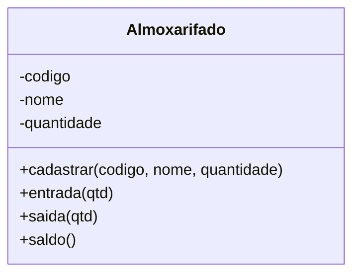
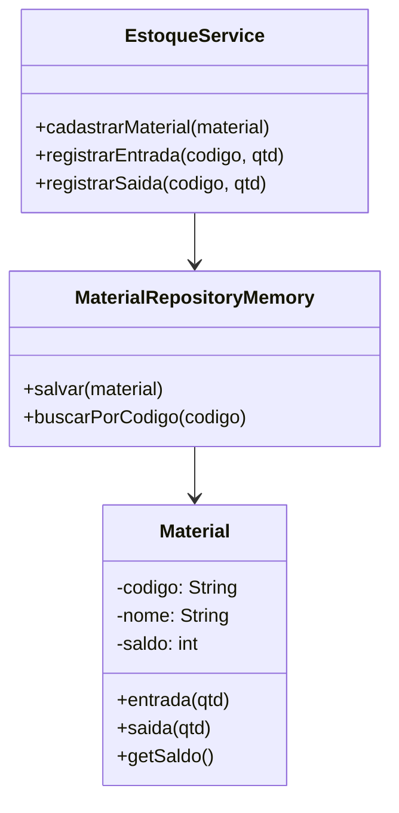
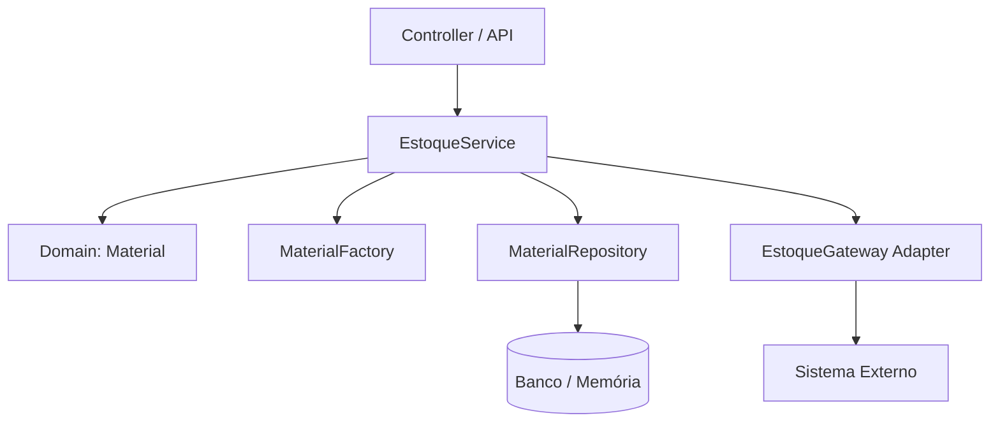
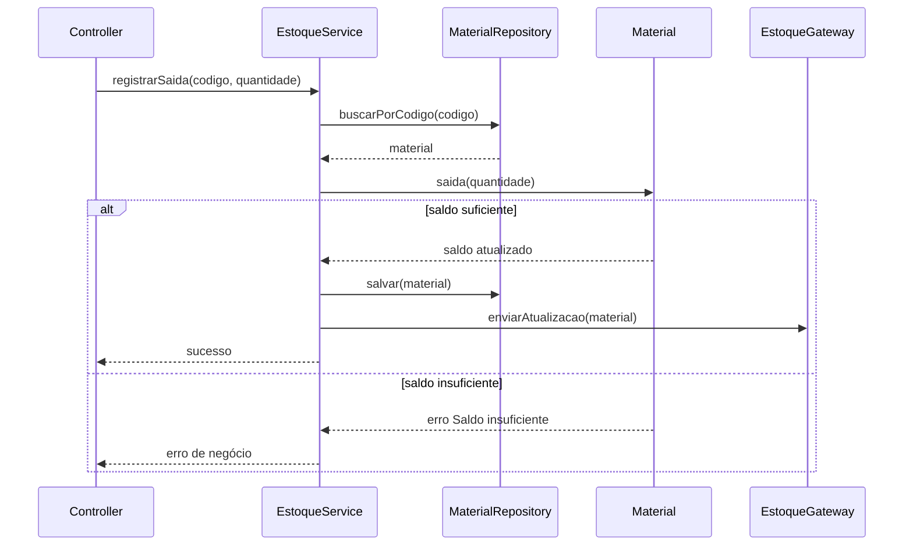

# 04 - Laboratório: Sistema de Almoxarifado

## Objetivo do laboratório

O laboratório mostra a evolução de um sistema de almoxarifado em três estágios:

1. **Contrato 1 - Ingênuo**: código direto, sem fronteiras e sem validações suficientes.
2. **Contrato 2 - Estruturado**: separação básica entre domínio, serviço e repositório.
3. **Contrato 3 - Evoluído**: CDC como centro do design, com interfaces e patterns aplicados conscientemente.

## Problema de negócio

O sistema deve permitir:

- cadastrar materiais;
- consultar saldo;
- registrar entrada;
- registrar saída;
- impedir saldo negativo;
- preservar o código do material como identificador único.

## Contrato 1 - Inicial e frágil

### Características

- Tudo concentrado em uma classe `Almoxarifado`.
- Entidade, regra e persistência futura misturadas.
- Nenhum contrato explícito.
- Nenhuma fronteira clara.
- Saldo pode ficar negativo.



### Problema principal

A classe faz tudo. Isso aproxima o sistema de um **God Object** e dificulta manutenção, teste e evolução.

## Contrato 2 - Estruturado

### Melhorias

- Criação da entidade `Material`.
- Criação de `EstoqueService`.
- Criação de `MaterialRepository`.
- Regra de saldo negativo começa a ficar explícita.
- Persistência começa a ser isolada.



### Limitação

As fronteiras ainda são implícitas. O sistema melhorou, mas depende de classes concretas. Qualquer desenvolvedor ainda pode burlar regras criando objetos diretamente ou acessando implementação interna.

## Contrato 3 - Evoluído com CDC e patterns

### Contratos definidos

#### Contrato de Entidade

```java
public interface Material {
    String getCodigo();
    String getNome();
    int getSaldo();
    void entrada(int quantidade);
    void saida(int quantidade);
}
```

Regra: o estado do material só pode ser alterado por operações do domínio. Por isso, no exemplo Java deste repositório, as operações `entrada` e `saida` ficam no próprio contrato de domínio.

#### Contrato de Repositório

```java
public interface MaterialRepository {
    void salvar(Material material);
    Material buscarPorCodigo(String codigo);
}
```

Motivo:

- isola persistência;
- permite trocar banco;
- facilita mock em testes.

#### Contrato de Serviço

```java
public interface EstoqueService {
    void cadastrarMaterial(Material material);
    int consultarSaldo(String codigo);
    void registrarEntrada(String codigo, int quantidade);
    void registrarSaida(String codigo, int quantidade);
}
```

Motivo:

- expõe operações de negócio;
- protege regras internas;
- reduz dependência de implementação.

#### Factory Method

```java
public interface MaterialFactory {
    Material criar(String codigo, String nome, int saldoInicial);
}
```

Motivo:

- centraliza criação;
- evita `new` espalhado;
- impede entidade nascer inválida.

#### Adapter / Gateway

```java
public interface EstoqueGateway {
    void enviarAtualizacao(Material material);
}
```

Motivo:

- protege o domínio de sistemas externos;
- facilita troca de integração;
- evita contaminação do core por detalhes técnicos.

## Arquitetura final



## Design Patterns utilizados

| Pattern | Papel no laboratório |
|---|---|
| Repository | Isolar persistência |
| Factory Method | Controlar criação de materiais válidos |
| Adapter/Gateway | Proteger domínio contra integrações externas |
| Service Layer | Orquestrar regras de negócio |
| CDC | Definir contratos antes da implementação |

## Comparativo dos três contratos

| Critério | Contrato 1 | Contrato 2 | Contrato 3 |
|---|---|---|---|
| Fronteiras | Inexistentes | Implícitas | Explícitas por interfaces |
| Regra de saldo | Frágil | Centralizada | Protegida |
| Criação de objeto | Espalhada | Ainda acoplada | Controlada por Factory |
| Persistência | Misturada ou inexistente | Repositório concreto | Repository Pattern |
| Testabilidade | Baixa | Média | Alta, com mocks e contratos |
| Evolução | Arriscada | Melhor, mas limitada | Segura e previsível |

## Exemplo de implementação Java resumida

```java
public final class MaterialImpl implements Material {
    private final String codigo;
    private final String nome;
    private int saldo;

    MaterialImpl(String codigo, String nome, int saldoInicial) {
        if (codigo == null || codigo.isBlank()) {
            throw new IllegalArgumentException("Código é obrigatório");
        }
        if (nome == null || nome.isBlank()) {
            throw new IllegalArgumentException("Nome é obrigatório");
        }
        if (saldoInicial < 0) {
            throw new IllegalArgumentException("Saldo inicial não pode ser negativo");
        }
        this.codigo = codigo;
        this.nome = nome;
        this.saldo = saldoInicial;
    }

    public void entrada(int quantidade) {
        if (quantidade <= 0) {
            throw new IllegalArgumentException("Quantidade deve ser positiva");
        }
        saldo += quantidade;
    }

    public void saida(int quantidade) {
        if (quantidade <= 0) {
            throw new IllegalArgumentException("Quantidade deve ser positiva");
        }
        if (saldo < quantidade) {
            throw new IllegalStateException("Saldo insuficiente");
        }
        saldo -= quantidade;
    }

    public String getCodigo() { return codigo; }
    public String getNome() { return nome; }
    public int getSaldo() { return saldo; }
}
```

## Fluxo de saída de material



## Aprendizado principal

O laboratório mostra que patterns não devem ser escolhidos antes do problema. Eles surgem como consequência:

- Factory apareceu quando a criação começou a doer.
- Repository apareceu quando persistência virou risco.
- Adapter apareceu quando integração externa ameaçou o domínio.
- CDC apareceu como base para deixar fronteiras e promessas explícitas.

> Código saudável não é o mais sofisticado. É o código que aceita mudança sem adoecer.
