# 01 - Introdução à Integração de Sistemas

## Objetivo do capítulo

Compreender por que sistemas modernos precisam se integrar, quais elementos compõem uma comunicação entre softwares e como escolher modelos básicos de integração, formatos de dados e padrões assíncronos.

## Mapa mental do capítulo

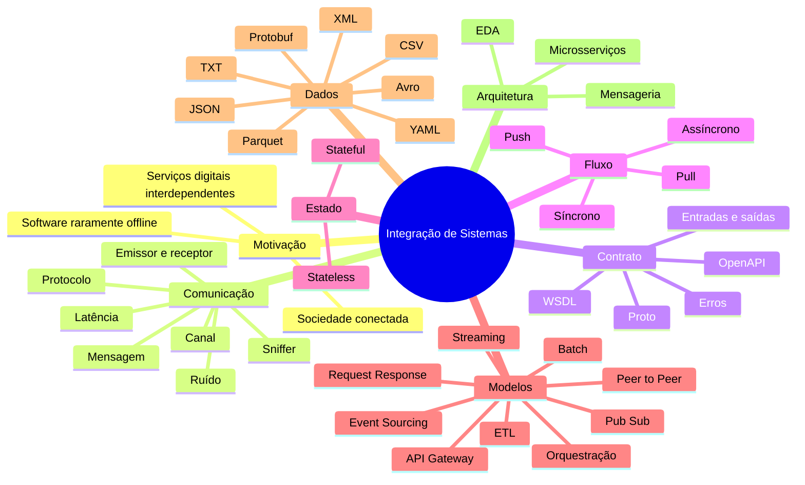
```mermaid
mindmap
  root((Integração de Sistemas))
    Motivação
      Sociedade conectada
      Software raramente offline
      Serviços digitais interdependentes
    Comunicação
      Emissor e receptor
      Canal
      Protocolo
      Mensagem
      Latência
      Ruído
      Sniffer
    Contrato
      OpenAPI
      WSDL
      Proto
      Entradas e saídas
      Erros
    Fluxo
      Síncrono
      Assíncrono
      Pull
      Push
    Estado
      Stateless
      Stateful
    Modelos
      Request Response
      Orquestração
      Peer to Peer
      API Gateway
      ETL
      Batch
      Event Sourcing
      Streaming
      Pub Sub
    Dados
      TXT
      CSV
      XML
      JSON
      YAML
      Parquet
      Avro
      Protobuf
    Arquitetura
      Microsserviços
      EDA
      Mensageria
```

## 1. Por que integração importa

A disciplina parte de uma ideia central: praticamente todo software moderno depende de outros sistemas. Consultar previsão do tempo, chamar transporte por aplicativo, fazer pagamentos digitais, consumir APIs públicas, autenticar usuários e processar eventos são exemplos de integração em uso cotidiano.

Em engenharia de software, integração não é apenas “chamar uma API”. Ela envolve contrato, protocolo, segurança, disponibilidade, latência, formato de dados, tratamento de erro e governança.

## 2. Elementos da comunicação

A comunicação entre sistemas pode ser entendida pela analogia com a comunicação humana.

| Elemento | Na comunicação humana | Em sistemas |
|---|---|---|
| Emissor | Pessoa que fala | Cliente, aplicação, produtor |
| Receptor | Pessoa que escuta | Servidor, API, consumidor |
| Mensagem | Voz, texto, sinal | JSON, XML, binário, evento |
| Canal | Ar, telefone | Rede, Wi-Fi, fibra, internet |
| Protocolo | Português, inglês | HTTP, TCP, UDP, AMQP, MQTT |
| Ruído | Barulho externo | Falha de rede, timeout, DDoS |
| Latência | Tempo até ouvir | Tempo até resposta ou entrega |
| Terceiro monitorando | Pessoa espionando | Sniffer, interceptor, atacante |

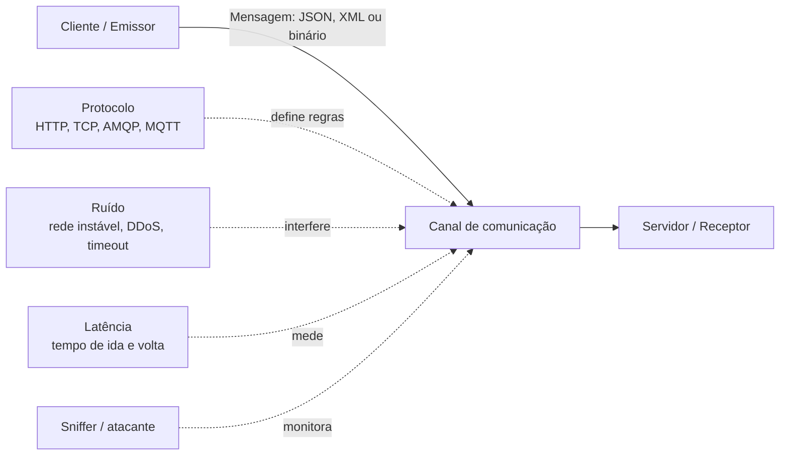
```mermaid
flowchart LR
    C["Cliente / Emissor"] -->|"Mensagem: JSON, XML ou binário"| CANAL["Canal de comunicação"]
    CANAL --> S["Servidor / Receptor"]

    P["Protocolo\nHTTP, TCP, AMQP, MQTT"] -. define regras .-> CANAL
    R["Ruído\nrede instável, DDoS, timeout"] -. interfere .-> CANAL
    L["Latência\ntempo de ida e volta"] -. mede .-> CANAL
    X["Sniffer / atacante"] -. monitora .-> CANAL
```

## 3. API e contrato de serviço

API significa **Application Programming Interface**. No contexto da disciplina, API é o ponto de comunicação que permite a um software consumir funcionalidades ou dados de outro, sem conhecer seus detalhes internos.

O ponto mais importante é o **contrato de serviço**. Um serviço bem exposto precisa deixar claro:

- o que está sendo oferecido;
- como chamar;
- qual protocolo usar;
- quais parâmetros são aceitos;
- qual formato será retornado;
- quais erros podem ocorrer;
- quais regras de autenticação e autorização são exigidas.

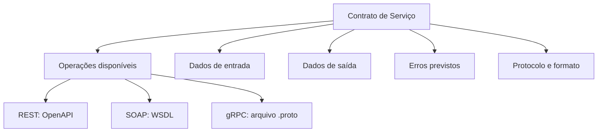
```mermaid
flowchart TD
    CONTRATO["Contrato de Serviço"] --> METODOS["Operações disponíveis"]
    CONTRATO --> ENTRADA["Dados de entrada"]
    CONTRATO --> SAIDA["Dados de saída"]
    CONTRATO --> ERROS["Erros previstos"]
    CONTRATO --> PROTOCOLO["Protocolo e formato"]

    METODOS --> REST["REST: OpenAPI"]
    METODOS --> SOAP["SOAP: WSDL"]
    METODOS --> GRPC["gRPC: arquivo .proto"]
```

### Contrato por estilo de API

| Estilo | Contrato mais comum | Observação |
|---|---|---|
| REST | OpenAPI/Swagger | Descreve paths, métodos, parâmetros, schemas e respostas |
| SOAP | WSDL | Contrato XML formal com operações, mensagens e endpoints |
| gRPC | `.proto` | Define mensagens, serviços e tipos usados para gerar código |
| GraphQL | Schema GraphQL | Define types, queries, mutations, inputs e resolvers |

## 4. Comunicação síncrona e assíncrona

### Comunicação síncrona

Na comunicação síncrona, o cliente envia uma requisição e aguarda a resposta. É adequada para operações em que a resposta é necessária imediatamente, como consultar dados de um cliente antes de abrir uma tela.

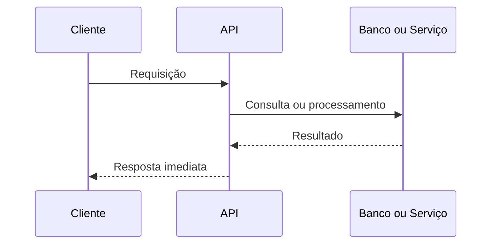
```mermaid
sequenceDiagram
    participant C as Cliente
    participant A as API
    participant B as Banco ou Serviço

    C->>A: Requisição
    A->>B: Consulta ou processamento
    B-->>A: Resultado
    A-->>C: Resposta imediata
```

**Características:**

- simples de entender;
- o cliente fica bloqueado aguardando;
- sensível a latência;
- ruim para processos longos;
- comum em REST, SOAP, GraphQL e RPC.

### Comunicação assíncrona

Na comunicação assíncrona, o cliente publica uma mensagem ou evento e não precisa aguardar o processamento completo. É adequada para tarefas demoradas, desacoplamento de sistemas e absorção de picos.

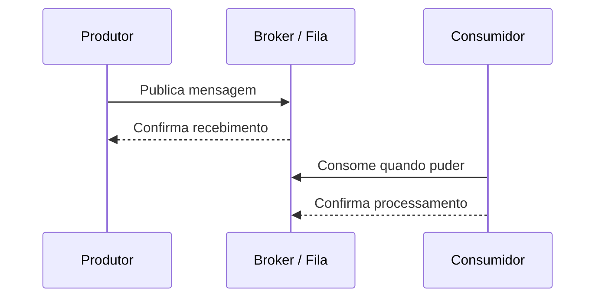
```mermaid
sequenceDiagram
    participant P as Produtor
    participant B as Broker / Fila
    participant C as Consumidor

    P->>B: Publica mensagem
    B-->>P: Confirma recebimento
    C->>B: Consome quando puder
    C-->>B: Confirma processamento
```

**Características:**

- reduz acoplamento;
- melhora resiliência;
- permite reprocessamento, dependendo da tecnologia;
- exige preocupação com idempotência, ordem, duplicidade e consistência eventual.

## 5. Stateless e Stateful

A escolha entre stateless e stateful altera a escalabilidade e o desenho da arquitetura.

| Modelo | Definição | Vantagem | Desvantagem |
|---|---|---|---|
| Stateless | Servidor não guarda estado entre requisições | Escala melhor, qualquer nó pode atender | Cliente precisa enviar o contexto necessário |
| Stateful | Servidor guarda estado/sessão | Pode manter contexto da conversa | Escala mais difícil; sessão precisa ser compartilhada ou fixada |

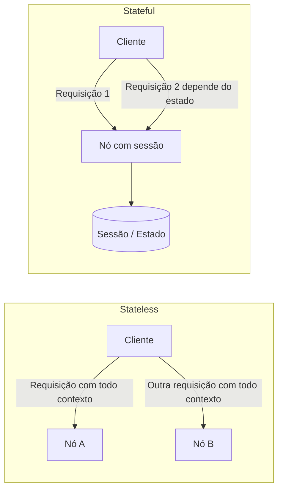
```mermaid
flowchart LR
    subgraph Stateless
        C1[Cliente] -->|"Requisição com todo contexto"| N1[Nó A]
        C1 -->|"Outra requisição com todo contexto"| N2[Nó B]
    end

    subgraph Stateful
        C2[Cliente] -->|"Requisição 1"| S1[Nó com sessão]
        S1 --> STORE[(Sessão / Estado)]
        C2 -->|"Requisição 2 depende do estado"| S1
    end
```

## 6. Modelos de integração

### Visão geral

| Modelo | Ideia central | Quando usar |
|---|---|---|
| Request-Response | Cliente pede, servidor responde | Consulta, CRUD, operações imediatas |
| Orquestração | Um componente central coordena o fluxo | Processo de negócio com etapas sequenciais |
| Peer-to-Peer | Nós se comunicam diretamente | Sistemas distribuídos sem ponto central único |
| API Gateway | Ponto único de entrada para APIs | Segurança, roteamento, rate limit, transformação |
| ETL | Extrair, transformar e carregar dados | Data warehouse, analytics, integração batch de dados |
| Batch | Acumular e processar em lote | Processamento noturno, arquivos, rotinas periódicas |
| Event Sourcing | Estado é derivado de eventos imutáveis | Auditoria, histórico, reprocessamento |
| Streaming | Processamento contínuo de eventos | Tempo real, telemetria, logs, IoT, Kafka |
| Pub/Sub | Publicadores enviam eventos para tópicos assinados | Notificar vários sistemas sobre o mesmo evento |

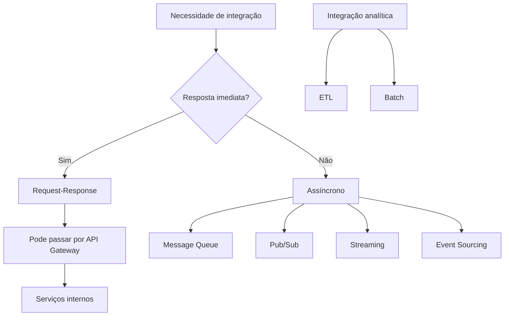
```mermaid
flowchart TD
    START["Necessidade de integração"] --> IMEDIATA{"Resposta imediata?"}
    IMEDIATA -->|Sim| RR["Request-Response"]
    IMEDIATA -->|Não| ASSINC["Assíncrono"]

    RR --> GATEWAY["Pode passar por API Gateway"]
    GATEWAY --> BACKENDS["Serviços internos"]

    ASSINC --> FILA["Message Queue"]
    ASSINC --> TOPICO["Pub/Sub"]
    ASSINC --> STREAM["Streaming"]
    ASSINC --> ES["Event Sourcing"]

    DADOS["Integração analítica"] --> ETL["ETL"]
    DADOS --> BATCH["Batch"]
```

### Request-Response

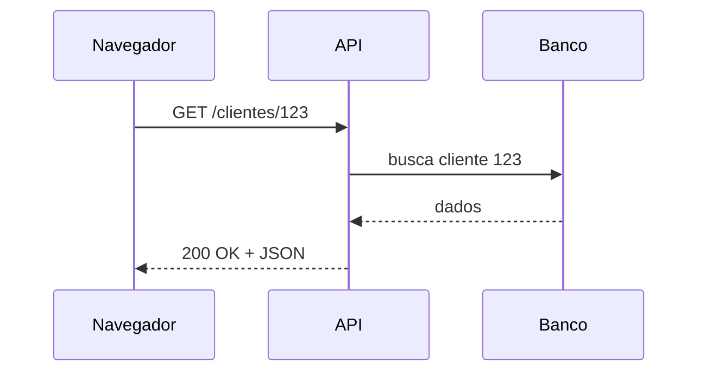
```mermaid
sequenceDiagram
    participant Navegador
    participant API
    participant Banco

    Navegador->>API: GET /clientes/123
    API->>Banco: busca cliente 123
    Banco-->>API: dados
    API-->>Navegador: 200 OK + JSON
```

### Orquestração

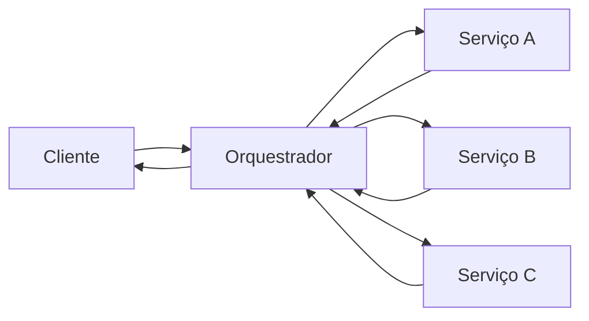
```mermaid
flowchart LR
    Cliente --> Orq["Orquestrador"]
    Orq --> S1["Serviço A"]
    Orq --> S2["Serviço B"]
    Orq --> S3["Serviço C"]
    S1 --> Orq
    S2 --> Orq
    S3 --> Orq
    Orq --> Cliente
```

### Peer-to-Peer

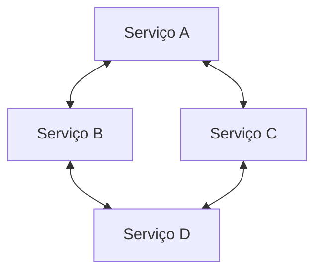
```mermaid
flowchart TB
    A[Serviço A] <--> B[Serviço B]
    A <--> C[Serviço C]
    B <--> D[Serviço D]
    C <--> D
```

### API Gateway

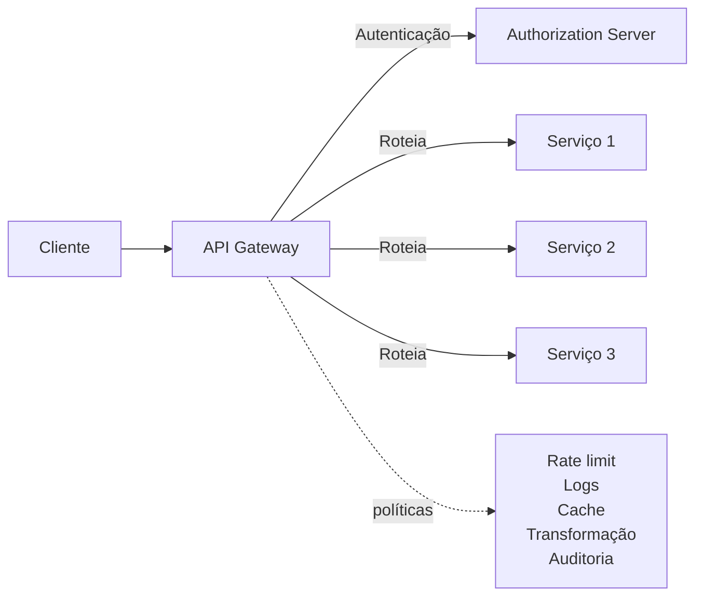
```mermaid
flowchart LR
    C[Cliente] --> G["API Gateway"]
    G -->|Autenticação| AUTH[Authorization Server]
    G -->|Roteia| S1[Serviço 1]
    G -->|Roteia| S2[Serviço 2]
    G -->|Roteia| S3[Serviço 3]
    G -. políticas .-> POL["Rate limit\nLogs\nCache\nTransformação\nAuditoria"]
```

## 7. Protocolos de rede

Os protocolos trabalham em conjunto, em camadas. HTTP, por exemplo, usa TCP ou, em versões mais recentes, pode operar sobre QUIC no HTTP/3.

| Protocolo | Papel | Observação |
|---|---|---|
| TCP | Transporte confiável | Confirma entrega; usado por HTTP/1.1 e HTTP/2 |
| UDP | Transporte sem garantia forte | Baixa latência; usado em cenários como vídeo e QUIC |
| HTTP | Protocolo de aplicação web | Base de REST e APIs web |
| HTTPS | HTTP com TLS | Protege o canal com criptografia |
| HTTP/3 | HTTP sobre QUIC | Foco em menor latência e melhor desempenho |
| WebSocket | Comunicação full duplex | Cliente e servidor enviam dados ao mesmo tempo |
| SMTP | Envio de e-mail | Muito usado em integração por notificação |
| FTP | Transferência de arquivos | Stateful; mantém contexto de navegação |
| AMQP | Mensageria por broker | Filas, roteamento e confiabilidade |
| MQTT | Mensageria leve | Muito usado em IoT |

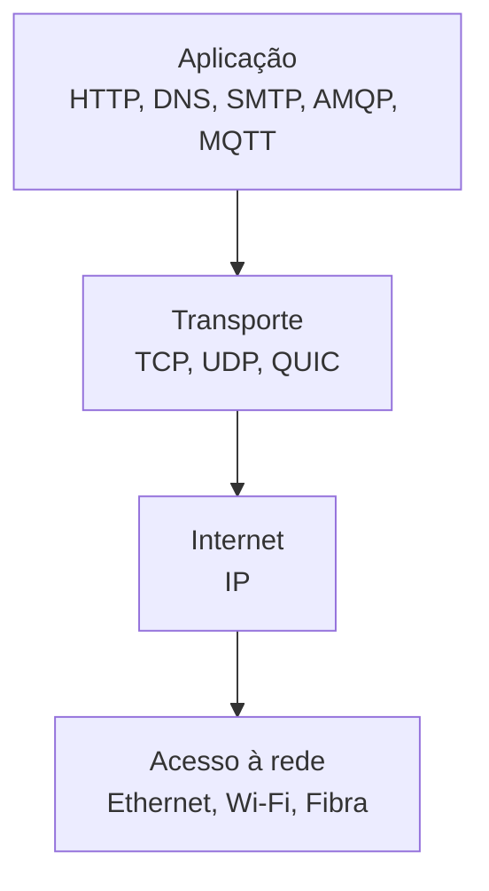
```mermaid
flowchart TB
    APP["Aplicação\nHTTP, DNS, SMTP, AMQP, MQTT"] --> TRANS["Transporte\nTCP, UDP, QUIC"]
    TRANS --> NET["Internet\nIP"]
    NET --> LINK["Acesso à rede\nEthernet, Wi-Fi, Fibra"]
```

## 8. Formatos de dados

### Texto vs binário

| Formato | Tipo | Melhor uso |
|---|---|---|
| TXT | Texto simples | Casos muito simples, baixa estrutura |
| CSV | Texto tabular | Planilhas, dados em linhas e colunas |
| XML | Texto hierárquico | Contratos robustos, SOAP, interoperabilidade legada |
| JSON | Texto chave-valor | APIs REST, dados estruturados e leves |
| YAML | Texto indentado | Configuração, OpenAPI, legibilidade humana |
| Parquet | Binário colunar | Big Data, analytics, leitura por coluna |
| Avro | Binário com schema | Streaming e integração de dados com schema |
| Protobuf | Binário com schema `.proto` | gRPC, alta performance, contratos fortemente definidos |

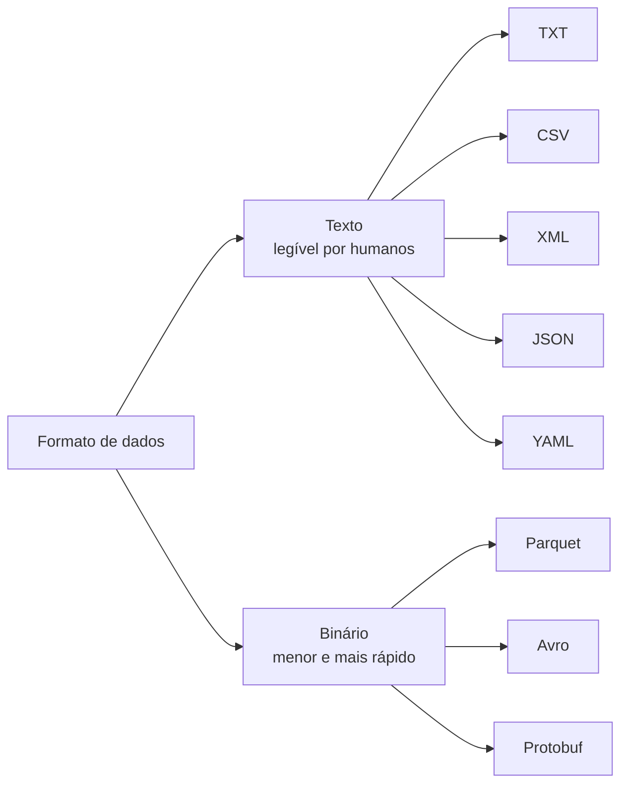
```mermaid
flowchart LR
    DADOS["Formato de dados"] --> TEXTO["Texto\nlegível por humanos"]
    DADOS --> BIN["Binário\nmenor e mais rápido"]

    TEXTO --> TXT[TXT]
    TEXTO --> CSV[CSV]
    TEXTO --> XML[XML]
    TEXTO --> JSON[JSON]
    TEXTO --> YAML[YAML]

    BIN --> PARQUET[Parquet]
    BIN --> AVRO[Avro]
    BIN --> PROTO[Protobuf]
```

### Critério de escolha

Use **texto** quando a prioridade for facilidade de leitura, debug e interoperabilidade simples. Use **binário** quando a prioridade for desempenho, volume de dados ou contrato fortemente tipado.

## 9. Microsserviços e Arquitetura Orientada a Eventos

Microsserviços e EDA não são concorrentes diretos. Microsserviços tratam da decomposição do sistema em serviços independentes. EDA trata da forma como esses serviços se comunicam por eventos.

| Aspecto | Microsserviços | EDA |
|---|---|---|
| Foco | Modularização por capacidade de negócio | Comunicação assíncrona por eventos |
| Unidade principal | Serviço | Evento |
| Comunicação comum | API síncrona | Mensagem/evento assíncrono |
| Componentes | API Gateway, service discovery, config server, logs | Produtor, evento, broker, consumidor |
| Risco | Latência e complexidade operacional | Ordem, duplicidade, consistência eventual |

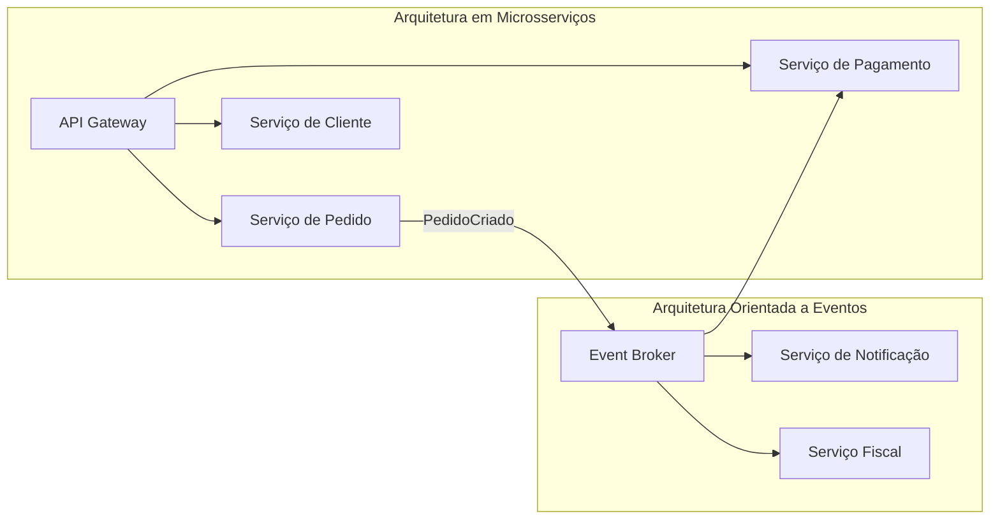
```mermaid
flowchart LR
    subgraph MSA["Arquitetura em Microsserviços"]
        GW[API Gateway] --> A[Serviço de Pedido]
        GW --> B[Serviço de Cliente]
        GW --> C[Serviço de Pagamento]
    end

    subgraph EDA["Arquitetura Orientada a Eventos"]
        A -->|"PedidoCriado"| BROKER[Event Broker]
        BROKER --> C
        BROKER --> N[Serviço de Notificação]
        BROKER --> F[Serviço Fiscal]
    end
```

## 10. Padrões de comunicação assíncrona

### Message Queue

Entrega cada mensagem para **um único consumidor**. Boa para distribuir carga de trabalho sem duplicar processamento.

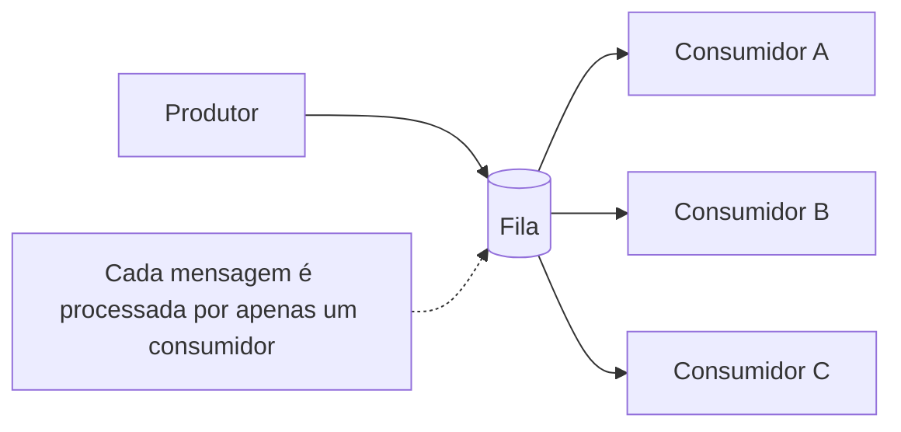
```mermaid
flowchart LR
    P1[Produtor] --> Q[(Fila)]
    Q --> C1[Consumidor A]
    Q --> C2[Consumidor B]
    Q --> C3[Consumidor C]
    NOTE["Cada mensagem é processada por apenas um consumidor"] -.-> Q
```

### Publish/Subscribe

Entrega uma cópia do evento para **todos os assinantes** do tópico.

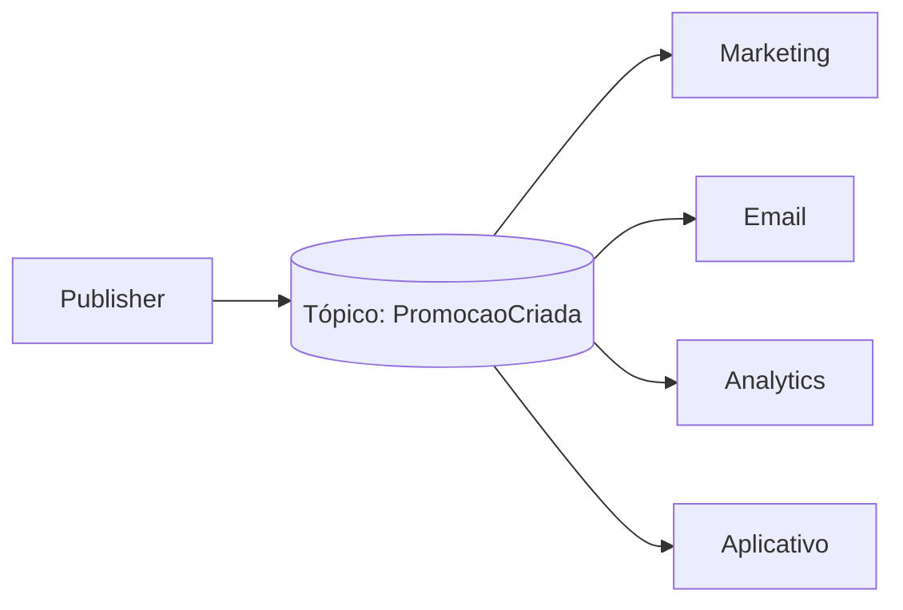
```mermaid
flowchart LR
    P[Publisher] --> T[(Tópico: PromocaoCriada)]
    T --> M[Marketing]
    T --> E[Email]
    T --> A[Analytics]
    T --> APP[Aplicativo]
```

### Streaming

Armazena eventos em um log. Consumidores controlam o offset e podem reprocessar eventos antigos.

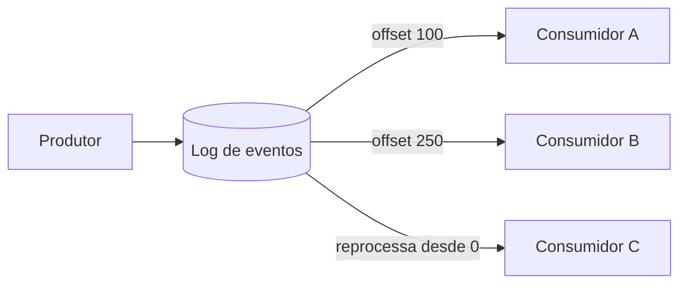
```mermaid
flowchart LR
    P[Produtor] --> LOG[(Log de eventos)]
    LOG -->|offset 100| C1[Consumidor A]
    LOG -->|offset 250| C2[Consumidor B]
    LOG -->|reprocessa desde 0| C3[Consumidor C]
```

## 11. Pull vs Push

| Estratégia | Quem inicia | Vantagem | Problema |
|---|---|---|---|
| Pull / Polling | Cliente | Simples | Muitas requisições desnecessárias |
| Push | Servidor/publicador | Mais eficiente | Mais complexo; exige canal adequado |

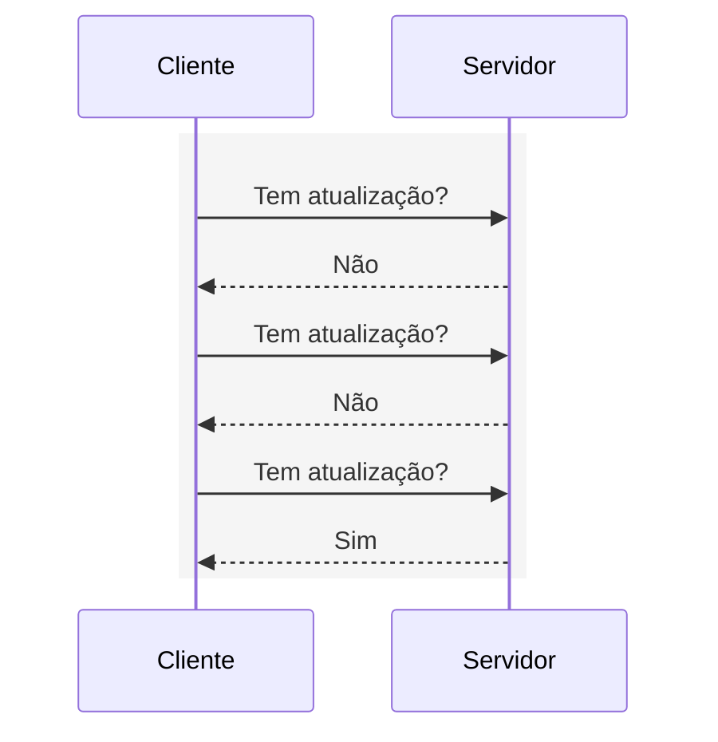
```mermaid
sequenceDiagram
    participant C as Cliente
    participant S as Servidor

    rect rgb(245,245,245)
    C->>S: Tem atualização?
    S-->>C: Não
    C->>S: Tem atualização?
    S-->>C: Não
    C->>S: Tem atualização?
    S-->>C: Sim
    end
```

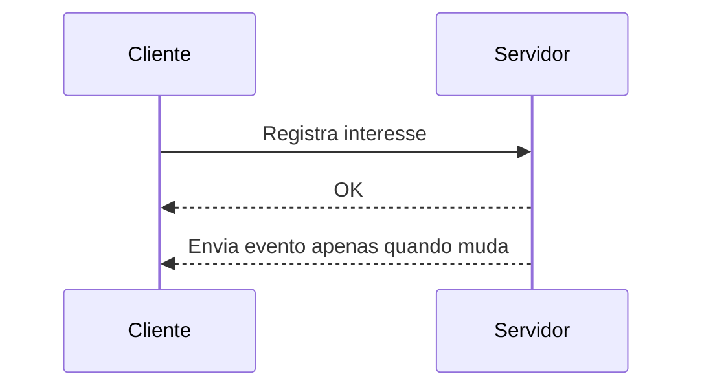
```mermaid
sequenceDiagram
    participant C as Cliente
    participant S as Servidor

    C->>S: Registra interesse
    S-->>C: OK
    S-->>C: Envia evento apenas quando muda
```

## 12. Saga em EDA

Saga é um padrão para coordenar transações distribuídas longas entre múltiplos serviços.

### Coreografia

Cada serviço reage a eventos, sem orquestrador central.

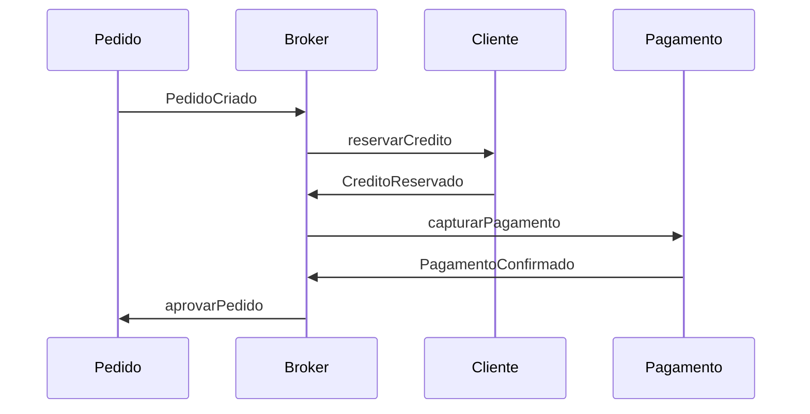
```mermaid
sequenceDiagram
    participant Pedido
    participant Broker
    participant Cliente
    participant Pagamento

    Pedido->>Broker: PedidoCriado
    Broker->>Cliente: reservarCredito
    Cliente->>Broker: CreditoReservado
    Broker->>Pagamento: capturarPagamento
    Pagamento->>Broker: PagamentoConfirmado
    Broker->>Pedido: aprovarPedido
```

### Orquestração

Um orquestrador controla a sequência e as compensações.

```mermaid
sequenceDiagram
    participant Pedido
    participant Saga as Orquestrador da Saga
    participant Cliente
    participant Pagamento

    Pedido->>Saga: iniciar CreateOrderSaga
    Saga->>Cliente: reservarCredito
    Cliente-->>Saga: ok
    Saga->>Pagamento: capturarPagamento
    Pagamento-->>Saga: falha
    Saga->>Cliente: compensar reserva
    Saga->>Pedido: rejeitar pedido
```

## Pontos de atenção para prova

- API é contrato e comunicação, não apenas endpoint.
- Comunicação síncrona bloqueia o cliente; assíncrona desacopla e melhora escalabilidade.
- Stateless escala melhor porque qualquer nó pode responder.
- API Gateway centraliza políticas, mas precisa de alta disponibilidade.
- Fila entrega para um consumidor; Pub/Sub entrega para vários; Streaming mantém histórico e offset.
- Formatos de texto facilitam depuração; formatos binários favorecem desempenho.
- MSA organiza serviços; EDA organiza comunicação por eventos.

## Questões de revisão

1. Explique a diferença entre comunicação síncrona e assíncrona.
2. Por que stateless facilita escalabilidade horizontal?
3. Qual a diferença entre fila, pub/sub e streaming?
4. Quando faz sentido usar Protobuf em vez de JSON?
5. Qual é o papel do API Gateway em uma arquitetura de integração?

### Gabarito resumido

1. Síncrona espera resposta imediata; assíncrona publica ou envia mensagem para processamento futuro.
2. Porque o servidor não guarda sessão; qualquer instância pode atender a requisição se o cliente enviar o contexto.
3. Fila distribui trabalho para um consumidor; Pub/Sub notifica múltiplos assinantes; Streaming guarda log e permite reprocessar por offset.
4. Quando desempenho, tamanho de mensagem e contrato tipado forem mais importantes que legibilidade humana.
5. Centralizar entrada, autenticação, autorização, roteamento, rate limit, logs, transformação, cache e proteção dos serviços internos.
