# 02 - Estilos de Arquitetura de Integração

## Objetivo do capítulo

Entender os principais estilos de APIs e integração: REST, SOAP, GraphQL, gRPC, WebSocket, WebHook, MQTT e AMQP. O foco é saber quando cada um se encaixa melhor, quais contratos utilizam, quais formatos trafegam e quais cuidados de design são cobrados em prova.

## Mapa mental do capítulo

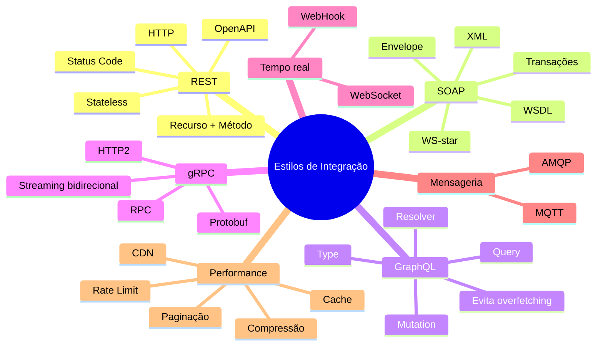

## 1. Visão comparativa dos estilos

| Estilo | Melhor uso | Transporte comum | Formato comum | Pontos fortes | Pontos fracos |
|---|---|---|---|---|---|
| REST | APIs web, CRUD, recursos | HTTP/HTTPS | JSON, XML, texto | Simples, popular, escalável | Sem padrão rigoroso por si só |
| SOAP | Integrações corporativas legadas e rigorosas | HTTP, SMTP e outros | XML | Contrato forte, WS-*, robustez | Verboso, pesado, complexo |
| GraphQL | Consultas flexíveis e agregadas | HTTP/HTTPS | JSON | Cliente escolhe dados, reduz over/underfetching | Curva maior, risco de consultas caras |
| gRPC | Comunicação interna de alta performance | HTTP/2 | Protobuf | Rápido, tipado, streaming | Menos amigável para navegador e rede restritiva |
| WebSocket | Tempo real bidirecional | TCP/HTTP upgrade | Texto ou binário | Full duplex, baixa latência | Gerenciamento de conexão |
| WebHook | Notificação por evento | HTTP/HTTPS | JSON, XML, texto | Evita polling, simples | Segurança e retentativas |
| MQTT | IoT e redes instáveis | TCP/IP | Binário | Leve, eficiente | Segurança nativa limitada |
| AMQP | Mensageria corporativa com broker | TCP | Binário | Confiável, flexível, orientado a filas | Mais complexo |

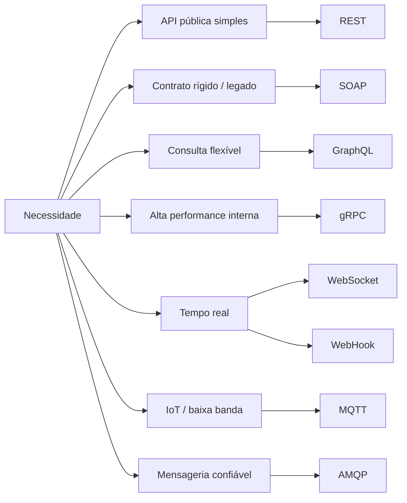

## 2. REST

REST significa **Representational State Transfer**. É um estilo arquitetural baseado nos padrões da Web, principalmente HTTP, URLs, métodos HTTP e códigos de status.

### REST x RESTful

REST é o conjunto de princípios. RESTful é a API que aplica esses princípios de forma adequada.

### Anatomia de URL e URI

Uma URL pode ter esquema, domínio, porta, path, query string e fragmento.

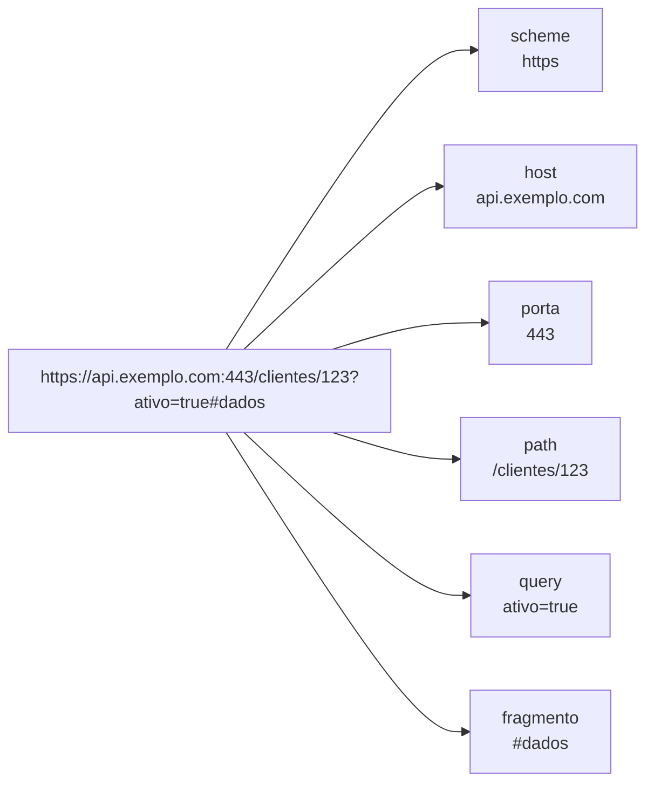

### Formas de passagem de dados em REST

| Forma | Exemplo | Uso recomendado |
|---|---|---|
| Path variable | `/clientes/123` | Identificar recurso específico |
| Query param | `/clientes?ativo=true` | Filtros, ordenação, paginação |
| Request body | JSON em POST/PUT/PATCH | Criação ou alteração de dados |
| Header | `Authorization`, `Accept` | Metadados, autenticação, negociação |
| Matrix variable | `/cars;color=red;year=2020` | Menos comum; depende do framework |

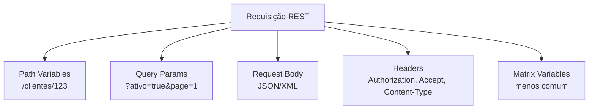

## 3. Design REST: método + recurso

Em REST, a intenção do cliente é definida pela combinação:

**Método HTTP + Recurso**

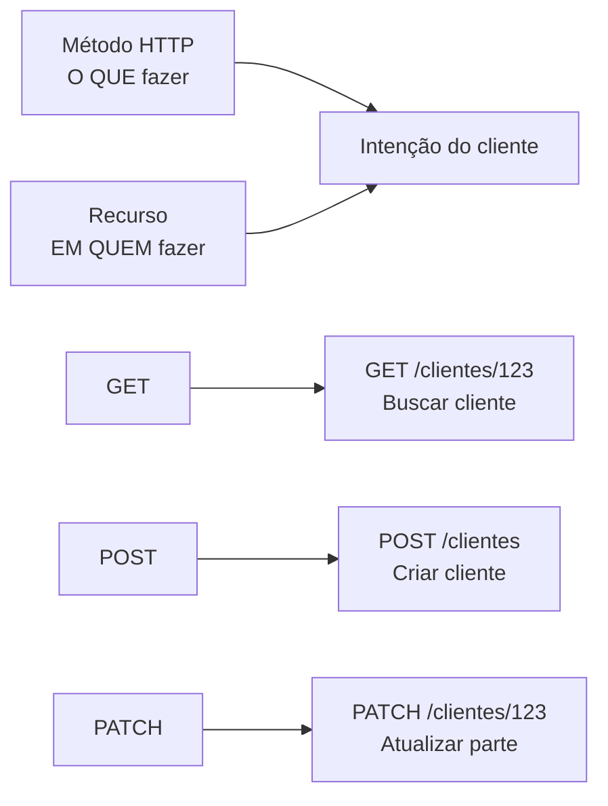

### Métodos HTTP

| Método | Uso | Idempotente? | Exemplo |
|---|---|---:|---|
| GET | Recuperar recurso | Sim | `GET /clientes/123` |
| POST | Criar recurso ou executar ação subordinada | Não | `POST /clientes` |
| PUT | Criar ou substituir recurso inteiro | Sim | `PUT /clientes/123` |
| PATCH | Atualizar parcialmente | Geralmente não garantido | `PATCH /clientes/123` |
| DELETE | Excluir recurso | Sim, em termos de resultado final | `DELETE /clientes/123` |
| OPTIONS | Descobrir operações suportadas | Sim | `OPTIONS /clientes` |

> Atenção: PUT substitui o recurso inteiro. Se a intenção for alterar apenas campos informados, o método mais coerente é PATCH.

## 4. Boas práticas de URL

### Evite ação no path

```http
Errado: POST /produtos/cadastrar
Certo:  POST /produtos
```

A ação deve estar no método HTTP, não no nome do recurso.

### Evite formato na URL

```http
Errado: GET /produtos/json
Certo:  GET /produtos
        Accept: application/json
```

Use **Content Negotiation**.

| Header | Indica |
|---|---|
| Content-Type | Formato do corpo enviado na requisição ou resposta |
| Accept | Formato que o cliente deseja receber |

### Evite nomes vagos

Prefira `/clientes`, `/pedidos`, `/pagamentos`, `/produtos` a nomes genéricos como `/itens`, `/resources` ou `/entity`.

## 5. Status codes

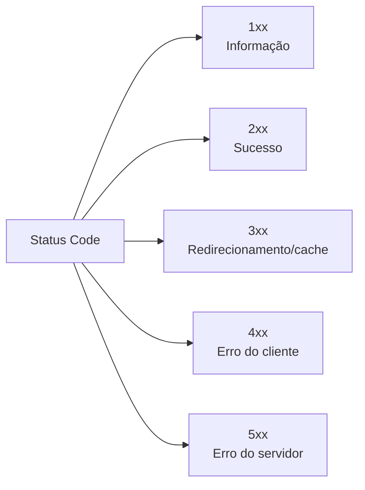

| Código | Nome | Quando usar |
|---:|---|---|
| 200 | OK | Sucesso genérico com resposta |
| 201 | Created | Recurso criado |
| 204 | No Content | Sucesso sem corpo de resposta |
| 400 | Bad Request | Requisição inválida |
| 401 | Unauthorized | Falta autenticação válida |
| 403 | Forbidden | Autenticado, mas sem permissão |
| 404 | Not Found | Recurso inexistente |
| 405 | Method Not Allowed | Método não permitido para o recurso |
| 409 | Conflict | Conflito de estado, duplicidade etc. |
| 412 | Precondition Failed | Pré-condição não satisfeita |
| 429 | Too Many Requests | Rate limit excedido |
| 500 | Internal Server Error | Erro interno genérico |
| 501 | Not Implemented | Operação não implementada |
| 502 | Bad Gateway | Falha de gateway/proxy |
| 503 | Service Unavailable | Serviço indisponível |
| 504 | Gateway Timeout | Timeout no gateway |

### Mensagens de erro

- Em **4xx**, explique o que o cliente deve corrigir.
- Em **5xx**, não exponha SQL, stack trace, nomes de tabela, infraestrutura ou detalhes internos.

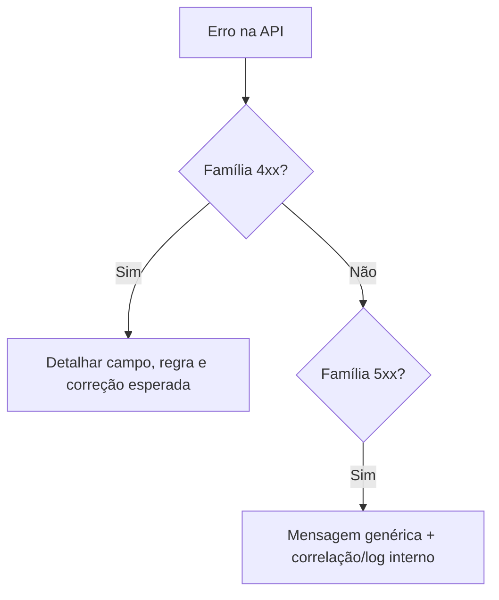

## 6. Ações fora do CRUD

Quando a API precisa de ações como ativar usuário, cancelar pedido ou aprovar fatura, existem alternativas.

| Abordagem | Exemplo | Vantagem | Cuidado |
|---|---|---|---|
| Sub-recurso de ação | `POST /users/{id}/ativar` | Simples | Mistura verbo no recurso |
| Header customizado | `POST /orders/{id}` + `X-Action: cancelar` | URI limpa | Menos intuitivo |
| Ação no body | `POST /invoices/{id}` com `{ "action": "aprovar" }` | Flexível | Sobrecarrega POST |
| PATCH de estado | `PATCH /users/{id}` com `{ "status": "ativo" }` | Usa método padrão | Pode confundir ação com atualização |
| Recurso actions | `POST /users/{id}/actions` | Trata ação como recurso | Mais verboso |

Regra prática: escolha a forma mais clara, documente e mantenha consistência em toda a API.

## 7. Modelo de Maturidade de Richardson

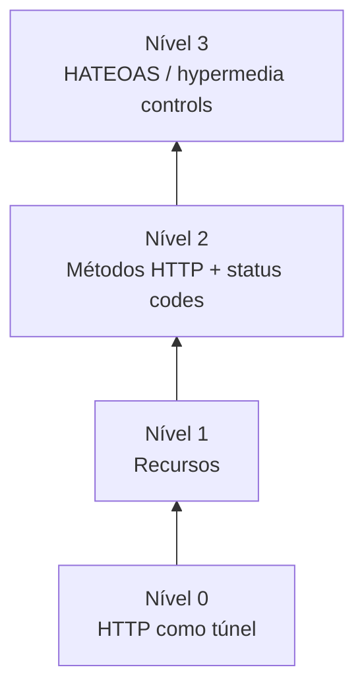

| Nível | Característica |
|---|---|
| 0 | Sem uso adequado de recursos; HTTP como transporte genérico |
| 1 | Usa recursos, como `/users` |
| 2 | Usa recursos + métodos HTTP + status codes corretamente |
| 3 | Usa HATEOAS, links e ações disponíveis na resposta |

## 8. Versionamento de APIs

Versão de software não é igual à versão da API. O contrato da API só muda quando muda o comportamento esperado pelos consumidores.

| Estratégia | Exemplo | Observação |
|---|---|---|
| URL | `/v1/clientes` | Simples e visível |
| Header customizado | `X-Accept-Version: v1` | Menos intuitivo |
| Header Accept | `Accept: application/vnd.exemplo.v1+json` | Mais formal |
| Data | `API-Version: 2025-04-06` | Útil para compatibilidade por data |
| Sem versão explícita | manter compatibilidade sempre | Exige disciplina forte |

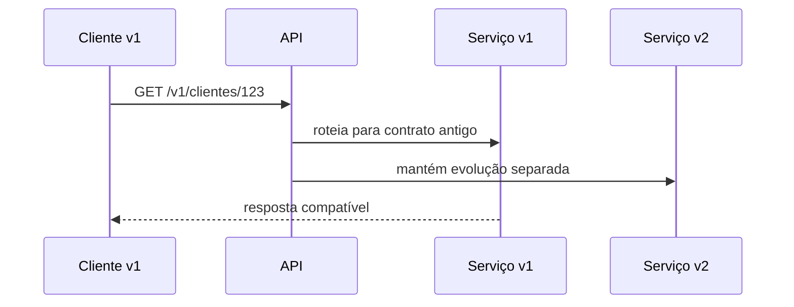

## 9. Documentação de APIs

Documentação é parte do contrato. Para REST, o padrão mais comum é OpenAPI; Swagger é o ecossistema de ferramentas em torno desse padrão.

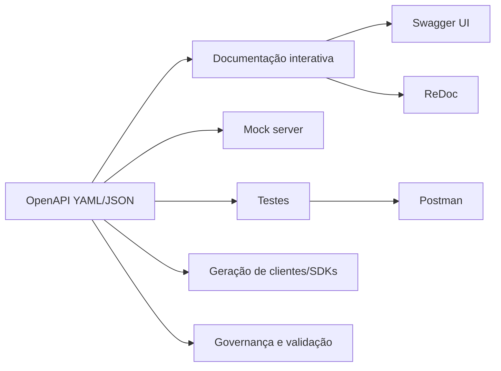

> Atualização: o material indicava OpenAPI 3.1.1 como versão atual. A versão mais recente publicada pela OpenAPI Initiative passou a ser 3.2.0 em 19/09/2025. Para prova, conheça o que está no material; para prática profissional, prefira consultar a especificação oficial atual.

## 10. SOAP

SOAP significa **Simple Object Access Protocol**. É um protocolo de mensagens baseado em XML, estruturado em envelope, header e body.

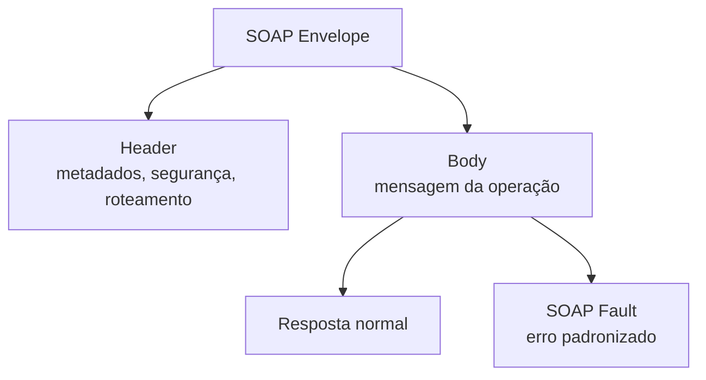

### REST x SOAP

| Aspecto | REST | SOAP |
|---|---|---|
| Natureza | Estilo arquitetural | Protocolo |
| Formato | JSON, XML, texto, HTML | XML |
| Contrato | OpenAPI, documentação externa | WSDL nativo |
| Transporte | HTTP/HTTPS | HTTP, SMTP e outros |
| Métodos HTTP | Usa GET, POST, PUT, PATCH, DELETE | Quando em HTTP, normalmente POST |
| Complexidade | Menor | Maior |
| Robustez formal | Menor por padrão | Maior, com WS-* |

### WSDL

WSDL descreve contrato SOAP: tipos, operações, mensagens, bindings e endpoints.

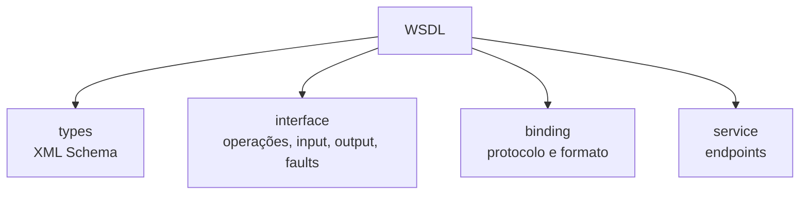

### WS-*

| Extensão | Finalidade |
|---|---|
| WS-Security | Integridade, confidencialidade, autenticidade |
| WS-Addressing | Endereçamento e roteamento |
| WS-ReliableMessaging | Entrega confiável |
| WS-Policy | Expressar políticas |
| WS-Coordination | Coordenar ações distribuídas |
| WS-Transaction | Transações atômicas e atividades de negócio |

## 11. GraphQL

GraphQL é uma linguagem de consulta para APIs. O cliente informa exatamente quais dados deseja receber.

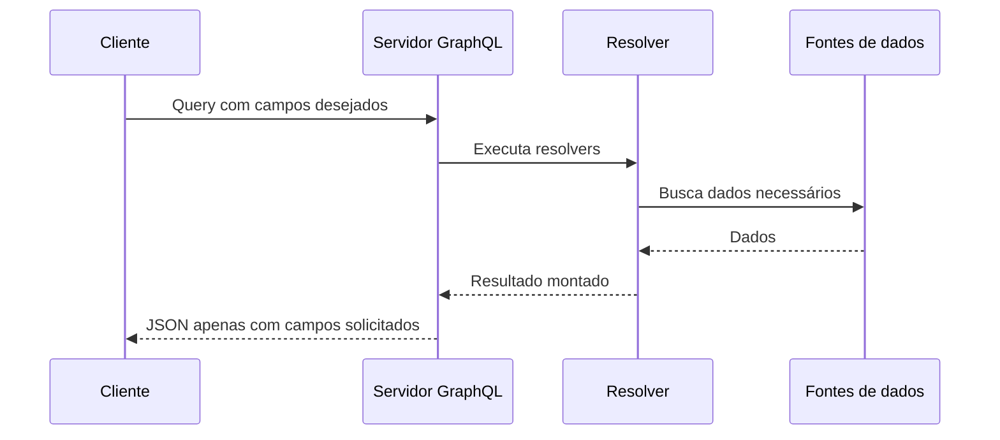

### Conceitos fundamentais

| Conceito | Significado |
|---|---|
| Operation | Instrução enviada pelo cliente |
| Query | Consulta de dados |
| Mutation | Criação ou alteração |
| Type | Modelo de dados exposto |
| Input | Modelo de entrada |
| Variables | Parâmetros externos da operação |
| Resolver | Função que resolve um campo, query ou mutation |
| Scalar | Tipos primitivos como Int, Float, String, Boolean e ID |
| `!` | Campo obrigatório/não nulo |
| `[]` | Lista |

### REST x GraphQL

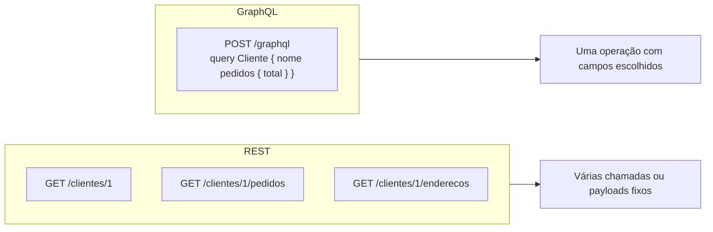

GraphQL não substitui REST em todos os casos. É mais indicado quando a necessidade de dados muda muito, há múltiplas fontes ou o frontend precisa controlar precisamente o payload.

## 12. gRPC e Protobuf

gRPC é uma evolução do conceito de RPC, usando HTTP/2 e Protocol Buffers.

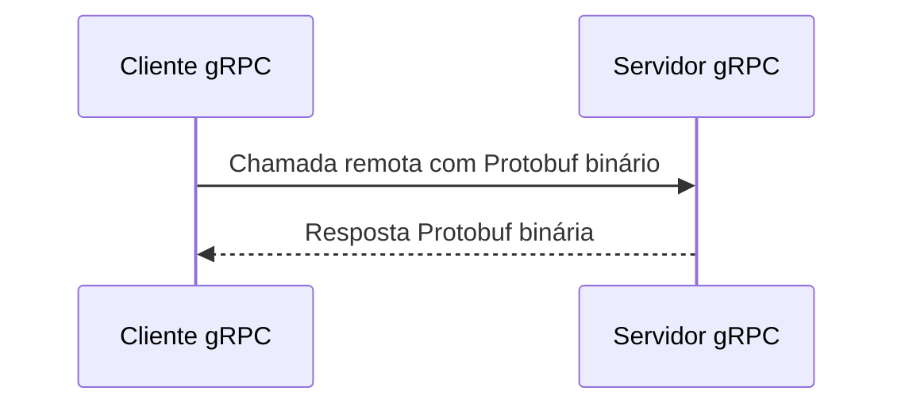

### Papel do `.proto`

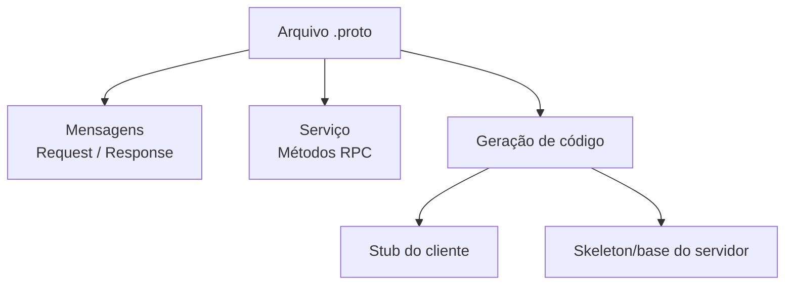

### Quando escolher gRPC

Use gRPC quando:

- a comunicação for principalmente entre serviços internos;
- performance for crítica;
- houver necessidade de contratos fortemente tipados;
- streaming bidirecional for útil;
- as linguagens envolvidas tiverem bom suporte.

Evite como primeira escolha para APIs públicas consumidas diretamente por navegadores sem camadas de adaptação.

## 13. Arquitetura híbrida

Não é necessário escolher apenas um estilo.

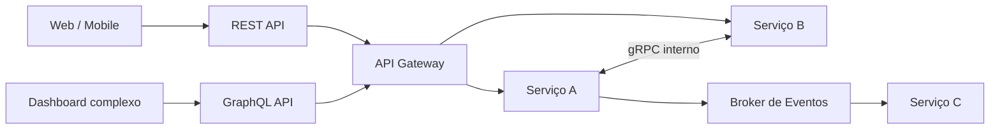

Exemplo prático:

- REST para recursos simples e APIs públicas;
- GraphQL para consultas complexas do frontend;
- gRPC entre microsserviços internos;
- mensageria para eventos assíncronos.

## 14. WebSocket e WebHook

| Estilo | Funcionamento | Exemplo |
|---|---|---|
| WebSocket | Conexão persistente full duplex | Chat, painel em tempo real, jogos |
| WebHook | Servidor chama uma URL do cliente quando evento ocorre | Pagamento aprovado, pedido enviado |

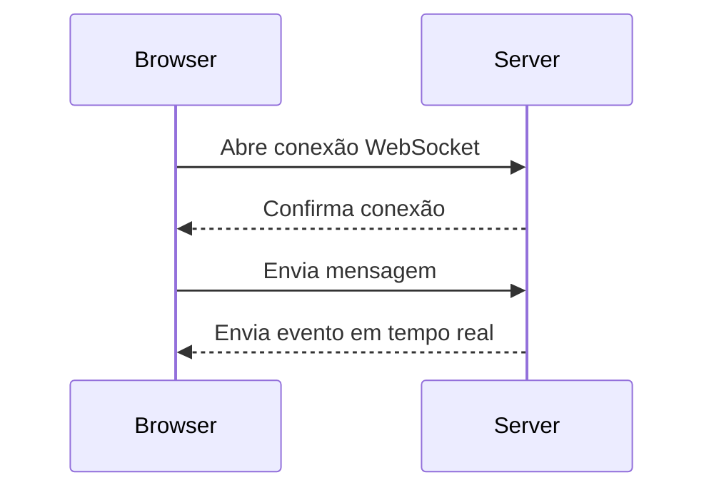

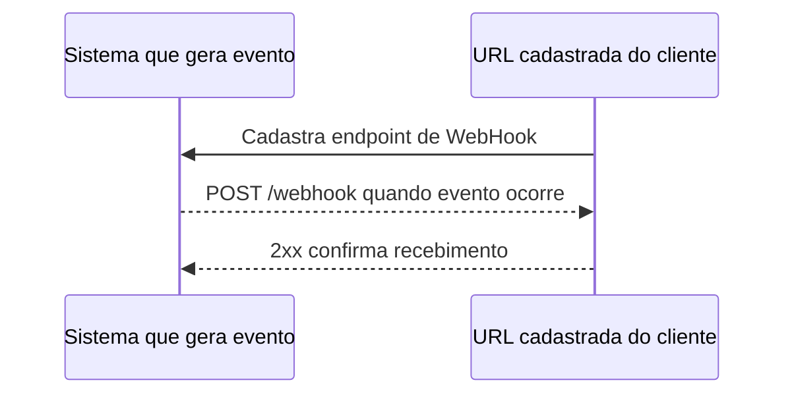

## 15. MQTT e AMQP

### MQTT

MQTT é leve e adequado para dispositivos de baixa potência ou redes instáveis.

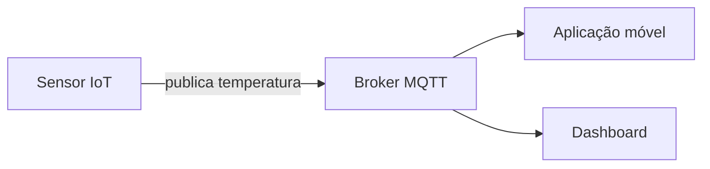

### AMQP

AMQP é um protocolo de mensageria mais robusto, flexível e orientado a broker.

```mermaid
flowchart LR
    P[Producer] --> EX[Exchange]
    EX -->|routing key A| Q1[(Queue A)]
    EX -->|routing key B| Q2[(Queue B)]
    Q1 --> C1[Consumer A]
    Q2 --> C2[Consumer B]
```

## 16. Paginação

Paginação evita devolver listas gigantes de uma vez.

| Elemento | Papel |
|---|---|
| `size` | Quantidade de itens por página |
| `page` | Página solicitada |
| `offset` | Posição inicial |
| `Link` | URLs de próxima, anterior, primeira e última página |
| `X-Total-Items` | Total de registros |
| `X-Total-Pages` | Total de páginas |

```mermaid
sequenceDiagram
    participant C as Cliente
    participant A as API

    C->>A: GET /clientes?page=1&size=10
    A-->>C: itens 1-10 + Link next
    C->>A: GET /clientes?page=2&size=10
    A-->>C: itens 11-20 + Link next/prev
```

## 17. Cache e CDN

Cache armazena cópias próximas ao cliente para reduzir latência e carga na origem.

```mermaid
sequenceDiagram
    participant C as Cliente
    participant CDN as CDN/Cache
    participant API as API Origem

    C->>CDN: GET /catalogo
    alt cache hit
        CDN-->>C: Resposta do cache
    else cache miss
        CDN->>API: Busca recurso
        API-->>CDN: Resposta + Cache-Control/ETag
        CDN-->>C: Resposta e armazena cópia
    end
```

| Header | Função |
|---|---|
| Expires | Data/hora absoluta de expiração |
| Cache-Control | Regras de cache, como `max-age` |
| ETag | Identificador opaco da versão do recurso |
| If-None-Match | Cliente envia ETag que possui |
| Last-Modified | Data da última modificação |

## 18. Compressão

Compressão reduz bytes trafegados.

```mermaid
sequenceDiagram
    participant C as Cliente
    participant S as Servidor

    C->>S: Accept-Encoding: gzip
    S-->>C: Content-Encoding: gzip + corpo comprimido
    C->>C: Descomprime resposta
```

## 19. Rate Limit

Rate limit limita o número de chamadas por cliente em uma janela de tempo. Ajuda a evitar abuso, proteger custos e reduzir impacto de DoS/DDoS.

```mermaid
flowchart TD
    C[Cliente] --> G[API Gateway]
    G --> CHECK{"Limite excedido?"}
    CHECK -->|Não| API[API interna]
    CHECK -->|Sim| R429["429 Too Many Requests"]
```

| Header | Significado |
|---|---|
| Retry-After | Quando tentar novamente |
| RateLimit-Limit | Cota total da janela |
| RateLimit-Remaining | Cota restante |
| RateLimit-Reset | Tempo até reset da janela |

## Pontos de atenção para prova

- REST usa método + recurso para expressar intenção.
- PUT substitui o recurso inteiro; PATCH atualiza parcialmente.
- 401 é falta de autenticação; 403 é falta de permissão.
- SOAP usa XML, envelope e WSDL; REST usa padrões HTTP e normalmente OpenAPI.
- GraphQL é forte para consulta flexível; gRPC é forte para performance interna.
- WebSocket é bidirecional persistente; WebHook é chamada por evento.
- Cache, paginação, compressão e rate limit são mecanismos de performance e proteção.

## Questões de revisão

1. Qual a diferença entre Content-Type e Accept?
2. Por que `GET /produtos/cadastrar` é um mau desenho REST?
3. Quando retornar 401 e quando retornar 403?
4. O que é HATEOAS no Modelo de Richardson?
5. Qual a principal vantagem do gRPC em relação a REST?
6. Quando GraphQL é melhor que REST?
7. Qual a diferença entre WebSocket e WebHook?
8. Por que rate limit costuma ficar no API Gateway?

### Gabarito resumido

1. Content-Type descreve o corpo enviado; Accept informa o formato desejado na resposta.
2. Porque a ação deve ser indicada pelo método HTTP; o path deve representar recurso.
3. 401 quando não há autenticação válida; 403 quando há autenticação, mas falta autorização.
4. A API retorna links/ações possíveis junto com os dados.
5. Protobuf binário, HTTP/2, contrato tipado e suporte a streaming.
6. Quando o cliente precisa controlar campos, evitar múltiplas chamadas e compor dados de várias fontes.
7. WebSocket mantém conexão bidirecional; WebHook é uma chamada HTTP feita pelo servidor quando ocorre um evento.
8. Porque o gateway é o ponto único de entrada e consegue aplicar políticas globais por consumidor.
