# 03 - Segurança, Cloud e Testes

## Objetivo do capítulo

Revisar segurança em APIs, autenticação/autorização, OWASP API Security Top 10, OAuth2, JWT, cloud services, API First, API como produto, API Gateway, Portal de APIs e testes de integração.

## Mapa mental do capítulo

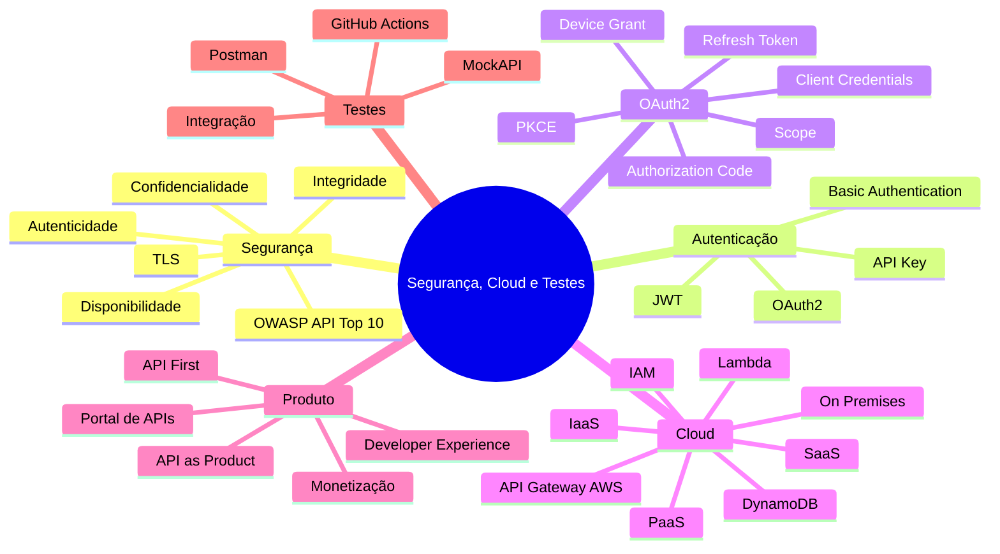

## 1. Princípios da Segurança da Informação

| Princípio | Pergunta que responde | Exemplo |
|---|---|---|
| Autenticidade | Quem é o usuário ou sistema? | Login, MFA, certificado, auditoria |
| Confidencialidade | Quem pode acessar? | Autorização por perfil, escopo, alçada |
| Integridade | O dado foi alterado? | Assinatura digital, hash, validação de token |
| Disponibilidade | O recurso está acessível? | Redundância, backups, SGBD, escalabilidade |

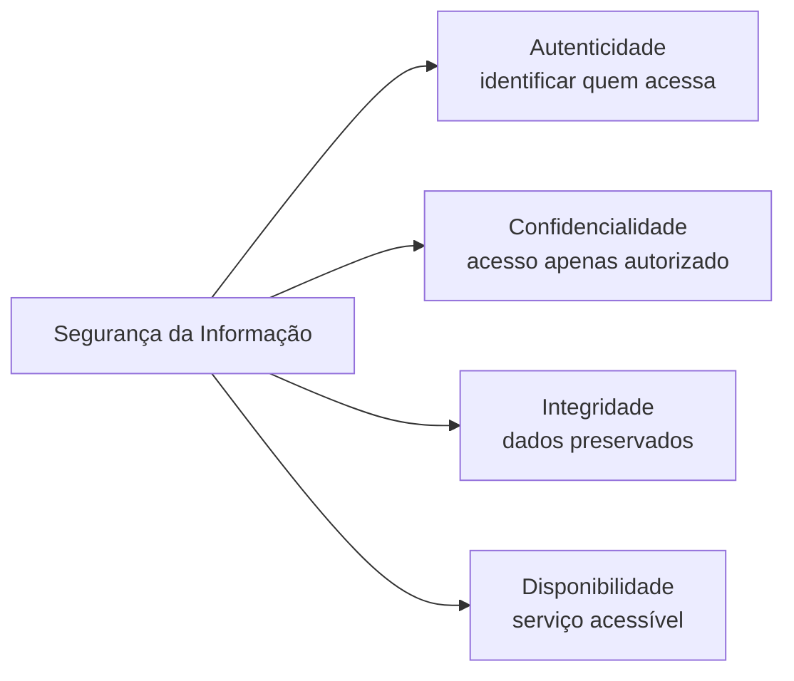

## 2. OWASP API Security Top 10 - 2023

As APIs são alvos importantes porque expõem lógica de negócio e dados. A lista OWASP API Security Top 10 2023 organiza riscos comuns em APIs.

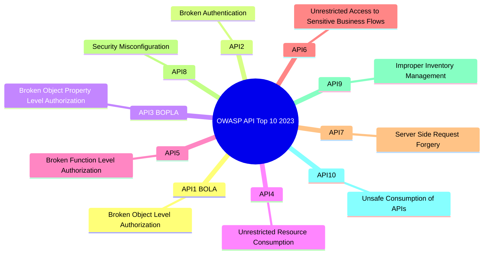

### Resumo prático dos riscos

| Item | Nome | Ideia central | Mitigação principal |
|---|---|---|---|
| API1 | BOLA | Usuário troca ID e acessa objeto de outro | Verificar autorização por objeto; usar IDs imprevisíveis |
| API2 | Broken Authentication | Falhas no mecanismo de login/token | MFA, bloqueio, captcha, expiração, proteção contra força bruta |
| API3 | BOPLA | Usuário altera campo sensível que não deveria | DTOs separados, allowlist de campos, validação por propriedade |
| API4 | Unrestricted Resource Consumption | Consumo excessivo de CPU, memória, chamadas ou custo | Rate limit, limites de payload, cotas e alertas de custo |
| API5 | Broken Function Level Authorization | Usuário comum acessa endpoint administrativo | Zero Trust, RBAC/ABAC, negar por padrão |
| API6 | Sensitive Business Flows | Abuso de regra de negócio sensível | Captcha, limitação, análise de comportamento, regra de negócio |
| API7 | SSRF | Servidor é induzido a acessar URL interna | Validar URLs, bloquear localhost/rede interna, não seguir redirects cegamente |
| API8 | Security Misconfiguration | Configuração insegura, CORS/TLS/cache incorretos | Hardening, automação, headers seguros, patches |
| API9 | Improper Inventory Management | APIs antigas ou ambientes expostos sem controle | Inventário, desativação, controle de versões e ambientes |
| API10 | Unsafe Consumption of APIs | Confiar cegamente em APIs terceiras | Validar respostas, TLS, allowlist, não seguir redirects cegamente |

## 3. BOLA e BOPLA: diferença essencial

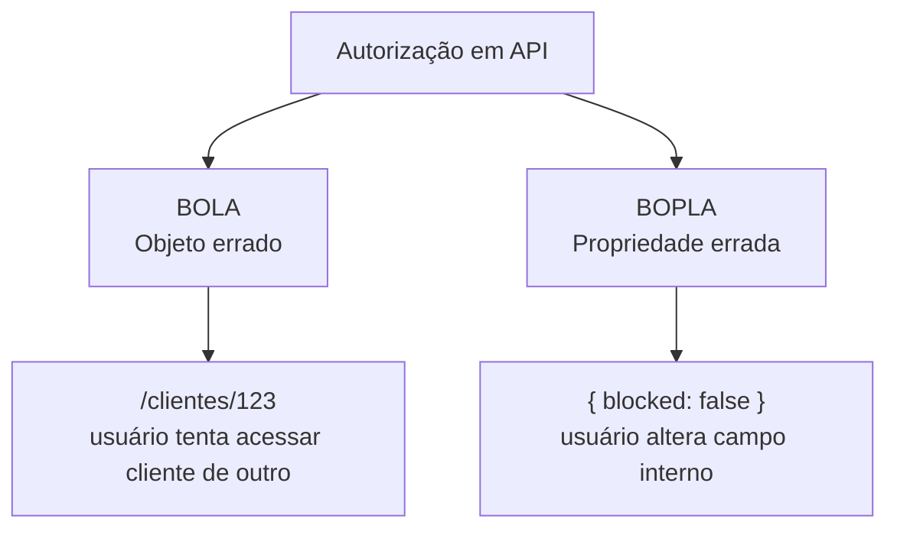

- **BOLA**: o problema é acessar o objeto que pertence a outra pessoa ou domínio.
- **BOPLA**: o problema é ler ou alterar uma propriedade que não deveria estar disponível ao consumidor.

## 4. TLS, HTTPS e canal seguro

TLS protege o canal de comunicação, garantindo criptografia e reduzindo risco de interceptação.

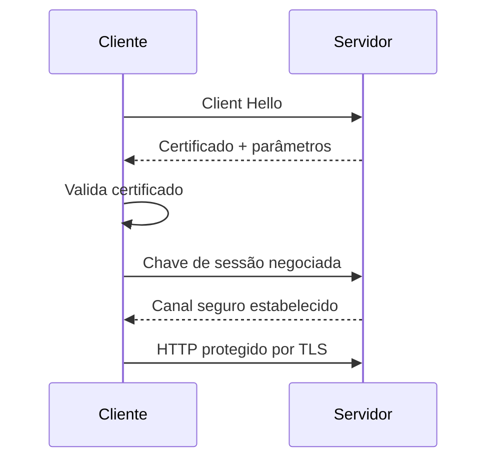

Na prática, **HTTPS = HTTP sobre TLS**.

## 5. Autenticação básica, token, OAuth2 e JWT

| Método | Como funciona | Vantagem | Risco/cuidado |
|---|---|---|---|
| Basic Authentication | Envia usuário e senha em Base64 no header | Simples | Inseguro se usado sem TLS; Base64 não é criptografia |
| API Key / token opaco | Cliente envia chave/token | Simples para sistemas | Precisa rotação, escopo e armazenamento seguro |
| OAuth2 | Authorization Server emite tokens | Padrão robusto para delegação | Implementação mais complexa |
| JWT | Token com conteúdo assinado | Validação local e claims | É obrigatório validar assinatura, expiração e audiência |

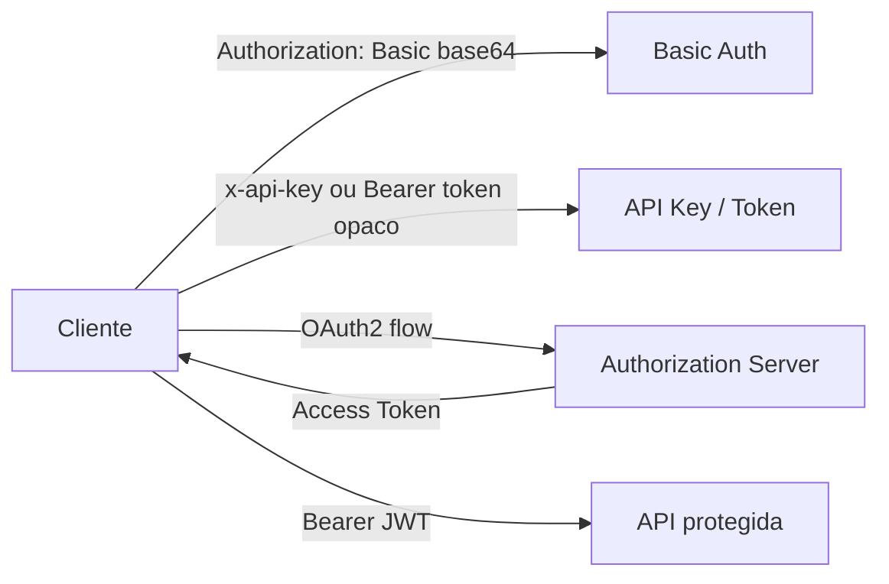

## 6. OAuth2

OAuth2 separa o cliente, o servidor de autorização e o servidor de recursos.

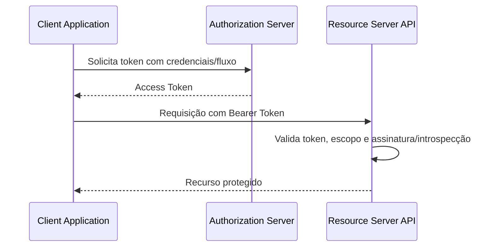

### Conceitos

| Conceito | Significado |
|---|---|
| client_id | Identifica a aplicação cliente |
| client_secret | Segredo da aplicação cliente |
| access_token | Credencial temporária para acessar API |
| refresh_token | Credencial para renovar access token |
| scope | Conjunto de permissões do token |
| Authorization Server | Emite e valida tokens |
| Resource Server | API que protege os recursos |

### Grant types

| Fluxo | Uso | Complexidade |
|---|---|---|
| Client Credentials | Sistema para sistema, sem usuário | Menor |
| Authorization Code | Usuário + aplicação cliente | Maior |
| Authorization Code + PKCE | Aplicações públicas/mobile/SPAs | Maior e mais seguro |
| Device Grant | Dispositivos com pouca interface, como TV | Média/alta |
| Refresh Token | Renovar access token expirado | Baixa/média |

### Client Credentials

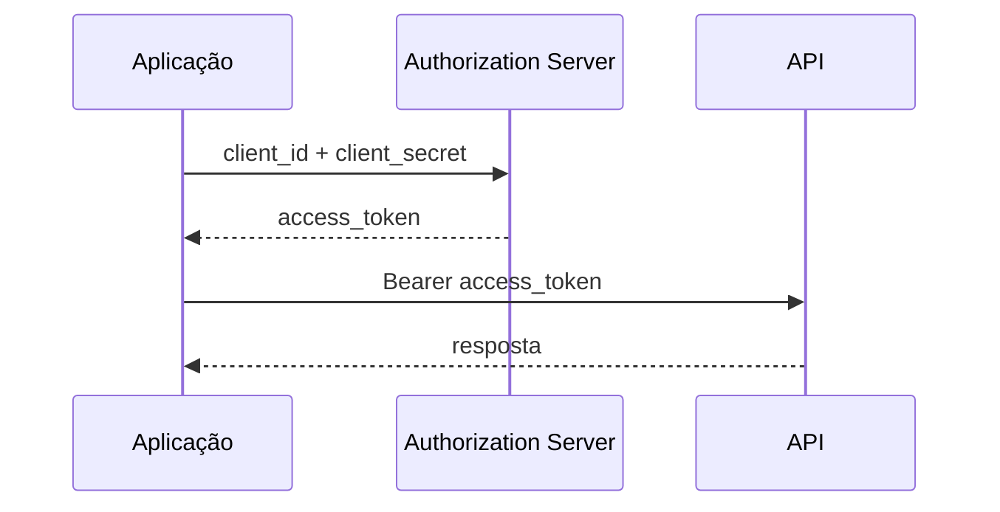

### Authorization Code + PKCE

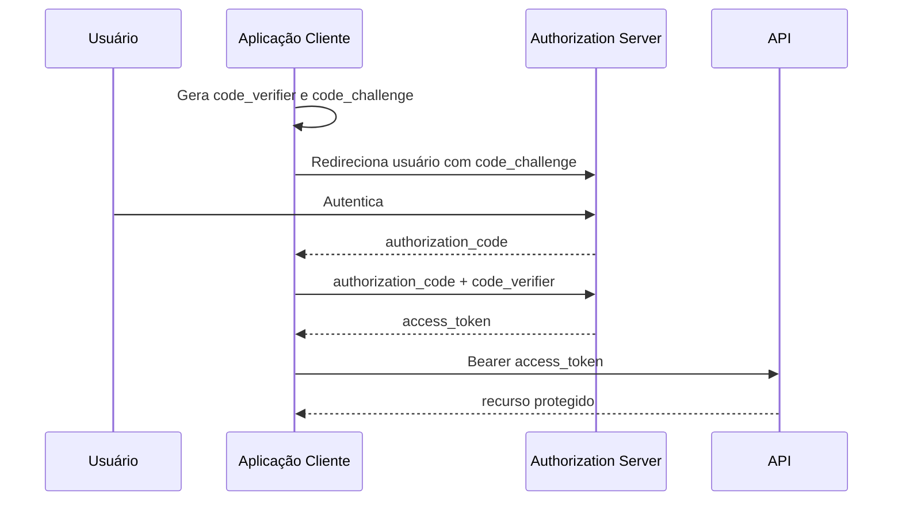

## 7. JWT

JWT é composto por header, payload e signature.

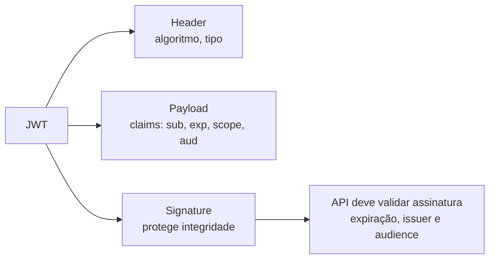

Pontos obrigatórios ao validar JWT:

- assinatura;
- expiração (`exp`);
- emissor (`iss`);
- audiência (`aud`);
- escopos/perfis;
- algoritmo esperado;
- rotação de chaves.

## 8. Cloud Services

Cloud Services são recursos de computação pela internet: servidores, armazenamento, bancos de dados, redes, software, analytics e inteligência.

### Modelos de responsabilidade

| Modelo | Provedor gerencia | Cliente gerencia | Exemplo mental |
|---|---|---|---|
| On-Premises | Nada | Tudo | Datacenter próprio |
| IaaS | Rede, storage, servidores, virtualização | SO, runtime, app, dados | VM na nuvem |
| PaaS | Infra + plataforma/runtime | Código e dados | Plataforma para subir app |
| SaaS | Tudo | Uso e configuração | Gmail, sistema pronto |

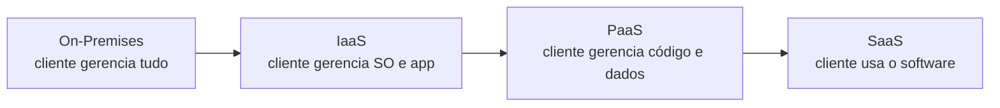

## 9. APIs na nuvem e arquitetura serverless

Na prática proposta pelo material, a API pública na AWS usa API Gateway, Lambda, DynamoDB e IAM.

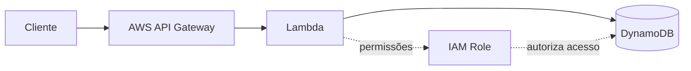

| Serviço | Papel |
|---|---|
| API Gateway | Expõe endpoint público e roteia chamada |
| Lambda | Executa regra de negócio sob demanda |
| DynamoDB | Armazena dados |
| IAM | Define permissões entre serviços |

## 10. API First

API First define o contrato antes do código. Isso permite paralelismo entre front-end, back-end, testes e mock.

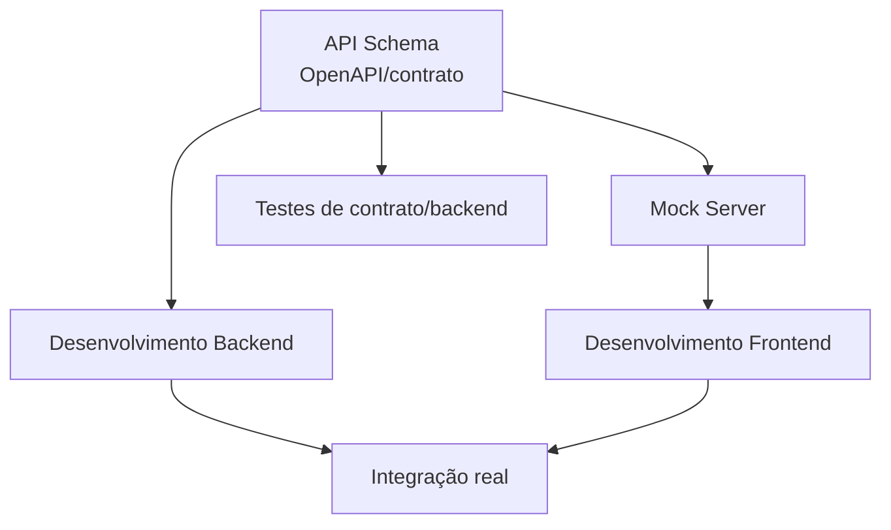

Benefícios:

- reduz retrabalho;
- permite frontend começar antes do backend final;
- facilita testes e documentação;
- transforma contrato em fonte da verdade.

## 11. API como Produto

API como produto significa que a API não é apenas mecanismo técnico de integração: ela é uma oferta de negócio, com consumidores, experiência, governança, monetização e suporte.

### Papéis

| Papel | Responsabilidade |
|---|---|
| API Product Manager | Backlog, KPIs, estratégia e priorização |
| API Architect | Coerência arquitetural, integração entre times e padrões |
| API Developer | Implementação, documentação, segurança e performance |
| API Evangelist | Adoção, comunidade, tutoriais, feedback dos consumidores |
| API Champion | Patrocínio executivo e alinhamento com linhas de negócio |

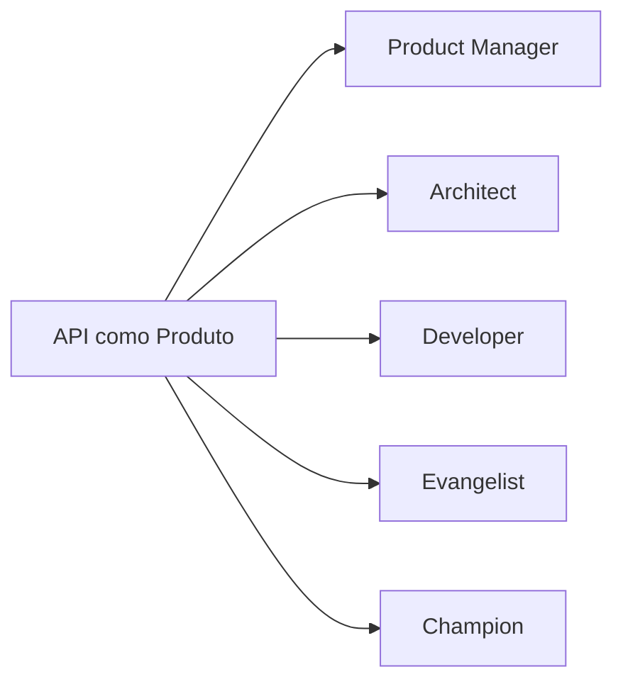

## 12. Developer Experience

Developer Experience é a experiência do desenvolvedor ao consumir, testar, entender e integrar a API.

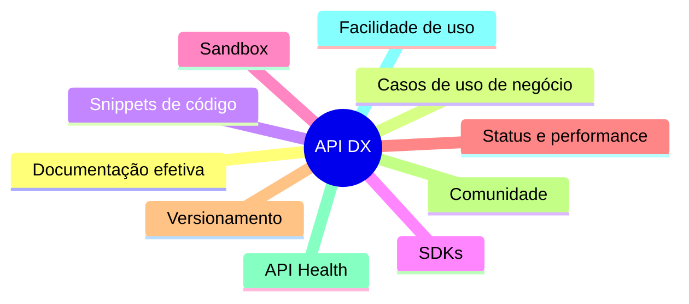

Quanto melhor a DX, maior a chance de adoção da API.

## 13. Monetização de APIs

| Modelo | Funcionamento |
|---|---|
| Por uso | Cobrança por chamada, lote ou volume |
| Licenças em camadas | Free, Premium, Enterprise etc. |
| Assinatura | Valor fixo semanal/mensal/anual |
| Unidade de infraestrutura | Cobrança por recursos consumidos |
| Unidade | Chaves, acessos ou licenças |
| Participação na receita | Percentual da receita gerada pelo consumidor |

## 14. API Gateway

API Gateway é ponto único de entrada para as APIs. Atua como proxy reverso e concentra políticas.

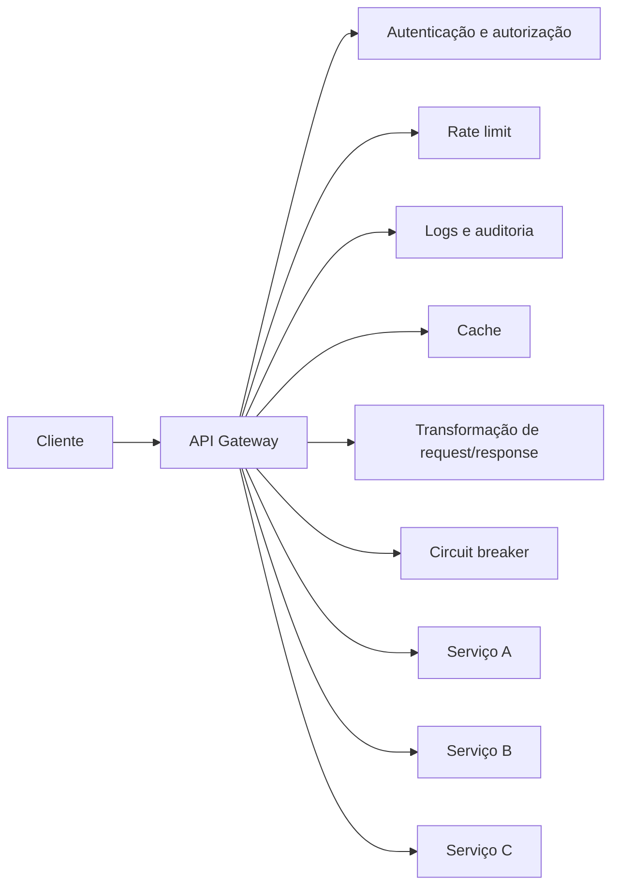

Responsabilidades comuns:

- validação de token;
- autorização;
- rate limit;
- roteamento;
- transformação de payload;
- service discovery;
- logs e auditoria;
- cache;
- tratamento de erro;
- circuit breaker;
- monetização e métricas de consumo.

> Cuidado: se o gateway é ponto único de entrada, ele precisa de redundância, escalabilidade e alta disponibilidade.

## 15. Portal de APIs

Portal de APIs centraliza documentação, cadastro, onboarding e suporte aos consumidores.

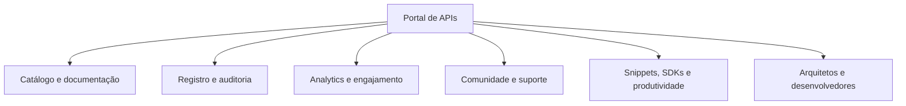

API Gateway e Portal de APIs são complementares: o gateway controla o tráfego; o portal organiza o consumo.

## 16. Testes de integração de APIs

Teste de integração chama os componentes de entrada do software e valida o fluxo com dependências reais ou simuladas.

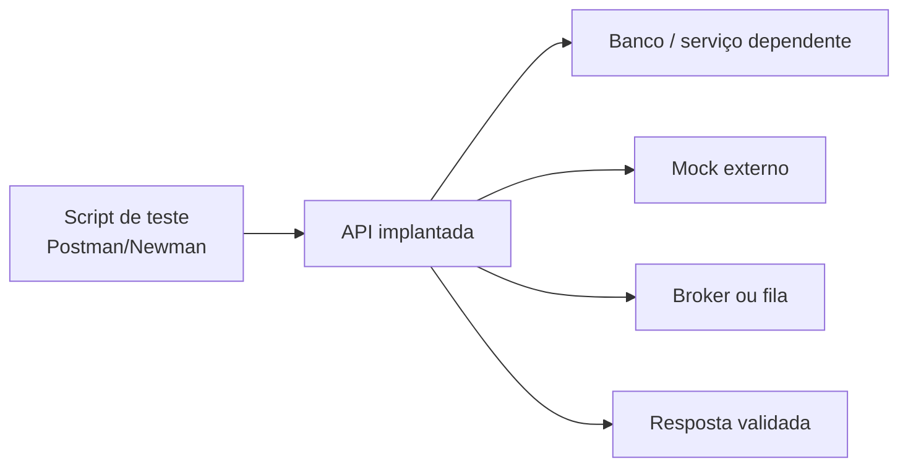

### Pipeline com GitHub Actions

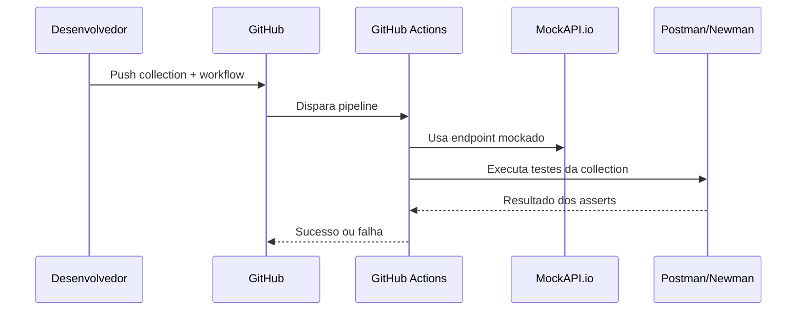

### Etapas da prática

1. Criar projeto e recurso no MockAPI.io.
2. Criar Collection no Postman.
3. Criar request apontando para o endpoint mockado.
4. Adicionar testes/asserts.
5. Exportar a Collection.
6. Criar repositório no GitHub.
7. Adicionar workflow com execução automatizada.
8. Rodar pipeline e analisar resultado.

## Pontos de atenção para prova

- Segurança de API começa com autenticação, autorização e validação do contrato.
- 401 é autenticação; 403 é autorização.
- BOLA é acesso indevido ao objeto; BOPLA é acesso indevido à propriedade.
- OAuth2 é protocolo de autorização delegada; JWT é um formato de token.
- Basic Auth usa Base64, que não é criptografia.
- API Gateway centraliza políticas, mas deve ter alta disponibilidade.
- API First antecipa contrato e permite mock/teste paralelos.
- Teste de integração exige ambiente acessível e valida o fluxo entre componentes.

## Questões de revisão

1. Quais são os quatro princípios da segurança da informação?
2. Qual a diferença entre autenticação e autorização?
3. Diferencie BOLA e BOPLA.
4. Por que Basic Authentication é considerada frágil?
5. O que é scope em OAuth2?
6. Qual a diferença entre access token e refresh token?
7. O que deve ser validado em um JWT?
8. Qual a função do IAM na prática AWS?
9. O que é API First?
10. Por que API Gateway e Portal de APIs são componentes diferentes?

### Gabarito resumido

1. Autenticidade, confidencialidade, integridade e disponibilidade.
2. Autenticação identifica quem é; autorização define o que pode acessar.
3. BOLA acessa objeto indevido; BOPLA lê/altera propriedade indevida.
4. Porque envia usuário/senha codificados em Base64; sem TLS é facilmente exposto e mesmo com TLS não é ideal para APIs modernas.
5. Conjunto de permissões concedidas no token.
6. Access token acessa recurso por tempo curto; refresh token renova access tokens.
7. Assinatura, expiração, emissor, audiência, escopos, algoritmo e chaves.
8. Conceder permissões para Lambda acessar recursos como DynamoDB.
9. Definir contrato da API antes do desenvolvimento do código.
10. Gateway controla tráfego e políticas; Portal organiza documentação, onboarding, comunidade e consumo.
