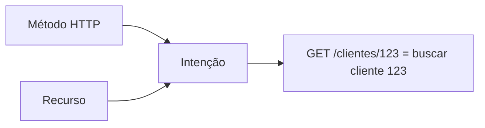
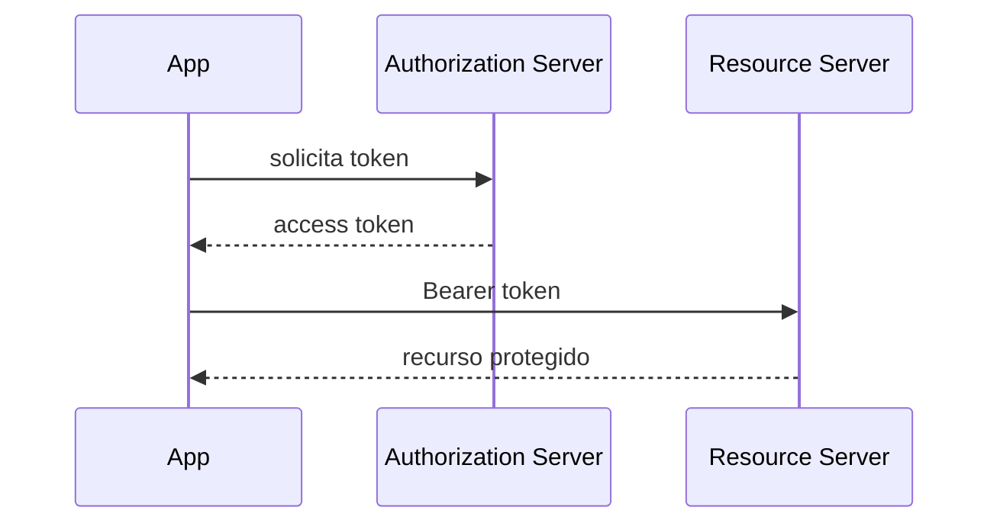
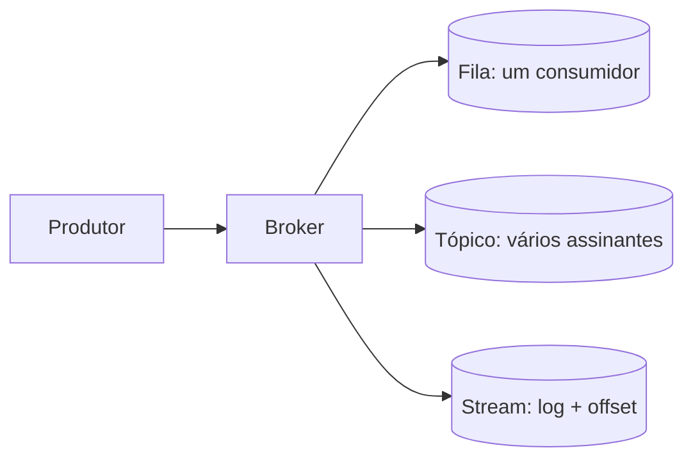
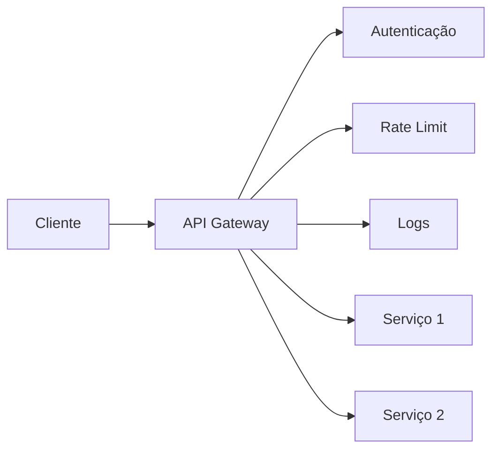

# 04 - Revisão para Prova

## Leitura de véspera

Se tiver pouco tempo, revise nesta ordem:

1. REST: método + recurso, status codes, PUT vs PATCH, versionamento e OpenAPI.
2. SOAP: envelope, WSDL, XML e WS-*.
3. GraphQL: query, mutation, type, input, variables e resolver.
4. gRPC: HTTP/2, Protobuf e arquivo `.proto`.
5. Mensageria: fila, pub/sub e streaming.
6. Segurança: OWASP API Top 10, OAuth2, JWT, TLS.
7. API Gateway, API First, API as a Product e testes de integração.

## Tabela de memorização rápida

| Tema | Frase que resolve muita questão |
|---|---|
| API | Contrato de comunicação entre sistemas |
| REST | Método HTTP + recurso + status code |
| PUT | Substitui o recurso inteiro |
| PATCH | Atualiza parcialmente |
| 401 | Não autenticado |
| 403 | Autenticado, mas sem permissão |
| SOAP | XML + Envelope + WSDL |
| GraphQL | Cliente escolhe os campos |
| gRPC | RPC moderno com HTTP/2 e Protobuf |
| WebSocket | Comunicação bidirecional persistente |
| WebHook | Servidor chama cliente quando evento ocorre |
| MQTT | Mensageria leve para IoT |
| AMQP | Mensageria com broker e filas robustas |
| Fila | Uma mensagem para um consumidor |
| Pub/Sub | Uma mensagem para vários assinantes |
| Streaming | Log de eventos com offset e reprocessamento |
| OAuth2 | Protocolo de autorização delegada |
| JWT | Formato de token com header, payload e assinatura |
| API Gateway | Ponto único de entrada e políticas globais |
| API First | Contrato antes do código |
| DX | Experiência do desenvolvedor consumidor da API |

## Diagramas essenciais para redesenhar na prova

### REST: método + recurso

### OAuth2

### Mensageria

### API Gateway

## Questões objetivas

### 1. Em uma API REST, qual combinação define a intenção do cliente?

a) Header + Body  
b) Método HTTP + Recurso  
c) Status code + Body  
d) Porta + Domínio  

**Gabarito:** b

### 2. Qual método HTTP é mais adequado para atualização parcial?

a) GET  
b) POST  
c) PUT  
d) PATCH  

**Gabarito:** d

### 3. O código 403 significa:

a) Usuário não enviou credenciais  
b) Usuário está autenticado, mas não autorizado  
c) Servidor está fora do ar  
d) Recurso foi criado  

**Gabarito:** b

### 4. Qual estilo usa WSDL como contrato?

a) REST  
b) SOAP  
c) GraphQL  
d) WebSocket  

**Gabarito:** b

### 5. Qual tecnologia usa arquivo `.proto`?

a) SOAP  
b) GraphQL  
c) gRPC  
d) REST  

**Gabarito:** c

### 6. Em Pub/Sub:

a) A mensagem vai para apenas um consumidor  
b) A mensagem é apagada antes de ser lida  
c) Todos os assinantes do tópico recebem cópia do evento  
d) Não existe broker  

**Gabarito:** c

### 7. Em streaming, o offset serve para:

a) Definir senha do consumidor  
b) Controlar posição de leitura no log  
c) Compactar mensagens  
d) Criptografar payload  

**Gabarito:** b

### 8. BOLA ocorre quando:

a) Um token JWT expira  
b) Um cliente acessa objeto que não deveria, manipulando ID  
c) Uma API usa XML  
d) O servidor retorna 500  

**Gabarito:** b

### 9. Basic Authentication usa:

a) Usuário e senha codificados em Base64  
b) Certificado obrigatório no navegador  
c) Protobuf  
d) WSDL  

**Gabarito:** a

### 10. API First significa:

a) Implementar banco antes da API  
b) Definir contrato antes do código  
c) Criar frontend depois de produção  
d) Evitar documentação  

**Gabarito:** b

## Questões discursivas

### 1. Compare REST, GraphQL e gRPC.

**Resposta esperada:** REST é simples, usa HTTP, recursos, métodos e status codes; GraphQL permite que o cliente escolha exatamente os dados por queries e mutations; gRPC usa HTTP/2 e Protobuf, sendo mais performático e adequado para comunicação interna entre serviços.

### 2. Explique a diferença entre fila, pub/sub e streaming.

**Resposta esperada:** fila entrega cada mensagem a um consumidor; pub/sub entrega uma cópia para todos os assinantes de um tópico; streaming armazena eventos em log e permite controle de offset e reprocessamento.

### 3. Por que um API Gateway melhora segurança e governança?

**Resposta esperada:** ele centraliza autenticação, autorização, rate limit, roteamento, transformação, logs, auditoria, cache, circuit breaker e controle de consumo, evitando que cada serviço implemente essas políticas isoladamente.

### 4. Explique OAuth2 em alto nível.

**Resposta esperada:** o cliente obtém um access token junto ao Authorization Server e usa esse token para acessar o Resource Server/API. O token pode conter escopos e tempo de expiração. Fluxos diferentes atendem cenários diferentes, como client credentials, authorization code, PKCE, device grant e refresh token.

### 5. O que é API como Produto?

**Resposta esperada:** é tratar a API como uma oferta de negócio, com consumidores, documentação, DX, portal, suporte, KPIs, papéis definidos, monetização e governança, não apenas como interface técnica.
